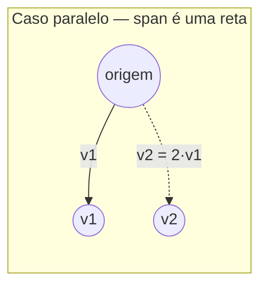
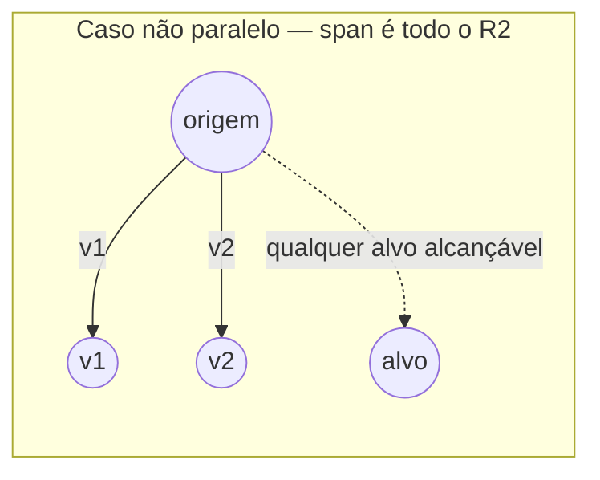

## Objetivos de Aprendizagem

- Calcular uma combinação linear c₁v₁ + c₂v₂ + … + cₖvₖ de um conjunto dado de vetores para coeficientes escalares especificados.
- Definir o span de um conjunto de vetores como o conjunto de todas as suas combinações lineares, e explicar por que o span é sempre um ponto, uma reta, um plano, ou um análogo de dimensão maior passando pela origem.
- Determinar, para dois vetores em ℝ², se seu span é uma reta ou todo o ℝ², com base em se os vetores são paralelos.
- Determinar se um vetor alvo dado está no span de um conjunto de vetores dado tentando resolver diretamente para os pesos da combinação.
- Conectar a noção de span à pergunta de quais lados direitos b um sistema de equações Ax = b pode de fato produzir.

## Contexto e Motivação

A soma permite combinar dois vetores em um; a multiplicação por escalar permite esticar um único vetor. Uma **combinação linear** simplesmente faz ambas ao mesmo tempo, para quantos vetores você quiser: escolha alguns escalares, escale cada vetor pelo seu próprio escalar, e some todos os resultados. Isso soa como uma pequena generalização, mas é uma das duas ou três ideias genuinamente estruturais de toda esta disciplina, porque reformula uma pergunta que parece geométrica ("quais pontos eu posso alcançar?") em uma pergunta que é diretamente computável ("para quais escalares c₁, …, cₖ c₁v₁ + … + cₖvₖ é igual ao meu alvo?").

O **span** de um conjunto de vetores é a resposta a "quais pontos eu posso alcançar?" tornada precisa: é o conjunto de *todo* vetor alcançável como *alguma* combinação linear dos vetores dados, usando quaisquer escalares de números reais. O span acaba sendo exatamente a lente certa para entender sistemas de equações lineares, o próximo conceito nesta disciplina mostra que resolver Ax = b é precisamente a pergunta de se b está no span das colunas de A, e se estiver, encontrar os pesos da combinação (as entradas de x) que o produzem. Entender o span completamente aqui, com exemplos concretos e verificáveis, é o que faz essa reformulação posterior parecer inevitável em vez de um truque.

O 18.06 do MIT trata o span como uma das poucas ideias em torno das quais todo o curso orbita, precisamente porque conecta as operações de "combinar vetores" ao formato geométrico do conjunto alcançável resultante, um único vetor não nulo gera (spans) uma reta pela origem; dois vetores não paralelos em ℝ² geram todo o plano; três vetores em ℝ³ que não estão todos em um plano comum geram todo o ℝ³. A dimensão do span, quanto "espaço" as combinações lineares de fato preenchem, se torna o número mais importante associado a um conjunto de vetores nesta disciplina, preparando silenciosamente a ideia de independência linear e posto (rank) que conceitos posteriores constroem.

## Teoria Central

### Combinações lineares: definição

Dados vetores v₁, v₂, …, vₖ em ℝⁿ e escalares c₁, c₂, …, cₖ ∈ ℝ, uma **combinação linear** de v₁, …, vₖ (com esses coeficientes) é o vetor:

c₁v₁ + c₂v₂ + … + cₖvₖ

Cada termo cᵢvᵢ é um múltiplo escalar (do conceito anterior), e a expressão inteira é uma soma desses vetores escalados (soma de vetores, novamente do conceito anterior), uma combinação linear não introduz nenhuma operação primitiva nova; é puramente um *nome* para um padrão específico e útil de aplicar as duas operações já definidas. Toda combinação linear de vetores em ℝⁿ é ela mesma um vetor em ℝⁿ, já que tanto a soma quanto a multiplicação por escalar permanecem dentro de ℝⁿ.

Dois casos extremos valem a pena nomear explicitamente: escolher todo cᵢ = 0 sempre produz o vetor zero, independentemente de quais vᵢ foram escolhidos, a **combinação linear trivial**. Escolher exatamente um cᵢ = 1 e o resto 0 simplesmente recupera vᵢ em si, então cada um dos vetores originais é trivialmente uma combinação linear do conjunto inteiro.

### Span: o conjunto de todas as combinações alcançáveis

O **span** de um conjunto de vetores {v₁, v₂, …, vₖ} em ℝⁿ, escrito span{v₁, …, vₖ}, é o conjunto de *todos* os vetores obteníveis como *alguma* combinação linear de v₁, …, vₖ:

span{v₁, …, vₖ} = { c₁v₁ + c₂v₂ + … + cₖvₖ : c₁, c₂, …, cₖ ∈ ℝ }

Isso é um conjunto de vetores, não um único vetor ou um número, perguntar "qual é o span desses vetores?" é pedir uma descrição de uma região inteira de ℝⁿ, não uma única resposta. Como a escolha de coeficientes zero está sempre disponível, o vetor zero 0 pertence a todo span, independentemente de quais vetores estão sendo combinados, span{v₁, …, vₖ} sempre contém pelo menos a origem.

**Span de um único vetor não nulo.** span{v} para um único v ∈ ℝⁿ não nulo é { cv : c ∈ ℝ }, todo múltiplo escalar de v. Geometricamente isso é a reta inteira passando pela origem e pelo ponto v, já que escalar v por todo número real (positivo, negativo, zero, fracionário) varre exatamente essa reta e nada mais.

**Span de dois vetores em ℝ²: a dicotomia paralelo/não paralelo.** Este é o caso mais instrutivo deste conceito, e se divide em exatamente duas possibilidades:

- Se v₁ e v₂ são **paralelos** (um é um múltiplo escalar do outro, v₂ = cv₁ para algum c), então toda combinação linear c₁v₁ + c₂v₂ = c₁v₁ + c₂(cv₁) = (c₁ + c₂c)v₁ colapsa para apenas outro múltiplo escalar de v₁, não importa como c₁, c₂ sejam escolhidos, o resultado nunca sai da única reta que span{v₁} já varre. Adicionar um segundo vetor paralelo ao conjunto não contribui nada de novo ao span.
- Se v₁ e v₂ **não são paralelos** (nenhum é um múltiplo escalar do outro), seu span é *todo* o ℝ², todo ponto no plano é alcançável como alguma combinação c₁v₁ + c₂v₂. Esta é uma afirmação genuína que vale a pena confirmar concretamente (o Exemplo Resolvido 1 a verifica diretamente para um ponto alvo específico), e ela generaliza: quaisquer dois vetores não paralelos em ℝ² formam uma *base* para o plano (um termo desenvolvido mais adiante em conceitos posteriores), significando que são simultaneamente suficientes para alcançar em todo lugar e nenhum deles é redundante.

**Padrão geral.** Em ℝⁿ, o span de um conjunto de vetores é sempre uma região "plana" passando pela origem, um ponto (span do conjunto vazio, ou de apenas o vetor zero), uma reta, um plano, ou um análogo de dimensão maior (um *subespaço*, no vocabulário para o qual esta disciplina constrói), nunca uma forma curva ou limitada, porque combinações lineares apenas esticam e somam, operações que não conseguem dobrar uma estrutura reta em uma curva ou enrolá-la sobre si mesma.

### Testando se um vetor alvo está em um span

Dado um vetor alvo b e um conjunto {v₁, …, vₖ}, a pergunta "b ∈ span{v₁, …, vₖ}?" é exatamente a pergunta "existem escalares c₁, …, cₖ com c₁v₁ + … + cₖvₖ = b?" Como uma equação vetorial em ℝⁿ se desdobra em n equações escalares (uma por coordenada, como estabelecido no conceito de vetores), isso é precisamente um **sistema de equações lineares** nas incógnitas c₁, …, cₖ, o alvo está no span exatamente quando esse sistema tem pelo menos uma solução. Esta é a ligação concreta que este conceito prepara para o próximo: span é o *conjunto de lados direitos solucionáveis*, e verificar pertencimento a um span é literalmente a mesma tarefa que resolver um sistema linear.

## Exemplos Resolvidos

### Exemplo 1 — confirmando que dois vetores não paralelos geram todo o ℝ²

**Problema:** Sejam v₁ = (1, 0) e v₂ = (1, 1). Mostre que um alvo arbitrário b = (5, 3) está em span{v₁, v₂} encontrando os coeficientes explicitamente.

**Monte a equação vetorial:** c₁(1,0) + c₂(1,1) = (5,3).

**Desdobre em equações escalares** (uma por coordenada): c₁ + c₂ = 5 (primeiro componente), e c₂ = 3 (segundo componente, já que o primeiro componente de v₁ contribui 0 ali e v₂ contribui c₂).

**Resolva:** da segunda equação, c₂ = 3. Substituindo na primeira, c₁ + 3 = 5, então c₁ = 2.

**Verifique:** 2(1,0) + 3(1,1) = (2,0) + (3,3) = (5,3). ✓ corresponde a b exatamente.

**Generalize:** porque v₁ e v₂ não são paralelos (v₂ não é nenhum múltiplo escalar de v₁, suas razões de componentes, 1:0 versus 1:1, são inconsistentes), o mesmo sistema de duas equações e duas incógnitas c₁ + c₂ = b₁, c₂ = b₂ pode ser resolvido para *qualquer* alvo (b₁, b₂), confirmando que span{v₁, v₂} realmente é todo o ℝ² e não apenas sorte para essa única escolha de b.

### Exemplo 2 — vetores paralelos geram apenas uma reta

**Problema:** Sejam v₁ = (2, 1) e v₂ = (6, 3). Determine span{v₁, v₂}, e verifique se b = (5, 3) está nele.

**Verifique paralelismo primeiro:** v₂ = (6,3) = 3·(2,1) = 3v₁, então v₂ é um múltiplo escalar de v₁, os dois vetores são paralelos.

**Conclusão sobre o span:** pelo argumento da Teoria Central, span{v₁, v₂} colapsa para span{v₁} sozinho, a reta pela origem e (2,1), ou seja, todos os pontos da forma (2t, t) para t ∈ ℝ.

**Verifique se b = (5,3) está nessa reta:** b precisaria satisfazer (5,3) = (2t, t) para algum t. Da segunda coordenada, t = 3; substituindo na primeira coordenada exige 2(3) = 6, mas a primeira coordenada de b é 5, não 6. Como 5 ≠ 6, nenhum t existe.

**Conclusão:** b = (5,3) *não* está em span{v₁, v₂}, este par de vetores, apesar de haver dois deles, só consegue alcançar pontos em uma única reta, e (5,3) simplesmente não está nela. Este é o retorno direto de reconhecer paralelismo cedo: nenhuma quantidade de álgebra buscando c₁, c₂ jamais teria encontrado uma solução, porque a geometria já a descartou.

### Exemplo 3 — uma combinação linear em ℝ³ e testando pertencimento ao span

**Problema:** Sejam v₁ = (1, 1, 0), v₂ = (0, 1, 1), e b = (2, 4, 2). Determine se b ∈ span{v₁, v₂}.

**Monte a equação vetorial:** c₁(1,1,0) + c₂(0,1,1) = (2,4,2), ou seja, (c₁, c₁+c₂, c₂) = (2,4,2).

**Desdobre em três equações escalares:** c₁ = 2 (primeira coordenada); c₁ + c₂ = 4 (segunda coordenada); c₂ = 2 (terceira coordenada).

**Resolva usando as duas equações "isoladas":** c₁ = 2 e c₂ = 2 diretamente.

**Verifique consistência contra a terceira equação:** a equação do meio exige c₁ + c₂ = 4; substituindo c₁ = 2, c₂ = 2 dá 2 + 2 = 4. ✓ consistente.

**Conclusão:** b ∈ span{v₁, v₂}, com b = 2v₁ + 2v₂. Note que este exemplo tinha *três* equações escalares mas apenas *duas* incógnitas (c₁, c₂), um sistema aparentemente sobredeterminado que aconteceu de ser consistente. Se a equação do meio exigisse em vez disso, digamos, c₁ + c₂ = 5, os mesmos c₁ = 2, c₂ = 2 forçados pelas outras duas equações dariam 2 + 2 = 4 ≠ 5, uma contradição direta, provando que esse b específico *não* estaria no span. Este é exatamente o tipo de verificação de consistência que sistemas de equações formalizam completamente no próximo conceito.

## Equívocos Comuns e Armadilhas

- **"Adicionar mais vetores a um conjunto sempre torna o span maior."** Só é verdade se o vetor adicionado não já for alcançável como uma combinação dos outros. O Exemplo 2 mostra dois vetores cujo span é apenas uma reta, exatamente a mesma que o span de qualquer um deles sozinho, porque o segundo vetor era paralelo (redundante) em vez de contribuir com uma direção genuinamente nova.
- **"O span de um conjunto de vetores é o mesmo que o próprio conjunto."** O span é (em geral) infinito, todo múltiplo escalar e combinação, enquanto o conjunto original é apenas a lista finita de vetores com que você começou. span{(1,0)} contém (1,0) em si, mas também (2,0), (−5,0), (0,001,0), e todo outro ponto naquela reta inteira; o conjunto gerador finito e seu span (tipicamente infinito) são objetos muito diferentes.
- **"Se um vetor alvo b 'parece' que deveria ser alcançável, ele deve estar no span."** Pertencimento a um span é um fato algébrico preciso, verificado resolvendo as equações escalares correspondentes para consistência (como no Exemplo 3), não uma questão de plausibilidade visual. Um vetor alvo pode parecer "no meio" de dois vetores dados e ainda assim não estar em seu span se os vetores forem paralelos (Exemplo 2), ou pode parecer "sem relação" e ainda assim ser alcançável uma vez que os coeficientes reais sejam resolvidos.
- **"Span sempre exige pelo menos dois vetores."** Span é definido para qualquer conjunto de vetores, incluindo um conjunto com apenas um vetor (gerando uma reta, como mostrado) ou até o conjunto vazio (cujo span, por convenção, é apenas {0}, já que não há vetores para combinar além da combinação trivial que sempre existe). A palavra "span" descreve uma operação sobre quantos vetores você tiver, não um conceito que só faz sentido a partir de dois.

## Resumo

Uma combinação linear c₁v₁ + … + cₖvₖ é simplesmente o padrão de escalar cada um de vários vetores e somar os resultados, nenhuma operação nova além da soma e multiplicação por escalar já estabelecidas. O span de um conjunto de vetores coleta *todo* vetor alcançável dessa forma, e seu formato é inteiramente determinado por quanta redundância está presente entre os vetores dados: um único vetor não nulo gera uma reta; dois vetores não paralelos em ℝ² geram o plano inteiro, enquanto dois vetores paralelos ainda geram apenas essa mesma reta, não importa quantos vetores paralelos sejam adicionados. Testar se um vetor alvo específico está em um span se reduz diretamente a resolver um sistema de equações escalares para os pesos da combinação, uma equação vetorial em ℝⁿ é n equações de coordenada de uma vez, e essa redução é exatamente a ponte para o próximo conceito, onde sistemas de equações lineares Ax = b são entendidos precisamente como perguntar se b está no span das colunas de A.

## Documentation Links

- [MIT 18.06SC — Syllabus (OCW)](https://www.ocw.mit.edu/courses/18-06sc-linear-algebra-fall-2011/pages/syllabus) — doc
- [MIT 18.06 — Course Home (OCW)](https://ocw.mit.edu/courses/18-06-linear-algebra-spring-2010/) — doc
