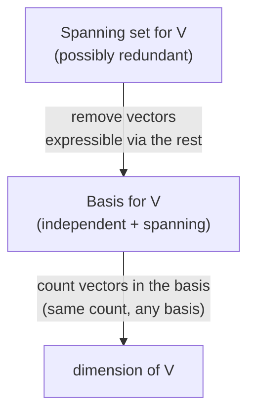

## Learning Objectives

- Define linear independence precisely, both as "no vector is a linear combination of the others" and as "the only solution to c₁v₁ + c₂v₂ + … + cₙvₙ = 0 is c₁ = c₂ = … = cₙ = 0," and explain why these are the same condition.
- Determine, for a small concrete set of vectors, whether it is linearly independent by solving the corresponding homogeneous system.
- Define a basis as a linearly independent spanning set, and identify the standard basis of ℝ² and ℝ³ by name.
- State why every basis of a given space has the same number of vectors, and use that shared number as the definition of dimension.
- Given a spanning set that is not independent, produce a basis by removing redundant vectors from it.

## Context & Motivation

The previous concept in this discipline established span: the set of every vector reachable by scaling and adding together some starting collection of vectors. Span answers "what can this set of vectors build?" but says nothing about whether the set doing the building is *efficient*. Two vectors that happen to point in the same direction, or three vectors in ℝ² where any one is already a combination of the other two, can span exactly the same space as a smaller, leaner set — the extra vectors are along for the ride, contributing no new reachable territory. Linear independence is the precise condition that rules this out: a linearly independent set has no redundancy at all, no vector that could be deleted without shrinking the span.

This matters immediately for how a space gets described. If a space can be spanned by different-sized sets — some with redundant vectors, some without — then "how many vectors does it take to span this space" is not yet a well-defined question until redundancy is eliminated. A **basis** is exactly a spanning set with the redundancy removed: independent, so nothing in it is wasted, and spanning, so nothing reachable is left out. Once that's pinned down, a genuinely nontrivial fact becomes available — every basis of a given space, however differently chosen, has exactly the same number of vectors. That shared number is the space's **dimension**, and it is the single most load-bearing number in this discipline: it will reappear when counting pivot columns in rank, when comparing the size of a column space to a null space in the rank-nullity theorem, and whenever a computation needs a fixed, unambiguous coordinate system to work in.

Concretely, this is why "ℝ³ is 3-dimensional" is a theorem, not a convention. Nothing in the definition of ℝ³ as ordered triples of real numbers immediately forces "3" to be the only correct count — it takes the basis machinery in this concept to prove that no independent spanning set of ℝ³ could have 2 or 4 vectors instead. MIT's 18.06 treats this as the moment where linear algebra stops being "vectors and equations" and starts being about the structure of a space itself — a shift that pays off directly in every later topic in this discipline, from column space and null space (whose dimensions are named rank and nullity) through eigenvectors (which, when independent, form a basis in which a matrix's action becomes almost embarrassingly simple to describe).

## Core Theory

### Linear independence

A set of vectors {v₁, v₂, …, vₙ} is **linearly independent** if the only scalars c₁, c₂, …, cₙ satisfying

c₁v₁ + c₂v₂ + … + cₙvₙ = 0

are c₁ = c₂ = … = cₙ = 0. This equation — a linear combination set equal to the zero vector — is called the **trivial relation** when all coefficients are zero; independence says the trivial relation is the *only* relation. If some other combination with not-all-zero coefficients also equals zero, the set is **linearly dependent**.

The equivalence to "no vector is a combination of the others" follows directly: suppose the set is dependent, so some nontrivial combination c₁v₁ + … + cₙvₙ = 0 holds with, say, cₖ ≠ 0. Then vₖ can be isolated:

vₖ = −(c₁/cₖ)v₁ − … − (cₖ₋₁/cₖ)vₖ₋₁ − (cₖ₊₁/cₖ)vₖ₊₁ − … − (cₙ/cₖ)vₙ

— exactly a linear combination of the remaining vectors. Conversely, if some vₖ is a combination of the others, moving every term to one side produces a nontrivial relation (the coefficient on vₖ is −1 ≠ 0). So "dependent" and "some vector is redundant, expressible via the rest" are the same statement, just phrased two ways; independence is the negation of either.

Checking independence directly reduces to a familiar computation: stack the vectors as columns of a matrix A and solve the homogeneous system Ax = 0. The set is independent exactly when x = 0 is the *only* solution — that is, exactly when the null space of A (formalized fully in the next concept) contains nothing but the zero vector.

### Two concrete cases: ℝ² and ℝ³

In ℝ², the **standard basis** is e₁ = (1, 0) and e₂ = (0, 1). These are independent — c₁(1,0) + c₂(0,1) = (c₁, c₂) equals (0,0) only when c₁ = c₂ = 0 — and they span all of ℝ², since any (a, b) equals a·e₁ + b·e₂ directly. Three vectors in ℝ², however, can never be independent: three unknowns' worth of coefficients are constrained by only two equations (one per coordinate) when set equal to zero, so a nontrivial solution is always available — a fact that generalizes below into a hard upper bound on how large an independent set in a given space can be.

In ℝ³, the standard basis is e₁ = (1, 0, 0), e₂ = (0, 1, 0), e₃ = (0, 0, 1), independent and spanning by the identical argument, one dimension up. A geometrically useful contrast: v₁ = (1, 2, 0), v₂ = (2, 4, 0), and v₃ = (0, 0, 1) are *not* independent, since v₂ = 2v₁ exactly — the relation 2v₁ − v₂ + 0v₃ = 0 is nontrivial. Removing either v₁ or v₂ leaves an independent pair that spans the same plane-plus-axis region the original three vectors reached; the third vector was never contributing anything the other two didn't already cover.

### Basis

A **basis** of a space V is a set of vectors that is both linearly independent and spans V. The two conditions pull in opposite directions and a basis sits exactly at the balance point: spanning alone permits redundant, oversized sets; independence alone permits sets too small to reach every vector in V. A basis is a spanning set with every ounce of redundancy wrung out, or equivalently, a maximal independent set — one that stops being independent the instant one more vector from V is added to it (since if it didn't span V, some vector outside its span could be added while preserving independence).

Every space considered in this discipline (ℝⁿ and its subspaces, like a column space or null space) has a basis, and typically many different ones — the standard basis is only the most convenient default, not the only valid choice. For instance, {(1,1), (1,−1)} is an equally valid basis of ℝ², independent (neither is a scalar multiple of the other) and spanning (any (a,b) can be written as a combination of the two, by solving a small 2×2 system).

### Dimension: why every basis agrees

The claim that makes "dimension" well-defined is: **any two bases of the same space V have exactly the same number of vectors.** The key supporting fact, sometimes called the exchange lemma, is that in a space spanned by m vectors, no set of more than m vectors can be linearly independent — extra vectors beyond the spanning count are always forced into a dependency, by the same counting argument that ruled out 3 independent vectors in ℝ² (spanned by 2). Applying this both ways — basis B₁ spans V, so any independent set, including basis B₂, has at most |B₁| vectors; symmetrically B₂ spans V, so B₁ has at most |B₂| vectors — forces |B₁| = |B₂|.

This shared count is the **dimension** of V, written dim(V). dim(ℝⁿ) = n, witnessed directly by the standard basis of n vectors; this matches intuition (ℝ² is "2-dimensional," ℝ³ is "3-dimensional") while also explaining precisely *why*: n is not an arbitrary label but the provably unique size of every basis ℝⁿ has.

## Worked Examples

### Example 1 — testing independence by solving a homogeneous system

**Problem:** Are v₁ = (1, 2, 1), v₂ = (2, 1, 0), v₃ = (0, 3, 2) linearly independent?

**Set up the equation.** c₁v₁ + c₂v₂ + c₃v₃ = 0 expands, coordinate by coordinate, to:

c₁ + 2c₂ + 0c₃ = 0
2c₁ + c₂ + 3c₃ = 0
c₁ + 0c₂ + 2c₃ = 0

**Solve.** From the first equation, c₁ = −2c₂. Substituting into the third: −2c₂ + 2c₃ = 0, so c₃ = c₂. Substituting both into the second: 2(−2c₂) + c₂ + 3(c₂) = −4c₂ + c₂ + 3c₂ = 0 — this holds for *every* value of c₂, so c₂ is a free parameter.

**Conclusion.** Choosing c₂ = 1 gives c₁ = −2, c₃ = 1, a nontrivial solution (not all zero). Check: −2(1,2,1) + 1(2,1,0) + 1(0,3,2) = (−2,−4,−2) + (2,1,0) + (0,3,2) = (0,0,0). ✓ The set is linearly dependent — specifically, v₃ = 2v₁ − v₂ (rearranging the relation), so v₃ is redundant and {v₁, v₂} alone spans the same subspace.

### Example 2 — building a basis from a redundant spanning set

**Problem:** The set {(1,0,0), (0,1,0), (1,1,0), (0,0,1)} spans a subspace of ℝ³. Reduce it to a basis.

**Spot the redundancy.** (1,1,0) = 1·(1,0,0) + 1·(0,1,0) — the third vector is a combination of the first two, so it contributes nothing new to the span.

**Remove it.** The remaining set {(1,0,0), (0,1,0), (0,0,1)} is exactly the standard basis of ℝ³ — independent (verified in Core Theory) and spanning all of ℝ³, so removing the redundant vector didn't just shrink the set, it revealed that the original four vectors were already spanning the whole of ℝ³.

**Conclusion.** {(1,0,0), (0,1,0), (0,0,1)} is a basis of the space spanned by the original four vectors, which is therefore all of ℝ³, of dimension 3 — one less than the four vectors started with, consistent with exactly one relation among them.

### Example 3 — a non-standard basis of ℝ²

**Problem:** Verify that {(1,1), (1,−1)} is a basis of ℝ², and express (5, 1) in terms of it.

**Independence.** c₁(1,1) + c₂(1,−1) = 0 gives c₁ + c₂ = 0 and c₁ − c₂ = 0. Adding these, 2c₁ = 0, so c₁ = 0, and then c₂ = 0 too. Only the trivial relation works, so the set is independent.

**Spanning.** For any (a, b), solve c₁ + c₂ = a and c₁ − c₂ = b: adding gives c₁ = (a+b)/2, subtracting gives c₂ = (a−b)/2 — a solution always exists, so the set spans ℝ².

**Both conditions hold, so it is a basis of ℝ² — necessarily of dimension 2, matching the standard basis's count, as the theorem guarantees.** For (5, 1): c₁ = (5+1)/2 = 3, c₂ = (5−1)/2 = 2. Check: 3(1,1) + 2(1,−1) = (3,3) + (2,−2) = (5,1). ✓

## Common Misconceptions & Pitfalls

- **"Independence just means the vectors are different from each other."** Distinctness is far weaker than independence. (1,2) and (2,4) are distinct vectors but not independent — the second is exactly 2 times the first, so 2(1,2) − 1(2,4) = (0,0) is a nontrivial relation. Independence requires no vector to be reachable from the others by scaling and adding, which is a much stronger condition than merely not being equal.
- **"A spanning set is automatically a basis."** Spanning is only half the requirement. {(1,0), (0,1), (1,1)} spans ℝ² but is not independent (the third vector equals the sum of the first two), so it is not a basis — a basis is a *minimal* spanning set, and this one has a vector too many.
- **"Dimension is just how many coordinates a vector has."** This coincides for ℝⁿ itself (dimension n, vectors with n coordinates) but breaks for subspaces: a line through the origin in ℝ³ is 1-dimensional (a single basis vector spans it) even though every vector on it still has 3 coordinates. Dimension counts basis vectors, not coordinate slots.
- **"Any basis of ℝⁿ must include the standard basis vectors."** False — Example 3 above is a perfectly valid basis of ℝ² containing neither (1,0) nor (0,1). The standard basis is a convenient default, not a requirement; any independent spanning set of the right size qualifies.
- **"More vectors always span more."** Adding vectors to an already-spanning independent set cannot increase the span (the space is already fully covered) and destroys independence instead — the exchange lemma guarantees that once a set's size exceeds the space's dimension, it must contain a dependency.

## Summary

Linear independence rules out redundancy: a set is independent exactly when the only linear combination of its vectors equal to zero is the trivial one, equivalently when no vector in the set is a combination of the rest. A basis combines independence with spanning — no waste and no gaps — and the standard bases of ℝ² and ℝ³ are the most familiar examples. The exchange lemma forces every basis of a given space to have the same number of vectors, which makes dimension a well-defined property of the space itself rather than an artifact of which basis happened to be chosen; dim(ℝⁿ) = n follows directly from the standard basis having n vectors. A redundant spanning set can always be pared down to a basis by discarding vectors expressible via the others, without changing the space spanned.

## Documentation Links

- [MIT 18.06SC — Syllabus (OCW)](https://www.ocw.mit.edu/courses/18-06sc-linear-algebra-fall-2011/pages/syllabus) — doc
- [Stanford CS229 — Linear Algebra Review and Reference](https://cs229.stanford.edu/section/cs229-linalg.pdf) — doc
