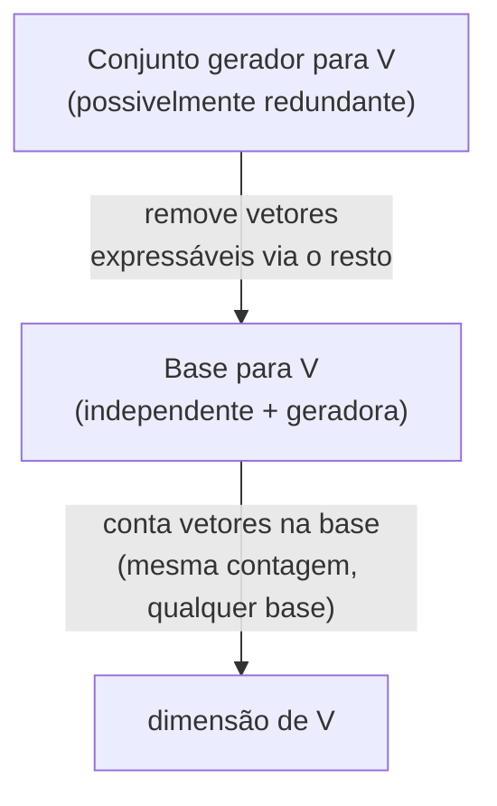

## Objetivos de Aprendizagem

- Definir independência linear precisamente, tanto como "nenhum vetor é uma combinação linear dos outros" quanto como "a única solução para c₁v₁ + c₂v₂ + … + cₙvₙ = 0 é c₁ = c₂ = … = cₙ = 0," e explicar por que essas são a mesma condição.
- Determinar, para um pequeno conjunto concreto de vetores, se ele é linearmente independente resolvendo o sistema homogêneo correspondente.
- Definir uma base como um conjunto gerador linearmente independente, e identificar a base padrão de ℝ² e ℝ³ pelo nome.
- Enunciar por que toda base de um dado espaço tem o mesmo número de vetores, e usar esse número compartilhado como a definição de dimensão.
- Dado um conjunto gerador que não é independente, produzir uma base removendo vetores redundantes dele.

## Contexto e Motivação

O conceito anterior nesta disciplina estabeleceu span: o conjunto de todo vetor alcançável escalando e somando alguma coleção inicial de vetores. O span responde "o que este conjunto de vetores pode construir?" mas não diz nada sobre se o conjunto fazendo a construção é *eficiente*. Dois vetores que acontecem de apontar na mesma direção, ou três vetores em ℝ² onde qualquer um já é uma combinação dos outros dois, podem gerar exatamente o mesmo espaço que um conjunto menor e mais enxuto, os vetores extras estão de carona, não contribuindo com nenhum território alcançável novo. Independência linear é a condição precisa que descarta isso: um conjunto linearmente independente não tem nenhuma redundância, nenhum vetor que poderia ser eliminado sem encolher o span.

Isso importa imediatamente para como um espaço é descrito. Se um espaço pode ser gerado por conjuntos de tamanhos diferentes, alguns com vetores redundantes, alguns sem, então "quantos vetores são necessários para gerar este espaço" ainda não é uma pergunta bem definida até que a redundância seja eliminada. Uma **base** é exatamente um conjunto gerador com a redundância removida: independente, então nada nele é desperdiçado, e gerador, então nada alcançável é deixado de fora. Uma vez que isso é fixado, um fato genuinamente não trivial se torna disponível: toda base de um dado espaço, por mais diferente que seja escolhida, tem exatamente o mesmo número de vetores. Esse número compartilhado é a **dimensão** do espaço, e é o número mais estrutural de toda esta disciplina: ele vai reaparecer ao contar colunas pivô no posto (rank), ao comparar o tamanho de um espaço de colunas com um espaço nulo no teorema do posto-nulidade, e sempre que um cálculo precisar de um sistema de coordenadas fixo e não ambíguo para trabalhar.

Concretamente, é por isso que "ℝ³ é 3-dimensional" é um teorema, não uma convenção. Nada na definição de ℝ³ como triplas ordenadas de números reais força imediatamente "3" a ser a única contagem correta, é preciso o maquinário de bases neste conceito para provar que nenhum conjunto gerador independente de ℝ³ poderia ter 2 ou 4 vetores em vez disso. O 18.06 do MIT trata isso como o momento em que a álgebra linear deixa de ser "vetores e equações" e passa a ser sobre a estrutura de um espaço em si, uma mudança que compensa diretamente em todo tópico posterior desta disciplina, do espaço de colunas e espaço nulo (cujas dimensões são chamadas de posto e nulidade) até os autovetores (que, quando independentes, formam uma base na qual a ação de uma matriz se torna quase embaraçosamente simples de descrever).

## Teoria Central

### Independência linear

Um conjunto de vetores {v₁, v₂, …, vₙ} é **linearmente independente** se os únicos escalares c₁, c₂, …, cₙ satisfazendo

c₁v₁ + c₂v₂ + … + cₙvₙ = 0

são c₁ = c₂ = … = cₙ = 0. Essa equação, uma combinação linear igualada ao vetor zero, é chamada de **relação trivial** quando todos os coeficientes são zero; independência diz que a relação trivial é a *única* relação. Se alguma outra combinação com coeficientes não todos zero também é igual a zero, o conjunto é **linearmente dependente**.

A equivalência a "nenhum vetor é uma combinação dos outros" segue diretamente: suponha que o conjunto seja dependente, então alguma combinação não trivial c₁v₁ + … + cₙvₙ = 0 vale com, digamos, cₖ ≠ 0. Então vₖ pode ser isolado:

vₖ = −(c₁/cₖ)v₁ − … − (cₖ₋₁/cₖ)vₖ₋₁ − (cₖ₊₁/cₖ)vₖ₊₁ − … − (cₙ/cₖ)vₙ

exatamente uma combinação linear dos vetores restantes. Reciprocamente, se algum vₖ é uma combinação dos outros, mover todo termo para um lado produz uma relação não trivial (o coeficiente em vₖ é −1 ≠ 0). Então "dependente" e "algum vetor é redundante, expressável via o resto" são a mesma afirmação, apenas formulada de duas formas; independência é a negação de qualquer uma delas.

Verificar independência diretamente se reduz a um cálculo familiar: empilhe os vetores como colunas de uma matriz A e resolva o sistema homogêneo Ax = 0. O conjunto é independente exatamente quando x = 0 é a *única* solução, ou seja, exatamente quando o espaço nulo de A (formalizado completamente no próximo conceito) não contém nada além do vetor zero.

### Dois casos concretos: ℝ² e ℝ³

Em ℝ², a **base padrão** é e₁ = (1, 0) e e₂ = (0, 1). Estes são independentes, c₁(1,0) + c₂(0,1) = (c₁, c₂) é igual a (0,0) apenas quando c₁ = c₂ = 0, e eles geram todo o ℝ², já que qualquer (a, b) é igual a a·e₁ + b·e₂ diretamente. Três vetores em ℝ², no entanto, nunca podem ser independentes: coeficientes de três incógnitas são restringidos por apenas duas equações (uma por coordenada) quando igualados a zero, então uma solução não trivial sempre está disponível, um fato que generaliza abaixo em um limite superior rígido sobre quão grande um conjunto independente em um dado espaço pode ser.

Em ℝ³, a base padrão é e₁ = (1, 0, 0), e₂ = (0, 1, 0), e₃ = (0, 0, 1), independente e geradora pelo argumento idêntico, uma dimensão acima. Um contraste geometricamente útil: v₁ = (1, 2, 0), v₂ = (2, 4, 0), e v₃ = (0, 0, 1) *não* são independentes, já que v₂ = 2v₁ exatamente, a relação 2v₁ − v₂ + 0v₃ = 0 é não trivial. Remover v₁ ou v₂ deixa um par independente que gera a mesma região plano-mais-eixo que os três vetores originais alcançavam; o terceiro vetor nunca estava contribuindo com nada que os outros dois já não cobrissem.

### Base

Uma **base** de um espaço V é um conjunto de vetores que é simultaneamente linearmente independente e gerador de V. As duas condições puxam em direções opostas e uma base fica exatamente no ponto de equilíbrio: gerar sozinho permite conjuntos redundantes e superdimensionados; independência sozinha permite conjuntos pequenos demais para alcançar todo vetor em V. Uma base é um conjunto gerador com toda gota de redundância espremida para fora, ou equivalentemente, um conjunto independente maximal, um que deixa de ser independente no instante em que mais um vetor de V é adicionado a ele (já que se não gerasse V, algum vetor fora de seu span poderia ser adicionado preservando a independência).

Todo espaço considerado nesta disciplina (ℝⁿ e seus subespaços, como um espaço de colunas ou espaço nulo) tem uma base, e tipicamente muitas diferentes, a base padrão é apenas o padrão mais conveniente, não a única escolha válida. Por exemplo, {(1,1), (1,−1)} é uma base igualmente válida de ℝ², independente (nenhum é um múltiplo escalar do outro) e geradora (qualquer (a,b) pode ser escrito como uma combinação dos dois, resolvendo um pequeno sistema 2×2).

### Dimensão: por que toda base concorda

A afirmação que torna "dimensão" bem definida é: **quaisquer duas bases do mesmo espaço V têm exatamente o mesmo número de vetores.** O fato de apoio chave, às vezes chamado de lema da troca, é que em um espaço gerado por m vetores, nenhum conjunto com mais de m vetores pode ser linearmente independente, vetores extras além da contagem geradora são sempre forçados em uma dependência, pelo mesmo argumento de contagem que descartou 3 vetores independentes em ℝ² (gerado por 2). Aplicando isso nas duas direções, a base B₁ gera V, então qualquer conjunto independente, incluindo a base B₂, tem no máximo |B₁| vetores; simetricamente B₂ gera V, então B₁ tem no máximo |B₂| vetores, força |B₁| = |B₂|.

Essa contagem compartilhada é a **dimensão** de V, escrita dim(V). dim(ℝⁿ) = n, testemunhada diretamente pela base padrão de n vetores; isso corresponde à intuição (ℝ² é "2-dimensional," ℝ³ é "3-dimensional") ao mesmo tempo em que explica precisamente *por quê*: n não é um rótulo arbitrário mas o tamanho comprovadamente único de toda base que ℝⁿ tem.

## Exemplos Resolvidos

### Exemplo 1 — testando independência resolvendo um sistema homogêneo

**Problema:** v₁ = (1, 2, 1), v₂ = (2, 1, 0), v₃ = (0, 3, 2) são linearmente independentes?

**Monte a equação.** c₁v₁ + c₂v₂ + c₃v₃ = 0 se expande, coordenada por coordenada, para:

c₁ + 2c₂ + 0c₃ = 0
2c₁ + c₂ + 3c₃ = 0
c₁ + 0c₂ + 2c₃ = 0

**Resolva.** Da primeira equação, c₁ = −2c₂. Substituindo na terceira: −2c₂ + 2c₃ = 0, então c₃ = c₂. Substituindo ambas na segunda: 2(−2c₂) + c₂ + 3(c₂) = −4c₂ + c₂ + 3c₂ = 0, isso vale para *todo* valor de c₂, então c₂ é um parâmetro livre.

**Conclusão.** Escolher c₂ = 1 dá c₁ = −2, c₃ = 1, uma solução não trivial (nem todos zero). Verifique: −2(1,2,1) + 1(2,1,0) + 1(0,3,2) = (−2,−4,−2) + (2,1,0) + (0,3,2) = (0,0,0). ✓ O conjunto é linearmente dependente, especificamente, v₃ = 2v₁ − v₂ (rearranjando a relação), então v₃ é redundante e {v₁, v₂} sozinho gera o mesmo subespaço.

### Exemplo 2 — construindo uma base a partir de um conjunto gerador redundante

**Problema:** O conjunto {(1,0,0), (0,1,0), (1,1,0), (0,0,1)} gera um subespaço de ℝ³. Reduza-o a uma base.

**Identifique a redundância.** (1,1,0) = 1·(1,0,0) + 1·(0,1,0), o terceiro vetor é uma combinação dos dois primeiros, então não contribui com nada novo para o span.

**Remova-o.** O conjunto restante {(1,0,0), (0,1,0), (0,0,1)} é exatamente a base padrão de ℝ³, independente (verificado na Teoria Central) e geradora de todo o ℝ³, então remover o vetor redundante não apenas encolheu o conjunto, revelou que os quatro vetores originais já geravam todo o ℝ³.

**Conclusão.** {(1,0,0), (0,1,0), (0,0,1)} é uma base do espaço gerado pelos quatro vetores originais, que é portanto todo o ℝ³, de dimensão 3, um a menos que os quatro vetores com que se começou, consistente com exatamente uma relação entre eles.

### Exemplo 3 — uma base não padrão de ℝ²

**Problema:** Verifique que {(1,1), (1,−1)} é uma base de ℝ², e expresse (5, 1) em termos dela.

**Independência.** c₁(1,1) + c₂(1,−1) = 0 dá c₁ + c₂ = 0 e c₁ − c₂ = 0. Somando essas, 2c₁ = 0, então c₁ = 0, e então c₂ = 0 também. Apenas a relação trivial funciona, então o conjunto é independente.

**Geração.** Para qualquer (a, b), resolva c₁ + c₂ = a e c₁ − c₂ = b: somando dá c₁ = (a+b)/2, subtraindo dá c₂ = (a−b)/2, uma solução sempre existe, então o conjunto gera ℝ².

**Ambas as condições valem, então é uma base de ℝ², necessariamente de dimensão 2, correspondendo à contagem da base padrão, como o teorema garante.** Para (5, 1): c₁ = (5+1)/2 = 3, c₂ = (5−1)/2 = 2. Verifique: 3(1,1) + 2(1,−1) = (3,3) + (2,−2) = (5,1). ✓

## Equívocos Comuns e Armadilhas

- **"Independência apenas significa que os vetores são diferentes uns dos outros."** Distinção é muito mais fraca que independência. (1,2) e (2,4) são vetores distintos mas não independentes, o segundo é exatamente 2 vezes o primeiro, então 2(1,2) − 1(2,4) = (0,0) é uma relação não trivial. Independência exige que nenhum vetor seja alcançável a partir dos outros por escalonamento e soma, o que é uma condição muito mais forte que meramente não ser igual.
- **"Um conjunto gerador é automaticamente uma base."** Gerar é apenas metade da exigência. {(1,0), (0,1), (1,1)} gera ℝ² mas não é independente (o terceiro vetor é igual à soma dos primeiros dois), então não é uma base, uma base é um conjunto gerador *mínimo*, e este tem um vetor a mais.
- **"Dimensão é apenas quantas coordenadas um vetor tem."** Isso coincide para o próprio ℝⁿ (dimensão n, vetores com n coordenadas) mas se quebra para subespaços: uma reta passando pela origem em ℝ³ é 1-dimensional (um único vetor base a gera) mesmo que todo vetor nela ainda tenha 3 coordenadas. Dimensão conta vetores base, não posições de coordenada.
- **"Qualquer base de ℝⁿ deve incluir os vetores da base padrão."** Falso, o Exemplo 3 acima é uma base perfeitamente válida de ℝ² que não contém nem (1,0) nem (0,1). A base padrão é um padrão conveniente, não uma exigência; qualquer conjunto gerador independente do tamanho certo se qualifica.
- **"Mais vetores sempre geram mais."** Adicionar vetores a um conjunto independente já gerador não pode aumentar o span (o espaço já está totalmente coberto) e destrói a independência em vez disso, o lema da troca garante que assim que o tamanho de um conjunto excede a dimensão do espaço, ele deve conter uma dependência.

## Resumo

Independência linear descarta redundância: um conjunto é independente exatamente quando a única combinação linear de seus vetores igual a zero é a trivial, equivalentemente quando nenhum vetor no conjunto é uma combinação do resto. Uma base combina independência com geração, sem desperdício e sem lacunas, e as bases padrão de ℝ² e ℝ³ são os exemplos mais familiares. O lema da troca força toda base de um dado espaço a ter o mesmo número de vetores, o que torna dimensão uma propriedade bem definida do próprio espaço em vez de um artefato de qual base aconteceu de ser escolhida; dim(ℝⁿ) = n segue diretamente do fato de a base padrão ter n vetores. Um conjunto gerador redundante sempre pode ser reduzido a uma base descartando vetores expressáveis via os outros, sem mudar o espaço gerado.

## Documentation Links

- [MIT 18.06SC — Syllabus (OCW)](https://www.ocw.mit.edu/courses/18-06sc-linear-algebra-fall-2011/pages/syllabus) — doc
- [Stanford CS229 — Linear Algebra Review and Reference](https://cs229.stanford.edu/section/cs229-linalg.pdf) — doc
