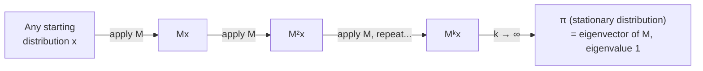

## Learning Objectives

- Define a Markov (column-stochastic) matrix: non-negative entries, with every column summing to 1, and explain what each column represents as a probability distribution.
- Define a stationary distribution as an eigenvector of a Markov matrix with eigenvalue 1, and explain why such an eigenvector always exists for this kind of matrix.
- Compute the stationary distribution of a small Markov matrix by hand, by solving Mx = x directly.
- Simulate a Markov chain numerically and observe convergence to its stationary distribution regardless of starting point.
- Explain, with a concrete worked example, how PageRank models the web as a Markov chain and how a page's rank is exactly an entry of the stationary distribution.

## Context & Motivation

Every concept so far in this discipline's eigenvalue topic has treated Av = λv as a purely algebraic fact about a matrix. Markov matrices are where that fact turns into something you can watch happen over time. A **Markov matrix** (also called a stochastic matrix) is built to describe a system that moves between a fixed set of states step by step, according to fixed probabilities — a random walker on a graph, a customer moving between subscription tiers, a molecule transitioning between conformations, or, in the application this concept builds toward, a web surfer clicking from page to page. What makes this a linear algebra story rather than just a probability story is a genuinely elegant fact: no matter where such a system starts, if you let it run for long enough, its state settles into a fixed long-run distribution — and that distribution is nothing more exotic than an eigenvector of the Markov matrix, with eigenvalue exactly 1.

The most famous real application of this idea is also one of the most consequential pieces of applied linear algebra of the last thirty years: **PageRank**, the algorithm Google was originally built on for ranking web pages. The core insight of PageRank's original formulation is to model the entire web as a graph — pages are nodes, hyperlinks are directed edges — and then imagine a "random surfer" who starts on some page and, at every step, clicks a uniformly random outgoing link. The probability that this random surfer is on any particular page, after enough clicks, converges to a stationary distribution exactly of the kind developed in this concept — and a page's PageRank is defined to be precisely its entry in that stationary distribution: the fraction of "attention," in the long run, that a random clicker spends on it. This concept builds the machinery to compute that convergent distribution directly, and works out a small worked web graph in full, precisely to make the PageRank connection concrete rather than a name-drop.

## Core Theory

### Definition: Markov (stochastic) matrices

An n×n matrix M is a **Markov matrix** (or **column-stochastic matrix**) if:

1. Every entry is non-negative: Mᵢⱼ ≥ 0 for all i, j.
2. Every column sums to 1: for each column j, Σᵢ Mᵢⱼ = 1.

The interpretation: column j is the probability distribution over "where you go next," given that you're currently in state j. Entry Mᵢⱼ is the probability of transitioning from state j to state i in one step. Because column j lists probabilities of landing somewhere (possibly staying put) after leaving state j, and those possibilities are exhaustive and mutually exclusive, they must sum to exactly 1 — that's the entire content of condition 2.

If x is a probability distribution over the n states at some point in time (a vector of non-negative entries summing to 1, one entry per state), then Mx gives the probability distribution one step later: (Mx)ᵢ = Σⱼ Mᵢⱼxⱼ sums, over every state j the system could currently be in, the probability of being in j times the probability of moving from j to i — exactly the law of total probability applied to "where will I be next."

### Stationary distributions as eigenvectors with eigenvalue 1

A **stationary distribution** of a Markov matrix M is a probability distribution π (non-negative entries, summing to 1) satisfying:

Mπ = π

This is exactly the eigenvector equation Mπ = λπ with λ = 1 — a stationary distribution is nothing more than an eigenvector of M for the eigenvalue 1, normalized so its entries sum to 1 (recall from the eigenvectors concept that eigenvectors are only defined up to a scalar multiple; the normalization "entries sum to 1" is what turns a generic eigenvector for λ = 1 into a genuine probability distribution).

**Why λ = 1 is always an eigenvalue.** Every column of M sums to 1, which is exactly the statement that every column of Mᵀ (M's transpose) sums to the same value across each *row* — equivalently, Mᵀ applied to the all-ones vector 𝟙 = (1,1,…,1) gives back 𝟙 itself: (Mᵀ𝟙)ᵢ = Σⱼ (Mᵀ)ᵢⱼ = Σⱼ Mⱼᵢ = 1 (the column-j sum condition, read for column i). So 𝟙 is an eigenvector of Mᵀ with eigenvalue 1. A matrix and its transpose always share the same eigenvalues (they have the same characteristic polynomial, since det(A − λI) = det((A − λI)ᵀ) = det(Aᵀ − λI) for any square matrix), so M itself also has 1 as an eigenvalue — though its eigenvector for that eigenvalue is generally a different vector than 𝟙, found by solving (M − I)π = 0 directly.

Under mild conditions on M (informally: every state can eventually reach every other state, and the chain doesn't cycle rigidly between a fixed set of states with no possibility of settling — conditions studied in more depth in a full course on Markov chains, and glossed over here), this stationary distribution is unique, and — crucially for the interpretation below — the system converges to it from *any* starting distribution as you apply M repeatedly:

Mᵏx → π as k → ∞, for essentially any valid starting distribution x

This convergence is precisely a diagonalization story: writing M = PDP⁻¹ (or its generalization when eigenvalues repeat), Mᵏx = PDᵏP⁻¹x, and since 1 is the largest-magnitude eigenvalue for a well-behaved Markov matrix, every other eigenvalue's contribution to Dᵏ shrinks toward 0 as k grows, leaving only the λ = 1 component surviving in the limit — which is exactly π.



### The connection to PageRank

Model the web as a directed graph: each page is a node, and a hyperlink from page j to page i is a directed edge j → i. Build a Markov matrix M where column j is a uniform distribution over page j's outgoing links: if page j has k outgoing links, each linked-to page receives probability 1/k in column j (and pages j does not link to get probability 0 in that column). This matrix M models a "random surfer": at every step, from whatever page they're on, they click a uniformly random one of that page's outgoing links.

The PageRank of a page is defined to be exactly its entry in the stationary distribution π of this matrix — the long-run fraction of clicks the random surfer spends on it. A page accumulates high PageRank by being linked to from other pages, especially pages that themselves have high PageRank and relatively few outgoing links to "dilute" their vote across — exactly the recursive intuition ("important pages are the ones linked to by other important pages") that makes PageRank feel almost circular in its definition, and it is the eigenvector equation Mπ = π that resolves the apparent circularity into a single, well-defined, computable vector.

## Worked Examples

### Example 1 — computing a stationary distribution by hand

**Problem:** Find the stationary distribution of M = [[0.5, 0.3], [0.5, 0.7]] (a two-state Markov matrix — state 1 stays with probability 0.5 and moves to state 2 with probability 0.5; state 2 stays with probability 0.7 and moves to state 1 with probability 0.3).

**Set up Mπ = π, i.e., (M − I)π = 0.**

M − I = [[0.5−1, 0.3], [0.5, 0.7−1]] = [[−0.5, 0.3], [0.5, −0.3]]

**Solve.** First row: −0.5π₁ + 0.3π₂ = 0, so π₂ = (0.5/0.3)π₁ = (5/3)π₁. (The second row, 0.5π₁ − 0.3π₂ = 0, gives the identical equation, as expected — this dependency is exactly what det(M−I) = 0 guarantees.)

**Normalize so entries sum to 1.** π₁ + π₂ = 1, and π₂ = (5/3)π₁, so π₁ + (5/3)π₁ = 1 → (8/3)π₁ = 1 → π₁ = 3/8. Then π₂ = 5/8.

**Check:** π = (3/8, 5/8). Verify Mπ = π: Mπ = (0.5·3/8 + 0.3·5/8, 0.5·3/8 + 0.7·5/8) = (1.5/8 + 1.5/8, 1.5/8 + 3.5/8) = (3/8, 5/8) ✓.

### Example 2 — simulating convergence from an arbitrary start

**Problem:** Starting from x₀ = (1, 0) (all probability on state 1), verify numerically that repeated application of M from Example 1 converges to π = (3/8, 5/8) = (0.375, 0.625).

```python
def matvec(M, x):
    return [sum(M[i][j] * x[j] for j in range(len(x))) for i in range(len(M))]

M = [[0.5, 0.3], [0.5, 0.7]]
x = [1.0, 0.0]  # start entirely in state 1

for step in range(15):
    x = matvec(M, x)

print(x)  # converges toward [0.375, 0.625]
```

Running this shows x rapidly approaching (0.375, 0.625) within a handful of steps — the same stationary distribution found algebraically in Example 1, regardless of the fact that this run started from a completely different, "unfair" starting point (all mass on state 1). Starting instead from x₀ = (0, 1), or from an even split (0.5, 0.5), converges to the identical (0.375, 0.625) — the defining feature of a stationary distribution reached from any valid starting point.

### Example 3 — a toy 4-page web graph and its PageRank

**Problem:** Consider a tiny web with four pages, P1–P4, linked as follows: P1 links to P2 and P3; P2 links to P3 only; P3 links to P1 and P4; P4 links to P1 only. Build the Markov (link-following) matrix, and find the stationary distribution — the PageRank of each page.

**Build the transition matrix.** Column j lists, for page j's outgoing links, a uniform probability over them. P1 has 2 outgoing links (to P2, P3), so column 1 puts 1/2 in the P2 row and 1/2 in the P3 row. P2 has 1 outgoing link (to P3), so column 2 puts 1 in the P3 row. P3 has 2 outgoing links (to P1, P4), so column 3 puts 1/2 in the P1 row and 1/2 in the P4 row. P4 has 1 outgoing link (to P1), so column 4 puts 1 in the P1 row. Ordering rows/columns as (P1, P2, P3, P4):

M =
```
        from P1  from P2  from P3  from P4
to P1  [  0        0       0.5      1    ]
to P2  [  0.5       0        0        0   ]
to P3  [  0.5       1        0        0   ]
to P4  [  0        0       0.5      0    ]
```

Each column sums to 1, confirming M is a valid Markov matrix.

**Solve Mπ = π by hand.** Writing π = (a, b, c, d):

Row P1: 0.5c + d = a
Row P2: 0.5a = b
Row P3: 0.5a + b = c
Row P4: 0.5c = d

From row P4: d = c/2. Substituting into row P1: 0.5c + c/2 = a, i.e., a = c. From row P2: b = a/2 = c/2. Checking row P3: 0.5a + b = c/2 + c/2 = c ✓ (consistent, as expected). So a = c, b = d = c/2. Normalizing a+b+c+d = 1: c + c/2 + c + c/2 = 3c = 1, so c = 1/3, giving:

π = (a, b, c, d) = (1/3, 1/6, 1/3, 1/6)

**Interpretation.** P1 and P3 each end up with PageRank 1/3 — the two most "important" pages in this toy web — while P2 and P4 trail at 1/6 each. This matches intuition: P1 receives links from both P3 and P4 (two sources of incoming "votes"), and P3 receives links from both P1 and P2 — the two most-linked-to pages come out on top, exactly as PageRank's recursive intuition predicts, but now resolved into a single, precise, computable number for every page rather than a vague notion of "importance."

**Verifying via simulation.** A power-iteration check confirms the same answer: starting from a uniform distribution (0.25, 0.25, 0.25, 0.25) over the four pages (modeling a random surfer starting anywhere with equal chance) and repeatedly applying M converges numerically to (0.333…, 0.167…, 0.333…, 0.167…) — matching (1/3, 1/6, 1/3, 1/6) exactly, confirming both that the algebraic solution is correct and that it is genuinely the limit reached by repeated link-following, not just an algebraic curiosity.

```python
def matvec(M, x):
    return [sum(M[i][j] * x[j] for j in range(len(x))) for i in range(len(M))]

M = [
    [0,   0,   0.5, 1],
    [0.5, 0,   0,   0],
    [0.5, 1,   0,   0],
    [0,   0,   0.5, 0],
]
x = [0.25, 0.25, 0.25, 0.25]

for step in range(30):
    x = matvec(M, x)

print(x)  # converges toward [0.333, 0.167, 0.333, 0.167]
```

## Common Misconceptions & Pitfalls

- **"The stationary distribution is the eigenvector with the largest entries, found by inspection."** It is defined precisely as the eigenvector for eigenvalue exactly 1 (normalized to sum to 1) — it must be found by solving (M − I)π = 0 (or verified by checking Mπ = π directly), not guessed at by scanning a matrix's entries.
- **"Any square matrix with rows or columns of probabilities has a stationary distribution reachable from every start."** The existence of *some* eigenvector for eigenvalue 1 is guaranteed by the column-sum-to-1 condition alone, but *convergence from every starting point* to a *unique* stationary distribution additionally requires the chain to be well-behaved (able to reach every state from every other, and not trapped in a rigid cycle) — conditions this concept states informally rather than proves, but which do occasionally fail for pathological transition structures.
- **"Column-stochastic and row-stochastic are the same convention, so it doesn't matter which one a source uses."** This concept fixes columns summing to 1, matching Mx = probability distribution one step later. Some sources instead define row-stochastic matrices (rows summing to 1) with the convention xM instead of Mx — algebraically equivalent up to a transpose, but mixing the two conventions inside a single computation silently produces wrong answers.
- **"A page with zero PageRank must have no outgoing links."** It is *incoming* links (and the PageRank of pages linking to it) that drive PageRank up, not outgoing links — outgoing links only determine how a page's own PageRank gets divided up and passed along to others. A page with many outgoing links but zero incoming links (like a "dangling" page nobody links to) actually receives low PageRank, precisely because nothing feeds probability into its row of M.

## Summary

A Markov matrix has non-negative entries with each column summing to 1, so that column j represents the probability distribution over where a system in state j moves to next. Its stationary distribution — the long-run probability distribution the system settles into regardless of starting point — is exactly an eigenvector of the matrix for eigenvalue 1, a fact guaranteed by the column-sum condition itself (via the shared eigenvalues of M and Mᵀ) and reachable in the limit thanks to the diagonalization machinery from earlier in this topic. PageRank is the historically pivotal application of this exact idea: model the web as a graph, build a Markov matrix from uniform link-following probabilities, and a page's rank is precisely its entry in the resulting stationary distribution — worked out concretely above for a small 4-page toy web, where the two most-linked-to pages converged to the highest rank, 1/3 each, exactly matching both the hand-solved eigenvector equation and a directly simulated random walk.

## Documentation Links

- [MIT 18.06 — Course Home (OCW)](https://ocw.mit.edu/courses/18-06-linear-algebra-spring-2010/) — doc
- [MIT 18.06SC — Syllabus (OCW)](https://www.ocw.mit.edu/courses/18-06sc-linear-algebra-fall-2011/pages/syllabus) — doc
