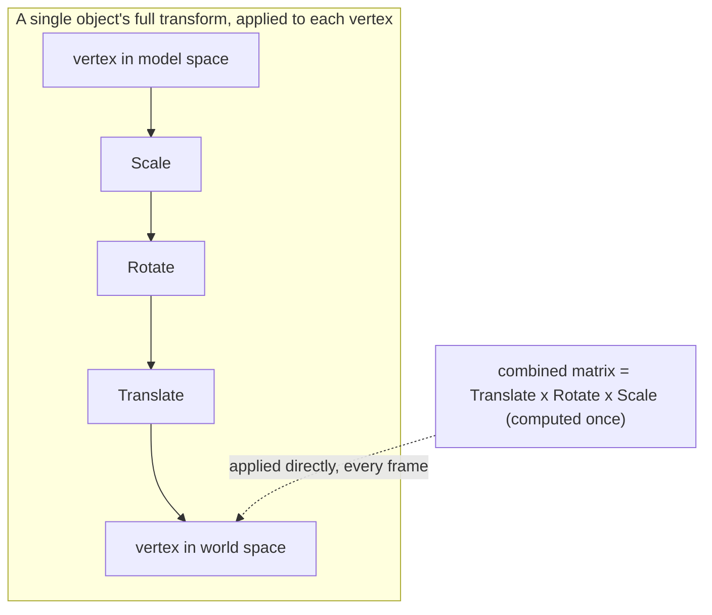

## Learning Objectives

- Describe a matrix as a function that maps an input vector to an output vector via matrix-vector multiplication, and verify the two linearity properties that make it a *linear* function.
- Write down the concrete 2×2 matrices for a 90° rotation, a uniform scale, and a reflection across each coordinate axis.
- Apply a transformation matrix to specific vectors (and to the vertices of a shape) and interpret the geometric result.
- Connect matrix-vector multiplication directly to real graphics pipelines — rotating, scaling, and positioning objects on screen, and transforming between camera and world coordinates.
- Explain why composing two transformations corresponds to multiplying their matrices, and why the order of that multiplication (established as non-commutative in the previous concept) matches the order the transformations are actually applied.

## Context & Motivation

Every time an object rotates, resizes, or flips on a screen — a sprite in a 2D game, a model spinning in a CAD viewer, a camera panning across a 3D scene — the software underneath is multiplying a vector by a matrix. This is not a loose analogy; it is literally the mechanism. Graphics APIs (OpenGL, DirectX, WebGL, the transform matrices used by CSS and SVG) represent every rotation, scale, reflection, and combination thereof as a matrix, and "animate the object" reduces to "multiply its coordinate vectors by the appropriate matrix, once per frame." Understanding a matrix as a transformation — a function that takes a vector in and produces a (possibly rotated, stretched, or flipped) vector out — is the single idea that connects the abstract algebra of the previous concept to a use case nearly every working programmer has touched.

The previous concept, matrix operations, established the mechanics of matrix multiplication and planted the motivation without fully cashing it in: multiplying two matrices corresponds to composing the transformations they represent. This concept makes that concrete. Once a handful of standard 2×2 matrices are in hand — rotation, scaling, reflection — building up a complex sequence of visual transformations (rotate this shape, then stretch it, then flip it) becomes nothing more than multiplying the corresponding matrices together in the right order, then applying the single resulting matrix once. This is exactly why real-time graphics software can afford to animate thousands of objects every frame: the expensive part (working out what "rotate, then scale" means as a combined operation) is done once as matrix multiplication, and the cheap part (applying it to every vertex) is done every frame as a simple matrix-vector product.

## Core Theory

### A matrix as a function

Given a matrix A ∈ ℝ^(m×n), define the function T: ℝⁿ → ℝᵐ by T(x) = Ax. This is a perfectly ordinary function — feed it a vector, get a vector back — but it is not an arbitrary function; it satisfies two properties that together define what "linear" means for a transformation:

    T(x + y) = A(x + y) = Ax + Ay = T(x) + T(y)          (additivity)
    T(cx) = A(cx) = c(Ax) = cT(x)                          (homogeneity)

Both follow immediately from the distributive and scalar-multiplication rules for matrix-vector products established in the systems-of-linear-equations and matrix-operations concepts — nothing new needs to be proved here beyond noticing the pattern. Every matrix defines a linear transformation this way, and — though the proof is not needed for this concept — the converse also holds: every linear transformation from ℝⁿ to ℝᵐ can be represented by some matrix. Matrices and linear transformations between concrete coordinate spaces are, for the purposes of this course, the same object viewed two ways: a grid of numbers, or a function that reshapes space.

A consequence worth flagging immediately: because T(0) = A0 = 0 for any matrix A, every linear transformation fixes the origin — it can rotate, scale, reflect, or shear space around the origin, but it can never *move* the origin itself. Sliding a shape from one location to another (a translation) is therefore not something a matrix acting alone can do; graphics systems work around this with an extra trick (homogeneous coordinates, which pad every vector with an extra "1" so that a translation becomes representable as part of a larger matrix), but that machinery is outside this concept's scope — the point here is only to notice clearly what a plain matrix transformation can and cannot do.

### Rotation

A rotation by angle θ (counterclockwise, about the origin) is given by the matrix

    R(θ) = [ cos θ   -sin θ ]
           [ sin θ    cos θ ]

For the commonly used case of a 90° rotation, cos 90° = 0 and sin 90° = 1, giving the clean matrix

    R(90°) = [ 0  -1 ]
             [ 1   0 ]

Applying this to the vector (1, 0) gives (0, 1), and applying it to (0, 1) gives (-1, 0) — exactly what a quarter-turn counterclockwise should do to the two axis directions, confirmed directly by matrix-vector multiplication rather than by trusting the formula on faith (see Worked Example 1).

### Scaling

A scaling matrix is diagonal — it stretches (or shrinks) each coordinate axis independently, with no mixing between axes:

    S(sx, sy) = [ sx   0 ]
                [  0  sy ]

When sx = sy = k, this is a **uniform scale**, stretching every direction by the same factor k (k > 1 enlarges, 0 < k < 1 shrinks, k = 1 leaves everything unchanged, k < 0 flips as well as scales). When sx ≠ sy, the scale is **non-uniform** — a circle fed through S(2, 1) comes out as an ellipse, stretched horizontally but not vertically, since only the x-coordinate of every point gets doubled.

### Reflection

A reflection across the x-axis flips the sign of the y-coordinate only, leaving x untouched:

    Fx = [ 1   0 ]
         [ 0  -1 ]

A reflection across the y-axis does the mirror-image operation:

    Fy = [ -1  0 ]
         [  0  1 ]

Both are diagonal, like scaling matrices, with entries restricted to ±1 — a reflection is really just a scale by -1 along a single axis, which is a useful way to remember both families as special cases of the same diagonal-matrix pattern rather than as unrelated formulas to memorize separately.

### Composition of transformations, and why order matters

Applying transformation B first, then transformation A, to a vector x means computing A(Bx) — and, exactly as established in the previous concept, A(Bx) = (AB)x. So "rotate, then scale" and "scale, then rotate" correspond to the two matrix products R·S and S·R respectively, and — because matrix multiplication is not commutative — these are generally different matrices, producing genuinely different visual results. Rotating a non-uniformly-scaled shape looks different from scaling a rotated shape, and this is not a subtlety that graphics programmers get to ignore: transformation order is a real, frequent source of bugs in any rendering or animation code that builds up a combined transform from simpler pieces (a model matrix that scales, then rotates, then translates an object, applied in exactly that order, is a completely standard graphics pipeline pattern, and swapping any two steps changes the on-screen result).



The two paths shown compute the same result: applying the three transformations one at a time, in sequence, or precomputing a single combined matrix (multiplied in the same order the steps are applied) and using it directly. Real-time graphics systems always prefer the second path — one matrix-vector multiplication per vertex, per frame — precisely because the composition work has already been folded into a single matrix ahead of time.

## Worked Examples

### Example 1 — verifying the 90° rotation on the standard axes

**Problem.** Apply R(90°) to the vectors (1, 0) and (0, 1), and confirm the result matches a quarter-turn counterclockwise.

**Setup.**

    R(90°) = [ 0  -1 ]
             [ 1   0 ]

**Apply to (1, 0):**

    R(90°)·(1,0) = (0·1 + (-1)·0, 1·1 + 0·0) = (0, 1)

The vector pointing along the positive x-axis now points along the positive y-axis — a 90° counterclockwise turn, exactly as expected.

**Apply to (0, 1):**

    R(90°)·(0,1) = (0·0 + (-1)·1, 1·0 + 0·1) = (-1, 0)

The vector pointing along the positive y-axis now points along the *negative* x-axis — again consistent with a 90° counterclockwise rotation: turning a quarter-turn from "up" lands on "left."

### Example 2 — reflecting a triangle across the x-axis

**Problem.** A triangle has vertices at (1, 1), (3, 1), and (2, 4). Apply the reflection Fx across the x-axis to all three vertices, and describe the result.

**Setup.**

    Fx = [ 1   0 ]
         [ 0  -1 ]

**Apply to each vertex** (Fx leaves x unchanged, negates y):

    (1,1) → (1,-1)
    (3,1) → (3,-1)
    (2,4) → (2,-4)

**Interpretation.** The triangle reappears below the x-axis, as an exact mirror image of the original — same horizontal positions and same shape (same side lengths, same angles), flipped vertically. This is precisely the "flip vertically" operation available in any image editor or game engine's sprite renderer, implemented as exactly this 2×2 matrix applied to every vertex of the shape being drawn.

### Example 3 — order matters: scale-then-rotate versus rotate-then-scale

**Problem.** Let S = S(2, 1) (double the x-coordinate, leave y alone) and R = R(90°). Apply both combined transformations to the vector (1, 0): first compute R(S x) (scale, then rotate), then compute S(R x) (rotate, then scale), and confirm they differ.

**Scale, then rotate: R(Sx).**

Step 1 — scale (1,0): S·(1,0) = (2·1, 1·0) = (2, 0)

Step 2 — rotate (2,0) by 90°: R·(2,0) = (0·2 + (-1)·0, 1·2 + 0·0) = (0, 2)

Result: (0, 2)

**Rotate, then scale: S(Rx).**

Step 1 — rotate (1,0) by 90°: R·(1,0) = (0, 1) (from Example 1)

Step 2 — scale (0,1): S·(0,1) = (2·0, 1·1) = (0, 1)

Result: (0, 1)

**Conclusion.** (0, 2) ≠ (0, 1) — scaling before rotating sends (1,0) to (0,2), while rotating before scaling sends it to (0,1), a visibly shorter vector. This is the geometric face of the algebraic fact from the previous concept that RS ≠ SR: the combined matrices for "scale then rotate" and "rotate then scale" are different matrices, and applying them to the same input vector proves it by producing different output vectors, not just by an abstract argument about matrix entries.

```python
import numpy as np
S = np.array([[2, 0], [0, 1]])
R = np.array([[0, -1], [1, 0]])
x = np.array([1, 0])
print(R @ (S @ x))   # [0 2]  -- scale then rotate
print(S @ (R @ x))   # [0 1]  -- rotate then scale
```

## Common Misconceptions & Pitfalls

- **"A matrix can represent moving a shape from one place to another (translation)."** Every linear transformation fixes the origin, since T(0) = A0 = 0 for any matrix A — a plain matrix-vector product can rotate, scale, reflect, or shear a shape around the origin, but it cannot slide it sideways. Real graphics systems handle translation with a separate mechanism (homogeneous coordinates, a topic outside this concept), precisely because ordinary matrix multiplication is structurally incapable of it.
- **"Rotating then scaling is the same as scaling then rotating."** Example 3 shows a direct counterexample: applying S(2,1) then R(90°) to (1,0) gives (0,2), while applying R(90°) then S(2,1) gives (0,1) — visibly different vectors from the same starting point. This is exactly the non-commutativity of matrix multiplication (AB ≠ BA in general) made geometrically visible, and it is a routine, practical bug source in graphics code that assembles a transform from simpler pieces in the wrong order.
- **"A scaling matrix must scale every direction by the same amount."** A scaling matrix is any diagonal matrix; sx and sy are independent and need not match. Non-uniform scaling (sx ≠ sy) is common and deliberate — stretching a circular button into an oval, or squashing a sprite for a cartoon "impact" effect, is exactly a non-uniform scale.
- **"Negative scale factors don't make geometric sense, so they must be an error."** A negative entry in a scaling matrix (say sx = -1) is a perfectly valid, meaningful operation — it flips that axis, which is exactly what a reflection matrix is (Fx and Fy are just scaling matrices with one entry equal to -1). There is no separate "reflection operation" in the mathematics beyond scaling by a negative number.

## Summary

A matrix A defines a linear transformation T(x) = Ax — a function satisfying T(x+y) = T(x)+T(y) and T(cx) = cT(x) — and this framing turns familiar geometric operations into concrete 2×2 matrices: rotation by angle θ uses cosines and sines, uniform and non-uniform scaling use diagonal matrices, and reflection across an axis is a diagonal matrix with a -1 in one slot. Composing two transformations — doing B first, then A — corresponds exactly to the matrix product AB, which is why the order of matrix multiplication matters: rotating then scaling a vector is demonstrably not the same as scaling then rotating it, a direct geometric instance of the non-commutativity established in the previous concept. This is not an abstract curiosity — it is literally the mechanism every 2D and 3D graphics system uses to rotate, resize, and reposition objects on screen, one matrix-vector multiplication per vertex, with complex combined motions built by multiplying simpler transformation matrices together ahead of time.

## Documentation Links

- [MIT 18.06 — Course Home (OCW)](https://ocw.mit.edu/courses/18-06-linear-algebra-spring-2010/) — doc
- [MIT 18.06SC — Syllabus (OCW)](https://www.ocw.mit.edu/courses/18-06sc-linear-algebra-fall-2011/pages/syllabus) — doc
