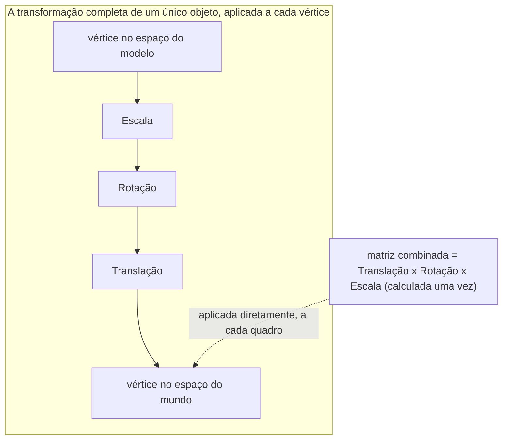

## Objetivos de Aprendizagem

- Descrever uma matriz como uma função que mapeia um vetor de entrada para um vetor de saída via multiplicação matriz-vetor, e verificar as duas propriedades de linearidade que a tornam uma função *linear*.
- Escrever as matrizes 2×2 concretas para uma rotação de 90°, uma escala uniforme, e uma reflexão em torno de cada eixo de coordenadas.
- Aplicar uma matriz de transformação a vetores específicos (e aos vértices de uma forma) e interpretar o resultado geométrico.
- Conectar a multiplicação matriz-vetor diretamente a pipelines gráficos reais, girando, escalando, e posicionando objetos na tela, e transformando entre coordenadas de câmera e de mundo.
- Explicar por que compor duas transformações corresponde a multiplicar suas matrizes, e por que a ordem dessa multiplicação (estabelecida como não comutativa no conceito anterior) corresponde à ordem em que as transformações são de fato aplicadas.

## Contexto e Motivação

Toda vez que um objeto gira, redimensiona, ou vira em uma tela, um sprite em um jogo 2D, um modelo girando em um visualizador CAD, uma câmera panorâmica ao longo de uma cena 3D, o software por baixo está multiplicando um vetor por uma matriz. Isso não é uma analogia solta; é literalmente o mecanismo. APIs gráficas (OpenGL, DirectX, WebGL, as matrizes de transformação usadas por CSS e SVG) representam toda rotação, escala, reflexão, e combinação delas como uma matriz, e "animar o objeto" se reduz a "multiplicar seus vetores de coordenadas pela matriz apropriada, uma vez por quadro." Entender uma matriz como uma transformação, uma função que recebe um vetor e produz um vetor (possivelmente girado, esticado, ou virado) de saída, é a única ideia que conecta a álgebra abstrata do conceito anterior a um caso de uso que quase todo programador em atividade já tocou.

O conceito anterior, operações com matrizes, estabeleceu a mecânica da multiplicação de matrizes e plantou a motivação sem totalmente coletá-la: multiplicar duas matrizes corresponde a compor as transformações que elas representam. Este conceito torna isso concreto. Uma vez que um punhado de matrizes 2×2 padrão está em mãos, rotação, escala, reflexão, construir uma sequência complexa de transformações visuais (gire esta forma, depois estique-a, depois vire-a) se torna nada mais do que multiplicar as matrizes correspondentes juntas na ordem certa, depois aplicar a única matriz resultante uma vez. Isso é exatamente por que software gráfico em tempo real pode se dar ao luxo de animar milhares de objetos a cada quadro: a parte cara (descobrir o que "girar, depois escalar" significa como uma operação combinada) é feita uma vez como multiplicação de matrizes, e a parte barata (aplicá-la a cada vértice) é feita a cada quadro como um simples produto matriz-vetor.

## Teoria Central

### Uma matriz como uma função

Dada uma matriz A ∈ ℝ^(m×n), defina a função T: ℝⁿ → ℝᵐ por T(x) = Ax. Esta é uma função perfeitamente comum, alimente-a com um vetor, receba um vetor de volta, mas não é uma função arbitrária; ela satisfaz duas propriedades que juntas definem o que "linear" significa para uma transformação:

    T(x + y) = A(x + y) = Ax + Ay = T(x) + T(y)          (aditividade)
    T(cx) = A(cx) = c(Ax) = cT(x)                          (homogeneidade)

Ambas seguem imediatamente das regras de distributividade e multiplicação por escalar para produtos matriz-vetor estabelecidas nos conceitos de sistemas de equações lineares e operações com matrizes, nada novo precisa ser provado aqui além de notar o padrão. Toda matriz define uma transformação linear dessa forma, e, embora a prova não seja necessária para este conceito, a recíproca também vale: toda transformação linear de ℝⁿ para ℝᵐ pode ser representada por alguma matriz. Matrizes e transformações lineares entre espaços de coordenadas concretos são, para os propósitos deste curso, o mesmo objeto visto de duas formas: uma grade de números, ou uma função que remodela o espaço.

Uma consequência que vale a pena sinalizar imediatamente: como T(0) = A0 = 0 para qualquer matriz A, toda transformação linear fixa a origem, ela pode girar, escalar, refletir, ou cisalhar o espaço em torno da origem, mas nunca pode *mover* a própria origem. Deslizar uma forma de um local para outro (uma translação) portanto não é algo que uma matriz agindo sozinha pode fazer; sistemas gráficos contornam isso com um truque extra (coordenadas homogêneas, que preenchem todo vetor com um "1" extra para que uma translação se torne representável como parte de uma matriz maior), mas esse maquinário está fora do escopo deste conceito, o ponto aqui é apenas notar claramente o que uma transformação de matriz simples pode e não pode fazer.

### Rotação

Uma rotação por ângulo θ (sentido anti-horário, em torno da origem) é dada pela matriz

    R(θ) = [ cos θ   -sin θ ]
           [ sin θ    cos θ ]

Para o caso comumente usado de uma rotação de 90°, cos 90° = 0 e sin 90° = 1, dando a matriz limpa

    R(90°) = [ 0  -1 ]
             [ 1   0 ]

Aplicar isso ao vetor (1, 0) dá (0, 1), e aplicá-lo a (0, 1) dá (-1, 0), exatamente o que um quarto de volta anti-horário deveria fazer com as duas direções de eixo, confirmado diretamente por multiplicação matriz-vetor em vez de confiar na fórmula por fé (veja o Exemplo Resolvido 1).

### Escala

Uma matriz de escala é diagonal, ela estica (ou encolhe) cada eixo de coordenadas independentemente, sem mistura entre eixos:

    S(sx, sy) = [ sx   0 ]
                [  0  sy ]

Quando sx = sy = k, isso é uma **escala uniforme**, esticando toda direção pelo mesmo fator k (k > 1 amplia, 0 < k < 1 encolhe, k = 1 deixa tudo inalterado, k < 0 também vira). Quando sx ≠ sy, a escala é **não uniforme**, um círculo alimentado através de S(2, 1) sai como uma elipse, esticada horizontalmente mas não verticalmente, já que apenas a coordenada x de todo ponto é dobrada.

### Reflexão

Uma reflexão em torno do eixo x inverte o sinal apenas da coordenada y, deixando x intocado:

    Fx = [ 1   0 ]
         [ 0  -1 ]

Uma reflexão em torno do eixo y faz a operação de imagem espelhada:

    Fy = [ -1  0 ]
         [  0  1 ]

Ambas são diagonais, como matrizes de escala, com entradas restritas a ±1, uma reflexão é realmente apenas uma escala por -1 ao longo de um único eixo, o que é uma forma útil de lembrar ambas as famílias como casos especiais do mesmo padrão de matriz diagonal em vez de fórmulas não relacionadas para memorizar separadamente.

### Composição de transformações, e por que a ordem importa

Aplicar a transformação B primeiro, depois a transformação A, a um vetor x significa calcular A(Bx), e, exatamente como estabelecido no conceito anterior, A(Bx) = (AB)x. Então "gire, depois escale" e "escale, depois gire" correspondem aos dois produtos de matriz R·S e S·R respectivamente, e, porque a multiplicação de matrizes não é comutativa, essas são geralmente matrizes diferentes, produzindo resultados visuais genuinamente diferentes. Girar uma forma escalada não uniformemente parece diferente de escalar uma forma girada, e isso não é uma sutileza que programadores gráficos podem ignorar: a ordem de transformação é uma fonte de bugs real e frequente em qualquer código de renderização ou animação que constrói uma transformação combinada a partir de peças mais simples (uma matriz de modelo que escala, depois gira, depois translada um objeto, aplicada exatamente nessa ordem, é um padrão de pipeline gráfico completamente padrão, e trocar quaisquer dois passos muda o resultado na tela).



Os dois caminhos mostrados calculam o mesmo resultado: aplicar as três transformações uma de cada vez, em sequência, ou pré-calcular uma única matriz combinada (multiplicada na mesma ordem em que os passos são aplicados) e usá-la diretamente. Sistemas gráficos em tempo real sempre preferem o segundo caminho, uma multiplicação matriz-vetor por vértice, por quadro, precisamente porque o trabalho de composição já foi dobrado em uma única matriz de antemão.

## Exemplos Resolvidos

### Exemplo 1 — verificando a rotação de 90° nos eixos padrão

**Problema.** Aplique R(90°) aos vetores (1, 0) e (0, 1), e confirme que o resultado corresponde a um quarto de volta anti-horário.

**Configuração.**

    R(90°) = [ 0  -1 ]
             [ 1   0 ]

**Aplique a (1, 0):**

    R(90°)·(1,0) = (0·1 + (-1)·0, 1·1 + 0·0) = (0, 1)

O vetor apontando ao longo do eixo x positivo agora aponta ao longo do eixo y positivo, um quarto de volta anti-horário, exatamente como esperado.

**Aplique a (0, 1):**

    R(90°)·(0,1) = (0·0 + (-1)·1, 1·0 + 0·1) = (-1, 0)

O vetor apontando ao longo do eixo y positivo agora aponta ao longo do eixo x *negativo*, novamente consistente com uma rotação de 90° anti-horária: girar um quarto de volta a partir de "cima" cai em "esquerda."

### Exemplo 2 — refletindo um triângulo em torno do eixo x

**Problema.** Um triângulo tem vértices em (1, 1), (3, 1), e (2, 4). Aplique a reflexão Fx em torno do eixo x a todos os três vértices, e descreva o resultado.

**Configuração.**

    Fx = [ 1   0 ]
         [ 0  -1 ]

**Aplique a cada vértice** (Fx deixa x inalterado, nega y):

    (1,1) → (1,-1)
    (3,1) → (3,-1)
    (2,4) → (2,-4)

**Interpretação.** O triângulo reaparece abaixo do eixo x, como uma imagem espelhada exata do original, mesmas posições horizontais e mesmo formato (mesmos comprimentos de lado, mesmos ângulos), virado verticalmente. Esta é precisamente a operação "virar verticalmente" disponível em qualquer editor de imagem ou renderizador de sprite de motor de jogo, implementada como exatamente essa matriz 2×2 aplicada a todo vértice da forma sendo desenhada.

### Exemplo 3 — a ordem importa: escala-depois-rotação versus rotação-depois-escala

**Problema.** Sejam S = S(2, 1) (dobra a coordenada x, deixa y sozinho) e R = R(90°). Aplique ambas as transformações combinadas ao vetor (1, 0): primeiro calcule R(S x) (escale, depois gire), depois calcule S(R x) (gire, depois escale), e confirme que diferem.

**Escale, depois gire: R(Sx).**

Passo 1, escale (1,0): S·(1,0) = (2·1, 1·0) = (2, 0)

Passo 2, gire (2,0) por 90°: R·(2,0) = (0·2 + (-1)·0, 1·2 + 0·0) = (0, 2)

Resultado: (0, 2)

**Gire, depois escale: S(Rx).**

Passo 1, gire (1,0) por 90°: R·(1,0) = (0, 1) (do Exemplo 1)

Passo 2, escale (0,1): S·(0,1) = (2·0, 1·1) = (0, 1)

Resultado: (0, 1)

**Conclusão.** (0, 2) ≠ (0, 1), escalar antes de girar envia (1,0) para (0,2), enquanto girar antes de escalar o envia para (0,1), um vetor visivelmente mais curto. Este é o rosto geométrico do fato algébrico do conceito anterior de que RS ≠ SR: as matrizes combinadas para "escale depois gire" e "gire depois escale" são matrizes diferentes, e aplicá-las ao mesmo vetor de entrada prova isso produzindo vetores de saída diferentes, não apenas por um argumento abstrato sobre entradas de matriz.

```python
import numpy as np
S = np.array([[2, 0], [0, 1]])
R = np.array([[0, -1], [1, 0]])
x = np.array([1, 0])
print(R @ (S @ x))   # [0 2]  -- escala depois gira
print(S @ (R @ x))   # [0 1]  -- gira depois escala
```

## Equívocos Comuns e Armadilhas

- **"Uma matriz pode representar mover uma forma de um lugar para outro (translação)."** Toda transformação linear fixa a origem, já que T(0) = A0 = 0 para qualquer matriz A, um produto matriz-vetor simples pode girar, escalar, refletir, ou cisalhar uma forma em torno da origem, mas não pode deslizá-la lateralmente. Sistemas gráficos reais lidam com translação com um mecanismo separado (coordenadas homogêneas, um tópico fora deste conceito), precisamente porque a multiplicação de matrizes comum é estruturalmente incapaz disso.
- **"Girar depois escalar é o mesmo que escalar depois girar."** O Exemplo 3 mostra um contraexemplo direto: aplicar S(2,1) depois R(90°) a (1,0) dá (0,2), enquanto aplicar R(90°) depois S(2,1) dá (0,1), vetores visivelmente diferentes a partir do mesmo ponto de partida. Isso é exatamente a não comutatividade da multiplicação de matrizes (AB ≠ BA em geral) tornada geometricamente visível, e é uma fonte de bugs rotineira e prática em código gráfico que monta uma transformação a partir de peças mais simples na ordem errada.
- **"Uma matriz de escala deve escalar toda direção pela mesma quantidade."** Uma matriz de escala é qualquer matriz diagonal; sx e sy são independentes e não precisam corresponder. Escala não uniforme (sx ≠ sy) é comum e deliberada, esticar um botão circular em uma oval, ou espremer um sprite para um efeito de "impacto" de desenho animado, é exatamente uma escala não uniforme.
- **"Fatores de escala negativos não fazem sentido geométrico, então devem ser um erro."** Uma entrada negativa em uma matriz de escala (digamos sx = -1) é uma operação perfeitamente válida e significativa, ela vira aquele eixo, que é exatamente o que uma matriz de reflexão é (Fx e Fy são apenas matrizes de escala com uma entrada igual a -1). Não há uma "operação de reflexão" separada na matemática além de escalar por um número negativo.

## Resumo

Uma matriz A define uma transformação linear T(x) = Ax, uma função satisfazendo T(x+y) = T(x)+T(y) e T(cx) = cT(x), e essa formulação transforma operações geométricas familiares em matrizes 2×2 concretas: rotação por ângulo θ usa cossenos e senos, escala uniforme e não uniforme usam matrizes diagonais, e reflexão em torno de um eixo é uma matriz diagonal com um -1 em uma posição. Compor duas transformações, fazer B primeiro, depois A, corresponde exatamente ao produto de matriz AB, o que é por que a ordem da multiplicação de matrizes importa: girar depois escalar um vetor demonstravelmente não é o mesmo que escalar depois girá-lo, uma instância geométrica direta da não comutatividade estabelecida no conceito anterior. Isso não é uma curiosidade abstrata, é literalmente o mecanismo que todo sistema gráfico 2D e 3D usa para girar, redimensionar, e reposicionar objetos na tela, uma multiplicação matriz-vetor por vértice, com movimentos combinados complexos construídos multiplicando matrizes de transformação mais simples juntas de antemão.

## Documentation Links

- [MIT 18.06 — Course Home (OCW)](https://ocw.mit.edu/courses/18-06-linear-algebra-spring-2010/) — doc
- [MIT 18.06SC — Syllabus (OCW)](https://www.ocw.mit.edu/courses/18-06sc-linear-algebra-fall-2011/pages/syllabus) — doc
