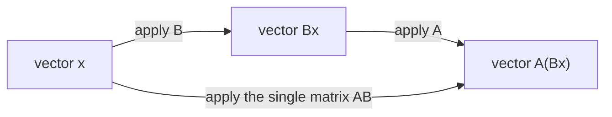

## Learning Objectives

- Define matrix addition and scalar multiplication component-wise, and state the dimension requirements each one imposes.
- Compute the product of two matrices using the row-times-column rule, and determine ahead of time whether a given product is even defined.
- Explain why matrix multiplication is defined this specific way rather than component-wise, by connecting it to the composition of the linear maps the matrices represent.
- Demonstrate, with a concrete 2×2 counterexample, that matrix multiplication is not commutative in general.
- Verify a hand-computed matrix product against a NumPy computation.

## Context & Motivation

Gaussian elimination, the previous topic in this sequence, spent its entire effort combining rows of a matrix — scaling a row by a constant, adding a multiple of one row to another. Those two moves, scaling and adding, are not new inventions specific to elimination; they are the two most basic operations on matrices, matrix addition and scalar multiplication, applied one row at a time. This concept makes that implicit machinery explicit and general: instead of operating row-by-row inside an elimination procedure, addition and scalar multiplication are defined once, for whole matrices, exactly the way vector addition and scalar multiplication were defined earlier for vectors — entry by entry, no surprises.

The real conceptual weight of this concept falls on the third operation, matrix multiplication, which is not an extension of the same component-wise idea and looks, on first encounter, almost perverse: instead of multiplying entries in matching positions the way addition matches them, multiplication combines an entire row of one matrix with an entire column of the other. Every linear algebra course built around applications — MIT's 18.06 among them — insists on slowing down here, because the payoff is not obvious from the definition alone. The reward, developed in full in the next concept, is that multiplying two matrices corresponds exactly to composing the linear transformations they represent: doing one geometric operation and then another turns into a single matrix product. Nothing about component-wise multiplication would have that property. This concept plants that motivation and works out the mechanics; the next concept cashes in the geometric payoff.

A second reason this material earns careful attention: matrix multiplication genuinely does not commute. AB and BA are not just "usually" different — they can differ in every conceivable way, including being defined for one order and not the other. This single fact ripples through the rest of linear algebra (order matters when composing transformations, order matters when factoring matrices, order matters in how machine learning libraries chain layers of computation) and is worth confronting directly, with an explicit counterexample, rather than discovering by surprise three concepts later.

## Core Theory

### Matrix addition and scalar multiplication

A matrix A ∈ ℝ^(m×n) is a rectangular array of real numbers with m rows and n columns; the entry in row i, column j is written A[i,j] (or Aᵢⱼ in prose). Addition and scalar multiplication are both defined entry by entry, exactly mirroring the vector case:

**Addition.** For A, B ∈ ℝ^(m×n) (same shape — this is required, not optional), the sum A + B ∈ ℝ^(m×n) is defined by

    (A + B)[i,j] = A[i,j] + B[i,j]     for every i, j

**Scalar multiplication.** For a scalar c ∈ ℝ and A ∈ ℝ^(m×n), the scaled matrix cA ∈ ℝ^(m×n) is defined by

    (cA)[i,j] = c · A[i,j]     for every i, j

Both operations require nothing beyond arithmetic on individual numbers, and both preserve the shape of the matrix. Two matrices of different shapes simply cannot be added — there is no sensible entry-by-entry pairing if the arrays don't line up — and this dimension check is the first thing to verify before attempting either operation. These two operations, together, make ℝ^(m×n) behave exactly like ℝ^(mn) in disguise: a matrix is really just a vector of mn numbers arranged in a grid instead of a column, and addition/scaling work identically either way. All the familiar algebraic laws hold as a result: A + B = B + A, (A + B) + C = A + (B + C), c(A + B) = cA + cB, and so on — none of this requires proof beyond "it's true for real numbers, entry by entry."

### The row-times-column rule for matrix multiplication

Matrix multiplication is a different kind of operation entirely. For A ∈ ℝ^(m×n) and B ∈ ℝ^(n×p), the product AB ∈ ℝ^(m×p) is defined by

    (AB)[i,j] = Σₖ A[i,k] · B[k,j] = A[i,1]B[1,j] + A[i,2]B[2,j] + ... + A[i,n]B[n,j]

In words: entry (i,j) of the product is the dot product of row i of A with column j of B. This is only defined when the number of columns of A matches the number of rows of B (both equal to n above) — the "inner" dimensions must agree, and the result inherits the "outer" dimensions: an (m×n) matrix times an (n×p) matrix gives an (m×p) matrix. If A is 2×3 and B is 3×2, AB is defined (2×2), but so is BA (3×3) — a first hint that even when both products exist, they need not be the same shape, let alone the same matrix.

This rule is exactly consistent with how a matrix acts on a single vector: recall from the systems-of-linear-equations concept that Ax, for a vector x, computes a linear combination of A's columns weighted by x's entries — equivalently, each entry of Ax is the dot product of a row of A with x. Multiplying A by a whole matrix B is nothing more than applying that same rule to every column of B at once: the j-th column of AB is exactly A times the j-th column of B. Matrix multiplication is vector-matrix multiplication, done column by column.

### Why multiplication is defined this way: composing transformations

The row-times-column rule looks arbitrary until it is connected to what a matrix does, not just what it contains. A matrix A defines a function that sends a vector x to Ax. Now suppose two such functions are applied in sequence: first B, then A — that is, compute A(Bx). The question this concept is really answering is: is there a single matrix that does the same job as "first B, then A," in one step? The answer is yes, and it is exactly the product AB, defined by the row-times-column rule:

    A(Bx) = (AB)x     for every vector x

This identity is not a coincidence of notation — it is the entire reason the row-times-column rule exists rather than some other, simpler-looking definition. If matrices were multiplied entry-by-entry (the naive guess), this identity would fail; composing two linear maps would not correspond to any simple operation on their matrices at all. The row-times-column rule is precisely the definition that makes matrix multiplication track function composition. The next concept, matrices as linear transformations, develops this fully with concrete rotations, scalings, and reflections — but the algebraic seed is planted here: multiplying matrices is how "do this, then do that" gets recorded as a single object.



Both paths through this diagram land on the same output vector — that shared destination is exactly the content of A(Bx) = (AB)x.

### Matrix multiplication is not commutative

For real numbers, ab = ba always. For matrices, AB = BA fails in general — not as an edge case, but as the typical situation. Three distinct ways this failure shows up, in increasing order of severity:

1. **Shape mismatch entirely.** If A is 2×3 and B is 3×5, AB is defined (2×5) but BA is not defined at all (5 columns of B cannot multiply against 2 rows of A unless 5 = 2).
2. **Same shape, different result shapes.** If A is 2×3 and B is 3×2, both AB (2×2) and BA (3×3) are defined, but they aren't even the same size, so they certainly aren't equal.
3. **Same shape throughout, still unequal.** Even restricting to square matrices of the same size, where AB and BA are both defined and both the same shape, they are generically different matrices. This is the case worth proving concretely, since it's the one that actually surprises people — the worked examples below do exactly this with a specific 2×2 pair.

The underlying reason traces back to the composition idea above: AB means "first apply B, then apply A," while BA means "first apply A, then apply B." There is no general reason doing two transformations in one order should produce the same overall effect as doing them in the other order — rotating a shape then stretching it is visibly not the same as stretching it then rotating it, and matrix multiplication faithfully preserves that order-sensitivity rather than smoothing it away.

What does survive from ordinary arithmetic: matrix multiplication is still associative, (AB)C = A(BC), and distributes over addition, A(B + C) = AB + AC and (A + B)C = AC + BC — these can be verified directly from the row-times-column definition by expanding both sides entry by entry. Only commutativity is lost.

## Worked Examples

### Example 1 — addition and scalar multiplication

**Problem.** Let

    A = [ 1  2 ]        B = [ 5   0 ]
        [ 3  4 ]            [-1   2 ]

Compute A + B and 3A.

**A + B**, entry by entry:

    (A+B)[1,1] = 1+5 = 6      (A+B)[1,2] = 2+0 = 2
    (A+B)[2,1] = 3+(-1) = 2   (A+B)[2,2] = 4+2 = 6

    A + B = [ 6  2 ]
            [ 2  6 ]

**3A**, scaling every entry:

    3A = [ 3   6 ]
         [ 9  12 ]

Both results are immediate once the shapes are confirmed to match (they're both 2×2 here) — there is no rule to discover beyond "do the arithmetic entry by entry."

### Example 2 — the row-times-column rule in full

**Problem.** Let

    A = [ 1  2  0 ]      (2×3)      B = [ 1   1 ]      (3×2)
        [-1  3  4 ]                     [ 0   2 ]
                                         [ 2  -1 ]

Compute AB, and confirm the result has the expected shape.

**Shape check.** A is 2×3, B is 3×2; the inner dimension 3 matches, so AB is defined and will be 2×2.

**Entry (1,1):** row 1 of A dotted with column 1 of B: (1)(1) + (2)(0) + (0)(2) = 1 + 0 + 0 = 1

**Entry (1,2):** row 1 of A dotted with column 2 of B: (1)(1) + (2)(2) + (0)(-1) = 1 + 4 + 0 = 5

**Entry (2,1):** row 2 of A dotted with column 1 of B: (-1)(1) + (3)(0) + (4)(2) = -1 + 0 + 8 = 7

**Entry (2,2):** row 2 of A dotted with column 2 of B: (-1)(1) + (3)(2) + (4)(-1) = -1 + 6 - 4 = 1

    AB = [ 1  5 ]
         [ 7  1 ]

Note that BA would also be defined here (3×2 times 2×3 gives 3×3) but would be an entirely different-shaped result — already a small demonstration that order changes not just the values but potentially the very shape of the answer.

A NumPy check for anyone verifying by hand:

```python
import numpy as np
A = np.array([[1, 2, 0], [-1, 3, 4]])
B = np.array([[1, 1], [0, 2], [2, -1]])
print(A @ B)
# [[1 5]
#  [7 1]]
```

### Example 3 — proving AB ≠ BA with a concrete 2×2 pair

**Problem.** Let

    A = [ 1  1 ]        B = [ 1  0 ]
        [ 0  1 ]            [ 1  1 ]

Compute both AB and BA, and confirm they differ.

**AB:**

    (AB)[1,1] = (1)(1) + (1)(1) = 2       (AB)[1,2] = (1)(0) + (1)(1) = 1
    (AB)[2,1] = (0)(1) + (1)(1) = 1       (AB)[2,2] = (0)(0) + (1)(1) = 1

    AB = [ 2  1 ]
         [ 1  1 ]

**BA:**

    (BA)[1,1] = (1)(1) + (0)(0) = 1       (BA)[1,2] = (1)(1) + (0)(1) = 1
    (BA)[2,1] = (1)(1) + (1)(0) = 1       (BA)[2,2] = (1)(1) + (1)(1) = 2

    BA = [ 1  1 ]
         [ 1  2 ]

**Conclusion.** AB ≠ BA — the two matrices don't even share a single off-diagonal-vs-diagonal pattern in common: AB has its larger entry (2) in the top-left, BA has its larger entry (2) in the bottom-right. Both products are legitimate 2×2 matrices, both computations used exactly the same two input matrices, and the only thing that changed was the order of multiplication. This is not a special property of a poorly chosen example — it is the generic behavior of matrix multiplication; finding two matrices where AB does happen to equal BA (such as any matrix multiplied with the identity, covered in the next concept) is the exception, not the rule.

```python
import numpy as np
A = np.array([[1, 1], [0, 1]])
B = np.array([[1, 0], [1, 1]])
print(A @ B)   # [[2 1] [1 1]]
print(B @ A)   # [[1 1] [1 2]]
```

## Common Misconceptions & Pitfalls

- **"Matrix multiplication combines entries in matching positions, like addition does."** This describes a different, less commonly used operation (the entry-wise or Hadamard product), not standard matrix multiplication. The row-times-column rule in Core Theory is the one meant whenever "matrix multiplication" or a bare AB is written without qualification; Example 2 shows the actual computation is a sum of products across a whole row and column, not a single entry-to-entry pairing.
- **"If AB is defined, BA must be defined too."** False whenever A and B aren't square with matching size — a 2×3 times a 3×5 is defined, but the reverse, 5×3 times 3×2, requires the inner dimensions (3 and 2) to match, and here they don't, at 5 and 3. Always check both directions independently rather than assuming symmetry in what's defined.
- **"AB = BA, at least for square matrices of the same size."** Example 3 is a direct counterexample using two of the simplest possible 2×2 matrices — both products are defined, both are 2×2, and they are still different matrices. Commutativity has to be checked, never assumed, even when the shapes cooperate.
- **"(A + B)² = A² + 2AB + B², same as with real numbers."** Expanding correctly gives (A+B)(A+B) = A² + AB + BA + B², and since AB and BA generally differ, this does not simplify to A² + 2AB + B² unless A and B happen to commute (AB = BA) — a condition that fails by default, not one that can be assumed away.

## Summary

Matrix addition and scalar multiplication are the straightforward, entry-by-entry operations, requiring matching shapes and behaving exactly like ordinary arithmetic applied one position at a time. Matrix multiplication is a fundamentally different operation, defined by the row-times-column rule — entry (i,j) of AB is the dot product of row i of A with column j of B — and this specific definition exists because it is exactly the rule that makes A(Bx) = (AB)x hold, i.e., matrix multiplication mirrors composing the linear functions the matrices represent. That connection to composition is also the root cause of the single most important non-obvious fact in this concept: matrix multiplication is not commutative. AB and BA can differ in value, in shape, or in whether they're even defined at all, and a concrete 2×2 pair suffices to prove this outright rather than merely assert it. Associativity and distributivity survive from ordinary arithmetic; commutativity does not.

## Documentation Links

- [Stanford CS229 — Linear Algebra Review and Reference](https://cs229.stanford.edu/section/cs229-linalg.pdf) — doc
- [ACM/IEEE CS2013 — Full Curriculum Guidelines](https://www.acm.org/binaries/content/assets/education/cs2013_web_final.pdf) — doc
