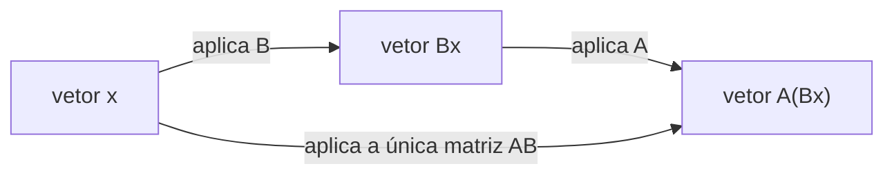

## Objetivos de Aprendizagem

- Definir a soma de matrizes e a multiplicação por escalar componente a componente, e enunciar as exigências de dimensão que cada uma impõe.
- Calcular o produto de duas matrizes usando a regra linha-vezes-coluna, e determinar antecipadamente se um dado produto sequer é definido.
- Explicar por que a multiplicação de matrizes é definida dessa forma específica em vez de componente a componente, conectando-a à composição das transformações lineares que as matrizes representam.
- Demonstrar, com um contraexemplo 2×2 concreto, que a multiplicação de matrizes não é comutativa em geral.
- Verificar um produto de matrizes calculado à mão contra um cálculo do NumPy.

## Contexto e Motivação

A eliminação Gaussiana, o tópico anterior nesta sequência, gastou todo seu esforço combinando linhas de uma matriz, escalando uma linha por uma constante, somando um múltiplo de uma linha a outra. Esses dois movimentos, escalar e somar, não são invenções novas específicas para eliminação; são as duas operações mais básicas em matrizes, soma de matrizes e multiplicação por escalar, aplicadas uma linha por vez. Este conceito torna esse maquinário implícito explícito e geral: em vez de operar linha por linha dentro de um procedimento de eliminação, soma e multiplicação por escalar são definidas uma vez, para matrizes inteiras, exatamente da forma que a soma de vetores e a multiplicação por escalar foram definidas anteriormente para vetores, entrada por entrada, sem surpresas.

O peso conceitual real deste conceito recai sobre a terceira operação, multiplicação de matrizes, que não é uma extensão da mesma ideia componente a componente e parece, no primeiro encontro, quase perversa: em vez de multiplicar entradas em posições correspondentes da forma que a soma as combina, a multiplicação combina uma linha inteira de uma matriz com uma coluna inteira da outra. Todo curso de álgebra linear construído em torno de aplicações, o 18.06 do MIT entre eles, insiste em desacelerar aqui, porque o retorno não é óbvio a partir da definição sozinha. A recompensa, desenvolvida completamente no próximo conceito, é que multiplicar duas matrizes corresponde exatamente a compor as transformações lineares que elas representam: fazer uma operação geométrica e depois outra se transforma em um único produto de matrizes. Nada sobre multiplicação componente a componente teria essa propriedade. Este conceito planta essa motivação e trabalha a mecânica; o próximo conceito coleta o retorno geométrico.

Uma segunda razão pela qual este material merece atenção cuidadosa: a multiplicação de matrizes genuinamente não comuta. AB e BA não são apenas "geralmente" diferentes, podem diferir de todo jeito concebível, incluindo estar definido para uma ordem e não para a outra. Este único fato se propaga pelo resto da álgebra linear (ordem importa ao compor transformações, ordem importa ao fatorar matrizes, ordem importa em como bibliotecas de aprendizado de máquina encadeiam camadas de cálculo) e vale a pena confrontar diretamente, com um contraexemplo explícito, em vez de descobrir por surpresa três conceitos depois.

## Teoria Central

### Soma de matrizes e multiplicação por escalar

Uma matriz A ∈ ℝ^(m×n) é um arranjo retangular de números reais com m linhas e n colunas; a entrada na linha i, coluna j é escrita A[i,j] (ou Aᵢⱼ em prosa). Soma e multiplicação por escalar são ambas definidas entrada por entrada, espelhando exatamente o caso de vetores:

**Soma.** Para A, B ∈ ℝ^(m×n) (mesmo formato, isso é exigido, não opcional), a soma A + B ∈ ℝ^(m×n) é definida por

    (A + B)[i,j] = A[i,j] + B[i,j]     para todo i, j

**Multiplicação por escalar.** Para um escalar c ∈ ℝ e A ∈ ℝ^(m×n), a matriz escalada cA ∈ ℝ^(m×n) é definida por

    (cA)[i,j] = c · A[i,j]     para todo i, j

Ambas as operações não exigem nada além de aritmética em números individuais, e ambas preservam o formato da matriz. Duas matrizes de formatos diferentes simplesmente não podem ser somadas, não há pareamento sensível entrada por entrada se os arranjos não se alinham, e essa verificação de dimensão é a primeira coisa a verificar antes de tentar qualquer operação. Essas duas operações, juntas, fazem ℝ^(m×n) se comportar exatamente como ℝ^(mn) disfarçado: uma matriz é realmente apenas um vetor de mn números arranjados em uma grade em vez de uma coluna, e soma/escalonamento funcionam identicamente de qualquer forma. Todas as leis algébricas familiares valem como resultado: A + B = B + A, (A + B) + C = A + (B + C), c(A + B) = cA + cB, e assim por diante, nada disso exige prova além de "é verdade para números reais, entrada por entrada."

### A regra linha-vezes-coluna para multiplicação de matrizes

A multiplicação de matrizes é um tipo de operação inteiramente diferente. Para A ∈ ℝ^(m×n) e B ∈ ℝ^(n×p), o produto AB ∈ ℝ^(m×p) é definido por

    (AB)[i,j] = Σₖ A[i,k] · B[k,j] = A[i,1]B[1,j] + A[i,2]B[2,j] + ... + A[i,n]B[n,j]

Em palavras: a entrada (i,j) do produto é o produto escalar da linha i de A com a coluna j de B. Isso só é definido quando o número de colunas de A corresponde ao número de linhas de B (ambos iguais a n acima), as dimensões "internas" devem concordar, e o resultado herda as dimensões "externas": uma matriz (m×n) vezes uma matriz (n×p) dá uma matriz (m×p). Se A é 2×3 e B é 3×2, AB é definido (2×2), mas BA também é (3×3), uma primeira dica de que mesmo quando ambos os produtos existem, não precisam ter o mesmo formato, muito menos ser a mesma matriz.

Essa regra é exatamente consistente com como uma matriz age sobre um único vetor: recorde do conceito de sistemas de equações lineares que Ax, para um vetor x, calcula uma combinação linear das colunas de A ponderada pelas entradas de x, equivalentemente, cada entrada de Ax é o produto escalar de uma linha de A com x. Multiplicar A por uma matriz B inteira nada mais é do que aplicar essa mesma regra a cada coluna de B de uma vez: a j-ésima coluna de AB é exatamente A vezes a j-ésima coluna de B. Multiplicação de matrizes é multiplicação matriz-vetor, feita coluna por coluna.

### Por que a multiplicação é definida dessa forma: compondo transformações

A regra linha-vezes-coluna parece arbitrária até ser conectada ao que uma matriz faz, não apenas ao que ela contém. Uma matriz A define uma função que envia um vetor x para Ax. Agora suponha que duas dessas funções são aplicadas em sequência: primeiro B, depois A, ou seja, calcule A(Bx). A pergunta que este conceito está realmente respondendo é: existe uma única matriz que faz o mesmo trabalho de "primeiro B, depois A," em um passo? A resposta é sim, e é exatamente o produto AB, definido pela regra linha-vezes-coluna:

    A(Bx) = (AB)x     para todo vetor x

Essa identidade não é uma coincidência de notação, é toda a razão pela qual a regra linha-vezes-coluna existe em vez de alguma outra definição de aparência mais simples. Se matrizes fossem multiplicadas entrada por entrada (o palpite ingênuo), essa identidade falharia; compor duas transformações lineares não corresponderia a nenhuma operação simples em suas matrizes de forma alguma. A regra linha-vezes-coluna é precisamente a definição que faz a multiplicação de matrizes acompanhar a composição de funções. O próximo conceito, matrizes como transformações lineares, desenvolve isso completamente com rotações, escalonamentos, e reflexões concretas, mas a semente algébrica é plantada aqui: multiplicar matrizes é como "faça isso, depois faça aquilo" é registrado como um único objeto.



Ambos os caminhos por este diagrama chegam ao mesmo vetor de saída, esse destino compartilhado é exatamente o conteúdo de A(Bx) = (AB)x.

### Multiplicação de matrizes não é comutativa

Para números reais, ab = ba sempre. Para matrizes, AB = BA falha em geral, não como um caso extremo, mas como a situação típica. Três formas distintas que essa falha aparece, em ordem crescente de severidade:

1. **Incompatibilidade de formato inteiramente.** Se A é 2×3 e B é 3×5, AB é definido (2×5) mas BA não é definido de forma alguma (5 colunas de B não podem multiplicar contra 2 linhas de A a menos que 5 = 2).
2. **Mesmo formato, formatos de resultado diferentes.** Se A é 2×3 e B é 3×2, tanto AB (2×2) quanto BA (3×3) são definidos, mas nem sequer têm o mesmo tamanho, então certamente não são iguais.
3. **Mesmo formato o tempo todo, ainda desiguais.** Mesmo restringindo a matrizes quadradas do mesmo tamanho, onde AB e BA são ambos definidos e ambos têm o mesmo formato, eles são genericamente matrizes diferentes. Este é o caso que vale a pena provar concretamente, já que é o que realmente surpreende as pessoas, os exemplos resolvidos abaixo fazem exatamente isso com um par 2×2 específico.

A razão subjacente remonta à ideia de composição acima: AB significa "primeiro aplique B, depois aplique A," enquanto BA significa "primeiro aplique A, depois aplique B." Não há razão geral pela qual fazer duas transformações em uma ordem deveria produzir o mesmo efeito geral que fazê-las na outra ordem, girar uma forma e depois esticá-la visivelmente não é o mesmo que esticá-la e depois girá-la, e a multiplicação de matrizes preserva fielmente essa sensibilidade à ordem em vez de suavizá-la.

O que sobrevive da aritmética comum: a multiplicação de matrizes ainda é associativa, (AB)C = A(BC), e distribui sobre a soma, A(B + C) = AB + AC e (A + B)C = AC + BC, essas podem ser verificadas diretamente a partir da definição linha-vezes-coluna expandindo ambos os lados entrada por entrada. Apenas a comutatividade é perdida.

## Exemplos Resolvidos

### Exemplo 1 — soma e multiplicação por escalar

**Problema.** Sejam

    A = [ 1  2 ]        B = [ 5   0 ]
        [ 3  4 ]            [-1   2 ]

Calcule A + B e 3A.

**A + B**, entrada por entrada:

    (A+B)[1,1] = 1+5 = 6      (A+B)[1,2] = 2+0 = 2
    (A+B)[2,1] = 3+(-1) = 2   (A+B)[2,2] = 4+2 = 6

    A + B = [ 6  2 ]
            [ 2  6 ]

**3A**, escalando toda entrada:

    3A = [ 3   6 ]
         [ 9  12 ]

Ambos os resultados são imediatos uma vez que os formatos são confirmados como correspondentes (ambos são 2×2 aqui), não há regra a descobrir além de "faça a aritmética entrada por entrada."

### Exemplo 2 — a regra linha-vezes-coluna completa

**Problema.** Sejam

    A = [ 1  2  0 ]      (2×3)      B = [ 1   1 ]      (3×2)
        [-1  3  4 ]                     [ 0   2 ]
                                         [ 2  -1 ]

Calcule AB, e confirme que o resultado tem o formato esperado.

**Verificação de formato.** A é 2×3, B é 3×2; a dimensão interna 3 corresponde, então AB é definido e será 2×2.

**Entrada (1,1):** linha 1 de A ponteada com coluna 1 de B: (1)(1) + (2)(0) + (0)(2) = 1 + 0 + 0 = 1

**Entrada (1,2):** linha 1 de A ponteada com coluna 2 de B: (1)(1) + (2)(2) + (0)(-1) = 1 + 4 + 0 = 5

**Entrada (2,1):** linha 2 de A ponteada com coluna 1 de B: (-1)(1) + (3)(0) + (4)(2) = -1 + 0 + 8 = 7

**Entrada (2,2):** linha 2 de A ponteada com coluna 2 de B: (-1)(1) + (3)(2) + (4)(-1) = -1 + 6 - 4 = 1

    AB = [ 1  5 ]
         [ 7  1 ]

Note que BA também seria definido aqui (3×2 vezes 2×3 dá 3×3) mas seria um resultado de formato inteiramente diferente, já uma pequena demonstração de que a ordem muda não apenas os valores mas potencialmente o próprio formato da resposta.

Uma verificação com NumPy para quem estiver verificando à mão:

```python
import numpy as np
A = np.array([[1, 2, 0], [-1, 3, 4]])
B = np.array([[1, 1], [0, 2], [2, -1]])
print(A @ B)
# [[1 5]
#  [7 1]]
```

### Exemplo 3 — provando AB ≠ BA com um par 2×2 concreto

**Problema.** Sejam

    A = [ 1  1 ]        B = [ 1  0 ]
        [ 0  1 ]            [ 1  1 ]

Calcule tanto AB quanto BA, e confirme que diferem.

**AB:**

    (AB)[1,1] = (1)(1) + (1)(1) = 2       (AB)[1,2] = (1)(0) + (1)(1) = 1
    (AB)[2,1] = (0)(1) + (1)(1) = 1       (AB)[2,2] = (0)(0) + (1)(1) = 1

    AB = [ 2  1 ]
         [ 1  1 ]

**BA:**

    (BA)[1,1] = (1)(1) + (0)(0) = 1       (BA)[1,2] = (1)(1) + (0)(1) = 1
    (BA)[2,1] = (1)(1) + (1)(0) = 1       (BA)[2,2] = (1)(1) + (1)(1) = 2

    BA = [ 1  1 ]
         [ 1  2 ]

**Conclusão.** AB ≠ BA, as duas matrizes nem sequer compartilham um único padrão de diagonal-versus-fora-da-diagonal em comum: AB tem sua entrada maior (2) no canto superior esquerdo, BA tem sua entrada maior (2) no canto inferior direito. Ambos os produtos são matrizes 2×2 legítimas, ambos os cálculos usaram exatamente as mesmas duas matrizes de entrada, e a única coisa que mudou foi a ordem da multiplicação. Isso não é uma propriedade especial de um exemplo mal escolhido, é o comportamento genérico da multiplicação de matrizes; encontrar duas matrizes onde AB acontece de ser igual a BA (como qualquer matriz multiplicada pela identidade, coberta no próximo conceito) é a exceção, não a regra.

```python
import numpy as np
A = np.array([[1, 1], [0, 1]])
B = np.array([[1, 0], [1, 1]])
print(A @ B)   # [[2 1] [1 1]]
print(B @ A)   # [[1 1] [1 2]]
```

## Equívocos Comuns e Armadilhas

- **"Multiplicação de matrizes combina entradas em posições correspondentes, como a soma faz."** Isso descreve uma operação diferente, menos comumente usada (o produto entrada por entrada, ou de Hadamard), não a multiplicação de matrizes padrão. A regra linha-vezes-coluna da Teoria Central é a pretendida sempre que "multiplicação de matrizes" ou um simples AB é escrito sem qualificação; o Exemplo 2 mostra que o cálculo real é uma soma de produtos ao longo de uma linha e coluna inteiras, não um pareamento único entrada a entrada.
- **"Se AB é definido, BA também deve ser definido."** Falso sempre que A e B não são quadradas com tamanho correspondente, uma 2×3 vezes uma 3×5 é definida, mas o reverso, 5×3 vezes 3×2, exige que as dimensões internas (3 e 2) correspondam, e aqui não correspondem, sendo 5 e 3. Sempre verifique ambas as direções independentemente em vez de assumir simetria no que é definido.
- **"AB = BA, pelo menos para matrizes quadradas do mesmo tamanho."** O Exemplo 3 é um contraexemplo direto usando duas das matrizes 2×2 mais simples possíveis, ambos os produtos são definidos, ambos são 2×2, e ainda assim são matrizes diferentes. Comutatividade tem que ser verificada, nunca assumida, mesmo quando os formatos cooperam.
- **"(A + B)² = A² + 2AB + B², igual a com números reais."** Expandir corretamente dá (A+B)(A+B) = A² + AB + BA + B², e já que AB e BA geralmente diferem, isso não se simplifica para A² + 2AB + B² a menos que A e B aconteçam de comutar (AB = BA), uma condição que falha por padrão, não uma que pode ser assumida.

## Resumo

Soma de matrizes e multiplicação por escalar são as operações diretas, entrada por entrada, exigindo formatos correspondentes e se comportando exatamente como aritmética comum aplicada uma posição de cada vez. A multiplicação de matrizes é uma operação fundamentalmente diferente, definida pela regra linha-vezes-coluna, a entrada (i,j) de AB é o produto escalar da linha i de A com a coluna j de B, e essa definição específica existe porque é exatamente a regra que faz A(Bx) = (AB)x valer, ou seja, a multiplicação de matrizes espelha compor as funções lineares que as matrizes representam. Essa conexão com composição também é a causa raiz do fato não óbvio mais importante deste conceito: a multiplicação de matrizes não é comutativa. AB e BA podem diferir em valor, em formato, ou em se sequer estão definidos, e um par 2×2 concreto basta para provar isso definitivamente em vez de apenas afirmá-lo. Associatividade e distributividade sobrevivem da aritmética comum; comutatividade não.

## Documentation Links

- [Stanford CS229 — Linear Algebra Review and Reference](https://cs229.stanford.edu/section/cs229-linalg.pdf) — doc
- [ACM/IEEE CS2013 — Full Curriculum Guidelines](https://www.acm.org/binaries/content/assets/education/cs2013_web_final.pdf) — doc
