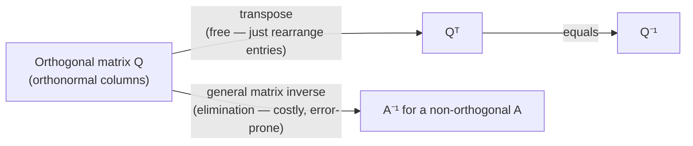

## Learning Objectives

- Define orthogonality between two vectors as a dot product of zero, and verify it directly for small examples.
- Define an orthonormal set of vectors (pairwise orthogonal, each of unit length) and an orthogonal matrix as a square matrix whose columns form such a set.
- Prove that an orthogonal matrix Q satisfies QᵀQ = I, and explain why this means Q⁻¹ = Qᵀ.
- Explain, computationally and conceptually, why orthogonal matrices are inexpensive to invert compared to a general matrix.
- Verify, for a small concrete matrix, whether it is orthogonal by checking its columns directly.

## Context & Motivation

The dot-product concept established that the dot product of two vectors measures, among other things, the cosine of the angle between them — positive when the angle is acute, negative when obtuse, and exactly zero precisely when the two vectors are perpendicular. That zero case is important enough on its own to deserve a name: two vectors with a zero dot product are called **orthogonal**, and it is worth isolating this single condition because an enormous amount of good computational behavior follows from it.

Orthogonality becomes especially powerful when an entire set of vectors is mutually orthogonal — not just one pair, but every pair in the set — and each vector is additionally scaled to length 1. Assembling such vectors as the columns of a matrix produces an **orthogonal matrix**, and it is genuinely remarkable, not merely convenient, what this buys: the inverse of an orthogonal matrix is nothing more than its transpose, computed by simply reading the matrix's entries in a different order, with no elimination, no cofactors, and no numerical instability of the kind that plagues inverting an arbitrary matrix.

This matters practically wherever repeated transformations need to be undone cheaply — computer graphics rotating a camera or an object back and forth, numerical algorithms that repeatedly change coordinate systems, and the QR decomposition that underlies much of modern numerical linear algebra all lean on exactly this property. And it isn't the last time orthogonal matrices appear in this discipline: when a symmetric matrix's eigenvectors are examined later, it turns out they can always be chosen to be mutually orthogonal — meaning the matrix that diagonalizes a symmetric matrix is itself an orthogonal matrix, letting the cheap-inverse property here carry forward into that far more advanced setting essentially for free.

## Core Theory

### Orthogonal vectors

Two vectors u and v are **orthogonal** if their dot product is zero:

u · v = 0

Geometrically, this means u and v meet at a right angle (90°) — or one of them is the zero vector, a degenerate edge case technically satisfying the definition (0 · v = 0 for any v), though the interesting content of orthogonality is about nonzero vectors meeting at right angles. In ℝ², u = (1, 0) and v = (0, 1) are orthogonal (u · v = 1·0 + 0·1 = 0), matching the visual picture of the x-axis and y-axis meeting perpendicularly; u = (1, 1) and v = (1, −1) are also orthogonal (1·1 + 1·(−1) = 0), even though neither lies along a coordinate axis.

A set of vectors is **mutually orthogonal** if every pair in the set has a zero dot product. A set that is mutually orthogonal *and* where every vector additionally has length (norm) exactly 1 is called **orthonormal**. Any orthogonal set of nonzero vectors can be converted to an orthonormal one by dividing each vector by its own norm — a step called **normalizing** — without disturbing the pairwise-orthogonal relationships (scaling a vector doesn't change the direction it points, only its length).

### Orthogonal matrices

A square matrix Q is an **orthogonal matrix** if its columns form an orthonormal set. This single requirement — pairwise dot products of zero between distinct columns, and each column's own dot product with itself equal to 1 (since a unit vector's norm-squared, which equals its dot product with itself, is 1) — can be restated compactly using matrix multiplication:

QᵀQ = I

To see why, examine what QᵀQ computes: entry (i, j) of QᵀQ is row i of Qᵀ (which is column i of Q) dotted with column j of Q. So entry (i, j) of QᵀQ is exactly (column i of Q) · (column j of Q). When i = j, this is a column dotted with itself — equal to 1, since each column has unit length. When i ≠ j, this is two distinct columns dotted together — equal to 0, by orthogonality. The result, entry by entry, is exactly the identity matrix: 1's on the diagonal, 0's everywhere else.

### The remarkable consequence: Q⁻¹ = Qᵀ

QᵀQ = I is precisely the defining property of a matrix inverse (from the identity-matrix-and-inverses concept: A⁻¹ is defined by A⁻¹A = AA⁻¹ = I). So Qᵀ *is* Q⁻¹:

Q⁻¹ = Qᵀ

This is the single fact that makes orthogonal matrices so valuable computationally. Computing a general matrix inverse requires Gaussian elimination (or an equivalent), a nontrivial amount of arithmetic that grows quickly with matrix size and can accumulate floating-point error along the way. Computing a transpose requires none of that — it's a pure rearrangement of entries (row i, column j swaps with row j, column i), with no arithmetic at all and therefore no numerical error introduced. Whenever a matrix is known in advance to be orthogonal — as rotation matrices always are, for instance — its inverse is available essentially for free.

### Why orthogonal matrices preserve geometry

An orthogonal matrix's rows, not just its columns, also turn out to form an orthonormal set — a consequence of QᵀQ = I also implying QQᵀ = I for square Q (once one side of an inverse relationship holds for square matrices, so does the other). This has a clean geometric payoff: multiplying a vector by an orthogonal matrix never changes its length, and never changes the angle between two vectors it's applied to — an orthogonal transformation is exactly a rotation, a reflection, or some combination of the two, never a stretch or a skew. This is part of why orthogonal matrices are the natural language for rotating objects in computer graphics: applying Q repeatedly rotates an object through a sequence of positions without ever distorting its shape, and undoing any rotation is just as cheap as applying it, via Qᵀ.

## Worked Examples

### Example 1 — verifying orthogonality between two vectors

**Problem:** Are u = (3, 4) and v = (4, −3) orthogonal?

**Compute the dot product.** u · v = 3·4 + 4·(−3) = 12 − 12 = 0.

**Conclusion.** Yes, u and v are orthogonal. Geometrically, u and v are both length 5 (3² + 4² = 25, 4² + (−3)² = 25) and, having a zero dot product, meet at exactly 90° — u points into the first quadrant, v into the fourth, and rotating u by 90° clockwise lands exactly on v, which is a useful way to see orthogonality directly for vectors in the plane.

### Example 2 — checking whether a matrix is orthogonal

**Problem:** Is Q = [[0, 1], [−1, 0]] an orthogonal matrix? If so, write down Q⁻¹ immediately.

**Identify the columns.** Column 1 is (0, −1); column 2 is (1, 0).

**Check unit length.** ‖(0,−1)‖ = √(0² + (−1)²) = √1 = 1. ✓ ‖(1,0)‖ = √(1² + 0²) = 1. ✓

**Check orthogonality between columns.** (0,−1) · (1,0) = 0·1 + (−1)·0 = 0. ✓

**Conclusion.** Both conditions hold, so Q is orthogonal, and Q⁻¹ = Qᵀ = [[0, −1], [1, 0]] — obtained purely by transposing, no elimination needed. As a sanity check, verify QᵀQ = I directly: [[0,−1],[1,0]] · [[0,1],[−1,0]] = [[0·0+(−1)(−1), 0·1+(−1)·0], [1·0+0·(−1), 1·1+0·0]] = [[1, 0], [0, 1]] = I. ✓ (This particular Q is, geometrically, a 90° rotation matrix — consistent with orthogonal matrices representing rotations.)

### Example 3 — a non-orthogonal matrix, for contrast

**Problem:** Is A = [[1, 1], [0, 1]] an orthogonal matrix?

**Identify the columns.** Column 1 is (1, 0); column 2 is (1, 1).

**Check unit length.** ‖(1,0)‖ = 1. ✓ ‖(1,1)‖ = √(1²+1²) = √2 ≠ 1. ✗

**Conclusion.** A is not orthogonal — column 2 fails the unit-length requirement, so there's no need to even check the dot product between columns. For this A, A⁻¹ must be computed by the general method (elimination or the 2×2 formula from the determinants concept), since Aᵀ = [[1, 0], [1, 1]] is not equal to A⁻¹ here — direct check: A · Aᵀ = [[1,1],[0,1]]·[[1,0],[1,1]] = [[1·1+1·1, 1·0+1·1],[0·1+1·1, 0·0+1·1]] = [[2,1],[1,1]] ≠ I, confirming Aᵀ is not A's inverse.

## Common Misconceptions & Pitfalls

- **"Orthogonal just means the columns are perpendicular to each other."** That's necessary but not sufficient — the columns must *also* each have unit length. A matrix with perpendicular but non-unit-length columns, like [[2,0],[0,3]] (columns (2,0) and (0,3), perpendicular but not unit length), is not an orthogonal matrix in the technical sense, even though its columns are mutually orthogonal — Example 3's A actually fails on the length condition specifically for this reason.
- **"Q⁻¹ = Qᵀ holds for every square matrix."** It holds only for orthogonal matrices specifically — Example 3 shows a square matrix where Aᵀ ≠ A⁻¹. The equality is the defining payoff of orthogonality, not a general property of transposition.
- **"An orthogonal matrix's rows and columns are unrelated conditions — a matrix could satisfy one and not the other."** For a square matrix, if the columns are orthonormal, the rows automatically are too (both facts follow together once QᵀQ = I is established, since that also forces QQᵀ = I). This is special to square matrices — the term "orthogonal matrix" is reserved for the square case precisely so this symmetry always holds.
- **"Orthogonal vectors must be unit vectors."** Orthogonality (zero dot product) and unit length are independent conditions — Example 1's u = (3,4) and v = (4,−3) are orthogonal but have length 5, not 1. It's only when assembling vectors as the *columns of an orthogonal matrix* that both conditions are required simultaneously (orthonormal, not merely orthogonal).

## Summary

Two vectors are orthogonal exactly when their dot product is zero, generalizing the everyday idea of a right angle to any pair of vectors. An orthogonal matrix Q is a square matrix whose columns form an orthonormal set — pairwise orthogonal and each of unit length — a condition compactly expressed as QᵀQ = I. This single equation delivers the concept's central, genuinely remarkable payoff: Q⁻¹ = Qᵀ, meaning an orthogonal matrix's inverse costs nothing more than rearranging its entries, with none of the arithmetic (and none of the numerical error) that a general matrix inverse requires. Orthogonal matrices represent rotations and reflections — transformations that preserve length and angle — which is why they appear throughout computer graphics and numerical linear algebra, and this same cheap-inverse property will resurface when a symmetric matrix's orthogonal eigenvector basis is studied later in this discipline.

## Documentation Links

- [MIT 18.06 — Course Home (OCW)](https://ocw.mit.edu/courses/18-06-linear-algebra-spring-2010/) — doc
- [Stanford CS229 — Linear Algebra Review and Reference](https://cs229.stanford.edu/section/cs229-linalg.pdf) — doc
