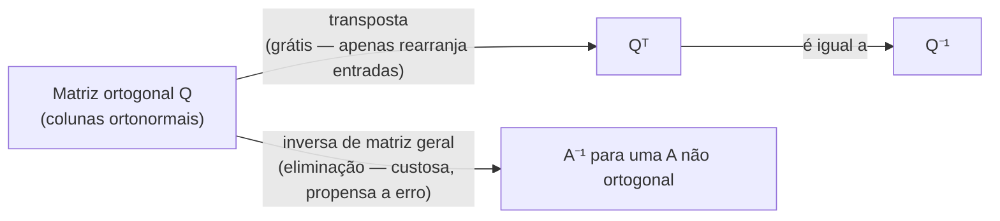

## Objetivos de Aprendizagem

- Definir ortogonalidade entre dois vetores como um produto escalar de zero, e verificá-la diretamente para exemplos pequenos.
- Definir um conjunto ortonormal de vetores (ortogonais dois a dois, cada um de comprimento unitário) e uma matriz ortogonal como uma matriz quadrada cujas colunas formam tal conjunto.
- Provar que uma matriz ortogonal Q satisfaz QᵀQ = I, e explicar por que isso significa Q⁻¹ = Qᵀ.
- Explicar, computacional e conceitualmente, por que matrizes ortogonais são baratas de inverter comparadas a uma matriz geral.
- Verificar, para uma matriz pequena concreta, se ela é ortogonal checando suas colunas diretamente.

## Contexto e Motivação

O conceito de produto escalar estabeleceu que o produto escalar de dois vetores mede, entre outras coisas, o cosseno do ângulo entre eles, positivo quando o ângulo é agudo, negativo quando obtuso, e exatamente zero precisamente quando os dois vetores são perpendiculares. Esse caso zero é importante o suficiente por si só para merecer um nome: dois vetores com produto escalar zero são chamados de **ortogonais**, e vale a pena isolar essa única condição porque uma enorme quantidade de bom comportamento computacional segue dela.

Ortogonalidade se torna especialmente poderosa quando um conjunto inteiro de vetores é mutuamente ortogonal, não apenas um par, mas todo par no conjunto, e cada vetor é adicionalmente escalado para comprimento 1. Montar tais vetores como as colunas de uma matriz produz uma **matriz ortogonal**, e é genuinamente notável, não meramente conveniente, o que isso proporciona: a inversa de uma matriz ortogonal nada mais é do que sua transposta, calculada apenas lendo as entradas da matriz em uma ordem diferente, sem eliminação, sem cofatores, e sem a instabilidade numérica do tipo que atormenta inverter uma matriz arbitrária.

Isso importa praticamente sempre que transformações repetidas precisam ser desfeitas de forma barata, gráficos de computador girando uma câmera ou um objeto para trás e para frente, algoritmos numéricos que repetidamente mudam sistemas de coordenadas, e a decomposição QR que sustenta grande parte da álgebra linear numérica moderna todos se apoiam exatamente nessa propriedade. E não é a última vez que matrizes ortogonais aparecem nesta disciplina: quando os autovetores de uma matriz simétrica são examinados mais tarde, acontece que eles sempre podem ser escolhidos mutuamente ortogonais, significando que a matriz que diagonaliza uma matriz simétrica é ela mesma uma matriz ortogonal, permitindo que a propriedade de inversa barata aqui se propague para aquele cenário muito mais avançado essencialmente de graça.

## Teoria Central

### Vetores ortogonais

Dois vetores u e v são **ortogonais** se seu produto escalar é zero:

u · v = 0

Geometricamente, isso significa que u e v se encontram em um ângulo reto (90°), ou um deles é o vetor zero, um caso extremo degenerado que tecnicamente satisfaz a definição (0 · v = 0 para qualquer v), embora o conteúdo interessante de ortogonalidade seja sobre vetores não nulos se encontrando em ângulos retos. Em ℝ², u = (1, 0) e v = (0, 1) são ortogonais (u · v = 1·0 + 0·1 = 0), correspondendo à imagem visual do eixo x e eixo y se encontrando perpendicularmente; u = (1, 1) e v = (1, −1) também são ortogonais (1·1 + 1·(−1) = 0), mesmo que nenhum esteja ao longo de um eixo de coordenadas.

Um conjunto de vetores é **mutuamente ortogonal** se todo par no conjunto tem produto escalar zero. Um conjunto que é mutuamente ortogonal *e* onde todo vetor adicionalmente tem comprimento (norma) exatamente 1 é chamado de **ortonormal**. Qualquer conjunto ortogonal de vetores não nulos pode ser convertido em um ortonormal dividindo cada vetor por sua própria norma, um passo chamado de **normalizar**, sem perturbar as relações de ortogonalidade dois a dois (escalar um vetor não muda a direção para a qual ele aponta, apenas seu comprimento).

### Matrizes ortogonais

Uma matriz quadrada Q é uma **matriz ortogonal** se suas colunas formam um conjunto ortonormal. Essa única exigência, produtos escalares zero par a par entre colunas distintas, e o produto escalar de cada coluna consigo mesma igual a 1 (já que a norma ao quadrado de um vetor unitário, que é igual ao seu produto escalar consigo mesmo, é 1), pode ser reafirmada compactamente usando multiplicação de matrizes:

QᵀQ = I

Para ver por quê, examine o que QᵀQ calcula: a entrada (i, j) de QᵀQ é a linha i de Qᵀ (que é a coluna i de Q) ponteada com a coluna j de Q. Então a entrada (i, j) de QᵀQ é exatamente (coluna i de Q) · (coluna j de Q). Quando i = j, isso é uma coluna ponteada consigo mesma, igual a 1, já que cada coluna tem comprimento unitário. Quando i ≠ j, isso são duas colunas distintas ponteadas juntas, igual a 0, por ortogonalidade. O resultado, entrada por entrada, é exatamente a matriz identidade: 1s na diagonal, 0s em todo outro lugar.

### A consequência notável: Q⁻¹ = Qᵀ

QᵀQ = I é precisamente a propriedade definidora de uma inversa de matriz (do conceito de matriz identidade e inversas: A⁻¹ é definida por A⁻¹A = AA⁻¹ = I). Então Qᵀ *é* Q⁻¹:

Q⁻¹ = Qᵀ

Este é o único fato que torna matrizes ortogonais tão valiosas computacionalmente. Calcular uma inversa de matriz geral exige eliminação Gaussiana (ou equivalente), uma quantidade não trivial de aritmética que cresce rapidamente com o tamanho da matriz e pode acumular erro de ponto flutuante ao longo do caminho. Calcular uma transposta não exige nada disso, é um rearranjo puro de entradas (linha i, coluna j troca com linha j, coluna i), sem nenhuma aritmética de forma alguma e portanto sem erro numérico introduzido. Sempre que uma matriz é conhecida de antemão como ortogonal, como matrizes de rotação sempre são, por exemplo, sua inversa está disponível essencialmente de graça.

### Por que matrizes ortogonais preservam geometria

As linhas de uma matriz ortogonal, não apenas suas colunas, também acabam formando um conjunto ortonormal, uma consequência de QᵀQ = I também implicar QQᵀ = I para Q quadrada (uma vez que um lado de uma relação de inversa vale para matrizes quadradas, o outro também vale). Isso tem um retorno geométrico limpo: multiplicar um vetor por uma matriz ortogonal nunca muda seu comprimento, e nunca muda o ângulo entre dois vetores aos quais é aplicada, uma transformação ortogonal é exatamente uma rotação, uma reflexão, ou alguma combinação das duas, nunca um esticamento ou um cisalhamento. Isso é parte de por que matrizes ortogonais são a linguagem natural para girar objetos em gráficos de computador: aplicar Q repetidamente gira um objeto por uma sequência de posições sem nunca distorcer seu formato, e desfazer qualquer rotação é tão barato quanto aplicá-la, via Qᵀ.

## Exemplos Resolvidos

### Exemplo 1 — verificando ortogonalidade entre dois vetores

**Problema:** u = (3, 4) e v = (4, −3) são ortogonais?

**Calcule o produto escalar.** u · v = 3·4 + 4·(−3) = 12 − 12 = 0.

**Conclusão.** Sim, u e v são ortogonais. Geometricamente, u e v têm ambos comprimento 5 (3² + 4² = 25, 4² + (−3)² = 25) e, tendo produto escalar zero, se encontram em exatamente 90°, u aponta para o primeiro quadrante, v para o quarto, e girar u por 90° no sentido horário cai exatamente em v, o que é uma forma útil de ver ortogonalidade diretamente para vetores no plano.

### Exemplo 2 — verificando se uma matriz é ortogonal

**Problema:** Q = [[0, 1], [−1, 0]] é uma matriz ortogonal? Se sim, escreva Q⁻¹ imediatamente.

**Identifique as colunas.** A coluna 1 é (0, −1); a coluna 2 é (1, 0).

**Verifique comprimento unitário.** ‖(0,−1)‖ = √(0² + (−1)²) = √1 = 1. ✓ ‖(1,0)‖ = √(1² + 0²) = 1. ✓

**Verifique ortogonalidade entre colunas.** (0,−1) · (1,0) = 0·1 + (−1)·0 = 0. ✓

**Conclusão.** Ambas as condições valem, então Q é ortogonal, e Q⁻¹ = Qᵀ = [[0, −1], [1, 0]], obtido puramente por transposição, sem eliminação necessária. Como verificação de sanidade, verifique QᵀQ = I diretamente: [[0,−1],[1,0]] · [[0,1],[−1,0]] = [[0·0+(−1)(−1), 0·1+(−1)·0], [1·0+0·(−1), 1·1+0·0]] = [[1, 0], [0, 1]] = I. ✓ (Essa Q em particular é, geometricamente, uma matriz de rotação de 90°, consistente com matrizes ortogonais representando rotações.)

### Exemplo 3 — uma matriz não ortogonal, para contraste

**Problema:** A = [[1, 1], [0, 1]] é uma matriz ortogonal?

**Identifique as colunas.** A coluna 1 é (1, 0); a coluna 2 é (1, 1).

**Verifique comprimento unitário.** ‖(1,0)‖ = 1. ✓ ‖(1,1)‖ = √(1²+1²) = √2 ≠ 1. ✗

**Conclusão.** A não é ortogonal, a coluna 2 falha a exigência de comprimento unitário, então nem sequer há necessidade de verificar o produto escalar entre colunas. Para essa A, A⁻¹ deve ser calculado pelo método geral (eliminação ou a fórmula 2×2 do conceito de determinantes), já que Aᵀ = [[1, 0], [1, 1]] não é igual a A⁻¹ aqui, verificação direta: A · Aᵀ = [[1,1],[0,1]]·[[1,0],[1,1]] = [[1·1+1·1, 1·0+1·1],[0·1+1·1, 0·0+1·1]] = [[2,1],[1,1]] ≠ I, confirmando que Aᵀ não é a inversa de A.

## Equívocos Comuns e Armadilhas

- **"Ortogonal apenas significa que as colunas são perpendiculares umas às outras."** Isso é necessário mas não suficiente, as colunas *também* devem ter cada uma comprimento unitário. Uma matriz com colunas perpendiculares mas de comprimento não unitário, como [[2,0],[0,3]] (colunas (2,0) e (0,3), perpendiculares mas não de comprimento unitário), não é uma matriz ortogonal no sentido técnico, mesmo que suas colunas sejam mutuamente ortogonais, o A do Exemplo 3 na verdade falha na condição de comprimento especificamente por essa razão.
- **"Q⁻¹ = Qᵀ vale para toda matriz quadrada."** Vale apenas para matrizes ortogonais especificamente, o Exemplo 3 mostra uma matriz quadrada onde Aᵀ ≠ A⁻¹. A igualdade é o retorno definidor de ortogonalidade, não uma propriedade geral de transposição.
- **"As linhas e colunas de uma matriz ortogonal são condições não relacionadas, uma matriz poderia satisfazer uma e não a outra."** Para uma matriz quadrada, se as colunas são ortonormais, as linhas automaticamente também são (ambos os fatos seguem juntos uma vez que QᵀQ = I é estabelecido, já que isso também força QQᵀ = I). Isso é especial para matrizes quadradas, o termo "matriz ortogonal" é reservado para o caso quadrado precisamente para que essa simetria sempre valha.
- **"Vetores ortogonais devem ser vetores unitários."** Ortogonalidade (produto escalar zero) e comprimento unitário são condições independentes, o u = (3,4) e v = (4,−3) do Exemplo 1 são ortogonais mas têm comprimento 5, não 1. É apenas quando montando vetores como as *colunas de uma matriz ortogonal* que ambas as condições são exigidas simultaneamente (ortonormal, não meramente ortogonal).

## Resumo

Dois vetores são ortogonais exatamente quando seu produto escalar é zero, generalizando a ideia cotidiana de um ângulo reto para qualquer par de vetores. Uma matriz ortogonal Q é uma matriz quadrada cujas colunas formam um conjunto ortonormal, ortogonais dois a dois e cada uma de comprimento unitário, uma condição expressa compactamente como QᵀQ = I. Essa única equação entrega o retorno central e genuinamente notável deste conceito: Q⁻¹ = Qᵀ, significando que a inversa de uma matriz ortogonal não custa nada além de rearranjar suas entradas, sem nenhuma da aritmética (e nenhum do erro numérico) que uma inversa de matriz geral exige. Matrizes ortogonais representam rotações e reflexões, transformações que preservam comprimento e ângulo, o que é por que elas aparecem por toda parte em gráficos de computador e álgebra linear numérica, e essa mesma propriedade de inversa barata vai ressurgir quando a base ortogonal de autovetores de uma matriz simétrica for estudada mais tarde nesta disciplina.

## Documentation Links

- [MIT 18.06 — Course Home (OCW)](https://ocw.mit.edu/courses/18-06-linear-algebra-spring-2010/) — doc
- [Stanford CS229 — Linear Algebra Review and Reference](https://cs229.stanford.edu/section/cs229-linalg.pdf) — doc
