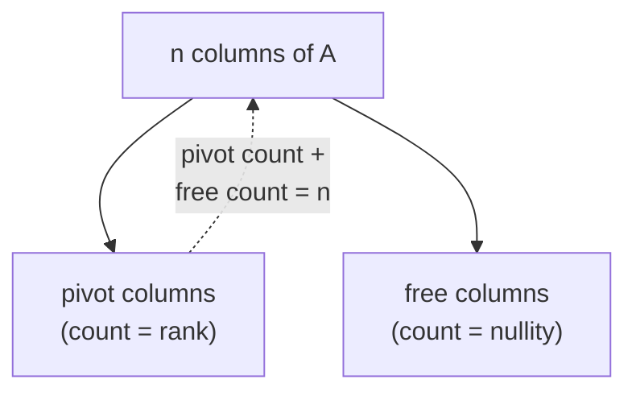

## Learning Objectives

- Define the rank of a matrix as the dimension of its column space, and state the two equivalent characterizations (number of pivot columns after elimination; dimension of the row space).
- Compute the rank of a small matrix by performing Gaussian elimination and counting pivots.
- State the Rank-Nullity theorem and explain what it says in plain language, connecting it back to column space and null space.
- Use rank to predict, without fully solving a system, whether Ax = b can have zero, one, or infinitely many solutions.
- Distinguish a full-rank matrix from a rank-deficient one, for both square and non-square matrices.

## Context & Motivation

The previous concept split a matrix's behavior into two subspaces — the column space, describing what A can produce, and the null space, describing what A destroys. Both are subspaces, and both therefore have a dimension. The dimension of the column space gets its own name, **rank**, because it turns out to be the single most useful number attached to a matrix: it summarizes, in one integer, how much genuinely independent information the matrix's rows or columns carry, and it does so before any specific right-hand side b is even mentioned.

What makes rank worth isolating as its own concept, rather than just leaving it as "the dimension of C(A)," is a fact that is not obvious from the definitions alone: the number of independent columns in a matrix always equals the number of independent rows, even though rows and columns are, on the face of it, entirely different objects living in different spaces (rows have n entries, columns have m entries, for an m×n matrix). This equality — proved properly in a full linear algebra course, and simply asserted here as a genuinely important, non-obvious fact — means "rank" is unambiguous: there aren't secretly two different numbers (row-rank and column-rank) to keep track of, just one.

Rank earns its keep immediately in practice. Before running elimination all the way through on a specific system Ax = b, the rank of A alone already predicts the shape of the answer: whether a unique solution is guaranteed, whether infinitely many solutions are possible, or whether the system might have no solution at all for some right-hand sides. This predictive power is exactly why MIT's 18.06 treats rank as a pivot concept (in both senses of the word) — it is the bridge between the mechanical procedure of Gaussian elimination and the structural questions column space and null space raise, tying the computational and conceptual halves of this discipline together into one number.

## Core Theory

### Definition: rank as dimension of the column space

For an m×n matrix A, the **rank** of A, written rank(A) or r, is the dimension of its column space C(A):

rank(A) = dim(C(A))

Since C(A) ⊆ ℝᵐ, rank(A) can be at most m; since C(A) is spanned by n columns, rank(A) can also be at most n. So for any m×n matrix, rank(A) ≤ min(m, n) always.

### Equivalent characterization: pivot columns after elimination

Running Gaussian elimination on A produces a row echelon form with some number of nonzero rows, each with a leading entry (a **pivot**). The columns containing these pivots are exactly a basis for C(A) — the columns elimination reveals as independent, with every other column expressible as a combination of them. So:

rank(A) = number of pivots in row echelon form of A

This gives rank a direct computational recipe: eliminate, count pivots, done. It also explains why rank is easy to compute in practice even for large matrices — it falls straight out of the same elimination procedure already used to solve Ax = b, with no extra work beyond counting.

### Equivalent characterization: dimension of the row space

Symmetrically, the **row space** of A is the span of A's rows (a subspace of ℝⁿ, since rows have n entries), and its dimension — the number of independent rows — is called the **row rank**. The genuinely non-obvious fact, stated here without a full proof but worth flagging explicitly precisely because it is not obvious: row rank always equals column rank, for every matrix, of every shape. So there is no ambiguity in speaking of "the" rank of A — row rank, column rank, and pivot count all agree:

rank(A) = dim(C(A)) = dim(row space of A) = number of pivots

### Rank-Nullity theorem

Recall from the previous concept that the null space N(A) is also a subspace, with its own dimension, called the **nullity** of A. For an m×n matrix A, the Rank-Nullity theorem states:

rank(A) + nullity(A) = n

where n is the number of columns of A. This is pure bookkeeping once elimination is understood: each of the n columns either becomes a pivot column (contributing to rank) or a free column (contributing one dimension to N(A), via one special solution per free variable, as built in the null-space worked examples). Every column is one or the other, and none is both, so the two counts must add up to the total column count n exactly.



This is precisely why rank and null space are two views of the same underlying elimination process: a high rank (many pivots) forces a low nullity (few free variables), and vice versa, with their sum pinned at n no matter how the columns are arranged.

### Rank and the shape of solutions to Ax = b

For an m×n matrix A with rank r:

- **Full column rank** (r = n, meaning every column is a pivot column): nullity = 0, so N(A) = {0}. Whenever a solution to Ax = b exists, it is unique — there's no freedom left to add a nonzero null-space vector to it.
- **Full row rank** (r = m, meaning every row survives elimination with a pivot): C(A) = ℝᵐ (the columns span the entire codomain), so Ax = b has a solution for *every* b, regardless of nullity.
- **Full rank, square case** (m = n = r): both of the above hold simultaneously — every Ax = b has exactly one solution, for every b, and A is invertible. This is rank's cleanest connection back to the identity-matrix-and-inverses concept: for a square matrix, "invertible" and "full rank" are exactly the same condition.
- **Rank-deficient** (r < min(m, n)): some combination of "not every b is reachable" and "solutions, when they exist, aren't unique" applies, depending on which of the two conditions above fails.

## Worked Examples

### Example 1 — computing rank by elimination

**Problem:** Find the rank of A = [[1, 2, 1], [2, 4, 3], [3, 6, 4]].

**Eliminate.** Subtract 2×row 1 from row 2: row 2 becomes (2−2, 4−4, 3−2) = (0, 0, 1). Subtract 3×row 1 from row 3: row 3 becomes (3−3, 6−6, 4−3) = (0, 0, 1). Now subtract the new row 2 from the new row 3: row 3 becomes (0, 0, 0).

**Resulting echelon form.** [[1, 2, 1], [0, 0, 1], [0, 0, 0]] — two nonzero rows, with pivots in column 1 (row 1) and column 3 (row 2); column 2 has no pivot of its own (it's a multiple of column 1, both being (2,4,6) = 2×(1,2,3) pattern-wise in the original columns — column 2 = 2×column 1 exactly, checkable directly in the original A).

**Conclusion.** rank(A) = 2 (two pivots), even though A is 3×3. This matrix is rank-deficient — neither full row rank nor full column rank — consistent with row 3 having become entirely zero during elimination, meaning the original three rows were not independent (row 3 = row 1 + row 2, verifiable directly: (1,2,1)+(2,4,3) = (3,6,4) = row 3 ✓).

### Example 2 — applying Rank-Nullity

**Problem:** A is a 4×6 matrix with rank 3. What is its nullity, and what does that say about solutions to Ax = b?

**Apply the theorem.** rank(A) + nullity(A) = n = 6 (the number of columns), so nullity(A) = 6 − 3 = 3.

**Interpretation.** Three of the six columns are pivot columns (contributing to rank 3); the other three are free columns, each contributing one dimension to a 3-dimensional null space. Since rank(A) = 3 < 6 = n, A does not have full column rank, so nullity is nontrivial (3, not 0) — whenever Ax = b has a solution, it is never unique; the solution set, if nonempty for a given b, is a 3-dimensional "slab" (x₀ plus all of a 3-dimensional N(A)), not a single point.

**Reachability.** Since A has only 4 rows and rank 3 < 4 = m, A also does not have full row rank, so C(A) is only a 3-dimensional subspace of ℝ⁴ — most vectors b in ℝ⁴ are *not* reachable at all, and Ax = b has no solution for those.

### Example 3 — rank predicts solvability before solving

**Problem:** A is 3×3 with rank 3. Without doing any more work, what can be said about Ax = b for an arbitrary b ∈ ℝ³?

**Full rank, square.** rank(A) = 3 = m = n, so A has both full row rank (C(A) = ℝ³, every b reachable) and full column rank (nullity = 3 − 3 = 0, so N(A) = {0}, uniqueness guaranteed whenever a solution exists).

**Conclusion.** Ax = b has exactly one solution, for every possible b ∈ ℝ³ — a conclusion reached entirely from rank(A) = 3, without ever specifying b or running elimination on a specific right-hand side. This is rank's predictive power in its cleanest form: a single number, computed once from A alone, answers the solvability question for every b simultaneously.

```python
import numpy as np

A = np.array([[1, 2, 1], [2, 4, 3], [3, 6, 4]])
print(np.linalg.matrix_rank(A))  # 2, matching Example 1's hand computation
```

## Common Misconceptions & Pitfalls

- **"Rank is just the number of rows, or the number of columns."** Neither, in general — rank is bounded above by both (rank ≤ min(m, n)) but is frequently smaller, as Example 1 shows: a 3×3 matrix with rank only 2. Rank measures independent rows/columns, not total rows/columns.
- **"Row rank and column rank could be different for a non-square matrix."** They cannot — this equality (row rank = column rank) holds for every matrix, square or not, and is exactly what makes "the rank" a well-defined single number rather than a pair. It is genuinely surprising the first time it's seen precisely because rows and columns look like unrelated objects.
- **"A higher rank always means a 'bigger' or 'better' matrix."** Rank is capped at min(m, n); a 2×5 matrix can have rank at most 2, no matter how large its entries or how many columns it has. "Full rank" for a non-square matrix means hitting that cap (min(m,n)), not matching some universal maximum.
- **"Rank-Nullity means rank and nullity trade off evenly, like a seesaw with two equal sides."** They trade off, but not symmetrically — their sum is fixed at n (the column count), not split evenly. A matrix can have rank 5 and nullity 1, or rank 1 and nullity 5, both valid for n = 6; the theorem constrains the sum, not the individual values.
- **"If Ax = 0 has only the trivial solution, then Ax = b is solvable for every b."** Trivial null space (nullity 0) only guarantees *uniqueness* when a solution exists — it says nothing about whether b is reachable at all. Example 2's matrix, with nullity 3 (not 0), still illustrates the general point in reverse: full column rank and full row rank are separate conditions, and only a square, full-rank matrix gets both simultaneously.

## Summary

Rank is the dimension of a matrix's column space, and it can be computed equivalently by counting pivots after elimination or by taking the dimension of the row space — three descriptions of the same number, resting on the non-obvious fact that row rank and column rank always agree. The Rank-Nullity theorem, rank(A) + nullity(A) = n, ties rank directly to the null space concept that preceded it: every column becomes either a pivot column (feeding rank) or a free column (feeding nullity), with no overlap and no column left uncounted. Rank alone — without ever specifying a right-hand side b — predicts the solvability and uniqueness behavior of Ax = b: full row rank guarantees every b is reachable, full column rank guarantees uniqueness when a solution exists, and a square matrix achieving both simultaneously is exactly an invertible matrix.

## Documentation Links

- [MIT 18.06SC — Syllabus (OCW)](https://www.ocw.mit.edu/courses/18-06sc-linear-algebra-fall-2011/pages/syllabus) — doc
- [Stanford CS229 — Linear Algebra Review and Reference](https://cs229.stanford.edu/section/cs229-linalg.pdf) — doc
