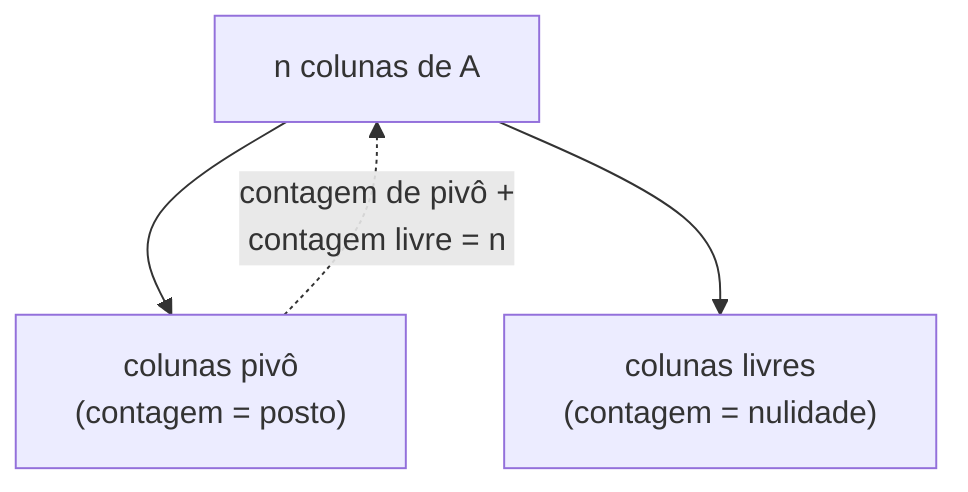

## Objetivos de Aprendizagem

- Definir o posto de uma matriz como a dimensão de seu espaço de colunas, e enunciar as duas caracterizações equivalentes (número de colunas pivô depois da eliminação; dimensão do espaço de linhas).
- Calcular o posto de uma matriz pequena executando eliminação Gaussiana e contando pivôs.
- Enunciar o teorema do Posto-Nulidade e explicar o que ele diz em linguagem simples, conectando-o de volta ao espaço de colunas e ao espaço nulo.
- Usar o posto para prever, sem resolver completamente um sistema, se Ax = b pode ter zero, uma, ou infinitas soluções.
- Distinguir uma matriz de posto completo de uma deficiente em posto, tanto para matrizes quadradas quanto não quadradas.

## Contexto e Motivação

O conceito anterior dividiu o comportamento de uma matriz em dois subespaços, o espaço de colunas, descrevendo o que A pode produzir, e o espaço nulo, descrevendo o que A destrói. Ambos são subespaços, e ambos portanto têm uma dimensão. A dimensão do espaço de colunas ganha seu próprio nome, **posto (rank)**, porque acaba sendo o número mais útil associado a uma matriz: ele resume, em um único inteiro, quanta informação genuinamente independente as linhas ou colunas da matriz carregam, e faz isso antes mesmo de qualquer lado direito específico b ser mencionado.

O que torna o posto digno de ser isolado como seu próprio conceito, em vez de simplesmente deixá-lo como "a dimensão de C(A)," é um fato que não é óbvio a partir das definições sozinhas: o número de colunas independentes em uma matriz sempre é igual ao número de linhas independentes, mesmo que linhas e colunas sejam, à primeira vista, objetos inteiramente diferentes vivendo em espaços diferentes (linhas têm n entradas, colunas têm m entradas, para uma matriz m×n). Essa igualdade, provada adequadamente em um curso completo de álgebra linear, e simplesmente afirmada aqui como um fato genuinamente importante e não óbvio, significa que "posto" é inequívoco: não há secretamente dois números diferentes (posto de linha e posto de coluna) para acompanhar, apenas um.

O posto se paga imediatamente na prática. Antes de rodar eliminação até o fim em um sistema específico Ax = b, o posto de A sozinho já prevê o formato da resposta: se uma solução única é garantida, se infinitas soluções são possíveis, ou se o sistema pode não ter nenhuma solução para alguns lados direitos. Esse poder preditivo é exatamente por que o 18.06 do MIT trata o posto como um conceito pivô (nos dois sentidos da palavra), ele é a ponte entre o procedimento mecânico da eliminação Gaussiana e as perguntas estruturais que espaço de colunas e espaço nulo levantam, amarrando as metades computacional e conceitual desta disciplina em um único número.

## Teoria Central

### Definição: posto como dimensão do espaço de colunas

Para uma matriz m×n A, o **posto** de A, escrito posto(A) ou r (rank(A) na literatura inglesa), é a dimensão de seu espaço de colunas C(A):

posto(A) = dim(C(A))

Como C(A) ⊆ ℝᵐ, posto(A) pode ser no máximo m; como C(A) é gerado por n colunas, posto(A) também pode ser no máximo n. Então para qualquer matriz m×n, posto(A) ≤ min(m, n) sempre.

### Caracterização equivalente: colunas pivô depois da eliminação

Rodar eliminação Gaussiana em A produz uma forma escalonada com algum número de linhas não nulas, cada uma com uma entrada líder (um **pivô**). As colunas contendo esses pivôs são exatamente uma base para C(A), as colunas que a eliminação revela como independentes, com toda outra coluna expressável como uma combinação delas. Então:

posto(A) = número de pivôs na forma escalonada de A

Isso dá ao posto uma receita computacional direta: elimine, conte pivôs, pronto. Também explica por que o posto é fácil de calcular na prática mesmo para matrizes grandes, ele cai diretamente do mesmo procedimento de eliminação já usado para resolver Ax = b, sem nenhum trabalho extra além de contar.

### Caracterização equivalente: dimensão do espaço de linhas

Simetricamente, o **espaço de linhas** de A é o span das linhas de A (um subespaço de ℝⁿ, já que linhas têm n entradas), e sua dimensão, o número de linhas independentes, é chamada de **posto de linha**. O fato genuinamente não óbvio, enunciado aqui sem uma prova completa mas que vale a pena sinalizar explicitamente precisamente porque não é óbvio: o posto de linha sempre é igual ao posto de coluna, para toda matriz, de todo formato. Então não há ambiguidade em falar de "o" posto de A, posto de linha, posto de coluna, e contagem de pivôs todos concordam:

posto(A) = dim(C(A)) = dim(espaço de linhas de A) = número de pivôs

### Teorema do Posto-Nulidade

Recorde do conceito anterior que o espaço nulo N(A) também é um subespaço, com sua própria dimensão, chamada de **nulidade** de A. Para uma matriz m×n A, o teorema do Posto-Nulidade afirma:

posto(A) + nulidade(A) = n

onde n é o número de colunas de A. Isso é pura contabilidade uma vez que a eliminação é entendida: cada uma das n colunas ou se torna uma coluna pivô (contribuindo para o posto) ou uma coluna livre (contribuindo uma dimensão para N(A), via uma solução especial por variável livre, como construído nos exemplos resolvidos de espaço nulo). Toda coluna é uma ou outra, e nenhuma é ambas, então as duas contagens devem somar exatamente à contagem total de colunas n.



Isso é precisamente por que posto e espaço nulo são duas visões do mesmo processo de eliminação subjacente: um posto alto (muitos pivôs) força uma nulidade baixa (poucas variáveis livres), e vice-versa, com sua soma fixada em n não importa como as colunas sejam arranjadas.

### Posto e o formato das soluções de Ax = b

Para uma matriz m×n A com posto r:

- **Posto de coluna completo** (r = n, significando que toda coluna é uma coluna pivô): nulidade = 0, então N(A) = {0}. Sempre que uma solução para Ax = b existe, ela é única, não há nenhuma liberdade restante para adicionar um vetor de espaço nulo não nulo a ela.
- **Posto de linha completo** (r = m, significando que toda linha sobrevive à eliminação com um pivô): C(A) = ℝᵐ (as colunas geram todo o codomínio), então Ax = b tem uma solução para *todo* b, independentemente da nulidade.
- **Posto completo, caso quadrado** (m = n = r): ambos acima valem simultaneamente, todo Ax = b tem exatamente uma solução, para todo b, e A é invertível. Esta é a conexão mais limpa do posto de volta ao conceito de matriz identidade e inversas: para uma matriz quadrada, "invertível" e "posto completo" são exatamente a mesma condição.
- **Deficiente em posto** (r < min(m, n)): alguma combinação de "nem todo b é alcançável" e "soluções, quando existem, não são únicas" se aplica, dependendo de qual das duas condições acima falha.

## Exemplos Resolvidos

### Exemplo 1 — calculando posto por eliminação

**Problema:** Encontre o posto de A = [[1, 2, 1], [2, 4, 3], [3, 6, 4]].

**Elimine.** Subtraia 2×linha 1 da linha 2: linha 2 se torna (2−2, 4−4, 3−2) = (0, 0, 1). Subtraia 3×linha 1 da linha 3: linha 3 se torna (3−3, 6−6, 4−3) = (0, 0, 1). Agora subtraia a nova linha 2 da nova linha 3: linha 3 se torna (0, 0, 0).

**Forma escalonada resultante.** [[1, 2, 1], [0, 0, 1], [0, 0, 0]], duas linhas não nulas, com pivôs na coluna 1 (linha 1) e coluna 3 (linha 2); a coluna 2 não tem pivô próprio (é um múltiplo da coluna 1, ambas seguindo o padrão (2,4,6) = 2×(1,2,3) nas colunas originais, coluna 2 = 2×coluna 1 exatamente, verificável diretamente na A original).

**Conclusão.** posto(A) = 2 (dois pivôs), mesmo que A seja 3×3. Essa matriz é deficiente em posto, nem posto de linha completo nem posto de coluna completo, consistente com a linha 3 ter se tornado inteiramente zero durante a eliminação, significando que as três linhas originais não eram independentes (linha 3 = linha 1 + linha 2, verificável diretamente: (1,2,1)+(2,4,3) = (3,6,4) = linha 3 ✓).

### Exemplo 2 — aplicando Posto-Nulidade

**Problema:** A é uma matriz 4×6 com posto 3. Qual é sua nulidade, e o que isso diz sobre soluções de Ax = b?

**Aplique o teorema.** posto(A) + nulidade(A) = n = 6 (o número de colunas), então nulidade(A) = 6 − 3 = 3.

**Interpretação.** Três das seis colunas são colunas pivô (contribuindo para posto 3); as outras três são colunas livres, cada uma contribuindo uma dimensão para um espaço nulo de 3 dimensões. Como posto(A) = 3 < 6 = n, A não tem posto de coluna completo, então a nulidade é não trivial (3, não 0), sempre que Ax = b tem uma solução, ela nunca é única; o conjunto solução, se não vazio para um dado b, é uma "fatia" de 3 dimensões (x₀ mais todo um N(A) de 3 dimensões), não um único ponto.

**Alcançabilidade.** Como A tem apenas 4 linhas e posto 3 < 4 = m, A também não tem posto de linha completo, então C(A) é apenas um subespaço de 3 dimensões de ℝ⁴, a maioria dos vetores b em ℝ⁴ *não* são alcançáveis de forma alguma, e Ax = b não tem solução para esses.

### Exemplo 3 — o posto prevê solubilidade antes de resolver

**Problema:** A é 3×3 com posto 3. Sem fazer mais nenhum trabalho, o que pode ser dito sobre Ax = b para um b arbitrário ∈ ℝ³?

**Posto completo, quadrado.** posto(A) = 3 = m = n, então A tem tanto posto de linha completo (C(A) = ℝ³, todo b alcançável) quanto posto de coluna completo (nulidade = 3 − 3 = 0, então N(A) = {0}, unicidade garantida sempre que uma solução existe).

**Conclusão.** Ax = b tem exatamente uma solução, para todo b possível ∈ ℝ³, uma conclusão alcançada inteiramente a partir de posto(A) = 3, sem nunca especificar b ou rodar eliminação em um lado direito específico. Este é o poder preditivo do posto em sua forma mais limpa: um único número, calculado uma vez a partir de A sozinho, responde à pergunta de solubilidade para todo b simultaneamente.

```python
import numpy as np

A = np.array([[1, 2, 1], [2, 4, 3], [3, 6, 4]])
print(np.linalg.matrix_rank(A))  # 2, corresponde ao cálculo manual do Exemplo 1
```

## Equívocos Comuns e Armadilhas

- **"Posto é apenas o número de linhas, ou o número de colunas."** Nenhum dos dois, em geral, o posto é limitado por ambos (posto ≤ min(m, n)) mas frequentemente é menor, como o Exemplo 1 mostra: uma matriz 3×3 com posto apenas 2. Posto mede linhas/colunas independentes, não linhas/colunas totais.
- **"Posto de linha e posto de coluna poderiam ser diferentes para uma matriz não quadrada."** Não podem, essa igualdade (posto de linha = posto de coluna) vale para toda matriz, quadrada ou não, e é exatamente o que torna "o posto" um único número bem definido em vez de um par. É genuinamente surpreendente na primeira vez que é visto precisamente porque linhas e colunas parecem objetos não relacionados.
- **"Um posto mais alto sempre significa uma matriz 'maior' ou 'melhor'."** O posto é limitado por min(m, n); uma matriz 2×5 pode ter posto no máximo 2, não importa quão grandes suas entradas sejam ou quantas colunas tenha. "Posto completo" para uma matriz não quadrada significa atingir esse limite (min(m,n)), não corresponder a algum máximo universal.
- **"Posto-Nulidade significa que posto e nulidade trocam uniformemente, como uma gangorra com dois lados iguais."** Eles trocam, mas não simetricamente, sua soma é fixa em n (a contagem de colunas), não dividida igualmente. Uma matriz pode ter posto 5 e nulidade 1, ou posto 1 e nulidade 5, ambos válidos para n = 6; o teorema restringe a soma, não os valores individuais.
- **"Se Ax = 0 tem apenas a solução trivial, então Ax = b é solucionável para todo b."** Espaço nulo trivial (nulidade 0) apenas garante *unicidade* quando uma solução existe, não diz nada sobre se b é alcançável de forma alguma. A matriz do Exemplo 2, com nulidade 3 (não 0), ainda ilustra o ponto geral ao contrário: posto de coluna completo e posto de linha completo são condições separadas, e apenas uma matriz quadrada de posto completo obtém ambas simultaneamente.

## Resumo

Posto é a dimensão do espaço de colunas de uma matriz, e pode ser calculado equivalentemente contando pivôs depois da eliminação ou tomando a dimensão do espaço de linhas, três descrições do mesmo número, apoiadas no fato não óbvio de que posto de linha e posto de coluna sempre concordam. O teorema do Posto-Nulidade, posto(A) + nulidade(A) = n, amarra o posto diretamente ao conceito de espaço nulo que o precedeu: toda coluna se torna ou uma coluna pivô (alimentando o posto) ou uma coluna livre (alimentando a nulidade), sem sobreposição e sem coluna deixada sem contar. O posto sozinho, sem nunca especificar um lado direito b, prevê o comportamento de solubilidade e unicidade de Ax = b: posto de linha completo garante que todo b é alcançável, posto de coluna completo garante unicidade quando uma solução existe, e uma matriz quadrada alcançando ambos simultaneamente é exatamente uma matriz invertível.

## Documentation Links

- [MIT 18.06SC — Syllabus (OCW)](https://www.ocw.mit.edu/courses/18-06sc-linear-algebra-fall-2011/pages/syllabus) — doc
- [Stanford CS229 — Linear Algebra Review and Reference](https://cs229.stanford.edu/section/cs229-linalg.pdf) — doc
