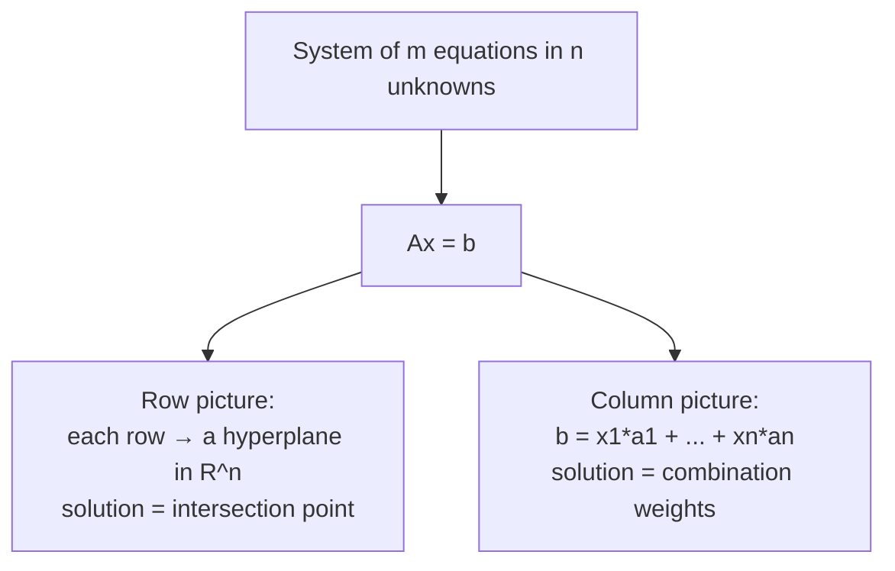

## Learning Objectives

- Rewrite a system of linear equations as a single matrix-vector equation Ax = b, identifying the coefficient matrix A, unknown vector x, and right-hand-side vector b.
- Explain the row picture of Ax = b — each equation as a line (or hyperplane) — and identify the solution as the intersection point of those lines.
- Explain the column picture of Ax = b — b as a linear combination of A's columns, with x supplying the combination weights — and connect it directly to the span concept.
- Solve a small (2×2) system by hand and interpret the same solution under both the row and column pictures.
- Recognize that the row and column pictures always describe the exact same solution set, viewed from two different geometric angles.

## Context & Motivation

A system of linear equations — several equations, several unknowns, everything to the first power, no products of unknowns — is one of the oldest and most practically important objects in all of applied mathematics, and it turns out to be exactly the object that vectors, linear combinations, and span were quietly building toward. Every one of the ideas developed so far in this discipline compresses a system of m equations in n unknowns into a single, deceptively short equation: Ax = b, where A is an m×n matrix built from the equations' coefficients, x is the unknown vector of n values being solved for, and b is the vector of right-hand-side constants. What looked like a page of separate equations is, underneath, one vector equation — and everything learned about vectors, linear combinations, and span applies to it directly.

MIT's 18.06 famously opens its entire treatment of linear systems by insisting on two complementary pictures of the exact same equation Ax = b, and this concept exists specifically to present both explicitly, because each picture makes a different fact obvious. The **row picture** treats each individual equation as defining a line (in two unknowns) or a plane/hyperplane (in more), and the solution to the whole system is wherever all of those lines or planes simultaneously intersect — this is the picture most people learn first, because it matches how the equations are literally written down, one at a time. The **column picture** does something less obvious but ultimately more powerful: it reads Ax = b as "some linear combination of A's columns equals b," with the unknown vector x supplying exactly the combination weights — this is span, from the previous concept, applied directly to the columns of A.

Neither picture is more "correct" than the other — they describe the identical solution set, viewed from two different angles — but building fluency in switching between them is what makes systems of equations tractable once they grow beyond two or three unknowns, where a literal geometric picture of intersecting lines becomes impossible to draw but the column picture (is b reachable as a combination of these columns?) keeps working exactly as before. This dual view is also the direct setup for the next concept, Gaussian elimination, which is nothing more than a systematic procedure for answering the row-picture question (where do all these hyperplanes intersect?) by manipulating the equations methodically until the answer falls out.

## Core Theory

### From a system of equations to Ax = b

Consider a system of m linear equations in n unknowns x₁, …, xₙ:

a₁₁x₁ + a₁₂x₂ + … + a₁ₙxₙ = b₁
a₂₁x₁ + a₂₂x₂ + … + a₂ₙxₙ = b₂
⋮
aₘ₁x₁ + aₘ₂x₂ + … + aₘₙxₙ = bₘ

Collect the coefficients aᵢⱼ into an m×n matrix A (row i, column j holds aᵢⱼ), the unknowns into a vector x = (x₁, …, xₙ) ∈ ℝⁿ, and the right-hand sides into a vector b = (b₁, …, bₘ) ∈ ℝᵐ. The entire system is then exactly equivalent to the single matrix-vector equation:

Ax = b

where matrix-vector multiplication is defined so that the i-th entry of Ax is precisely aᵢ₁x₁ + aᵢ₂x₂ + … + aᵢₙxₙ — the left-hand side of the i-th original equation. This is not an approximation or a convenient shorthand that loses information; unpacking Ax = b one coordinate at a time recovers the original m equations exactly, the same way a single vector equation in ℝⁿ was shown earlier to unpack into n coordinate equations.

### The row picture: intersection of hyperplanes

Reading Ax = b **one row at a time** recovers each original equation individually: row i of A, dotted with x, must equal bᵢ. In two unknowns, a single linear equation a x₁ + b x₂ = c defines a **line** in the (x₁, x₂) plane; in three unknowns, a single equation defines a **plane** in 3-dimensional space; in n unknowns generally, a single linear equation defines a **hyperplane** — a flat (n−1)-dimensional slice of ℝⁿ.

The **row picture** of Ax = b is: draw each equation as its line (or plane, or hyperplane), and the solution set of the whole system is exactly the set of points lying on *all* of these lines simultaneously — their common intersection. For a system of two equations in two unknowns, this is the familiar picture of two lines in the plane: they intersect in exactly one point (the unique solution), are parallel and distinct (no solution — the lines never meet), or are the exact same line (infinitely many solutions — every point on the line satisfies both equations at once).

### The column picture: b as a combination of A's columns

Reading Ax = b **one column at a time** gives an entirely different, and initially less obvious, interpretation. If A has columns a₁, a₂, …, aₙ (each a vector in ℝᵐ), then matrix-vector multiplication can be rewritten as:

Ax = x₁a₁ + x₂a₂ + … + xₙaₙ

This is exactly a linear combination of A's columns, with the unknowns x₁, …, xₙ serving as the combination weights. So the equation Ax = b says precisely: **find weights x₁, …, xₙ such that this specific linear combination of A's columns equals b** — which is exactly the span-membership question from the previous concept, applied to the set of columns {a₁, …, aₙ}. The system Ax = b has a solution exactly when b ∈ span{a₁, …, aₙ}, and any actual solution x hands over the specific combination weights that reach it.

This is the **column picture**: instead of intersecting m hyperplanes in ℝⁿ (the row view), picture instead searching among all linear combinations of n vectors in ℝᵐ (the columns of A) for the one combination that produces b.

### Why both pictures always agree

The row and column pictures are not two different, competing theories of what Ax = b means — they are two ways of reading the identical equation, so they necessarily describe the exact same solution set x. The row picture asks "which points satisfy every equation simultaneously?"; the column picture asks "which combination of columns reaches b?" — and because both questions are just different groupings of the same sum Σⱼ aᵢⱼxⱼ = bᵢ (grouped by row i in one case, by column j in the other), any x that answers one question automatically answers the other. The value of holding both pictures in mind is purely about intuition and technique: the row picture is what makes "no solution" and "infinitely many solutions" easy to see geometrically (parallel or coincident lines), while the column picture is what generalizes cleanly to higher dimensions, where a literal intersection-of-hyperplanes picture becomes impossible to draw but "is b in the span of these columns?" remains exactly as meaningful and computable as before.

## Worked Examples

### Example 1 — a 2×2 system, solved and viewed both ways

**Problem:** Solve the system
2x₁ + x₂ = 5
x₁ − x₂ = 1
and interpret the solution under both the row and column pictures.

**Solve algebraically** (by substitution): from the second equation, x₁ = 1 + x₂. Substitute into the first: 2(1 + x₂) + x₂ = 5, i.e., 2 + 2x₂ + x₂ = 5, i.e., 3x₂ = 3, so x₂ = 1. Then x₁ = 1 + 1 = 2. Solution: x = (2, 1).

**Verify:** 2(2) + 1 = 5 ✓; 2 − 1 = 1 ✓.

**Row picture:** the first equation 2x₁ + x₂ = 5 is a line in the (x₁,x₂) plane; the second, x₁ − x₂ = 1, is a different line (they aren't parallel — their slopes, −2 and 1 respectively, differ). The solution x = (2,1) is exactly the single point where these two lines cross.

**Column picture:** rewrite the system as Ax = b with A = [[2,1],[1,−1]] (columns a₁ = (2,1), a₂ = (1,−1)) and b = (5,1). The claim is that x₁a₁ + x₂a₂ = b for x₁=2, x₂=1: 2(2,1) + 1(1,−1) = (4,2) + (1,−1) = (5,1). ✓ matches b exactly. So the same numbers (2 and 1) that named the intersection point in the row picture are *also* exactly the weights needed to combine A's two columns into b — the two pictures aren't just consistent in principle, they hand back the literal same pair of numbers here.

### Example 2 — a system with no solution, seen in both pictures

**Problem:** Consider
x₁ + x₂ = 2
2x₁ + 2x₂ = 5
Show this system has no solution, and explain why in both the row and column pictures.

**Row picture:** the first equation is the line x₂ = 2 − x₁; the second, dividing by 2, is x₂ = 5/2 − x₁ — the exact same slope (−1) as the first line, but a different intercept (2 versus 5/2). Two distinct parallel lines never intersect, so there is no point satisfying both equations at once — no solution.

**Column picture:** A has columns a₁ = (1,2) and a₂ = (1,2) — note these are identical (and certainly parallel, being equal), so span{a₁, a₂} is only the line through the origin and (1,2) (per the parallel-vectors case from the span concept). The target b = (2,5) would need to lie on that line — points of the form (t, 2t). Checking b = (2,5): would need 2t = 2 (so t=1) and simultaneously 2t = 5 (so t=2.5) from the second coordinate — inconsistent, so b is not on the line, confirming again there's no solution.

**Consistency between the pictures:** both approaches agree the system is unsolvable, for the same underlying reason viewed two ways — the rows describe parallel, non-coincident lines; the columns are parallel vectors whose span excludes b.

## Common Misconceptions & Pitfalls

- **"The row picture and column picture are two different mathematical theories that happen to give the same answer."** They are not two theories at all — they are two ways of grouping the identical sum of products that defines Ax = b (grouped by row versus by column). Any solution x satisfies both readings automatically and simultaneously, because unpacking the matrix-vector product either way produces literally the same set of equalities.
- **"The column picture only makes sense when you can also draw the row picture."** The opposite is closer to true in practice: the row picture (intersecting hyperplanes) becomes impossible to visualize once n exceeds 3, while the column picture (is b in the span of these columns?) is exactly as meaningful and checkable in ℝ¹⁰⁰ as it is in ℝ². The column picture is what generalizes; the row picture is what builds intuition at small size.
- **"If a system has more equations than unknowns, it can't have a solution."** More equations than unknowns (m > n) makes it more likely that some equation is redundant with — or contradicts — the others, but it's not automatic either way. Example 3 in the linear-combinations-and-span concept showed a "3 equations, 2 unknowns" case that turned out consistent; a system can be over-determined in count and still solvable, if the extra equation happens to already agree with what the others force.
- **"A system with a row of all-zero coefficients on the left is automatically contradictory."** A row like 0x₁ + 0x₂ = 0 (both sides zero) is not a contradiction — it's a statement that's always true, contributing no actual constraint at all. The dangerous case, developed fully in the next concept, is a row where the left side is entirely zero coefficients *but the right-hand side is nonzero* (0 = 5, say) — that combination is what actually signals no solution exists.

## Summary

A system of m linear equations in n unknowns compresses exactly into one equation, Ax = b, with no information lost — A holding the coefficients, x the unknowns, b the right-hand sides. That single equation supports two equally valid, always-agreeing readings: the row picture, where each equation is a hyperplane and the solution is their common intersection point, and the column picture, where b must be expressed as a linear combination of A's columns, with x supplying the combination weights — a direct application of span to the columns of A. Small systems (2×2, 3×3) make the row picture easy to draw and the column picture easy to double-check numerically, as both worked examples show; larger systems lose the drawable row picture entirely but keep the column picture's question — is b reachable? — exactly as well-posed and computable as before. This dual framing is the direct setup for Gaussian elimination, the systematic algorithm the next concept develops for actually finding where those hyperplanes intersect (or determining that they don't).

## Documentation Links

- [MIT 18.06SC — Syllabus (OCW)](https://www.ocw.mit.edu/courses/18-06sc-linear-algebra-fall-2011/pages/syllabus) — doc
- [Stanford CS229 — Linear Algebra Review and Reference](https://cs229.stanford.edu/section/cs229-linalg.pdf) — doc
