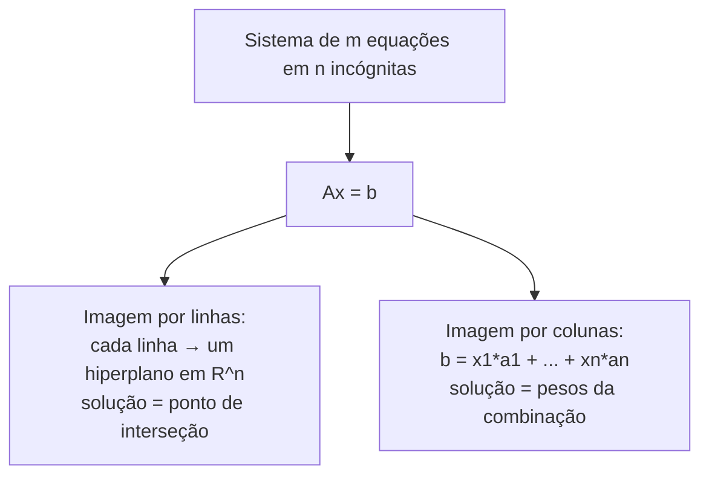

## Objetivos de Aprendizagem

- Reescrever um sistema de equações lineares como uma única equação matriz-vetor Ax = b, identificando a matriz de coeficientes A, o vetor de incógnitas x, e o vetor de lados direitos b.
- Explicar a imagem por linhas de Ax = b, cada equação como uma reta (ou hiperplano), e identificar a solução como o ponto de interseção dessas retas.
- Explicar a imagem por colunas de Ax = b, b como uma combinação linear das colunas de A, com x fornecendo os pesos da combinação, e conectá-la diretamente ao conceito de span.
- Resolver um sistema pequeno (2×2) à mão e interpretar a mesma solução sob ambas as imagens, por linhas e por colunas.
- Reconhecer que as imagens por linhas e por colunas sempre descrevem exatamente o mesmo conjunto solução, visto de dois ângulos geométricos diferentes.

## Contexto e Motivação

Um sistema de equações lineares, várias equações, várias incógnitas, tudo na primeira potência, sem produtos de incógnitas, é um dos objetos mais antigos e praticamente importantes de toda a matemática aplicada, e acaba sendo exatamente o objeto para o qual vetores, combinações lineares, e span vinham silenciosamente construindo. Cada uma das ideias desenvolvidas até agora nesta disciplina comprime um sistema de m equações em n incógnitas em uma única equação, enganosamente curta: Ax = b, onde A é uma matriz m×n construída a partir dos coeficientes das equações, x é o vetor de incógnitas de n valores sendo resolvido, e b é o vetor de constantes do lado direito. O que parecia uma página de equações separadas é, por baixo, uma equação vetorial única, e tudo que foi aprendido sobre vetores, combinações lineares, e span se aplica a ela diretamente.

O 18.06 do MIT abre notoriamente todo o seu tratamento de sistemas lineares insistindo em duas imagens complementares da mesma equação Ax = b, e este conceito existe especificamente para apresentar ambas explicitamente, porque cada imagem torna um fato diferente óbvio. A **imagem por linhas** trata cada equação individual como definindo uma reta (em duas incógnitas) ou um plano/hiperplano (em mais), e a solução do sistema inteiro é onde quer que todas essas retas ou planos se interceptem simultaneamente, esta é a imagem que a maioria das pessoas aprende primeiro, porque corresponde a como as equações são literalmente escritas, uma de cada vez. A **imagem por colunas** faz algo menos óbvio mas em última análise mais poderoso: ela lê Ax = b como "alguma combinação linear das colunas de A é igual a b," com o vetor de incógnitas x fornecendo exatamente os pesos da combinação, isso é span, do conceito anterior, aplicado diretamente às colunas de A.

Nenhuma imagem é mais "correta" que a outra, elas descrevem o conjunto solução idêntico, visto de dois ângulos diferentes, mas construir fluência em alternar entre elas é o que torna sistemas de equações tratáveis assim que crescem além de duas ou três incógnitas, onde uma imagem geométrica literal de retas se interceptando se torna impossível de desenhar mas a imagem por colunas (b é alcançável como uma combinação dessas colunas?) continua funcionando exatamente como antes. Essa visão dupla também é a preparação direta para o próximo conceito, eliminação Gaussiana, que nada mais é do que um procedimento sistemático para responder à pergunta da imagem por linhas (onde todos esses hiperplanos se interceptam?) manipulando as equações metodicamente até que a resposta caia.

## Teoria Central

### De um sistema de equações a Ax = b

Considere um sistema de m equações lineares em n incógnitas x₁, …, xₙ:

a₁₁x₁ + a₁₂x₂ + … + a₁ₙxₙ = b₁
a₂₁x₁ + a₂₂x₂ + … + a₂ₙxₙ = b₂
⋮
aₘ₁x₁ + aₘ₂x₂ + … + aₘₙxₙ = bₘ

Colete os coeficientes aᵢⱼ em uma matriz m×n A (linha i, coluna j contém aᵢⱼ), as incógnitas em um vetor x = (x₁, …, xₙ) ∈ ℝⁿ, e os lados direitos em um vetor b = (b₁, …, bₘ) ∈ ℝᵐ. O sistema inteiro é então exatamente equivalente à única equação matriz-vetor:

Ax = b

onde a multiplicação matriz-vetor é definida de modo que a i-ésima entrada de Ax é precisamente aᵢ₁x₁ + aᵢ₂x₂ + … + aᵢₙxₙ, o lado esquerdo da i-ésima equação original. Isso não é uma aproximação ou uma abreviação conveniente que perde informação; desdobrar Ax = b uma coordenada de cada vez recupera as m equações originais exatamente, da mesma forma que uma única equação vetorial em ℝⁿ foi mostrada anteriormente se desdobrar em n equações de coordenada.

### A imagem por linhas: interseção de hiperplanos

Ler Ax = b **uma linha de cada vez** recupera cada equação original individualmente: a linha i de A, ponteada com x, deve ser igual a bᵢ. Em duas incógnitas, uma única equação linear a x₁ + b x₂ = c define uma **reta** no plano (x₁, x₂); em três incógnitas, uma única equação define um **plano** no espaço tridimensional; em n incógnitas em geral, uma única equação linear define um **hiperplano**, uma fatia plana de dimensão (n−1) de ℝⁿ.

A **imagem por linhas** de Ax = b é: desenhe cada equação como sua reta (ou plano, ou hiperplano), e o conjunto solução do sistema inteiro é exatamente o conjunto de pontos que estão em *todas* essas retas simultaneamente, sua interseção comum. Para um sistema de duas equações em duas incógnitas, esta é a imagem familiar de duas retas no plano: elas se interceptam em exatamente um ponto (a solução única), são paralelas e distintas (sem solução, as retas nunca se encontram), ou são exatamente a mesma reta (infinitas soluções, todo ponto na reta satisfaz ambas as equações ao mesmo tempo).

### A imagem por colunas: b como uma combinação das colunas de A

Ler Ax = b **uma coluna de cada vez** dá uma interpretação inteiramente diferente, e inicialmente menos óbvia. Se A tem colunas a₁, a₂, …, aₙ (cada uma um vetor em ℝᵐ), então a multiplicação matriz-vetor pode ser reescrita como:

Ax = x₁a₁ + x₂a₂ + … + xₙaₙ

Isso é exatamente uma combinação linear das colunas de A, com as incógnitas x₁, …, xₙ servindo como os pesos da combinação. Então a equação Ax = b diz precisamente: **encontre pesos x₁, …, xₙ tais que essa combinação linear específica das colunas de A é igual a b**, que é exatamente a pergunta de pertencimento ao span do conceito anterior, aplicada ao conjunto de colunas {a₁, …, aₙ}. O sistema Ax = b tem uma solução exatamente quando b ∈ span{a₁, …, aₙ}, e qualquer solução real x entrega os pesos específicos da combinação que a alcançam.

Esta é a **imagem por colunas**: em vez de interceptar m hiperplanos em ℝⁿ (a visão por linhas), imagine em vez disso buscar entre todas as combinações lineares de n vetores em ℝᵐ (as colunas de A) por aquela combinação que produz b.

### Por que as duas imagens sempre concordam

As imagens por linhas e por colunas não são duas teorias diferentes e concorrentes do que Ax = b significa, elas são duas formas de ler a mesma equação idêntica, então necessariamente descrevem o exato mesmo conjunto solução x. A imagem por linhas pergunta "quais pontos satisfazem toda equação simultaneamente?"; a imagem por colunas pergunta "qual combinação de colunas alcança b?", e porque ambas as perguntas são apenas agrupamentos diferentes da mesma soma Σⱼ aᵢⱼxⱼ = bᵢ (agrupada pela linha i em um caso, pela coluna j no outro), qualquer x que responda a uma pergunta automaticamente responde à outra. O valor de manter ambas as imagens em mente é puramente sobre intuição e técnica: a imagem por linhas é o que torna "sem solução" e "infinitas soluções" fáceis de ver geometricamente (retas paralelas ou coincidentes), enquanto a imagem por colunas é o que generaliza limpamente para dimensões maiores, onde uma imagem literal de interseção de hiperplanos se torna impossível de desenhar mas "b está no span dessas colunas?" permanece exatamente tão significativo e computável quanto antes.

## Exemplos Resolvidos

### Exemplo 1 — um sistema 2×2, resolvido e visto de ambas as formas

**Problema:** Resolva o sistema
2x₁ + x₂ = 5
x₁ − x₂ = 1
e interprete a solução sob ambas as imagens, por linhas e por colunas.

**Resolva algebricamente** (por substituição): da segunda equação, x₁ = 1 + x₂. Substitua na primeira: 2(1 + x₂) + x₂ = 5, ou seja, 2 + 2x₂ + x₂ = 5, ou seja, 3x₂ = 3, então x₂ = 1. Então x₁ = 1 + 1 = 2. Solução: x = (2, 1).

**Verifique:** 2(2) + 1 = 5 ✓; 2 − 1 = 1 ✓.

**Imagem por linhas:** a primeira equação 2x₁ + x₂ = 5 é uma reta no plano (x₁,x₂); a segunda, x₁ − x₂ = 1, é uma reta diferente (não são paralelas, suas inclinações, −2 e 1 respectivamente, diferem). A solução x = (2,1) é exatamente o único ponto onde essas duas retas se cruzam.

**Imagem por colunas:** reescreva o sistema como Ax = b com A = [[2,1],[1,−1]] (colunas a₁ = (2,1), a₂ = (1,−1)) e b = (5,1). A afirmação é que x₁a₁ + x₂a₂ = b para x₁=2, x₂=1: 2(2,1) + 1(1,−1) = (4,2) + (1,−1) = (5,1). ✓ corresponde a b exatamente. Então os mesmos números (2 e 1) que nomearam o ponto de interseção na imagem por linhas são *também* exatamente os pesos necessários para combinar as duas colunas de A em b, as duas imagens não são apenas consistentes em princípio, elas devolvem o mesmo par de números literal aqui.

### Exemplo 2 — um sistema sem solução, visto em ambas as imagens

**Problema:** Considere
x₁ + x₂ = 2
2x₁ + 2x₂ = 5
Mostre que este sistema não tem solução, e explique por quê em ambas as imagens, por linhas e por colunas.

**Imagem por linhas:** a primeira equação é a reta x₂ = 2 − x₁; a segunda, dividindo por 2, é x₂ = 5/2 − x₁, a mesma inclinação exata (−1) da primeira reta, mas um intercepto diferente (2 versus 5/2). Duas retas paralelas distintas nunca se interceptam, então não há ponto satisfazendo ambas as equações ao mesmo tempo, sem solução.

**Imagem por colunas:** A tem colunas a₁ = (1,2) e a₂ = (1,2), note que essas são idênticas (e certamente paralelas, sendo iguais), então span{a₁, a₂} é apenas a reta pela origem e (1,2) (pelo caso de vetores paralelos do conceito de span). O alvo b = (2,5) precisaria estar nessa reta, pontos da forma (t, 2t). Verificando b = (2,5): precisaria de 2t = 2 (então t=1) e simultaneamente 2t = 5 (então t=2,5) da segunda coordenada, inconsistente, então b não está na reta, confirmando novamente que não há solução.

**Consistência entre as imagens:** ambas as abordagens concordam que o sistema não é solucionável, pela mesma razão subjacente vista de duas formas, as linhas descrevem retas paralelas e não coincidentes; as colunas são vetores paralelos cujo span exclui b.

## Equívocos Comuns e Armadilhas

- **"A imagem por linhas e a imagem por colunas são duas teorias matemáticas diferentes que acontecem de dar a mesma resposta."** Não são duas teorias de forma alguma, são duas formas de agrupar a mesma soma idêntica de produtos que define Ax = b (agrupada por linha versus por coluna). Qualquer solução x satisfaz ambas as leituras automaticamente e simultaneamente, porque desdobrar o produto matriz-vetor de qualquer forma produz literalmente o mesmo conjunto de igualdades.
- **"A imagem por colunas só faz sentido quando você também consegue desenhar a imagem por linhas."** O oposto está mais próximo de verdadeiro na prática: a imagem por linhas (interseção de hiperplanos) se torna impossível de visualizar assim que n excede 3, enquanto a imagem por colunas (b está no span dessas colunas?) é exatamente tão significativa e verificável em ℝ¹⁰⁰ quanto em ℝ². A imagem por colunas é o que generaliza; a imagem por linhas é o que constrói intuição em pequena escala.
- **"Se um sistema tem mais equações que incógnitas, ele não pode ter solução."** Mais equações que incógnitas (m > n) torna mais provável que alguma equação seja redundante com, ou contradiga, as outras, mas não é automático de nenhuma forma. O Exemplo 3 do conceito de combinações lineares e span mostrou um caso de "3 equações, 2 incógnitas" que acabou sendo consistente; um sistema pode ser sobredeterminado em contagem e ainda solucionável, se a equação extra acontecer de já concordar com o que as outras forçam.
- **"Um sistema com uma linha de coeficientes todos zero no lado esquerdo é automaticamente contraditório."** Uma linha como 0x₁ + 0x₂ = 0 (ambos os lados zero) não é uma contradição, é uma afirmação que é sempre verdadeira, contribuindo com nenhuma restrição real. O caso perigoso, desenvolvido completamente no próximo conceito, é uma linha onde o lado esquerdo é inteiramente coeficientes zero *mas o lado direito é não nulo* (0 = 5, digamos), essa combinação é o que de fato sinaliza que nenhuma solução existe.

## Resumo

Um sistema de m equações lineares em n incógnitas se comprime exatamente em uma equação, Ax = b, sem perda de informação, A contendo os coeficientes, x as incógnitas, b os lados direitos. Essa única equação sustenta duas leituras igualmente válidas e sempre concordantes: a imagem por linhas, onde cada equação é um hiperplano e a solução é seu ponto de interseção comum, e a imagem por colunas, onde b deve ser expresso como uma combinação linear das colunas de A, com x fornecendo os pesos da combinação, uma aplicação direta de span às colunas de A. Sistemas pequenos (2×2, 3×3) tornam a imagem por linhas fácil de desenhar e a imagem por colunas fácil de verificar numericamente, como ambos os exemplos resolvidos mostram; sistemas maiores perdem inteiramente a imagem por linhas desenhável mas mantêm a pergunta da imagem por colunas, b é alcançável?, exatamente tão bem definida e computável quanto antes. Essa formulação dupla é a preparação direta para a eliminação Gaussiana, o algoritmo sistemático que o próximo conceito desenvolve para de fato encontrar onde esses hiperplanos se interceptam (ou determinar que não se interceptam).

## Documentation Links

- [MIT 18.06SC — Syllabus (OCW)](https://www.ocw.mit.edu/courses/18-06sc-linear-algebra-fall-2011/pages/syllabus) — doc
- [Stanford CS229 — Linear Algebra Review and Reference](https://cs229.stanford.edu/section/cs229-linalg.pdf) — doc
