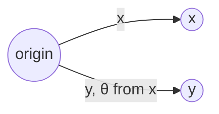

## Learning Objectives

- Compute the dot product of two vectors in ℝⁿ using the component formula Σ xᵢyᵢ.
- State the relationship x·y = ‖x‖‖y‖cos θ connecting the dot product to the angle θ between two vectors, and explain why this makes the dot product zero exactly when the vectors are perpendicular.
- Compute the Euclidean (L2) norm ‖x‖ of a vector and connect it to the dot product via ‖x‖ = √(x·x).
- Determine whether two given vectors are orthogonal, and compute the angle between two vectors when the dot product and norms are known.
- Distinguish the dot product's role as a scalar-valued measure of alignment from vector addition and scalar multiplication, which always produce vectors.

## Context & Motivation

Addition and scalar multiplication, the two operations introduced previously, always take vectors in and produce a vector out — they never leave ℝⁿ. The dot product is the first operation in this discipline that takes two vectors and collapses them into a single real number, and that number turns out to encode something genuinely useful: how much the two vectors "agree" in direction, and, as a byproduct, how long a single vector is. This is not a minor technical addition — it's the operation that makes geometry (angle, length, perpendicularity) computable using nothing but the arithmetic already in hand from the component definition of a vector.

The practical stakes are immediate once you look at what the dot product powers. Stanford's CS229 reference introduces it as the backbone of cosine similarity, the standard way of comparing two feature vectors or two word embeddings in machine learning — two vectors are judged "similar" almost entirely on the basis of the angle between them, which is exactly what the dot product measures. The same operation underlies projections (how much of one vector lies "along" another), the definition of length itself (a vector's norm is nothing but its dot product with itself, square-rooted), and orthogonality (perpendicularity), which becomes essential once systems of equations and elimination need a notion of independence between directions.

What makes the dot product worth pausing on, rather than treating as "just another formula," is the two-sided definition: it has a purely algebraic definition (multiply corresponding components and add) and a purely geometric characterization (length times length times the cosine of the angle between them), and the claim that these always agree is a genuine theorem, not a coincidence of notation. Once that equivalence is trusted, the dot product becomes a tool for moving freely between algebra (numbers you can compute from components alone, with no picture required) and geometry (angle, perpendicularity, length) — exactly the kind of bridge this discipline is built to give you.

## Core Theory

### The dot product: definition and basic computation

Given two vectors x = (x₁, …, xₙ) and y = (y₁, …, yₙ) in ℝⁿ, their **dot product** (also called the inner product or scalar product) is the real number:

x·y = x₁y₁ + x₂y₂ + … + xₙyₙ = Σᵢ xᵢyᵢ

Note the shape of this definition carefully: two *vectors* go in, but a single *scalar* comes out — this is what separates the dot product from addition and scalar multiplication, both of which stay entirely within ℝⁿ. The dot product is only defined between vectors of the same dimension, for the same reason addition requires matching dimensions: there must be a well-defined pairing of components to multiply together.

From the component formula, several algebraic properties follow immediately:

- **Commutativity**: x·y = y·x, since xᵢyᵢ = yᵢxᵢ for every real pair.
- **Distributivity over addition**: x·(y + z) = x·y + x·z.
- **Compatibility with scalar multiplication**: (cx)·y = c(x·y) = x·(cy).
- **Positive-definiteness**: x·x ≥ 0 always, and x·x = 0 exactly when x is the zero vector (since x·x = x₁² + x₂² + … + xₙ², a sum of squares, which is zero only when every term — and hence every component — is zero).

That last property, x·x ≥ 0 with equality only at the zero vector, is what makes the dot product usable as the basis for a notion of length, developed next.

### The Euclidean norm: length from the dot product

The **Euclidean norm** (or **L2 norm**, or simply the **length**) of a vector x ∈ ℝⁿ is defined as:

‖x‖ = √(x·x) = √(x₁² + x₂² + … + xₙ²)

For n = 2, this is exactly the Pythagorean theorem: a vector x = (x₁, x₂), viewed as an arrow from the origin to the point (x₁, x₂), forms the hypotenuse of a right triangle with legs x₁ and x₂, so its length is √(x₁² + x₂²) by Pythagoras directly. For n = 3, the same formula extends the Pythagorean theorem one dimension further (apply it twice: once in a plane, once out of it), and for n > 3 the formula is simply *defined* to continue the same pattern — there is no longer a literal right-triangle picture to point to, but the algebra carries the geometric idea of "length" forward unchanged.

Two immediate consequences of the definition:

- ‖x‖ ≥ 0 always, and ‖x‖ = 0 exactly when x = 0 — inherited directly from x·x's positive-definiteness.
- ‖cx‖ = |c|·‖x‖ for any scalar c — scaling a vector by c scales its length by |c| (the absolute value, since length can't be negative even if c is): ‖cx‖ = √((cx)·(cx)) = √(c²(x·x)) = |c|√(x·x) = |c|‖x‖.

A vector with ‖x‖ = 1 is called a **unit vector**. Any nonzero vector x can be turned into a unit vector pointing in the same direction by dividing by its own length: x⁄‖x‖ has norm exactly 1, a process called **normalizing** x.

### The geometric meaning: x·y = ‖x‖‖y‖cos θ

The single fact that connects the purely algebraic dot product formula to genuine geometry is this identity: for any two nonzero vectors x, y ∈ ℝⁿ, if θ is the angle between them (measured the ordinary way, between 0 and π radians),

x·y = ‖x‖‖y‖cos θ

This can be derived from the Law of Cosines applied to the triangle formed by x, y, and x − y, but the derivation itself is secondary to what the identity says: the dot product packages together the lengths of both vectors *and* the angle between them into a single number, and the component formula (Σxᵢyᵢ) is guaranteed to always compute that exact same number, with no picture or angle-measuring required.

Rearranging the identity gives a way to *recover* the angle from components alone:

cos θ = (x·y) ⁄ (‖x‖‖y‖)

**Why the dot product is zero exactly when the vectors are perpendicular.** Since ‖x‖ > 0 and ‖y‖ > 0 for nonzero vectors, the equation x·y = ‖x‖‖y‖cos θ can only equal zero when cos θ = 0 — and cos θ = 0 exactly at θ = π/2 (90°), i.e., exactly when x and y are perpendicular. Two vectors satisfying x·y = 0 are called **orthogonal**. This single equivalence — dot product zero ⟺ perpendicular — is what makes the dot product the standard *algebraic test* for a *geometric* property: no protractor, no picture, just compute Σxᵢyᵢ and check whether it's zero.

The sign of the dot product carries meaning even away from exactly zero: since ‖x‖‖y‖ > 0 always, the sign of x·y matches the sign of cos θ — positive when the angle is acute (θ < 90°, vectors pointing "roughly the same way"), negative when obtuse (θ > 90°, pointing "roughly opposite"), and zero exactly at the perpendicular boundary between the two.



Picture x and y as two arrows from the same origin, with θ the angle swept between them; x·y > 0 means θ < 90° (narrow angle, vectors "leaning together"), x·y < 0 means θ > 90° (wide angle, vectors "leaning apart"), and x·y = 0 means the arrows meet at a perfect right angle.

## Worked Examples

### Example 1 — computing a dot product and a norm directly

**Problem:** Let x = (3, 4) and y = (1, 2). Compute x·y, ‖x‖, and ‖y‖.

**x·y:** multiply corresponding components and add: (3)(1) + (4)(2) = 3 + 8 = 11.

**‖x‖:** √(x·x) = √(3² + 4²) = √(9 + 16) = √25 = 5. (This is the classic 3-4-5 right triangle — x has length exactly 5.)

**‖y‖:** √(1² + 2²) = √(1 + 4) = √5 ≈ 2.236.

A quick check with NumPy confirms the same values without hand arithmetic:

```python
import numpy as np
x = np.array([3, 4])
y = np.array([1, 2])
print(np.dot(x, y))       # 11
print(np.linalg.norm(x))  # 5.0
print(np.linalg.norm(y))  # 2.23606797749979
```

### Example 2 — finding the angle between two vectors

**Problem:** Using x = (3, 4) and y = (1, 2) from Example 1, find the angle θ between them.

**Apply the rearranged identity:** cos θ = (x·y) ⁄ (‖x‖‖y‖) = 11 ⁄ (5 · √5) = 11 ⁄ (5√5).

**Numerically:** 5√5 ≈ 11.180, so cos θ ≈ 11 ⁄ 11.180 ≈ 0.9839.

**Solve for θ:** θ = arccos(0.9839) ≈ 0.180 radians ≈ 10.3°.

**Interpretation:** a small angle (about 10°), consistent with x·y = 11 being a fairly large positive number relative to ‖x‖‖y‖ ≈ 11.18 — the dot product is almost as large as it could possibly be (it can never exceed ‖x‖‖y‖, since cos θ ≤ 1 always), which happens exactly when the two vectors point in nearly the same direction.

### Example 3 — testing orthogonality and building a unit vector

**Problem:** Determine whether u = (2, −1, 3) and v = (1, 5, 1) are orthogonal, and, separately, normalize u into a unit vector.

**Orthogonality test:** compute u·v = (2)(1) + (−1)(5) + (3)(1) = 2 − 5 + 3 = 0. Since the dot product is exactly zero, u and v are orthogonal — they meet at a right angle in ℝ³, even though there's no simple picture to check this against directly; the algebra is the only evidence needed, and it's conclusive.

**Normalizing u:** first compute ‖u‖ = √(2² + (−1)² + 3²) = √(4 + 1 + 9) = √14. The unit vector in u's direction is:

u ⁄ ‖u‖ = (2⁄√14, −1⁄√14, 3⁄√14)

**Verify it's actually a unit vector:** its own norm should be 1. Compute (u⁄‖u‖)·(u⁄‖u‖) = (1⁄14)(u·u) = (1⁄14)(14) = 1, so ‖u⁄‖u‖‖ = √1 = 1 — confirmed algebraically, using exactly the scaling property ‖cx‖ = |c|‖x‖ established in Core Theory with c = 1⁄‖u‖.

## Common Misconceptions & Pitfalls

- **"The dot product of two vectors is a vector."** It is a single real number (a scalar), never a vector — this is precisely what distinguishes it from addition and scalar multiplication. Writing "x·y = (5, 3)" or any other vector-shaped answer is a category error; the correct output of a dot product always has the shape of a plain number.
- **"If x·y is a large number, the vectors must be nearly parallel."** Large in absolute terms is not the same as large relative to ‖x‖‖y‖. For instance, x = (100, 0) and y = (0, 100) have x·y = 0 (perpendicular!) despite both vectors being individually "large" — what matters for angle is the ratio (x·y)⁄(‖x‖‖y‖) = cos θ, not the raw dot product value on its own.
- **"‖x + y‖ = ‖x‖ + ‖y‖ always."** This only holds when x and y point in exactly the same direction (θ = 0). In general ‖x + y‖ ≤ ‖x‖ + ‖y‖ (the triangle inequality), with equality only in that parallel case — e.g., x = (1,0), y = (0,1) gives ‖x+y‖ = ‖(1,1)‖ = √2 ≈ 1.414, while ‖x‖ + ‖y‖ = 1 + 1 = 2; √2 < 2, confirming the inequality is strict here since x and y are perpendicular, not parallel.
- **"Orthogonal vectors must be nonzero and pointing in genuinely different directions, so the zero vector can't be involved."** By the definition x·y = 0, the zero vector is orthogonal to *every* vector, including itself (0·x = 0 for any x) — this is a degenerate edge case worth remembering explicitly, since "orthogonal" is sometimes informally described only in terms of two genuinely distinct directions meeting at 90°, which breaks down when one vector is 0 (an angle isn't even well-defined for the zero vector, yet the algebraic test x·y=0 still reports "orthogonal").

## Summary

The dot product x·y = Σᵢ xᵢyᵢ is the first operation in this discipline that turns two vectors into a single scalar, and that scalar is not arbitrary — it is guaranteed, by the identity x·y = ‖x‖‖y‖cos θ, to encode exactly how aligned the two vectors are, with the sign distinguishing acute from obtuse angles and the value zero marking the perpendicular (orthogonal) case precisely. The Euclidean norm ‖x‖ = √(x·x) rides on the same operation, generalizing the Pythagorean theorem into a definition of "length" that keeps working uniformly no matter how many components a vector has, even once a literal right-triangle picture is no longer available to draw. Together, the dot product and the norm are what let this discipline talk about angle, length, and perpendicularity using nothing but component arithmetic — no protractor or ruler, just Σxᵢyᵢ and √(x·x), computed directly from the numbers already in hand.

## Documentation Links

- [Stanford CS229 — Linear Algebra Review and Reference](https://cs229.stanford.edu/section/cs229-linalg.pdf) — doc
- [MIT 18.06 — Course Home (OCW)](https://ocw.mit.edu/courses/18-06-linear-algebra-spring-2010/) — doc
