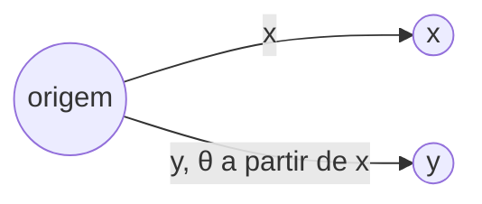

## Objetivos de Aprendizagem

- Calcular o produto escalar de dois vetores em ℝⁿ usando a fórmula por componentes Σ xᵢyᵢ.
- Enunciar a relação x·y = ‖x‖‖y‖cos θ conectando o produto escalar ao ângulo θ entre dois vetores, e explicar por que isso torna o produto escalar zero exatamente quando os vetores são perpendiculares.
- Calcular a norma Euclidiana (L2) ‖x‖ de um vetor e conectá-la ao produto escalar via ‖x‖ = √(x·x).
- Determinar se dois vetores dados são ortogonais, e calcular o ângulo entre dois vetores quando o produto escalar e as normas são conhecidos.
- Distinguir o papel do produto escalar como uma medida de alinhamento com valor escalar da soma de vetores e multiplicação por escalar, que sempre produzem vetores.

## Contexto e Motivação

A soma e a multiplicação por escalar, as duas operações introduzidas anteriormente, sempre recebem vetores e produzem um vetor, nunca saem de ℝⁿ. O produto escalar é a primeira operação nesta disciplina que recebe dois vetores e os colapsa em um único número real, e esse número acaba codificando algo genuinamente útil: quanto os dois vetores "concordam" em direção, e, como subproduto, quão longo um único vetor é. Isso não é uma adição técnica menor, é a operação que torna geometria (ângulo, comprimento, perpendicularidade) computável usando nada além da aritmética já em mãos a partir da definição por componentes de um vetor.

Os riscos práticos são imediatos assim que você olha para o que o produto escalar viabiliza. A referência do CS229 de Stanford o introduz como a espinha dorsal da similaridade de cosseno, a forma padrão de comparar dois vetores de características ou dois embeddings de palavras em aprendizado de máquina, dois vetores são julgados "similares" quase inteiramente com base no ângulo entre eles, que é exatamente o que o produto escalar mede. A mesma operação sustenta projeções (quanto de um vetor está "ao longo" de outro), a própria definição de comprimento (a norma de um vetor é nada além do seu produto escalar consigo mesmo, com raiz quadrada), e ortogonalidade (perpendicularidade), que se torna essencial assim que sistemas de equações e eliminação precisam de uma noção de independência entre direções.

O que torna o produto escalar digno de uma pausa, em vez de ser tratado como "apenas mais uma fórmula," é a definição de dois lados: ele tem uma definição puramente algébrica (multiplique componentes correspondentes e some) e uma caracterização puramente geométrica (comprimento vezes comprimento vezes o cosseno do ângulo entre eles), e a afirmação de que esses sempre concordam é um teorema genuíno, não uma coincidência de notação. Uma vez que essa equivalência é confiável, o produto escalar se torna uma ferramenta para se mover livremente entre álgebra (números que você pode calcular apenas a partir de componentes, sem necessidade de imagem) e geometria (ângulo, perpendicularidade, comprimento), exatamente o tipo de ponte que esta disciplina é construída para dar a você.

## Teoria Central

### O produto escalar: definição e cálculo básico

Dados dois vetores x = (x₁, …, xₙ) e y = (y₁, …, yₙ) em ℝⁿ, seu **produto escalar** (também chamado de produto interno ou produto ponto) é o número real:

x·y = x₁y₁ + x₂y₂ + … + xₙyₙ = Σᵢ xᵢyᵢ

Note o formato dessa definição com cuidado: dois *vetores* entram, mas um único *escalar* sai, isso é o que separa o produto escalar da soma e da multiplicação por escalar, que ambas permanecem inteiramente dentro de ℝⁿ. O produto escalar só é definido entre vetores de mesma dimensão, pela mesma razão que a soma exige dimensões correspondentes: precisa haver um pareamento bem definido de componentes para multiplicar juntos.

A partir da fórmula por componentes, várias propriedades algébricas seguem imediatamente:

- **Comutatividade**: x·y = y·x, já que xᵢyᵢ = yᵢxᵢ para todo par real.
- **Distributividade sobre a soma**: x·(y + z) = x·y + x·z.
- **Compatibilidade com a multiplicação por escalar**: (cx)·y = c(x·y) = x·(cy).
- **Positividade estrita**: x·x ≥ 0 sempre, e x·x = 0 exatamente quando x é o vetor zero (já que x·x = x₁² + x₂² + … + xₙ², uma soma de quadrados, que é zero apenas quando todo termo, e portanto todo componente, é zero).

Essa última propriedade, x·x ≥ 0 com igualdade apenas no vetor zero, é o que torna o produto escalar utilizável como base para uma noção de comprimento, desenvolvida a seguir.

### A norma Euclidiana: comprimento a partir do produto escalar

A **norma Euclidiana** (ou **norma L2**, ou simplesmente o **comprimento**) de um vetor x ∈ ℝⁿ é definida como:

‖x‖ = √(x·x) = √(x₁² + x₂² + … + xₙ²)

Para n = 2, isso é exatamente o teorema de Pitágoras: um vetor x = (x₁, x₂), visto como uma seta da origem até o ponto (x₁, x₂), forma a hipotenusa de um triângulo retângulo com catetos x₁ e x₂, então seu comprimento é √(x₁² + x₂²) diretamente por Pitágoras. Para n = 3, a mesma fórmula estende o teorema de Pitágoras uma dimensão além (aplique-o duas vezes: uma vez em um plano, uma vez fora dele), e para n > 3 a fórmula é simplesmente *definida* para continuar o mesmo padrão, não há mais uma imagem literal de triângulo retângulo para apontar, mas a álgebra carrega a ideia geométrica de "comprimento" adiante inalterada.

Duas consequências imediatas da definição:

- ‖x‖ ≥ 0 sempre, e ‖x‖ = 0 exatamente quando x = 0, herdado diretamente da positividade estrita de x·x.
- ‖cx‖ = |c|·‖x‖ para qualquer escalar c, escalar um vetor por c escala seu comprimento por |c| (o valor absoluto, já que o comprimento não pode ser negativo mesmo se c for): ‖cx‖ = √((cx)·(cx)) = √(c²(x·x)) = |c|√(x·x) = |c|‖x‖.

Um vetor com ‖x‖ = 1 é chamado de **vetor unitário**. Qualquer vetor não nulo x pode ser transformado em um vetor unitário apontando na mesma direção dividindo pelo seu próprio comprimento: x⁄‖x‖ tem norma exatamente 1, um processo chamado de **normalizar** x.

### O significado geométrico: x·y = ‖x‖‖y‖cos θ

O único fato que conecta a fórmula puramente algébrica do produto escalar à geometria genuína é esta identidade: para quaisquer dois vetores não nulos x, y ∈ ℝⁿ, se θ é o ângulo entre eles (medido da forma comum, entre 0 e π radianos),

x·y = ‖x‖‖y‖cos θ

Isso pode ser derivado da Lei dos Cossenos aplicada ao triângulo formado por x, y, e x − y, mas a derivação em si é secundária ao que a identidade diz: o produto escalar empacota juntos os comprimentos de ambos os vetores *e* o ângulo entre eles em um único número, e a fórmula por componentes (Σxᵢyᵢ) é garantida a sempre calcular esse exato mesmo número, sem necessidade de imagem ou medição de ângulo.

Rearranjar a identidade dá uma forma de *recuperar* o ângulo apenas a partir das componentes:

cos θ = (x·y) ⁄ (‖x‖‖y‖)

**Por que o produto escalar é zero exatamente quando os vetores são perpendiculares.** Como ‖x‖ > 0 e ‖y‖ > 0 para vetores não nulos, a equação x·y = ‖x‖‖y‖cos θ só pode ser igual a zero quando cos θ = 0, e cos θ = 0 exatamente em θ = π/2 (90°), ou seja, exatamente quando x e y são perpendiculares. Dois vetores satisfazendo x·y = 0 são chamados de **ortogonais**. Essa única equivalência, produto escalar zero ⟺ perpendicular, é o que torna o produto escalar o *teste algébrico* padrão para uma propriedade *geométrica*: sem transferidor, sem imagem, apenas calcule Σxᵢyᵢ e verifique se é zero.

O sinal do produto escalar carrega significado mesmo longe de exatamente zero: já que ‖x‖‖y‖ > 0 sempre, o sinal de x·y corresponde ao sinal de cos θ, positivo quando o ângulo é agudo (θ < 90°, vetores apontando "aproximadamente na mesma direção"), negativo quando obtuso (θ > 90°, apontando "aproximadamente em direções opostas"), e zero exatamente na fronteira perpendicular entre os dois.



Imagine x e y como duas setas a partir da mesma origem, com θ o ângulo varrido entre elas; x·y > 0 significa θ < 90° (ângulo estreito, vetores "inclinando-se juntos"), x·y < 0 significa θ > 90° (ângulo largo, vetores "inclinando-se separados"), e x·y = 0 significa que as setas se encontram em um ângulo reto perfeito.

## Exemplos Resolvidos

### Exemplo 1 — calculando um produto escalar e uma norma diretamente

**Problema:** Sejam x = (3, 4) e y = (1, 2). Calcule x·y, ‖x‖, e ‖y‖.

**x·y:** multiplique componentes correspondentes e some: (3)(1) + (4)(2) = 3 + 8 = 11.

**‖x‖:** √(x·x) = √(3² + 4²) = √(9 + 16) = √25 = 5. (Este é o clássico triângulo retângulo 3-4-5, x tem comprimento exatamente 5.)

**‖y‖:** √(1² + 2²) = √(1 + 4) = √5 ≈ 2,236.

Uma verificação rápida com NumPy confirma os mesmos valores sem aritmética manual:

```python
import numpy as np
x = np.array([3, 4])
y = np.array([1, 2])
print(np.dot(x, y))       # 11
print(np.linalg.norm(x))  # 5.0
print(np.linalg.norm(y))  # 2.23606797749979
```

### Exemplo 2 — encontrando o ângulo entre dois vetores

**Problema:** Usando x = (3, 4) e y = (1, 2) do Exemplo 1, encontre o ângulo θ entre eles.

**Aplique a identidade rearranjada:** cos θ = (x·y) ⁄ (‖x‖‖y‖) = 11 ⁄ (5 · √5) = 11 ⁄ (5√5).

**Numericamente:** 5√5 ≈ 11,180, então cos θ ≈ 11 ⁄ 11,180 ≈ 0,9839.

**Resolva para θ:** θ = arccos(0,9839) ≈ 0,180 radianos ≈ 10,3°.

**Interpretação:** um ângulo pequeno (cerca de 10°), consistente com x·y = 11 sendo um número positivo razoavelmente grande em relação a ‖x‖‖y‖ ≈ 11,18, o produto escalar é quase tão grande quanto poderia possivelmente ser (nunca pode exceder ‖x‖‖y‖, já que cos θ ≤ 1 sempre), o que acontece exatamente quando os dois vetores apontam em quase a mesma direção.

### Exemplo 3 — testando ortogonalidade e construindo um vetor unitário

**Problema:** Determine se u = (2, −1, 3) e v = (1, 5, 1) são ortogonais, e, separadamente, normalize u em um vetor unitário.

**Teste de ortogonalidade:** calcule u·v = (2)(1) + (−1)(5) + (3)(1) = 2 − 5 + 3 = 0. Como o produto escalar é exatamente zero, u e v são ortogonais, eles se encontram em um ângulo reto em ℝ³, mesmo que não haja uma imagem simples para verificar isso diretamente; a álgebra é a única evidência necessária, e é conclusiva.

**Normalizando u:** primeiro calcule ‖u‖ = √(2² + (−1)² + 3²) = √(4 + 1 + 9) = √14. O vetor unitário na direção de u é:

u ⁄ ‖u‖ = (2⁄√14, −1⁄√14, 3⁄√14)

**Verifique que é de fato um vetor unitário:** sua própria norma deveria ser 1. Calcule (u⁄‖u‖)·(u⁄‖u‖) = (1⁄14)(u·u) = (1⁄14)(14) = 1, então ‖u⁄‖u‖‖ = √1 = 1, confirmado algebricamente, usando exatamente a propriedade de escalonamento ‖cx‖ = |c|‖x‖ estabelecida na Teoria Central com c = 1⁄‖u‖.

## Equívocos Comuns e Armadilhas

- **"O produto escalar de dois vetores é um vetor."** É um único número real (um escalar), nunca um vetor, isso é precisamente o que o distingue da soma e da multiplicação por escalar. Escrever "x·y = (5, 3)" ou qualquer outra resposta em formato de vetor é um erro categórico; a saída correta de um produto escalar sempre tem o formato de um número simples.
- **"Se x·y é um número grande, os vetores devem ser quase paralelos."** Grande em termos absolutos não é o mesmo que grande em relação a ‖x‖‖y‖. Por exemplo, x = (100, 0) e y = (0, 100) têm x·y = 0 (perpendiculares!) apesar de ambos os vetores serem individualmente "grandes", o que importa para o ângulo é a razão (x·y)⁄(‖x‖‖y‖) = cos θ, não o valor bruto do produto escalar isoladamente.
- **"‖x + y‖ = ‖x‖ + ‖y‖ sempre."** Isso só vale quando x e y apontam exatamente na mesma direção (θ = 0). Em geral ‖x + y‖ ≤ ‖x‖ + ‖y‖ (a desigualdade triangular), com igualdade apenas nesse caso paralelo, por exemplo, x = (1,0), y = (0,1) dá ‖x+y‖ = ‖(1,1)‖ = √2 ≈ 1,414, enquanto ‖x‖ + ‖y‖ = 1 + 1 = 2; √2 < 2, confirmando que a desigualdade é estrita aqui já que x e y são perpendiculares, não paralelos.
- **"Vetores ortogonais precisam ser não nulos e apontar em direções genuinamente diferentes, então o vetor zero não pode estar envolvido."** Pela definição x·y = 0, o vetor zero é ortogonal a *todo* vetor, incluindo ele mesmo (0·x = 0 para qualquer x), esse é um caso extremo degenerado que vale a pena lembrar explicitamente, já que "ortogonal" é às vezes descrito informalmente apenas em termos de duas direções genuinamente distintas se encontrando a 90°, o que se rompe quando um vetor é 0 (um ângulo nem sequer é bem definido para o vetor zero, mas o teste algébrico x·y=0 ainda relata "ortogonal").

## Resumo

O produto escalar x·y = Σᵢ xᵢyᵢ é a primeira operação nesta disciplina que transforma dois vetores em um único escalar, e esse escalar não é arbitrário, ele é garantido, pela identidade x·y = ‖x‖‖y‖cos θ, a codificar exatamente quão alinhados os dois vetores estão, com o sinal distinguindo ângulos agudos de obtusos e o valor zero marcando precisamente o caso perpendicular (ortogonal). A norma Euclidiana ‖x‖ = √(x·x) se apoia na mesma operação, generalizando o teorema de Pitágoras em uma definição de "comprimento" que continua funcionando uniformemente não importa quantos componentes um vetor tenha, mesmo quando uma imagem literal de triângulo retângulo não está mais disponível para desenhar. Juntos, o produto escalar e a norma são o que permite a esta disciplina falar sobre ângulo, comprimento, e perpendicularidade usando nada além de aritmética de componentes, sem transferidor ou régua, apenas Σxᵢyᵢ e √(x·x), calculados diretamente a partir dos números já em mãos.

## Documentation Links

- [Stanford CS229 — Linear Algebra Review and Reference](https://cs229.stanford.edu/section/cs229-linalg.pdf) — doc
- [MIT 18.06 — Course Home (OCW)](https://ocw.mit.edu/courses/18-06-linear-algebra-spring-2010/) — doc
