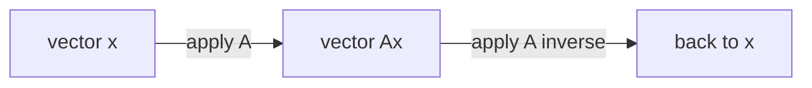

## Learning Objectives

- Define the identity matrix I and state its defining property, AI = IA = A for every compatible A.
- Define the inverse A⁻¹ of a matrix A via the conditions AA⁻¹ = A⁻¹A = I, and prove that an inverse, when it exists, is unique.
- Compute the inverse of a 2×2 matrix using the direct formula, and verify the result by multiplying it back against the original.
- Explain why some square matrices have no inverse at all (singular matrices), and connect this to linearly dependent rows or columns.
- State that determinants, covered later in this discipline, give a fast test for whether a matrix is invertible, without needing to construct the inverse itself.

## Context & Motivation

Ordinary arithmetic has two special numbers that make everything else work smoothly: 0, which does nothing under addition, and 1, which does nothing under multiplication — and every nonzero number has a reciprocal, a partner that multiplies it back to 1. Matrix algebra has direct analogues of the second pair, and they matter for exactly the reason reciprocals matter in ordinary algebra: they are what makes "solving for x" possible. Given the equation Ax = b — the entire subject of the systems-of-linear-equations concept — the natural instinct, carried straight over from scalar algebra, is to "divide both sides by A." Matrices don't support division, but they do support the analogous operation whenever a matrix inverse A⁻¹ exists: multiplying both sides by A⁻¹ gives x = A⁻¹b directly, no elimination required.

That said, the identity matrix and matrix inverses covered here are foundational rather than the day-to-day computational tool: in practice, numerical libraries and production code overwhelmingly prefer Gaussian elimination (or its industrial-strength variants) to solve Ax = b, because explicitly computing A⁻¹ is more expensive and less numerically stable than eliminating directly — a point Stanford's CS229 materials make explicitly when reviewing linear algebra for machine learning. The conceptual value of the inverse is enormous regardless: "does A⁻¹ exist" is one of the most important yes/no questions that can be asked about a matrix, since the answer determines whether Ax = b has a unique solution for every b, and the vocabulary built here — invertible versus singular — recurs throughout the rest of this discipline, from column space and rank through determinants and eigenvalues.

## Core Theory

### The identity matrix

The **identity matrix** I_n (or just I when the size is clear from context) is the n×n matrix with 1s down the main diagonal and 0s everywhere else:

    I_3 = [ 1  0  0 ]
          [ 0  1  0 ]
          [ 0  0  1 ]

Its defining property is that it acts as a "do nothing" matrix under multiplication: for any matrix A of compatible shape,

    AI = A     and     IA = A

This follows directly from the row-times-column rule: entry (i,j) of AI is row i of A dotted with column j of I, and column j of I is all zeros except for a single 1 in position j — so the dot product just picks out A[i,j] unchanged. As a linear transformation (previous concept), I represents the transformation that leaves every vector exactly where it is: Ix = x for every vector x. It is the matrix equivalent of the number 1.

### The inverse of a matrix, and its uniqueness

For a square matrix A ∈ ℝ^(n×n), a matrix B is called an **inverse** of A if it satisfies both

    AB = I     and     BA = I

When such a B exists, A is called **invertible** (or **nonsingular**), and the inverse is written A⁻¹. Both equations are required — for square matrices it turns out that one implies the other, but the definition demands both because, mirroring the point from matrix-operations, matrix multiplication doesn't commute in general, so AB = I alone would not automatically guarantee BA = I for arbitrary (non-square) matrices; restricting to square A sidesteps this subtlety.

**The inverse is unique when it exists.** Suppose B and C are both inverses of A, so AB = BA = I and AC = CA = I. Then:

    B = BI = B(AC) = (BA)C = IC = C

using associativity of matrix multiplication (from matrix-operations) to regroup B(AC) as (BA)C. Since B = C, there is only ever one inverse to speak of, justifying the notation A⁻¹ as naming a specific matrix rather than one choice among several.

### The 2×2 inverse formula

For a 2×2 matrix

    A = [ a  b ]
        [ c  d ]

the inverse, when it exists, is given by the explicit formula

    A⁻¹ = (1 / (ad - bc)) · [  d  -b ]
                             [ -c   a ]

The quantity ad − bc appearing in the denominator is the **determinant** of A (written det(A) or |A|), a topic developed fully in a later concept — for now it is enough to treat it as the single number this formula happens to divide by. Multiplying out AA⁻¹ using this formula confirms it works in general:

    AA⁻¹ = (1/(ad-bc)) · [ a  b ] [  d  -b ]  = (1/(ad-bc)) · [ ad-bc      0    ]  = [ 1  0 ]
                          [ c  d ] [ -c   a ]                  [   0     ad-bc  ]    [ 0  1 ]

exactly I, provided ad − bc ≠ 0 so the division is legal. This last condition is not a technicality to route around — it is the entire content of the next section.

### Singular matrices: when no inverse exists

If ad − bc = 0 for a 2×2 matrix, the formula above requires dividing by zero, and no inverse exists — such a matrix is called **singular**. This is not a computational inconvenience that a cleverer formula could fix; it reflects a genuine structural fact about the matrix. Whenever ad − bc = 0, one row of A is a scalar multiple of the other (equivalently, one column is a multiple of the other) — the rows or columns are **linearly dependent**, in the language of the linear-combinations-and-span concept. Geometrically (previous concept, matrices as linear transformations), a singular 2×2 matrix collapses the entire plane onto a line (or onto the origin) rather than mapping it onto another full plane — information is genuinely destroyed by the transformation, and no matrix can undo that loss, because infinitely many different input vectors get mapped to the very same output, so there is no way to define a "reverse" transformation that recovers a unique input from a given output.

This connects directly to solving Ax = b: if A is singular, Ax = b either has no solution at all, or has infinitely many, but never exactly one — the clean "multiply both sides by A⁻¹" trick simply isn't available, and elimination (rather than an inverse) is required to sort out which of those two cases actually holds for a given b. Determining invertibility for larger (n×n, n > 2) matrices by hand from a formula like this quickly becomes impractical, which is exactly the gap the later determinants concept fills: a single computed number, det(A), that is nonzero exactly when A is invertible, generalizing the ad − bc pattern seen here to any square size — without needing to construct A⁻¹ at all just to answer the yes/no question of whether it exists.



When A is invertible, this round trip always returns exactly to the starting vector — applying A and then A⁻¹ (in either order) is indistinguishable from applying I. When A is singular, no such "undo" matrix exists, because the forward trip through A already discarded information the return trip would need.

## Worked Examples

### Example 1 — confirming AI = A and IA = A directly

**Problem.** Let A = [ 2 5 ; -1 3 ] (2×2). Confirm AI₂ = A and I₂A = A by direct computation.

**AI₂:**

    [ 2  5 ] [ 1  0 ]   [ 2·1+5·0   2·0+5·1 ]   [ 2  5 ]
    [-1  3 ] [ 0  1 ] = [-1·1+3·0  -1·0+3·1 ] = [-1  3 ]

**I₂A:**

    [ 1  0 ] [ 2  5 ]   [ 1·2+0·(-1)   1·5+0·3 ]   [ 2  5 ]
    [ 0  1 ] [-1  3 ] = [ 0·2+1·(-1)   0·5+1·3 ] = [-1  3 ]

Both equal A exactly, confirming the identity matrix's defining "do nothing" property on this concrete example, on both sides.

### Example 2 — computing and verifying a 2×2 inverse

**Problem.** Find the inverse of A = [ 3 2 ; 1 4 ], and verify it by multiplying both AA⁻¹ and A⁻¹A.

**Step 1 — compute the determinant.** ad − bc = (3)(4) − (2)(1) = 12 − 2 = 10. Since this is nonzero, A is invertible.

**Step 2 — apply the formula.**

    A⁻¹ = (1/10) [ 4  -2 ]   =  [ 0.4  -0.2 ]
                  [-1   3 ]      [-0.1   0.3 ]

**Step 3 — verify AA⁻¹ = I.**

    (AA⁻¹)[1,1] = (3)(0.4) + (2)(-0.1) = 1.2 - 0.2 = 1.0
    (AA⁻¹)[1,2] = (3)(-0.2) + (2)(0.3) = -0.6 + 0.6 = 0.0
    (AA⁻¹)[2,1] = (1)(0.4) + (4)(-0.1) = 0.4 - 0.4 = 0.0
    (AA⁻¹)[2,2] = (1)(-0.2) + (4)(0.3) = -0.2 + 1.2 = 1.0

    AA⁻¹ = [ 1  0 ] = I     ✓
           [ 0  1 ]

**Step 4 — verify A⁻¹A = I** proceeds identically and also gives I (omitted for brevity, but this is exactly the check that confirms A⁻¹ really is a two-sided inverse, not merely a one-sided one).

```python
import numpy as np
A = np.array([[3, 2], [1, 4]])
A_inv = np.linalg.inv(A)
print(A_inv)          # [[ 0.4 -0.2] [-0.1  0.3]]
print(A @ A_inv)       # [[1. 0.] [0. 1.]]
```

### Example 3 — a singular matrix, and why the inverse formula breaks

**Problem.** Attempt to invert A = [ 2 4 ; 1 2 ], and explain the failure in terms of the matrix's rows.

**Step 1 — compute the determinant.** ad − bc = (2)(2) − (4)(1) = 4 − 4 = 0.

**Step 2 — the formula fails.** The inverse formula requires dividing by ad − bc = 0, which is undefined — no inverse exists for this matrix.

**Step 3 — connect to linear dependence.** Notice row 2 of A, (1, 2), is exactly half of row 1, (2, 4): row 1 = 2 × row 2. The rows are scalar multiples of each other, so they are linearly dependent — there is genuinely less information in this matrix than its 2×2 size suggests. Running Gaussian elimination on A confirms this directly: subtracting (1/2) × row 1 from row 2 produces a row of all zeros, the classic elimination signature of a singular matrix. Geometrically, A maps the entire plane onto the single line through the origin in the direction (2, 1) (since both (2,4) and its transformation send everything toward that same direction) — a genuine collapse of dimension, and exactly why no "undo" matrix can exist.

```python
import numpy as np
A = np.array([[2, 4], [1, 2]])
print(np.linalg.det(A))          # 0.0
try:
    np.linalg.inv(A)
except np.linalg.LinAlgError as e:
    print("Singular matrix:", e)
```

## Common Misconceptions & Pitfalls

- **"Every square matrix has an inverse."** False — Example 3 exhibits a perfectly ordinary-looking 2×2 matrix with no inverse at all. Invertibility is a real condition to check (ad − bc ≠ 0 for 2×2, or more generally a nonzero determinant), not a guarantee that comes free with being square.
- **"(AB)⁻¹ = A⁻¹B⁻¹."** The correct identity reverses the order: (AB)⁻¹ = B⁻¹A⁻¹. This can be checked directly: (AB)(B⁻¹A⁻¹) = A(BB⁻¹)A⁻¹ = AIA⁻¹ = AA⁻¹ = I, using associativity at each step — the naive order A⁻¹B⁻¹ does not simplify this way and generally fails to produce I at all. This mirrors the reversal seen with the transpose of a product in the next concept — a pattern worth noticing rather than treating as a coincidence.
- **"Computing A⁻¹ is the standard way to solve Ax = b."** Mathematically valid when A is invertible (x = A⁻¹b), but not how production numerical code typically solves such systems — direct elimination is generally faster and more numerically stable than forming an explicit inverse, which is one reason libraries like NumPy expose `solve` as the recommended path and reserve explicit `inv` calls for when the inverse itself is actually needed for something else.
- **"A non-square matrix can be inverted the same way, just with a differently shaped formula."** The inverse as defined here (AA⁻¹ = A⁻¹A = I) requires A to be square — a non-square matrix cannot satisfy both equations simultaneously, since AB and BA would need to be different-sized identity matrices. Non-square matrices have a different, more advanced generalization (a pseudo-inverse) that falls outside this concept's scope entirely.

## Summary

The identity matrix I is the multiplicative "do nothing" matrix, satisfying AI = IA = A for every compatible A, and the inverse A⁻¹ of a square matrix A is the (unique, when it exists) matrix satisfying AA⁻¹ = A⁻¹A = I — the direct analogue of a reciprocal, letting Ax = b be solved as x = A⁻¹b whenever A is invertible. For 2×2 matrices, an explicit formula gives A⁻¹ in terms of the entries a, b, c, d, dividing by the quantity ad − bc; when that quantity is zero, the matrix is singular, no inverse exists, and this always traces back to linearly dependent rows or columns — a genuine loss of information under the transformation the matrix represents, not a computational accident. Determining invertibility by hand from a formula like ad − bc doesn't scale past 2×2, which is exactly the gap the later determinants concept closes: a single number, generalized to any square size, that is nonzero precisely when the matrix is invertible.

## Documentation Links

- [Stanford CS229 — Linear Algebra Review and Reference](https://cs229.stanford.edu/section/cs229-linalg.pdf) — doc
- [MIT 18.06SC — Syllabus (OCW)](https://www.ocw.mit.edu/courses/18-06sc-linear-algebra-fall-2011/pages/syllabus) — doc
