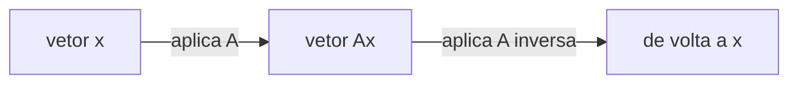

## Objetivos de Aprendizagem

- Definir a matriz identidade I e enunciar sua propriedade definidora, AI = IA = A para todo A compatível.
- Definir a inversa A⁻¹ de uma matriz A via as condições AA⁻¹ = A⁻¹A = I, e provar que uma inversa, quando existe, é única.
- Calcular a inversa de uma matriz 2×2 usando a fórmula direta, e verificar o resultado multiplicando-o de volta contra o original.
- Explicar por que algumas matrizes quadradas não têm nenhuma inversa (matrizes singulares), e conectar isso a linhas ou colunas linearmente dependentes.
- Enunciar que determinantes, cobertos mais adiante nesta disciplina, dão um teste rápido para se uma matriz é invertível, sem precisar construir a própria inversa.

## Contexto e Motivação

A aritmética comum tem dois números especiais que fazem tudo mais funcionar suavemente: 0, que não faz nada sob soma, e 1, que não faz nada sob multiplicação, e todo número não nulo tem um recíproco, um parceiro que o multiplica de volta a 1. A álgebra de matrizes tem análogos diretos do segundo par, e eles importam exatamente pela razão pela qual recíprocos importam na álgebra comum: são o que torna "resolver para x" possível. Dada a equação Ax = b, todo o assunto do conceito de sistemas de equações lineares, o instinto natural, carregado diretamente da álgebra escalar, é "dividir ambos os lados por A." Matrizes não suportam divisão, mas suportam a operação análoga sempre que uma inversa de matriz A⁻¹ existe: multiplicar ambos os lados por A⁻¹ dá x = A⁻¹b diretamente, sem exigir eliminação.

Dito isso, a matriz identidade e as inversas de matriz cobertas aqui são fundacionais em vez da ferramenta computacional do dia a dia: na prática, bibliotecas numéricas e código de produção preferem esmagadoramente a eliminação Gaussiana (ou suas variantes de força industrial) para resolver Ax = b, porque calcular A⁻¹ explicitamente é mais caro e menos numericamente estável do que eliminar diretamente, um ponto que os materiais do CS229 de Stanford fazem explicitamente ao revisar álgebra linear para aprendizado de máquina. O valor conceitual da inversa é enorme independentemente disso: "A⁻¹ existe" é uma das perguntas de sim/não mais importantes que podem ser feitas sobre uma matriz, já que a resposta determina se Ax = b tem uma solução única para todo b, e o vocabulário construído aqui, invertível versus singular, reaparece ao longo do resto desta disciplina, do espaço de colunas e posto (rank) até determinantes e autovalores.

## Teoria Central

### A matriz identidade

A **matriz identidade** I_n (ou apenas I quando o tamanho está claro pelo contexto) é a matriz n×n com 1s ao longo da diagonal principal e 0s em todo outro lugar:

    I_3 = [ 1  0  0 ]
          [ 0  1  0 ]
          [ 0  0  1 ]

Sua propriedade definidora é que ela age como uma matriz "não faz nada" sob multiplicação: para qualquer matriz A de formato compatível,

    AI = A     e     IA = A

Isso segue diretamente da regra linha-vezes-coluna: a entrada (i,j) de AI é a linha i de A ponteada com a coluna j de I, e a coluna j de I é toda zeros exceto por um único 1 na posição j, então o produto escalar apenas seleciona A[i,j] inalterado. Como uma transformação linear (conceito anterior), I representa a transformação que deixa todo vetor exatamente onde está: Ix = x para todo vetor x. É o equivalente matricial do número 1.

### A inversa de uma matriz, e sua unicidade

Para uma matriz quadrada A ∈ ℝ^(n×n), uma matriz B é chamada de **inversa** de A se ela satisfaz ambas

    AB = I     e     BA = I

Quando tal B existe, A é chamada de **invertível** (ou **não singular**), e a inversa é escrita A⁻¹. Ambas as equações são exigidas, para matrizes quadradas acontece que uma implica a outra, mas a definição exige ambas porque, espelhando o ponto do conceito de operações com matrizes, a multiplicação de matrizes não comuta em geral, então AB = I sozinho não garantiria automaticamente BA = I para matrizes arbitrárias (não quadradas); restringir a A quadrada evita essa sutileza.

**A inversa é única quando existe.** Suponha que B e C sejam ambas inversas de A, então AB = BA = I e AC = CA = I. Então:

    B = BI = B(AC) = (BA)C = IC = C

usando associatividade da multiplicação de matrizes (de operações com matrizes) para reagrupar B(AC) como (BA)C. Como B = C, há apenas uma inversa a se falar, justificando a notação A⁻¹ como nomeando uma matriz específica em vez de uma escolha entre várias.

### A fórmula da inversa 2×2

Para uma matriz 2×2

    A = [ a  b ]
        [ c  d ]

a inversa, quando existe, é dada pela fórmula explícita

    A⁻¹ = (1 / (ad - bc)) · [  d  -b ]
                             [ -c   a ]

A quantidade ad − bc que aparece no denominador é o **determinante** de A (escrito det(A) ou |A|), um tópico desenvolvido completamente em um conceito posterior, por ora basta tratá-lo como o único número pelo qual essa fórmula acontece de dividir. Multiplicar AA⁻¹ usando essa fórmula confirma que ela funciona em geral:

    AA⁻¹ = (1/(ad-bc)) · [ a  b ] [  d  -b ]  = (1/(ad-bc)) · [ ad-bc      0    ]  = [ 1  0 ]
                          [ c  d ] [ -c   a ]                  [   0     ad-bc  ]    [ 0  1 ]

exatamente I, desde que ad − bc ≠ 0 para que a divisão seja legal. Essa última condição não é um tecnicismo a contornar, é todo o conteúdo da próxima seção.

### Matrizes singulares: quando nenhuma inversa existe

Se ad − bc = 0 para uma matriz 2×2, a fórmula acima exige dividir por zero, e nenhuma inversa existe, tal matriz é chamada de **singular**. Isso não é um inconveniente computacional que uma fórmula mais esperta poderia consertar; reflete um fato estrutural genuíno sobre a matriz. Sempre que ad − bc = 0, uma linha de A é um múltiplo escalar da outra (equivalentemente, uma coluna é um múltiplo da outra), as linhas ou colunas são **linearmente dependentes**, na linguagem do conceito de combinações lineares e span. Geometricamente (conceito anterior, matrizes como transformações lineares), uma matriz 2×2 singular colapsa o plano inteiro em uma reta (ou na origem) em vez de mapeá-lo para outro plano completo, informação é genuinamente destruída pela transformação, e nenhuma matriz pode desfazer essa perda, porque infinitos vetores de entrada diferentes são mapeados para a mesma saída, então não há forma de definir uma transformação "reversa" que recupere uma única entrada a partir de uma dada saída.

Isso se conecta diretamente a resolver Ax = b: se A é singular, Ax = b ou não tem solução alguma, ou tem infinitas, mas nunca exatamente uma, o truque limpo de "multiplique ambos os lados por A⁻¹" simplesmente não está disponível, e eliminação (em vez de uma inversa) é necessária para descobrir qual desses dois casos de fato vale para um dado b. Determinar invertibilidade para matrizes maiores (n×n, n > 2) à mão a partir de uma fórmula como essa rapidamente se torna impraticável, que é exatamente a lacuna que o conceito posterior de determinantes preenche: um único número calculado, det(A), que é não nulo exatamente quando A é invertível, generalizando o padrão ad − bc visto aqui para qualquer tamanho quadrado, sem precisar construir A⁻¹ de forma alguma apenas para responder à pergunta de sim/não de se ele existe.



Quando A é invertível, essa viagem de ida e volta sempre retorna exatamente ao vetor inicial, aplicar A e depois A⁻¹ (em qualquer ordem) é indistinguível de aplicar I. Quando A é singular, nenhuma matriz "desfazer" existe, porque a viagem de ida através de A já descartou informação que a viagem de volta precisaria.

## Exemplos Resolvidos

### Exemplo 1 — confirmando AI = A e IA = A diretamente

**Problema.** Seja A = [ 2 5 ; -1 3 ] (2×2). Confirme AI₂ = A e I₂A = A por cálculo direto.

**AI₂:**

    [ 2  5 ] [ 1  0 ]   [ 2·1+5·0   2·0+5·1 ]   [ 2  5 ]
    [-1  3 ] [ 0  1 ] = [-1·1+3·0  -1·0+3·1 ] = [-1  3 ]

**I₂A:**

    [ 1  0 ] [ 2  5 ]   [ 1·2+0·(-1)   1·5+0·3 ]   [ 2  5 ]
    [ 0  1 ] [-1  3 ] = [ 0·2+1·(-1)   0·5+1·3 ] = [-1  3 ]

Ambas iguais a A exatamente, confirmando a propriedade definidora "não faz nada" da matriz identidade neste exemplo concreto, em ambos os lados.

### Exemplo 2 — calculando e verificando uma inversa 2×2

**Problema.** Encontre a inversa de A = [ 3 2 ; 1 4 ], e verifique-a multiplicando tanto AA⁻¹ quanto A⁻¹A.

**Passo 1 — calcule o determinante.** ad − bc = (3)(4) − (2)(1) = 12 − 2 = 10. Como isso é não nulo, A é invertível.

**Passo 2 — aplique a fórmula.**

    A⁻¹ = (1/10) [ 4  -2 ]   =  [ 0.4  -0.2 ]
                  [-1   3 ]      [-0.1   0.3 ]

**Passo 3 — verifique AA⁻¹ = I.**

    (AA⁻¹)[1,1] = (3)(0.4) + (2)(-0.1) = 1.2 - 0.2 = 1.0
    (AA⁻¹)[1,2] = (3)(-0.2) + (2)(0.3) = -0.6 + 0.6 = 0.0
    (AA⁻¹)[2,1] = (1)(0.4) + (4)(-0.1) = 0.4 - 0.4 = 0.0
    (AA⁻¹)[2,2] = (1)(-0.2) + (4)(0.3) = -0.2 + 1.2 = 1.0

    AA⁻¹ = [ 1  0 ] = I     ✓
           [ 0  1 ]

**Passo 4 — verificar A⁻¹A = I** procede identicamente e também dá I (omitido por brevidade, mas esta é exatamente a verificação que confirma que A⁻¹ realmente é uma inversa de dois lados, não meramente de um lado).

```python
import numpy as np
A = np.array([[3, 2], [1, 4]])
A_inv = np.linalg.inv(A)
print(A_inv)          # [[ 0.4 -0.2] [-0.1  0.3]]
print(A @ A_inv)       # [[1. 0.] [0. 1.]]
```

### Exemplo 3 — uma matriz singular, e por que a fórmula da inversa quebra

**Problema.** Tente inverter A = [ 2 4 ; 1 2 ], e explique a falha em termos das linhas da matriz.

**Passo 1 — calcule o determinante.** ad − bc = (2)(2) − (4)(1) = 4 − 4 = 0.

**Passo 2 — a fórmula falha.** A fórmula da inversa exige dividir por ad − bc = 0, que é indefinido, nenhuma inversa existe para essa matriz.

**Passo 3 — conecte à dependência linear.** Note que a linha 2 de A, (1, 2), é exatamente metade da linha 1, (2, 4): linha 1 = 2 × linha 2. As linhas são múltiplos escalares uma da outra, então são linearmente dependentes, há genuinamente menos informação nessa matriz do que seu tamanho 2×2 sugere. Rodar eliminação Gaussiana em A confirma isso diretamente: subtrair (1/2) × linha 1 da linha 2 produz uma linha toda de zeros, a assinatura clássica de eliminação de uma matriz singular. Geometricamente, A mapeia o plano inteiro na única reta pela origem na direção (2, 1) (já que tanto (2,4) quanto sua transformação enviam tudo em direção àquela mesma direção), um colapso genuíno de dimensão, e exatamente por que nenhuma matriz "desfazer" pode existir.

```python
import numpy as np
A = np.array([[2, 4], [1, 2]])
print(np.linalg.det(A))          # 0.0
try:
    np.linalg.inv(A)
except np.linalg.LinAlgError as e:
    print("Singular matrix:", e)
```

## Equívocos Comuns e Armadilhas

- **"Toda matriz quadrada tem uma inversa."** Falso, o Exemplo 3 exibe uma matriz 2×2 de aparência perfeitamente comum sem nenhuma inversa. Invertibilidade é uma condição real a verificar (ad − bc ≠ 0 para 2×2, ou mais geralmente um determinante não nulo), não uma garantia que vem de graça por ser quadrada.
- **"(AB)⁻¹ = A⁻¹B⁻¹."** A identidade correta inverte a ordem: (AB)⁻¹ = B⁻¹A⁻¹. Isso pode ser verificado diretamente: (AB)(B⁻¹A⁻¹) = A(BB⁻¹)A⁻¹ = AIA⁻¹ = AA⁻¹ = I, usando associatividade em cada passo, a ordem ingênua A⁻¹B⁻¹ não simplifica dessa forma e geralmente falha em produzir I de forma alguma. Isso espelha a inversão vista com a transposta de um produto no próximo conceito, um padrão que vale a pena notar em vez de tratar como coincidência.
- **"Calcular A⁻¹ é a forma padrão de resolver Ax = b."** Matematicamente válido quando A é invertível (x = A⁻¹b), mas não é como código numérico de produção tipicamente resolve tais sistemas, eliminação direta é geralmente mais rápida e numericamente mais estável do que formar uma inversa explícita, que é uma razão pela qual bibliotecas como NumPy expõem `solve` como o caminho recomendado e reservam chamadas `inv` explícitas para quando a própria inversa é de fato necessária para outra coisa.
- **"Uma matriz não quadrada pode ser invertida da mesma forma, apenas com uma fórmula de formato diferente."** A inversa como definida aqui (AA⁻¹ = A⁻¹A = I) exige que A seja quadrada, uma matriz não quadrada não pode satisfazer ambas as equações simultaneamente, já que AB e BA precisariam ser matrizes identidade de tamanhos diferentes. Matrizes não quadradas têm uma generalização diferente, mais avançada (uma pseudo-inversa) que cai inteiramente fora do escopo deste conceito.

## Resumo

A matriz identidade I é a matriz multiplicativa "não faz nada," satisfazendo AI = IA = A para todo A compatível, e a inversa A⁻¹ de uma matriz quadrada A é a matriz (única, quando existe) satisfazendo AA⁻¹ = A⁻¹A = I, o análogo direto de um recíproco, permitindo que Ax = b seja resolvido como x = A⁻¹b sempre que A é invertível. Para matrizes 2×2, uma fórmula explícita dá A⁻¹ em termos das entradas a, b, c, d, dividindo pela quantidade ad − bc; quando essa quantidade é zero, a matriz é singular, nenhuma inversa existe, e isso sempre remonta a linhas ou colunas linearmente dependentes, uma perda genuína de informação sob a transformação que a matriz representa, não um acidente computacional. Determinar invertibilidade à mão a partir de uma fórmula como ad − bc não escala além de 2×2, que é exatamente a lacuna que o conceito posterior de determinantes fecha: um único número, generalizado para qualquer tamanho quadrado, que é não nulo precisamente quando a matriz é invertível.

## Documentation Links

- [Stanford CS229 — Linear Algebra Review and Reference](https://cs229.stanford.edu/section/cs229-linalg.pdf) — doc
- [MIT 18.06SC — Syllabus (OCW)](https://www.ocw.mit.edu/courses/18-06sc-linear-algebra-fall-2011/pages/syllabus) — doc
