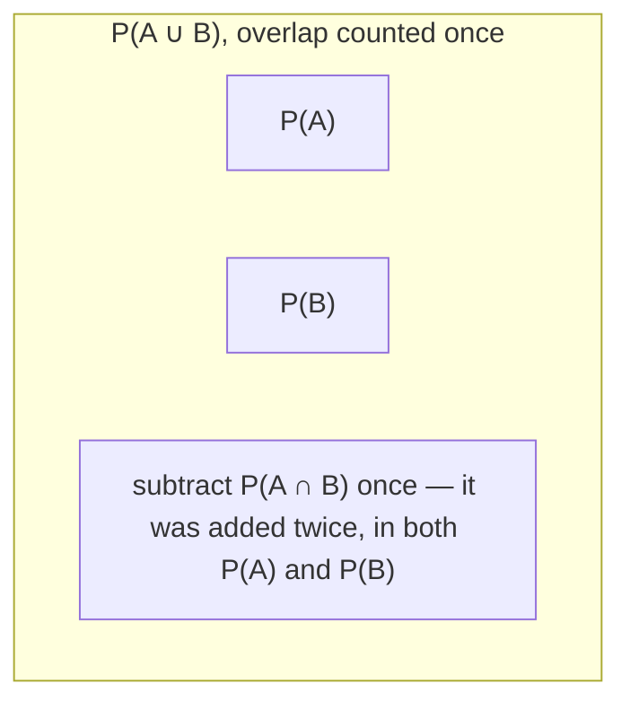

## Learning Objectives

- State the three Kolmogorov axioms of probability precisely, in terms of a sample space Ω and events as subsets of it.
- Derive the complement rule P(Aᶜ) = 1 − P(A) directly from the axioms.
- Derive the inclusion-exclusion formula P(A ∪ B) = P(A) + P(B) − P(A ∩ B) from the axioms, and connect it to the general Inclusion-Exclusion Principle from combinatorics.
- Derive and apply monotonicity: if A ⊆ B then P(A) ≤ P(B).
- Verify whether a proposed assignment of numbers to events is a valid probability measure by checking it against the axioms.

## Context & Motivation

It's tempting to think "probability" already has an intuitive, self-evident meaning — a number between 0 and 1 that measures how likely something is — and that the only real work left is computing that number for particular events. But intuition alone doesn't tell you which properties a probability assignment is required to have, and without those properties, chained reasoning ("if this is true then that must also be true") has no formal ground to stand on. This is exactly the gap Andrey Kolmogorov closed in 1933 with a short list of axioms: three simple requirements that any function assigning probabilities to events must satisfy in order to be called a probability measure at all. Everything else in probability theory — every rule for combining probabilities, every distribution, every theorem in this entire curriculum track — is, in a precise sense, a logical consequence of just these three axioms and nothing more.

MIT's 6.041 course, and virtually every rigorous treatment of probability since, opens with exactly this move: lay down the axioms first, then prove that familiar-sounding facts (probabilities can't exceed 1, the probability of "not A" is 1 minus the probability of A, mutually exclusive probabilities add) are theorems rather than additional assumptions. This matters practically, not just for mathematical tidiness: once you know these facts are provable from three axioms, you can trust them in situations where intuition is unreliable or silent — compound events with many overlapping conditions, infinite sample spaces, or bizarre-looking events that don't correspond to any everyday scenario. The proof goes through regardless, because it only ever used the axioms.

There is also a direct payoff connecting back to earlier material in discrete mathematics. The Inclusion-Exclusion Principle for counting — |A ∪ B| = |A| + |B| − |A ∩ B|, and its generalizations to three or more sets — has a probabilistic twin that looks identical in shape and is, in fact, derived by the same overlap-correction logic, just applied to probability measure instead of raw counts. Seeing that connection explicitly is one of the best ways to internalize why the probabilistic inclusion-exclusion formula holds, rather than memorizing it as an isolated fact.

## Core Theory

### The three Kolmogorov axioms

Let Ω be a sample space and let P be a function assigning a real number P(A) to every event A ⊆ Ω. P is a **probability measure** if it satisfies:

1. **Non-negativity**: P(A) ≥ 0 for every event A.
2. **Normalization**: P(Ω) = 1 — the certain event has probability 1.
3. **Countable additivity**: for any sequence of pairwise mutually exclusive events A₁, A₂, A₃, … (that is, Aᵢ ∩ Aⱼ = ∅ whenever i ≠ j), P(A₁ ∪ A₂ ∪ A₃ ∪ …) = P(A₁) + P(A₂) + P(A₃) + ….

For a finite sample space, axiom 3 reduces to the simpler statement that for any two disjoint events A and B, P(A ∪ B) = P(A) + P(B), extended by ordinary induction to any finite collection of pairwise disjoint events. The countable (infinite-sequence) version is what's needed once sample spaces can be countably infinite, such as "number of flips until first head."

These three axioms are deliberately minimal — they say nothing about how to compute P(A) for a specific event in a specific experiment, only what any valid assignment must respect. The equally-likely-outcomes formula P(A) = |A|/|Ω| from sample spaces and events is one way of constructing a function satisfying all three axioms; it is easy to check directly that it does (non-negativity and normalization are immediate from |A| ≥ 0 and |Ω|/|Ω| = 1, and additivity for disjoint sets follows because disjoint sets have no shared outcomes to double-count).

### Derived rule: the complement

**Claim:** P(Aᶜ) = 1 − P(A) for any event A.

**Proof.** A and Aᶜ are disjoint (A ∩ Aᶜ = ∅ by definition of complement) and together they cover all of Ω (A ∪ Aᶜ = Ω). By axiom 3 (additivity, applied to the two-event case), P(A ∪ Aᶜ) = P(A) + P(Aᶜ). But A ∪ Aᶜ = Ω, so by axiom 2, P(A) + P(Aᶜ) = P(Ω) = 1. Rearranging gives P(Aᶜ) = 1 − P(A). ∎

A useful immediate corollary: P(∅) = 0. Since ∅ = Ωᶜ, the complement rule gives P(∅) = 1 − P(Ω) = 1 − 1 = 0 — the impossible event has probability zero, and this did not need to be assumed separately; it falls straight out of axioms 2 and the complement rule.

### Derived rule: monotonicity

**Claim:** if A ⊆ B, then P(A) ≤ P(B).

**Proof.** Since A ⊆ B, B can be written as the disjoint union B = A ∪ (B ∩ Aᶜ) — everything in B is either in A, or in B but not in A, and these two pieces share no outcomes. By axiom 3, P(B) = P(A) + P(B ∩ Aᶜ). By axiom 1, P(B ∩ Aᶜ) ≥ 0. So P(B) = P(A) + (something ≥ 0) ≥ P(A). ∎

This also gives the familiar upper bound P(A) ≤ 1 for every event, since A ⊆ Ω always, so P(A) ≤ P(Ω) = 1 by monotonicity — combined with axiom 1, every probability lies in the closed interval [0, 1], which is itself a *theorem*, not a fourth axiom.

### Derived rule: inclusion-exclusion for probability

**Claim:** for any two events A and B (not necessarily disjoint), P(A ∪ B) = P(A) + P(B) − P(A ∩ B).

**Proof.** Write A ∪ B as a disjoint union: A ∪ B = A ∪ (B ∩ Aᶜ), where A and B ∩ Aᶜ share no outcomes. By axiom 3, P(A ∪ B) = P(A) + P(B ∩ Aᶜ). Now decompose B itself: B = (B ∩ A) ∪ (B ∩ Aᶜ), again a disjoint union, so by axiom 3, P(B) = P(B ∩ A) + P(B ∩ Aᶜ), which rearranges to P(B ∩ Aᶜ) = P(B) − P(A ∩ B). Substituting back: P(A ∪ B) = P(A) + P(B) − P(A ∩ B). ∎

This is precisely the probabilistic counterpart of the **Inclusion-Exclusion Principle** for counting sizes of sets: |A ∪ B| = |A| + |B| − |A ∩ B|. The two formulas share their exact structure and reasoning — add the two pieces, then subtract the overlap once because it was counted twice — because in the equally-likely-outcomes model P(A) = |A|/|Ω| turns one identity directly into the other by dividing every term by |Ω|. The three-set version generalizes exactly the way it does for counting: P(A∪B∪C) = P(A)+P(B)+P(C) − P(A∩B) − P(A∩C) − P(B∩C) + P(A∩B∩C), with the same alternating-sign overlap-correction pattern.

## Worked Examples

### Example 1 — checking whether a proposed assignment is a valid probability measure

**Problem:** Ω = {a, b, c} models a three-outcome experiment. A proposed assignment gives P({a}) = 0.5, P({b}) = 0.2, P({c}) = 0.2. Is this a valid probability measure?

**Check axiom 1.** All three values are ≥ 0. ✓

**Check axiom 2.** P(Ω) should equal 1. By additivity (axiom 3) applied to the disjoint singletons, P(Ω) = P({a}) + P({b}) + P({c}) = 0.5 + 0.2 + 0.2 = 0.9 ≠ 1. ✗

**Conclusion.** This assignment is not a valid probability measure — the outcome probabilities don't sum to 1, violating normalization. (A corrected assignment might use 0.5, 0.2, 0.3, or any other triple summing to 1.) This is exactly the kind of check that has to be run whenever a probability model is proposed from scratch, before any further reasoning about it is trustworthy.

### Example 2 — using the complement rule to avoid a hard direct count

**Problem:** A fair coin is flipped 10 times. What is the probability of getting at least one head?

**Direct approach (hard).** "At least one head" is the union of 10 overlapping events ("head on flip 1" or "head on flip 2" or … ), and computing this directly via repeated inclusion-exclusion across 10 events would require accounting for every possible overlap — extremely tedious.

**Complement approach (easy).** Let A = "at least one head in 10 flips." Then Aᶜ = "zero heads in 10 flips" = "all 10 flips are tails" — a single, easily computed outcome-class. Since each flip is fair and independent (a notion made precise in the next concept), P(all tails) = (1/2)¹⁰ = 1/1024. By the complement rule, P(A) = 1 − P(Aᶜ) = 1 − 1/1024 = 1023/1024 ≈ 0.999.

This is the single most common practical use of the complement rule: whenever an event is phrased as "at least one …," its complement ("none at all") is almost always far easier to compute directly, and the axioms guarantee the complement rule is valid to invoke without further justification each time.

### Example 3 — inclusion-exclusion with concrete numbers

**Problem:** Among a group of students, P(takes Math) = 0.6, P(takes Physics) = 0.4, and P(takes both Math and Physics) = 0.25. What is the probability a randomly chosen student takes at least one of the two subjects? What is the probability a student takes neither?

**At least one.** Let M = "takes Math," P = "takes Physics." By the inclusion-exclusion formula derived above, P(M ∪ P) = P(M) + P(P) − P(M ∩ P) = 0.6 + 0.4 − 0.25 = 0.75.

**Neither.** "Neither" is (M ∪ P)ᶜ. By the complement rule, P((M ∪ P)ᶜ) = 1 − P(M ∪ P) = 1 − 0.75 = 0.25.

Both steps used only results already derived from the three axioms — inclusion-exclusion and the complement rule — chained together. Notice also that naively adding P(M) + P(P) = 1.0 without subtracting the overlap would have wrongly suggested every student takes at least one of the two subjects (probability 1), which is inconsistent with the given 0.25 overlap; this is the probabilistic analogue of the double-counting error flagged for plain set counting.

## Common Misconceptions & Pitfalls

- **"Additivity holds for any two events, not just disjoint ones."** Axiom 3 explicitly requires the events to be pairwise mutually exclusive. For overlapping events, P(A ∪ B) = P(A) + P(B) is simply false in general — it overcounts P(A ∩ B) — which is exactly why the inclusion-exclusion correction term exists. Example 3 shows the numeric consequence of skipping this check.
- **"The axioms tell you how to compute probabilities."** They don't — they only constrain which assignments are *valid*. Computing an actual probability for a real experiment requires additional information or modeling assumptions (equally likely outcomes, a given distribution, empirical data); the axioms are a consistency check on the result, not a computation method themselves, as Example 1 illustrates.
- **"P(A) ≤ 1 and P(A) ≥ 0 are axioms."** Non-negativity (P(A) ≥ 0) is an axiom, but the upper bound P(A) ≤ 1 is a *derived theorem* (via monotonicity and normalization), not a separate assumption — Kolmogorov's list has exactly three axioms, not four.
- **"Inclusion-exclusion for probability is a different, unrelated idea from the one in combinatorics."** They are the same overlap-correction logic applied to different measures — set size in one case, probability mass in the other — and in the equally-likely model, one formula literally divides through to give the other, term by term.

## Summary

Kolmogorov's three axioms — non-negativity, normalization (P(Ω) = 1), and countable additivity over disjoint events — are the entire foundation probability theory is built on. From just these three, the complement rule P(Aᶜ) = 1 − P(A), monotonicity (A ⊆ B implies P(A) ≤ P(B)), the bound 0 ≤ P(A) ≤ 1, and inclusion-exclusion for two events, P(A ∪ B) = P(A) + P(B) − P(A ∩ B), all follow as proved theorems rather than additional assumptions. The probabilistic inclusion-exclusion formula mirrors, term for term, the Inclusion-Exclusion Principle already established for counting set sizes in discrete mathematics — the same overlap-correction idea, just measured in probability rather than raw counts. Any proposed assignment of numbers to events can and should be checked directly against the three axioms before being trusted as a valid probability measure.

## Documentation Links

- [MIT 6.041 — Lecture Notes (OCW)](https://ocw.mit.edu/courses/6-041-probabilistic-systems-analysis-and-applied-probability-fall-2010/pages/lecture-notes/) — doc
- [ACM/IEEE CS2013 — Full Curriculum Guidelines](https://www.acm.org/binaries/content/assets/education/cs2013_web_final.pdf) — doc
