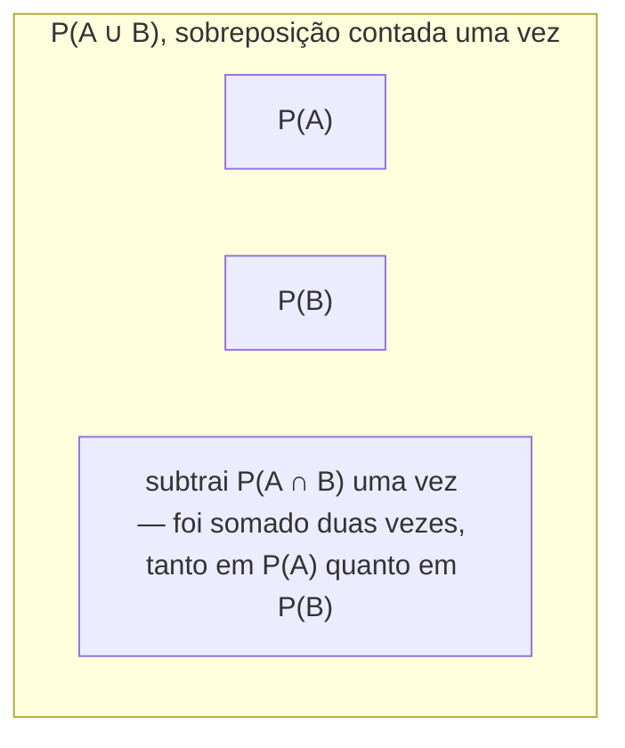

## Objetivos de Aprendizagem

- Declarar os três axiomas de Kolmogorov de probabilidade precisamente, em termos de um espaço amostral Ω e eventos como subconjuntos dele.
- Derivar a regra do complemento P(Aᶜ) = 1 − P(A) diretamente dos axiomas.
- Derivar a fórmula de inclusão-exclusão P(A ∪ B) = P(A) + P(B) − P(A ∩ B) a partir dos axiomas, e conectá-la ao Princípio da Inclusão-Exclusão geral da combinatória.
- Derivar e aplicar monotonicidade: se A ⊆ B então P(A) ≤ P(B).
- Verificar se uma atribuição proposta de números a eventos é uma medida de probabilidade válida checando-a contra os axiomas.

## Contexto e Motivação

É tentador pensar que "probabilidade" já tem um significado intuitivo e autoevidente (um número entre 0 e 1 que mede quão provável algo é) e que o único trabalho real restante é computar esse número para eventos particulares. Mas intuição sozinha não diz quais propriedades uma atribuição de probabilidade é exigida a ter, e sem essas propriedades, raciocínio encadeado ("se isso é verdade então aquilo também precisa ser") não tem chão formal onde pisar. Essa é exatamente a lacuna que Andrey Kolmogorov fechou em 1933 com uma lista curta de axiomas: três requisitos simples que qualquer função atribuindo probabilidades a eventos precisa satisfazer para ser chamada de medida de probabilidade de forma alguma. Tudo mais na teoria da probabilidade (toda regra para combinar probabilidades, toda distribuição, todo teorema nesta trilha curricular inteira) é, num sentido preciso, uma consequência lógica só desses três axiomas e nada mais.

O curso 6.041 do MIT, e virtualmente todo tratamento rigoroso de probabilidade desde então, abre com exatamente esse movimento: estabeleça os axiomas primeiro, depois prove que fatos de som familiar (probabilidades não podem exceder 1, a probabilidade de "não A" é 1 menos a probabilidade de A, probabilidades mutuamente exclusivas somam) são teoremas em vez de suposições adicionais. Isso importa praticamente, não só por arrumação matemática: uma vez que você sabe que esses fatos são prováveis a partir de três axiomas, você pode confiar neles em situações onde a intuição é não confiável ou silenciosa, eventos compostos com muitas condições sobrepostas, espaços amostrais infinitos, ou eventos de aparência bizarra que não correspondem a nenhum cenário do dia a dia. A prova continua valendo independentemente, porque só usou os axiomas.

Há também um retorno direto conectando de volta a material anterior de matemática discreta. O Princípio da Inclusão-Exclusão para contagem (|A ∪ B| = |A| + |B| − |A ∩ B|, e suas generalizações para três ou mais conjuntos) tem um gêmeo probabilístico que se parece idêntico em forma e é, de fato, derivado pela mesma lógica de correção de sobreposição, só aplicada à medida de probabilidade em vez de contagens cruas. Ver essa conexão explicitamente é uma das melhores formas de internalizar por que a fórmula probabilística de inclusão-exclusão vale, em vez de decorá-la como um fato isolado.

## Teoria Central

### Os três axiomas de Kolmogorov

Seja Ω um espaço amostral e seja P uma função atribuindo um número real P(A) a todo evento A ⊆ Ω. P é uma **medida de probabilidade** se satisfaz:

1. **Não negatividade**: P(A) ≥ 0 para todo evento A.
2. **Normalização**: P(Ω) = 1, o evento certo tem probabilidade 1.
3. **Aditividade contável**: para qualquer sequência de eventos mutuamente exclusivos dois a dois A₁, A₂, A₃, … (isto é, Aᵢ ∩ Aⱼ = ∅ sempre que i ≠ j), P(A₁ ∪ A₂ ∪ A₃ ∪ …) = P(A₁) + P(A₂) + P(A₃) + ….

Para um espaço amostral finito, o axioma 3 se reduz à afirmação mais simples de que para quaisquer dois eventos disjuntos A e B, P(A ∪ B) = P(A) + P(B), estendida por indução comum a qualquer coleção finita de eventos disjuntos dois a dois. A versão contável (sequência infinita) é o que é necessário uma vez que espaços amostrais podem ser contavelmente infinitos, como "número de lançamentos até a primeira cara".

Esses três axiomas são deliberadamente mínimos; não dizem nada sobre como computar P(A) para um evento específico num experimento específico, só o que qualquer atribuição válida precisa respeitar. A fórmula de resultados igualmente prováveis P(A) = |A|/|Ω| de espaços amostrais e eventos é uma forma de construir uma função satisfazendo os três axiomas; é fácil checar diretamente que satisfaz (não negatividade e normalização são imediatas de |A| ≥ 0 e |Ω|/|Ω| = 1, e aditividade para conjuntos disjuntos decorre porque conjuntos disjuntos não têm resultados compartilhados para contar duas vezes).

### Regra derivada: o complemento

**Afirmação:** P(Aᶜ) = 1 − P(A) para qualquer evento A.

**Prova.** A e Aᶜ são disjuntos (A ∩ Aᶜ = ∅ pela definição de complemento) e juntos cobrem todo Ω (A ∪ Aᶜ = Ω). Pelo axioma 3 (aditividade, aplicada ao caso de dois eventos), P(A ∪ Aᶜ) = P(A) + P(Aᶜ). Mas A ∪ Aᶜ = Ω, então pelo axioma 2, P(A) + P(Aᶜ) = P(Ω) = 1. Rearranjando dá P(Aᶜ) = 1 − P(A). ∎

Um corolário imediato útil: P(∅) = 0. Como ∅ = Ωᶜ, a regra do complemento dá P(∅) = 1 − P(Ω) = 1 − 1 = 0, o evento impossível tem probabilidade zero, e isso não precisou ser assumido separadamente; decorre diretamente do axioma 2 e da regra do complemento.

### Regra derivada: monotonicidade

**Afirmação:** se A ⊆ B, então P(A) ≤ P(B).

**Prova.** Como A ⊆ B, B pode ser escrito como a união disjunta B = A ∪ (B ∩ Aᶜ), tudo em B está ou em A, ou em B mas não em A, e essas duas partes não compartilham nenhum resultado. Pelo axioma 3, P(B) = P(A) + P(B ∩ Aᶜ). Pelo axioma 1, P(B ∩ Aᶜ) ≥ 0. Então P(B) = P(A) + (algo ≥ 0) ≥ P(A). ∎

Isso também dá o limite superior familiar P(A) ≤ 1 para todo evento, já que A ⊆ Ω sempre, então P(A) ≤ P(Ω) = 1 por monotonicidade, combinado com o axioma 1, toda probabilidade fica no intervalo fechado [0, 1], que é ele mesmo um *teorema*, não um quarto axioma.

### Regra derivada: inclusão-exclusão para probabilidade

**Afirmação:** para quaisquer dois eventos A e B (não necessariamente disjuntos), P(A ∪ B) = P(A) + P(B) − P(A ∩ B).

**Prova.** Escreva A ∪ B como uma união disjunta: A ∪ B = A ∪ (B ∩ Aᶜ), onde A e B ∩ Aᶜ não compartilham nenhum resultado. Pelo axioma 3, P(A ∪ B) = P(A) + P(B ∩ Aᶜ). Agora decomponha o próprio B: B = (B ∩ A) ∪ (B ∩ Aᶜ), novamente uma união disjunta, então pelo axioma 3, P(B) = P(B ∩ A) + P(B ∩ Aᶜ), que se rearranja para P(B ∩ Aᶜ) = P(B) − P(A ∩ B). Substituindo de volta: P(A ∪ B) = P(A) + P(B) − P(A ∩ B). ∎

Esta é precisamente a contraparte probabilística do **Princípio da Inclusão-Exclusão** para contar tamanhos de conjuntos: |A ∪ B| = |A| + |B| − |A ∩ B|. As duas fórmulas compartilham sua estrutura e raciocínio exatos (some as duas partes, depois subtraia a sobreposição uma vez porque foi contada duas vezes), porque no modelo de resultados igualmente prováveis P(A) = |A|/|Ω| transforma uma identidade diretamente na outra dividindo todo termo por |Ω|. A versão de três conjuntos generaliza exatamente do jeito que faz para contagem: P(A∪B∪C) = P(A)+P(B)+P(C) − P(A∩B) − P(A∩C) − P(B∩C) + P(A∩B∩C), com o mesmo padrão de correção de sobreposição de sinal alternado.

## Exemplos Resolvidos

### Exemplo 1: checando se uma atribuição proposta é uma medida de probabilidade válida

**Problema:** Ω = {a, b, c} modela um experimento de três resultados. Uma atribuição proposta dá P({a}) = 0,5, P({b}) = 0,2, P({c}) = 0,2. Isso é uma medida de probabilidade válida?

**Checa o axioma 1.** Os três valores são ≥ 0. ✓

**Checa o axioma 2.** P(Ω) deveria ser igual a 1. Por aditividade (axioma 3) aplicada aos singletons disjuntos, P(Ω) = P({a}) + P({b}) + P({c}) = 0,5 + 0,2 + 0,2 = 0,9 ≠ 1. ✗

**Conclusão.** Essa atribuição não é uma medida de probabilidade válida; as probabilidades de resultado não somam 1, violando normalização. (Uma atribuição corrigida poderia usar 0,5, 0,2, 0,3, ou qualquer outra tripla somando 1.) Essa é exatamente o tipo de checagem que precisa ser feita sempre que um modelo de probabilidade é proposto do zero, antes que qualquer raciocínio posterior sobre ele seja confiável.

### Exemplo 2: usando a regra do complemento para evitar uma contagem direta difícil

**Problema:** uma moeda justa é lançada 10 vezes. Qual é a probabilidade de obter pelo menos uma cara?

**Abordagem direta (difícil).** "Pelo menos uma cara" é a união de 10 eventos sobrepostos ("cara no lançamento 1" ou "cara no lançamento 2" ou …), e computar isso diretamente via inclusão-exclusão repetida através de 10 eventos exigiria contabilizar toda sobreposição possível, extremamente tedioso.

**Abordagem do complemento (fácil).** Seja A = "pelo menos uma cara em 10 lançamentos." Então Aᶜ = "zero caras em 10 lançamentos" = "todos os 10 lançamentos são coroa", uma única classe de resultado facilmente computada. Como cada lançamento é justo e independente (uma noção tornada precisa no próximo conceito), P(todas coroa) = (1/2)¹⁰ = 1/1024. Pela regra do complemento, P(A) = 1 − P(Aᶜ) = 1 − 1/1024 = 1023/1024 ≈ 0,999.

Este é o uso prático mais comum da regra do complemento: sempre que um evento é frasado como "pelo menos um …", seu complemento ("nenhum de forma alguma") é quase sempre muito mais fácil de computar diretamente, e os axiomas garantem que a regra do complemento é válida de invocar sem justificativa adicional toda vez.

### Exemplo 3: inclusão-exclusão com números concretos

**Problema:** entre um grupo de alunos, P(cursa Matemática) = 0,6, P(cursa Física) = 0,4, e P(cursa tanto Matemática quanto Física) = 0,25. Qual é a probabilidade de um aluno escolhido aleatoriamente cursar pelo menos uma das duas disciplinas? Qual é a probabilidade de um aluno não cursar nenhuma?

**Pelo menos uma.** Seja M = "cursa Matemática," F = "cursa Física." Pela fórmula de inclusão-exclusão derivada acima, P(M ∪ F) = P(M) + P(F) − P(M ∩ F) = 0,6 + 0,4 − 0,25 = 0,75.

**Nenhuma.** "Nenhuma" é (M ∪ F)ᶜ. Pela regra do complemento, P((M ∪ F)ᶜ) = 1 − P(M ∪ F) = 1 − 0,75 = 0,25.

Os dois passos usaram só resultados já derivados dos três axiomas (inclusão-exclusão e a regra do complemento) encadeados juntos. Note também que somar ingenuamente P(M) + P(F) = 1,0 sem subtrair a sobreposição teria erroneamente sugerido que todo aluno cursa pelo menos uma das duas disciplinas (probabilidade 1), o que é inconsistente com a sobreposição dada de 0,25; esse é o análogo probabilístico do erro de contagem dupla sinalizado para contagem de conjuntos comum.

## Equívocos Comuns e Armadilhas

- **"Aditividade vale para quaisquer dois eventos, não só disjuntos."** O axioma 3 exige explicitamente que os eventos sejam mutuamente exclusivos dois a dois. Para eventos sobrepostos, P(A ∪ B) = P(A) + P(B) é simplesmente falso em geral; conta P(A ∩ B) duas vezes, que é exatamente por que o termo de correção de inclusão-exclusão existe. O Exemplo 3 mostra a consequência numérica de pular essa checagem.
- **"Os axiomas dizem como computar probabilidades."** Não dizem; só restringem quais atribuições são *válidas*. Computar uma probabilidade real para um experimento real exige informação ou suposições de modelagem adicionais (resultados igualmente prováveis, uma distribuição dada, dados empíricos); os axiomas são uma checagem de consistência sobre o resultado, não um método de computação em si, como o Exemplo 1 ilustra.
- **"P(A) ≤ 1 e P(A) ≥ 0 são axiomas."** Não negatividade (P(A) ≥ 0) é um axioma, mas o limite superior P(A) ≤ 1 é um *teorema derivado* (via monotonicidade e normalização), não uma suposição separada; a lista de Kolmogorov tem exatamente três axiomas, não quatro.
- **"Inclusão-exclusão para probabilidade é uma ideia diferente e não relacionada à da combinatória."** São a mesma lógica de correção de sobreposição aplicada a medidas diferentes (tamanho de conjunto num caso, massa de probabilidade no outro), e no modelo de igualmente prováveis, uma fórmula literalmente divide para dar a outra, termo por termo.

## Resumo

Os três axiomas de Kolmogorov (não negatividade, normalização (P(Ω) = 1), e aditividade contável sobre eventos disjuntos) são a fundação inteira sobre a qual a teoria da probabilidade é construída. Só desses três, a regra do complemento P(Aᶜ) = 1 − P(A), monotonicidade (A ⊆ B implica P(A) ≤ P(B)), o limite 0 ≤ P(A) ≤ 1, e inclusão-exclusão para dois eventos, P(A ∪ B) = P(A) + P(B) − P(A ∩ B), todos decorrem como teoremas provados em vez de suposições adicionais. A fórmula de inclusão-exclusão probabilística espelha, termo a termo, o Princípio da Inclusão-Exclusão já estabelecido para contar tamanhos de conjunto em matemática discreta, a mesma ideia de correção de sobreposição, só medida em probabilidade em vez de contagens cruas. Qualquer atribuição proposta de números a eventos pode e deveria ser checada diretamente contra os três axiomas antes de ser confiada como uma medida de probabilidade válida.

## Documentation Links

- [MIT 6.041 — Lecture Notes (OCW)](https://ocw.mit.edu/courses/6-041-probabilistic-systems-analysis-and-applied-probability-fall-2010/pages/lecture-notes/) — doc
- [ACM/IEEE CS2013 — Full Curriculum Guidelines](https://www.acm.org/binaries/content/assets/education/cs2013_web_final.pdf) — doc
