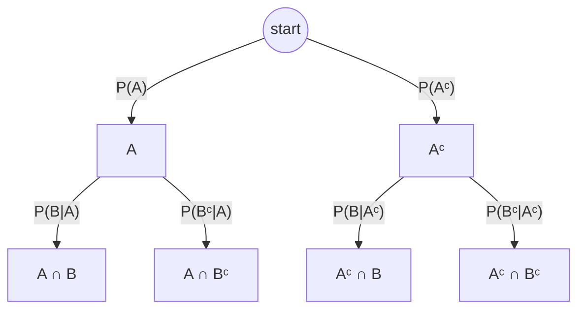

## Learning Objectives

- Derive Bayes' theorem from the definition of conditional probability.
- State and apply the Law of Total Probability to compute an unconditional probability from a partition of the sample space.
- Combine both into the "expanded" form of Bayes' theorem, and use it to reverse a conditional probability given only forward conditionals and a prior.
- Compute and interpret a diagnostic test's positive predictive value from its sensitivity, specificity, and the base-rate prevalence of the condition being tested for.
- Explain, with a concrete numeric example, why even a highly "accurate" test can produce mostly false positives when the underlying condition is rare.

## Context & Motivation

Conditional probability lets you compute P(evidence | cause) when the causal direction is the one you have data for — how likely is a positive test result, given that the disease is actually present? That's usually the number a lab can measure directly, by testing a large group of confirmed-positive and confirmed-negative patients and recording how the test behaves. But that is almost never the question anyone actually wants answered. A patient who tests positive doesn't want to know "if I had the disease, how likely is a positive test" — they already have the positive test, and they want to know "given this positive test, how likely do I actually have the disease?" That is P(cause | evidence), the reverse conditional, and reversing a conditional probability is exactly what Bayes' theorem does — nothing more, nothing less.

The theorem is named for Thomas Bayes, an 18th-century minister and mathematician, but its reach today extends far beyond its original context: spam filters use it to go from P(word "free" appears | email is spam) — easy to estimate from a labeled dataset — to P(email is spam | word "free" appears), which is the actual decision the filter needs to make. Medical diagnostics use it constantly, as the worked example below demonstrates in detail. Modern machine learning classifiers, A/B test analysis, and legal reasoning about evidence all lean on the same reversal. Stanford's CS109 treats it as the hinge point of the entire course — the moment where conditional probability stops being a bookkeeping tool and becomes a genuine engine for updating beliefs in light of new evidence, which is precisely the perspective that Bayesian statistics, much later in this track, builds an entire alternative philosophy of inference around.

What makes Bayes' theorem worth genuine, careful study — rather than treating it as "just algebra" — is that the reversed probability is very frequently wildly counterintuitive, in a specific and well-documented way: it depends heavily on how common the "cause" was to begin with, a fact people's intuition reliably ignores. The classic demonstration of this is a diagnostic test for a rare disease, worked through in full below, and it is worth internalizing deeply, because the same base-rate-neglect mistake shows up constantly in the real world — in interpreting screening tests, forensic evidence, and even everyday risk assessments.

## Core Theory

### Deriving Bayes' theorem

Start from the definition of conditional probability, applied twice, once in each direction:

P(A|B) = P(A ∩ B) / P(B), and P(B|A) = P(A ∩ B) / P(A).

Both equations share the same numerator, P(A ∩ B). Solving the second equation for it: P(A ∩ B) = P(B|A)·P(A). Substituting this into the first equation's numerator gives **Bayes' theorem**:

P(A|B) = P(B|A) · P(A) / P(B)

In words: the "posterior" P(A|B) — the updated probability of A after observing B — equals the "likelihood" P(B|A) — how probable the observed evidence is under A — times the "prior" P(A) — how probable A was believed to be before any evidence — all divided by P(B), the overall probability of observing the evidence B at all, regardless of whether A holds.

### The Law of Total Probability

The denominator P(B) is often not given directly, but it can almost always be reconstructed if A and Aᶜ (or, more generally, a whole partition of the sample space) are available. If A₁, A₂, …, Aₙ partition Ω — meaning they are pairwise disjoint and their union is all of Ω — then any event B can be decomposed as B = (B∩A₁) ∪ (B∩A₂) ∪ … ∪ (B∩Aₙ), a disjoint union. By additivity (from the axioms of probability) and the multiplication rule, this gives the **Law of Total Probability**:

P(B) = P(B|A₁)P(A₁) + P(B|A₂)P(A₂) + … + P(B|Aₙ)P(Aₙ)

In the simplest and most common case, the partition is just {A, Aᶜ}: P(B) = P(B|A)·P(A) + P(B|Aᶜ)·P(Aᶜ).

Each path's probability is the product of the branch probabilities along it (the chain rule from conditional probability). P(B) is the sum of the two paths landing in a "B" leaf: P(A∩B) + P(Aᶜ∩B) — exactly the Law of Total Probability applied to this two-branch partition.

### The expanded form of Bayes' theorem

Substituting the Law of Total Probability's expression for P(B) directly into Bayes' theorem gives the fully expanded, most practically usable form:

P(A|B) = P(B|A)·P(A) / [P(B|A)·P(A) + P(B|Aᶜ)·P(Aᶜ)]

This is the form actually used in nearly every application, because it requires only quantities that are typically available directly: the prior P(A), and the two "forward" conditionals P(B|A) and P(B|Aᶜ) — without ever needing P(B) as a separately given number. Reading the tree diagram above, this formula is nothing more than "the probability of reaching B via the A-branch, divided by the total probability of reaching B via *either* branch" — a ratio of one path's weight to the sum of all paths ending in the same leaf type.

## Worked Examples

### Example 1 — the diagnostic test (the central example of this concept)

**Problem:** A disease affects 1% of the population (prevalence). A diagnostic test has 99% sensitivity (it correctly returns positive for 99% of people who actually have the disease) and 95% specificity (it correctly returns negative for 95% of people who don't have the disease, meaning it false-positives on the remaining 5%). A randomly selected person tests positive. What is the probability they actually have the disease?

**Setup.** Let D = "has the disease," + = "tests positive." Given: P(D) = 0.01, so P(Dᶜ) = 0.99. Sensitivity: P(+|D) = 0.99. Specificity: P(−|Dᶜ) = 0.95, so the false-positive rate is P(+|Dᶜ) = 1 − 0.95 = 0.05.

**Apply the Law of Total Probability to find P(+).** P(+) = P(+|D)P(D) + P(+|Dᶜ)P(Dᶜ) = (0.99)(0.01) + (0.05)(0.99) = 0.0099 + 0.0495 = 0.0594.

**Apply Bayes' theorem.** P(D|+) = P(+|D)P(D) / P(+) = 0.0099 / 0.0594 ≈ 0.1667.

**Interpretation — the counterintuitive result.** Despite a test that sounds highly accurate — 99% sensitivity, 95% specificity — a positive result means only about a 16.7% chance of actually having the disease, not anywhere near 99%. The reason is the base rate: because the disease is rare (1% prevalence), the population of people without the disease is enormous (99%) compared to those with it, and even a "small" 5% false-positive rate applied to that huge healthy population produces far more false positives (49.5 people per 10,000, from 0.0495 × 10,000) than true positives (99 people per 10,000, from 0.0099 × 10,000) — the arithmetic gives 99 true positives against 495 false positives out of every 10,000 people tested, so among the 594 total positives, only 99 (≈16.7%) are genuine. This is not a flaw in the test's accuracy figures — sensitivity and specificity are both genuinely high — it is a direct, unavoidable consequence of applying an imperfect test to a population where the condition is rare, and it is precisely why follow-up confirmatory testing is standard medical practice after an initial positive screen: a second, independent positive test dramatically raises this posterior, since the new prior going into the second test is now 16.7% rather than 1%.

### Example 2 — the spam filter

**Problem:** 20% of all emails received are spam. The word "winner" appears in 40% of spam emails but only in 1% of legitimate emails. An email containing the word "winner" arrives. What is the probability it is spam?

**Setup.** Let S = "is spam," W = "contains 'winner.'" P(S) = 0.20, P(Sᶜ) = 0.80. P(W|S) = 0.40. P(W|Sᶜ) = 0.01.

**Law of Total Probability.** P(W) = P(W|S)P(S) + P(W|Sᶜ)P(Sᶜ) = (0.40)(0.20) + (0.01)(0.80) = 0.08 + 0.008 = 0.088.

**Bayes' theorem.** P(S|W) = P(W|S)P(S) / P(W) = 0.08 / 0.088 ≈ 0.909.

So an email containing "winner" is spam with probability ≈90.9%, a much more decisive result than Example 1's diagnostic case — because here the prior P(S) = 0.20 is far from rare, and the gap between P(W|S) = 0.40 and P(W|Sᶜ) = 0.01 is large, both factors pushing the posterior strongly toward spam. Contrasting this with Example 1 reinforces that the size of the swing in a Bayesian update depends jointly on the prior and on how sharply the evidence discriminates between the two hypotheses — neither factor alone determines the outcome.

### Example 3 — reversing with a three-way partition

**Problem:** A factory has three machines, A, B, and C, producing 50%, 30%, and 20% of its output respectively. Their defect rates are 2%, 3%, and 5% respectively. A randomly selected item is found defective. What is the probability it came from machine C?

**Setup.** P(A) = 0.5, P(B) = 0.3, P(C) = 0.2 (a full partition — these three sum to 1). Let Def = "item is defective." P(Def|A) = 0.02, P(Def|B) = 0.03, P(Def|C) = 0.05.

**Law of Total Probability, three-way partition.** P(Def) = P(Def|A)P(A) + P(Def|B)P(B) + P(Def|C)P(C) = (0.02)(0.5) + (0.03)(0.3) + (0.05)(0.2) = 0.010 + 0.009 + 0.010 = 0.029.

**Bayes' theorem for P(C|Def).** P(C|Def) = P(Def|C)P(C) / P(Def) = 0.010 / 0.029 ≈ 0.345.

So even though machine C produces only 20% of output, it accounts for about 34.5% of defective items — because its defect rate is the highest of the three. This example generalizes the two-branch tree to three branches, and shows the expanded Bayes' theorem works identically with any size partition, always as "this branch's contribution to Def, divided by the total contribution to Def across every branch."

## Common Misconceptions & Pitfalls

- **"A 99%-accurate test means a positive result is 99% likely to be correct."** This is precisely the mistake Example 1 dismantles: sensitivity and specificity describe P(test result | true condition), not P(true condition | test result) — confusing these two directions, sometimes called the "base-rate fallacy" or "confusion of the inverse," is one of the most consequential and common statistical errors in real-world reasoning, from medicine to courtroom testimony.
- **"The base rate (prior) doesn't really matter much — the test's own accuracy is what determines the result."** As Example 1 shows numerically, an identical test (99% sensitivity, 95% specificity) gives a dramatically different posterior depending on whether the underlying condition has 1% prevalence (≈16.7% posterior) or, say, 50% prevalence (in which case the same formula gives P(D|+) = 0.99×0.5 / (0.99×0.5 + 0.05×0.5) = 0.495/0.52 ≈ 0.952 — a completely different answer despite an unchanged test). The prior is not a footnote; it can dominate the result entirely.
- **"P(B) in the denominator is some separately measured, mysterious quantity."** In practice it is almost always reconstructed from the Law of Total Probability using quantities already on hand — the prior and the forward conditionals across a partition — as every worked example above does; it's rare that P(B) needs to be measured independently.
- **"Once you compute a posterior, that's the final, fixed answer."** A posterior from one piece of evidence can become the *prior* for incorporating a second, independent piece of evidence — exactly the logic behind ordering a confirmatory second test in Example 1. Bayesian updating is naturally sequential, not a one-shot calculation.

## Summary

Bayes' theorem, P(A|B) = P(B|A)P(A)/P(B), falls directly out of writing the definition of conditional probability in both directions and equating the shared numerator P(A∩B) — it is algebra, not a new assumption. The Law of Total Probability, P(B) = ΣP(B|Aᵢ)P(Aᵢ) over a partition {Aᵢ}, supplies the denominator from quantities that are typically already available, giving the expanded form used in virtually every real application. The diagnostic-test example is the clearest demonstration of why this matters: a test with 99% sensitivity and 95% specificity, applied to a disease with only 1% prevalence, yields a positive-result posterior of only about 16.7% — a stark, concrete illustration that accuracy figures alone say nothing about the posterior without accounting for the base rate. The same reversal machinery powers spam filtering, multi-source defect attribution, and, eventually, an entire competing philosophy of statistical inference built around updating beliefs from data.

## Documentation Links

- [Stanford CS109 — Course Schedule](http://web.stanford.edu/class/cs109/schedule.html) — doc
- [ACM/IEEE CS2013 — Full Curriculum Guidelines](https://www.acm.org/binaries/content/assets/education/cs2013_web_final.pdf) — doc
