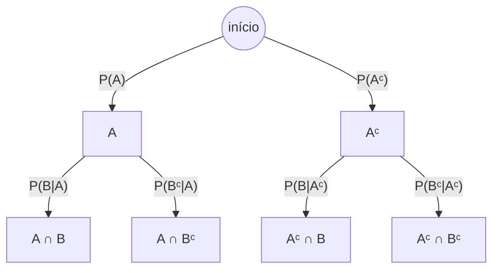

## Objetivos de Aprendizagem

- Derivar o Teorema de Bayes a partir da definição de probabilidade condicional.
- Enunciar e aplicar a Lei da Probabilidade Total para calcular uma probabilidade incondicional a partir de uma partição do espaço amostral.
- Combinar ambos na forma "expandida" do Teorema de Bayes, e usá-la para inverter uma probabilidade condicional dados apenas condicionais diretos e um prior.
- Calcular e interpretar o valor preditivo positivo de um teste diagnóstico a partir de sua sensibilidade, especificidade, e a prevalência de base da condição sendo testada.
- Explicar, com um exemplo numérico concreto, por que mesmo um teste altamente "preciso" pode produzir majoritariamente falsos positivos quando a condição subjacente é rara.

## Contexto e Motivação

A probabilidade condicional permite calcular P(evidência | causa) quando a direção causal é aquela para a qual você tem dados, quão provável é um resultado de teste positivo, dado que a doença de fato está presente? Esse é geralmente o número que um laboratório pode medir diretamente, testando um grande grupo de pacientes confirmadamente positivos e confirmadamente negativos e registrando como o teste se comporta. Mas essa quase nunca é a pergunta que alguém realmente quer respondida. Um paciente que testa positivo não quer saber "se eu tivesse a doença, quão provável é um teste positivo", ele já tem o teste positivo, e quer saber "dado esse teste positivo, quão provável é que eu de fato tenha a doença?" Isso é P(causa | evidência), o condicional reverso, e inverter uma probabilidade condicional é exatamente o que o Teorema de Bayes faz, nada mais, nada menos.

O teorema tem o nome de Thomas Bayes, um ministro e matemático do século XVIII, mas seu alcance hoje se estende muito além de seu contexto original: filtros de spam o usam para ir de P(a palavra "grátis" aparece | o e-mail é spam), fácil de estimar a partir de um conjunto de dados rotulado, para P(o e-mail é spam | a palavra "grátis" aparece), que é a decisão real que o filtro precisa tomar. Diagnósticos médicos o usam constantemente, como o exemplo resolvido abaixo demonstra em detalhes. Classificadores modernos de aprendizado de máquina, análise de teste A/B, e raciocínio jurídico sobre evidências todos se apoiam na mesma inversão. O CS109 de Stanford o trata como o ponto de articulação de todo o curso, o momento em que a probabilidade condicional deixa de ser uma ferramenta de contabilidade e se torna um motor genuíno para atualizar crenças à luz de nova evidência, que é precisamente a perspectiva em torno da qual a estatística Bayesiana, muito mais adiante nesta trilha, constrói toda uma filosofia alternativa de inferência.

O que torna o Teorema de Bayes digno de estudo genuíno e cuidadoso, em vez de ser tratado como "apenas álgebra", é que a probabilidade invertida é muito frequentemente extremamente contraintuitiva, de uma forma específica e bem documentada: ela depende fortemente de quão comum a "causa" já era de início, um fato que a intuição das pessoas confiavelmente ignora. A demonstração clássica disso é um teste diagnóstico para uma doença rara, trabalhado completamente abaixo, e vale a pena internalizar profundamente, porque o mesmo erro de negligência da taxa base aparece constantemente no mundo real, na interpretação de testes de triagem, evidência forense, e até avaliações de risco do dia a dia.

## Teoria Central

### Derivando o Teorema de Bayes

Comece pela definição de probabilidade condicional, aplicada duas vezes, uma vez em cada direção:

P(A|B) = P(A ∩ B) / P(B), e P(B|A) = P(A ∩ B) / P(A).

Ambas as equações compartilham o mesmo numerador, P(A ∩ B). Resolvendo a segunda equação para ele: P(A ∩ B) = P(B|A)·P(A). Substituindo isso no numerador da primeira equação dá o **Teorema de Bayes**:

P(A|B) = P(B|A) · P(A) / P(B)

Em palavras: o "posterior" P(A|B), a probabilidade atualizada de A depois de observar B, é igual à "verossimilhança" P(B|A), quão provável a evidência observada é sob A, vezes o "prior" P(A), quão provável se acreditava que A era antes de qualquer evidência, tudo dividido por P(B), a probabilidade geral de observar a evidência B em absoluto, independentemente de A ser válido ou não.

### A Lei da Probabilidade Total

O denominador P(B) frequentemente não é dado diretamente, mas quase sempre pode ser reconstruído se A e Aᶜ (ou, mais geralmente, uma partição inteira do espaço amostral) estiverem disponíveis. Se A₁, A₂, …, Aₙ particionam Ω, significando que são disjuntos dois a dois e sua união é todo o Ω, então qualquer evento B pode ser decomposto como B = (B∩A₁) ∪ (B∩A₂) ∪ … ∪ (B∩Aₙ), uma união disjunta. Pela aditividade (dos axiomas de probabilidade) e a regra da multiplicação, isso dá a **Lei da Probabilidade Total**:

P(B) = P(B|A₁)P(A₁) + P(B|A₂)P(A₂) + … + P(B|Aₙ)P(Aₙ)

No caso mais simples e comum, a partição é apenas {A, Aᶜ}: P(B) = P(B|A)·P(A) + P(B|Aᶜ)·P(Aᶜ).

A probabilidade de cada caminho é o produto das probabilidades de ramo ao longo dele (a regra da cadeia de probabilidade condicional). P(B) é a soma dos dois caminhos que caem em uma folha "B": P(A∩B) + P(Aᶜ∩B), exatamente a Lei da Probabilidade Total aplicada a essa partição de dois ramos.

### A forma expandida do Teorema de Bayes

Substituir a expressão da Lei da Probabilidade Total para P(B) diretamente no Teorema de Bayes dá a forma totalmente expandida, mais praticamente utilizável:

P(A|B) = P(B|A)·P(A) / [P(B|A)·P(A) + P(B|Aᶜ)·P(Aᶜ)]

Esta é a forma de fato usada em quase toda aplicação, porque exige apenas quantidades que tipicamente estão disponíveis diretamente: o prior P(A), e os dois condicionais "diretos" P(B|A) e P(B|Aᶜ), sem nunca precisar de P(B) como um número dado separadamente. Lendo o diagrama de árvore acima, essa fórmula nada mais é do que "a probabilidade de alcançar B via o ramo A, dividida pela probabilidade total de alcançar B via *qualquer* ramo", uma razão do peso de um caminho pela soma de todos os caminhos terminando no mesmo tipo de folha.

## Exemplos Resolvidos

### Exemplo 1 — o teste diagnóstico (o exemplo central deste conceito)

**Problema:** Uma doença afeta 1% da população (prevalência). Um teste diagnóstico tem 99% de sensibilidade (retorna corretamente positivo para 99% das pessoas que de fato têm a doença) e 95% de especificidade (retorna corretamente negativo para 95% das pessoas que não têm a doença, significando que dá falso positivo nos 5% restantes). Uma pessoa selecionada aleatoriamente testa positivo. Qual é a probabilidade de ela de fato ter a doença?

**Configuração.** Seja D = "tem a doença," + = "testa positivo." Dado: P(D) = 0,01, então P(Dᶜ) = 0,99. Sensibilidade: P(+|D) = 0,99. Especificidade: P(−|Dᶜ) = 0,95, então a taxa de falso positivo é P(+|Dᶜ) = 1 − 0,95 = 0,05.

**Aplique a Lei da Probabilidade Total para encontrar P(+).** P(+) = P(+|D)P(D) + P(+|Dᶜ)P(Dᶜ) = (0,99)(0,01) + (0,05)(0,99) = 0,0099 + 0,0495 = 0,0594.

**Aplique o Teorema de Bayes.** P(D|+) = P(+|D)P(D) / P(+) = 0,0099 / 0,0594 ≈ 0,1667.

**Interpretação, o resultado contraintuitivo.** Apesar de um teste que soa altamente preciso, 99% de sensibilidade, 95% de especificidade, um resultado positivo significa apenas cerca de 16,7% de chance de de fato ter a doença, nem perto de 99%. A razão é a taxa base: como a doença é rara (1% de prevalência), a população de pessoas sem a doença é enorme (99%) comparada às que a têm, e mesmo uma taxa de falso positivo "pequena" de 5% aplicada a essa população saudável enorme produz muito mais falsos positivos (49,5 pessoas por 10.000, de 0,0495 × 10.000) do que verdadeiros positivos (99 pessoas por 10.000, de 0,0099 × 10.000), a aritmética dá 99 verdadeiros positivos contra 495 falsos positivos a cada 10.000 pessoas testadas, então entre os 594 positivos totais, apenas 99 (≈16,7%) são genuínos. Isso não é uma falha nos números de precisão do teste, sensibilidade e especificidade são ambas genuinamente altas, é uma consequência direta e inevitável de aplicar um teste imperfeito a uma população onde a condição é rara, e é precisamente por que o teste confirmatório de acompanhamento é prática médica padrão depois de uma triagem positiva inicial: um segundo teste positivo independente aumenta dramaticamente esse posterior, já que o novo prior entrando no segundo teste é agora 16,7% em vez de 1%.

### Exemplo 2 — o filtro de spam

**Problema:** 20% de todos os e-mails recebidos são spam. A palavra "vencedor" aparece em 40% dos e-mails de spam mas apenas em 1% dos e-mails legítimos. Um e-mail contendo a palavra "vencedor" chega. Qual é a probabilidade de ele ser spam?

**Configuração.** Seja S = "é spam," W = "contém 'vencedor'." P(S) = 0,20, P(Sᶜ) = 0,80. P(W|S) = 0,40. P(W|Sᶜ) = 0,01.

**Lei da Probabilidade Total.** P(W) = P(W|S)P(S) + P(W|Sᶜ)P(Sᶜ) = (0,40)(0,20) + (0,01)(0,80) = 0,08 + 0,008 = 0,088.

**Teorema de Bayes.** P(S|W) = P(W|S)P(S) / P(W) = 0,08 / 0,088 ≈ 0,909.

Então um e-mail contendo "vencedor" é spam com probabilidade ≈90,9%, um resultado muito mais decisivo que o caso diagnóstico do Exemplo 1, porque aqui o prior P(S) = 0,20 está longe de raro, e a diferença entre P(W|S) = 0,40 e P(W|Sᶜ) = 0,01 é grande, ambos fatores empurrando o posterior fortemente em direção ao spam. Contrastar isso com o Exemplo 1 reforça que o tamanho da mudança em uma atualização Bayesiana depende conjuntamente do prior e de quão nitidamente a evidência discrimina entre as duas hipóteses, nenhum fator sozinho determina o resultado.

### Exemplo 3 — invertendo com uma partição de três vias

**Problema:** Uma fábrica tem três máquinas, A, B, e C, produzindo 50%, 30%, e 20% de sua produção respectivamente. Suas taxas de defeito são 2%, 3%, e 5% respectivamente. Um item selecionado aleatoriamente é encontrado defeituoso. Qual é a probabilidade de ele ter vindo da máquina C?

**Configuração.** P(A) = 0,5, P(B) = 0,3, P(C) = 0,2 (uma partição completa, essas três somam 1). Seja Def = "item é defeituoso." P(Def|A) = 0,02, P(Def|B) = 0,03, P(Def|C) = 0,05.

**Lei da Probabilidade Total, partição de três vias.** P(Def) = P(Def|A)P(A) + P(Def|B)P(B) + P(Def|C)P(C) = (0,02)(0,5) + (0,03)(0,3) + (0,05)(0,2) = 0,010 + 0,009 + 0,010 = 0,029.

**Teorema de Bayes para P(C|Def).** P(C|Def) = P(Def|C)P(C) / P(Def) = 0,010 / 0,029 ≈ 0,345.

Então mesmo que a máquina C produza apenas 20% da produção, ela é responsável por cerca de 34,5% dos itens defeituosos, porque sua taxa de defeito é a mais alta das três. Este exemplo generaliza a árvore de dois ramos para três ramos, e mostra que o Teorema de Bayes expandido funciona identicamente com qualquer tamanho de partição, sempre como "a contribuição deste ramo para Def, dividida pela contribuição total para Def em todos os ramos."

## Equívocos Comuns e Armadilhas

- **"Um teste 99% preciso significa que um resultado positivo tem 99% de chance de estar correto."** Este é precisamente o erro que o Exemplo 1 desmonta: sensibilidade e especificidade descrevem P(resultado do teste | condição verdadeira), não P(condição verdadeira | resultado do teste), confundir essas duas direções, às vezes chamado de "falácia da taxa base" ou "confusão do inverso," é um dos erros estatísticos mais consequentes e comuns no raciocínio do mundo real, da medicina ao testemunho em tribunal.
- **"A taxa base (prior) não importa muito, a precisão do próprio teste é o que determina o resultado."** Como o Exemplo 1 mostra numericamente, um teste idêntico (99% de sensibilidade, 95% de especificidade) dá um posterior dramaticamente diferente dependendo de se a condição subjacente tem 1% de prevalência (≈16,7% de posterior) ou, digamos, 50% de prevalência (nesse caso a mesma fórmula dá P(D|+) = 0,99×0,5 / (0,99×0,5 + 0,05×0,5) = 0,495/0,52 ≈ 0,952, uma resposta completamente diferente apesar de um teste inalterado). O prior não é uma nota de rodapé; pode dominar o resultado inteiramente.
- **"P(B) no denominador é alguma quantidade misteriosa medida separadamente."** Na prática ele é quase sempre reconstruído a partir da Lei da Probabilidade Total usando quantidades já em mãos, o prior e os condicionais diretos ao longo de uma partição, como todo exemplo resolvido acima faz; é raro que P(B) precise ser medido independentemente.
- **"Uma vez que você calcula um posterior, essa é a resposta final e fixa."** Um posterior de uma peça de evidência pode se tornar o *prior* para incorporar uma segunda peça de evidência independente, exatamente a lógica por trás de solicitar um segundo teste confirmatório no Exemplo 1. Atualização Bayesiana é naturalmente sequencial, não um cálculo de uma única vez.

## Resumo

O Teorema de Bayes, P(A|B) = P(B|A)P(A)/P(B), decorre diretamente de escrever a definição de probabilidade condicional em ambas as direções e igualar o numerador compartilhado P(A∩B), é álgebra, não uma nova suposição. A Lei da Probabilidade Total, P(B) = ΣP(B|Aᵢ)P(Aᵢ) sobre uma partição {Aᵢ}, fornece o denominador a partir de quantidades que tipicamente já estão disponíveis, dando a forma expandida usada em virtualmente toda aplicação real. O exemplo do teste diagnóstico é a demonstração mais clara de por que isso importa: um teste com 99% de sensibilidade e 95% de especificidade, aplicado a uma doença com apenas 1% de prevalência, produz um posterior de resultado positivo de apenas cerca de 16,7%, uma ilustração nítida e concreta de que números de precisão sozinhos não dizem nada sobre o posterior sem levar em conta a taxa base. O mesmo maquinário de inversão alimenta filtragem de spam, atribuição de defeitos multi-fonte, e, eventualmente, toda uma filosofia concorrente de inferência estatística construída em torno de atualizar crenças a partir de dados.

## Documentation Links

- [Stanford CS109 — Course Schedule](http://web.stanford.edu/class/cs109/schedule.html) — doc
- [ACM/IEEE CS2013 — Full Curriculum Guidelines](https://www.acm.org/binaries/content/assets/education/cs2013_web_final.pdf) — doc
