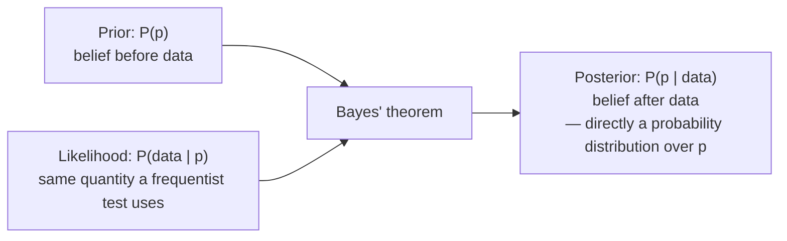

## Learning Objectives

- State the core philosophical difference between frequentist and Bayesian inference: whether the unknown parameter is treated as a fixed constant or as a random variable with its own distribution.
- Explain how a Bayesian analysis updates a prior distribution into a posterior distribution via Bayes' theorem, upon observing data.
- Work the same concrete example (estimating a coin's bias) both ways — frequentist point estimate/confidence interval and Bayesian prior/posterior — and compare the resulting statements directly.
- Explain why a Bayesian posterior probability can be interpreted directly as "the probability the parameter has this value," while a frequentist confidence interval cannot be interpreted that way.
- Identify situations where each philosophy is the more natural or practical fit, rather than treating one as universally superior.

## Context & Motivation

The two previous concepts in this cluster — confidence intervals and hypothesis testing — both rest on a specific philosophical stance, even though it was never named explicitly: the true parameter (a population mean μ, a coin's true bias p) is treated as a **fixed, unknown constant**, and all of the randomness in the analysis comes from the *data* — which particular sample happened to be drawn. This stance is called **frequentist inference**, and its central technique is asking about the long-run behavior of a procedure across hypothetical repeated sampling: "if this procedure were repeated many times, how often would the resulting interval contain the true μ?" (confidence intervals), or "if H₀ were true, how often would data this extreme occur?" (p-values). Both of the careful misconception-corrections in the previous two concepts — that a 95% confidence interval is not "95% probability μ is in this range," and that a p-value is not "the probability H₀ is true" — trace back to exactly this same root cause: frequentist tools are built to make statements about data and procedures, and are structurally incapable of assigning a probability directly to a fixed, unknown parameter.

**Bayesian inference** takes a fundamentally different stance: the unknown parameter itself is treated as a random variable, described by a probability distribution that represents a degree of belief about its value — before any data is seen, that belief is encoded as a **prior distribution**; after data is observed, Bayes' theorem (already established as a cornerstone of this discipline) updates that prior into a **posterior distribution**, which can then be directly and legitimately interpreted as "the probability the parameter takes on this value, given what has now been observed." This is exactly the kind of statement frequentist confidence intervals and p-values were shown, in the previous two concepts, to be unable to support — and the Bayesian framework can support it only because it made a different foundational choice from the outset about what kind of object the unknown parameter is. Neither philosophy is simply "more correct" than the other; they answer genuinely different questions, and this concept works through the same concrete example both ways so the difference becomes visible in the actual numbers, not just in the surrounding philosophy.

## Core Theory

### The core philosophical divide

| | Frequentist | Bayesian |
|---|---|---|
| The parameter (e.g., a coin's true bias p) | A fixed, unknown constant | A random variable with its own distribution |
| The data | Random (would differ if resampled) | Random (same as frequentist) |
| What gets a probability distribution | The data / the statistic (e.g., the sampling distribution of X̄) | The parameter itself (prior, then posterior) |
| Core question | "How would this procedure behave across repeated sampling?" | "Given this specific data, what do I now believe about the parameter?" |
| Typical output | A point estimate, a confidence interval, a p-value | A posterior distribution over the parameter |
| Legitimate statement | "95% of intervals built this way would contain the true p" | "There is a 95% posterior probability that p lies in this range" |

Both traditions use the same underlying probability theory built up across this entire discipline — the same axioms, the same conditional probability, the same distributions. What differs is not the mathematics of probability itself, but the *interpretation* assigned to it: whether probability is fundamentally about long-run frequencies across repeated trials (frequentist) or about a coherent degree of belief that can attach to any specific proposition, including a fixed but unknown parameter (Bayesian).

### Bayesian updating: prior → likelihood → posterior

Bayesian inference proceeds by direct application of Bayes' theorem, with the parameter p playing the role of the "cause" and the observed data playing the role of the "evidence":

P(p | data) = [P(data | p) · P(p)] / P(data)

Each term has a name:

- **P(p)** is the **prior** — the distribution over possible values of p, encoding whatever is believed before seeing this data (which may be "no strong opinion" — a flat, uninformative prior — or genuine prior knowledge from previous studies or domain expertise).
- **P(data | p)** is the **likelihood** — exactly the same quantity a frequentist analysis computes (how probable is this data, for a given hypothesized value of p) — the two philosophies share this piece entirely.
- **P(p | data)** is the **posterior** — the updated distribution over p, incorporating both the prior belief and the new evidence from the data.
- **P(data)** is a normalizing constant, ensuring the posterior integrates to 1 across all possible p, and does not otherwise affect the shape of the result.

The posterior becomes the new state of belief, and — crucially — it is a full probability distribution *over the parameter itself*, from which a direct probability statement like "P(0.5 ≤ p ≤ 0.6) = 0.95" can be read off honestly, because p was treated as a random variable from the start. This is not a notational trick; it follows directly from the choice, made at the outset, to model the parameter itself as random.

### Why the interpretations genuinely differ, not just in wording

A frequentist 95% confidence interval [a, b] was constructed, in the previous concept, from a procedure whose long-run success rate is 95% — but once a, b are actual numbers computed from actual data, no probability remains attachable to "is the fixed true p between a and b," because p never was a random variable in that framework; only the *procedure* had randomness, and that randomness is spent once the sample is in hand. A Bayesian **credible interval** [a, b] — the direct analogue, read off the posterior distribution — supports exactly the sentence the confidence interval could not: "there is a 95% probability that p lies between a and b," because in the Bayesian framework p genuinely was modeled as a random variable throughout, and the posterior is a legitimate probability distribution over it, at every step, including after the data arrives. This is not sloppier or more casual language finally being permitted — it is a logically sound statement, licensed specifically by the different foundational choice the Bayesian approach made about what kind of object p is.

## Worked Examples

### Example — estimating a coin's bias, worked both ways

**Shared setup.** A coin is flipped n = 20 times, landing heads 15 times (p̂ = 0.75). The goal, either way, is to say something rigorous about the coin's true probability of heads, p.

**Frequentist treatment.** p is a fixed, unknown constant. The point estimate is p̂ = 15/20 = 0.75 (unbiased and consistent, by the same reasoning as the point-estimation concept earlier in this cluster, applied to a proportion rather than a mean). A 95% confidence interval, using the Normal approximation to the sampling distribution of p̂ (standard error √(p̂(1−p̂)/n) = √(0.75 × 0.25/20) = √0.009375 ≈ 0.0968): p̂ ± 1.96 × 0.0968 ≈ 0.75 ± 0.190, giving approximately **[0.560, 0.940]**. Correct frequentist interpretation, exactly as developed in the confidence-intervals concept: if this sampling-and-interval procedure were repeated many times on many different 20-flip samples from this same coin, about 95% of the resulting intervals would contain the coin's true (fixed) p. It is not correct, in this framework, to say "there's a 95% probability the true p is between 0.560 and 0.940."

**Bayesian treatment.** p is treated as a random variable. Suppose a flat (uninformative) prior is used: P(p) is uniform over [0, 1], representing no strong opinion in advance about which values of p are more likely. Combining this prior with the observed likelihood of 15 heads out of 20 flips (a Binomial likelihood, from the distribution already covered in this discipline's probability half) via Bayes' theorem produces a posterior distribution over p that is concentrated around 0.75, with a spread reflecting the modest sample size (a Beta(16, 6) distribution, for readers familiar with that family — not required to follow the argument here). From this posterior, a **95% credible interval** can be read off directly — numerically close to the frequentist interval in this flat-prior case, something like **[0.55, 0.91]** (the two intervals are close, but not identical, because they are built from different underlying logic — the frequentist interval from the sampling distribution of p̂, the Bayesian interval from the posterior distribution of p itself). Correct Bayesian interpretation: **"there is a 95% probability that the coin's true bias p lies between 0.55 and 0.91, given the observed data and the prior used."** This is precisely the statement the frequentist framework could not license — and here it is fully legitimate, because p was modeled as a random variable with its own distribution from the very first step.

**Where the two philosophies diverge sharply: adding a strong prior.** Suppose instead there is strong prior reason to believe this specific coin is fair — say, it was pulled at random from a large batch of officially certified, machine-verified fair coins, with only a tiny fraction of the batch known to be defective. A Bayesian analysis would use a prior tightly concentrated around p = 0.5 rather than a flat prior, and the resulting posterior — even after seeing 15 heads out of 20 — would be pulled only modestly away from 0.5, reflecting a compromise between the strong prior and the (comparatively limited, n = 20) evidence. A frequentist point estimate and confidence interval, by contrast, are computed purely from this sample's data (p̂ = 0.75, interval ≈ [0.560, 0.940]) and have no mechanism at all to incorporate that outside prior information about the coin's provenance — the frequentist calculation would come out identically whether or not that certification history was known. This divergence is exactly the same tension raised at the end of the hypothesis-testing concept: two analyses of literally the same data can reach different conclusions once prior information is or isn't incorporated, and neither is making an arithmetic error — they are answering differently framed questions by design.

## Common Misconceptions & Pitfalls

- **"Bayesian and frequentist methods just use different formulas for the same underlying concept, like two notations for the same idea."** They rest on a genuinely different foundational choice about what kind of mathematical object the parameter is — fixed constant versus random variable — and this difference has real consequences for what can legitimately be said about the result, not just cosmetic differences in notation. The Worked Example's two "95%" intervals look numerically similar but support different sentences: the frequentist interval supports a statement about the *procedure's* long-run success rate, the Bayesian interval supports a direct probability statement about *p itself*.
- **"A flat prior means the Bayesian result is now just 'objective,' identical in spirit to the frequentist one."** A flat prior is a specific choice (representing indifference across all values of p, weighting them all equally) — it happens to produce numbers close to the frequentist interval in the coin example, but it is still a modeling choice being made explicitly, and a different (non-flat) prior, as the final part of the Worked Example shows, can move the posterior substantially. The frequentist calculation, by contrast, never involves choosing a prior in the first place — it simply doesn't have that input.
- **"Using prior information is inherently biased or unscientific, so frequentist methods are always the more rigorous, 'objective' choice."** Incorporating genuine, well-justified prior information (like a coin's known provenance from a certified batch) is not smuggling in bias — it is making explicit an input that a frequentist analysis of the same data simply discards by construction, which is not the same as that information being irrelevant. Whether to use a prior, and which one, is a legitimate methodological choice with real trade-offs in each direction, not a simple matter of "objective versus subjective."
- **"One of the two philosophies has been proven correct and the other discredited."** Both are mathematically rigorous, self-consistent frameworks built on the same underlying probability axioms, and both are in active, widespread use across science and engineering today — frequentist hypothesis testing dominates much of clinical-trial regulation and classical scientific publishing, while Bayesian methods are widely used in machine learning, spam filtering (building directly on Bayes' theorem, covered earlier in this discipline), and fields where incorporating prior expertise is especially valuable. The choice is about fit to the problem and available information, not a settled contest with one winner.
- **"A Bayesian credible interval and a frequentist confidence interval are interchangeable, since they're often numerically close."** They can be numerically close under a flat prior and large samples (as in the first part of the Worked Example), but they answer different questions and can diverge substantially once a genuinely informative prior is used (as the second part of the Worked Example shows) — treating them as always interchangeable erases exactly the philosophical distinction this concept exists to clarify.

## Summary

Frequentist inference — underlying the confidence intervals and hypothesis tests covered in the two previous concepts — treats an unknown parameter as a fixed constant and reasons about the long-run behavior of a procedure across hypothetical repeated sampling, which is precisely why a confidence interval cannot be read as "95% probability the parameter is in this range" and a p-value cannot be read as "the probability H₀ is true." Bayesian inference treats the parameter itself as a random variable, assigns it a prior distribution reflecting belief before the data, and updates that prior into a posterior distribution via Bayes' theorem upon observing data — a posterior that can be directly and legitimately interpreted as a probability statement about the parameter itself, exactly because the parameter was modeled as random from the outset. The coin-bias example, worked both ways, shows the two philosophies can produce numerically similar intervals under an uninformative prior, yet diverge meaningfully once genuine prior information is incorporated — illustrating that the difference is a real methodological choice with real consequences, not a matter of one approach being simply more correct than the other.

## Documentation Links

- [MIT 6.041 — Lecture Notes (OCW)](https://ocw.mit.edu/courses/6-041-probabilistic-systems-analysis-and-applied-probability-fall-2010/pages/lecture-notes/) — doc
- [MIT 6.041 — Syllabus (OCW)](https://ocw.mit.edu/courses/6-041-probabilistic-systems-analysis-and-applied-probability-fall-2010/pages/syllabus/) — doc
