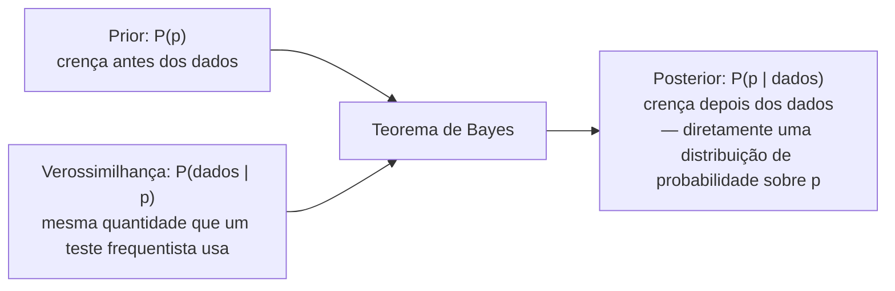

## Objetivos de Aprendizagem

- Enunciar a diferença filosófica central entre inferência frequentista e Bayesiana: se o parâmetro desconhecido é tratado como uma constante fixa ou como uma variável aleatória com sua própria distribuição.
- Explicar como uma análise Bayesiana atualiza uma distribuição prior em uma distribuição posterior via Teorema de Bayes, ao observar dados.
- Trabalhar o mesmo exemplo concreto (estimar o viés de uma moeda) das duas formas, estimativa pontual/intervalo de confiança frequentista e prior/posterior Bayesiano, e comparar as afirmações resultantes diretamente.
- Explicar por que uma probabilidade posterior Bayesiana pode ser interpretada diretamente como "a probabilidade de o parâmetro ter este valor", enquanto um intervalo de confiança frequentista não pode ser interpretado dessa forma.
- Identificar situações em que cada filosofia é o ajuste mais natural ou prático, em vez de tratar uma como universalmente superior.

## Contexto e Motivação

Os dois conceitos anteriores deste agrupamento, intervalos de confiança e teste de hipóteses, ambos se apoiam em uma postura filosófica específica, mesmo que ela nunca tenha sido nomeada explicitamente: o parâmetro verdadeiro (uma média populacional μ, o viés verdadeiro p de uma moeda) é tratado como uma **constante fixa e desconhecida**, e toda a aleatoriedade na análise vem dos *dados*, qual amostra específica aconteceu de ser coletada. Essa postura é chamada de **inferência frequentista**, e sua técnica central é perguntar sobre o comportamento de longo prazo de um procedimento ao longo de amostragem repetida hipotética: "se este procedimento fosse repetido muitas vezes, com que frequência o intervalo resultante conteria a μ verdadeira?" (intervalos de confiança), ou "se H₀ fosse verdadeira, com que frequência dados tão extremos ocorreriam?" (valores-p). Ambas as correções cuidadosas de equívocos nos dois conceitos anteriores, que um intervalo de confiança de 95% não é "95% de probabilidade de μ estar nessa faixa", e que um valor-p não é "a probabilidade de H₀ ser verdadeira", remontam exatamente à mesma causa raiz: ferramentas frequentistas são construídas para fazer afirmações sobre dados e procedimentos, e são estruturalmente incapazes de atribuir uma probabilidade diretamente a um parâmetro fixo e desconhecido.

A **inferência Bayesiana** adota uma postura fundamentalmente diferente: o próprio parâmetro desconhecido é tratado como uma variável aleatória, descrita por uma distribuição de probabilidade que representa um grau de crença sobre seu valor, antes de qualquer dado ser observado, essa crença é codificada como uma **distribuição prior**; depois de dados serem observados, o Teorema de Bayes (já estabelecido como um pilar desta disciplina) atualiza esse prior em uma **distribuição posterior**, que então pode ser direta e legitimamente interpretada como "a probabilidade de o parâmetro assumir este valor, dado o que agora foi observado". Isso é exatamente o tipo de afirmação que intervalos de confiança e valores-p frequentistas foram mostrados, nos dois conceitos anteriores, não conseguirem sustentar, e a estrutura Bayesiana consegue sustentá-la apenas porque fez uma escolha fundacional diferente desde o início sobre que tipo de objeto o parâmetro desconhecido é. Nenhuma das duas filosofias é simplesmente "mais correta" que a outra; elas respondem a perguntas genuinamente diferentes, e este conceito trabalha o mesmo exemplo concreto das duas formas para que a diferença se torne visível nos números reais, não apenas na filosofia ao redor.

## Teoria Central

### A divisão filosófica central

| | Frequentista | Bayesiana |
|---|---|---|
| O parâmetro (ex.: o viés verdadeiro p de uma moeda) | Uma constante fixa e desconhecida | Uma variável aleatória com sua própria distribuição |
| Os dados | Aleatórios (seriam diferentes se reamostrados) | Aleatórios (igual ao frequentista) |
| O que recebe uma distribuição de probabilidade | Os dados / a estatística (ex.: a distribuição amostral de X̄) | O próprio parâmetro (prior, depois posterior) |
| Pergunta central | "Como esse procedimento se comportaria ao longo de amostragem repetida?" | "Dados esses dados específicos, o que agora acredito sobre o parâmetro?" |
| Saída típica | Uma estimativa pontual, um intervalo de confiança, um valor-p | Uma distribuição posterior sobre o parâmetro |
| Afirmação legítima | "95% dos intervalos construídos desta forma conteriam o p verdadeiro" | "Há 95% de probabilidade posterior de que p esteja nesta faixa" |

Ambas as tradições usam a mesma teoria de probabilidade subjacente construída ao longo de toda esta disciplina, os mesmos axiomas, a mesma probabilidade condicional, as mesmas distribuições. O que difere não é a matemática da probabilidade em si, mas a *interpretação* atribuída a ela: se probabilidade é fundamentalmente sobre frequências de longo prazo ao longo de tentativas repetidas (frequentista) ou sobre um grau de crença coerente que pode se anexar a qualquer proposição específica, incluindo um parâmetro fixo mas desconhecido (Bayesiana).

### Atualização Bayesiana: prior → verossimilhança → posterior

A inferência Bayesiana procede por aplicação direta do Teorema de Bayes, com o parâmetro p desempenhando o papel da "causa" e os dados observados desempenhando o papel da "evidência":

P(p | dados) = [P(dados | p) · P(p)] / P(dados)

Cada termo tem um nome:

- **P(p)** é o **prior**, a distribuição sobre os valores possíveis de p, codificando o que se acredita antes de ver esses dados (que pode ser "sem opinião forte", um prior plano e não informativo, ou conhecimento prévio genuíno de estudos anteriores ou expertise de domínio).
- **P(dados | p)** é a **verossimilhança**, exatamente a mesma quantidade que uma análise frequentista calcula (quão provável são esses dados, para um valor hipotetizado dado de p), as duas filosofias compartilham essa peça inteiramente.
- **P(p | dados)** é o **posterior**, a distribuição atualizada sobre p, incorporando tanto a crença prévia quanto a nova evidência dos dados.
- **P(dados)** é uma constante normalizadora, garantindo que o posterior integre a 1 ao longo de todo p possível, e de outra forma não afeta o formato do resultado.

O posterior se torna o novo estado de crença, e, crucialmente, é uma distribuição de probabilidade completa *sobre o próprio parâmetro*, a partir da qual uma afirmação de probabilidade direta como "P(0,5 ≤ p ≤ 0,6) = 0,95" pode ser lida honestamente, porque p foi tratado como uma variável aleatória desde o início. Isso não é um truque de notação; segue diretamente da escolha, feita desde o início, de modelar o próprio parâmetro como aleatório.

### Por que as interpretações genuinamente diferem, não apenas na formulação

Um intervalo de confiança frequentista de 95% [a, b] foi construído, no conceito anterior, a partir de um procedimento cuja taxa de sucesso de longo prazo é 95%, mas uma vez que a, b são números reais calculados a partir de dados reais, nenhuma probabilidade permanece anexável a "o p verdadeiro fixo está entre a e b", porque p nunca foi uma variável aleatória naquela estrutura; apenas o *procedimento* tinha aleatoriedade, e essa aleatoriedade se esgota uma vez que a amostra está em mãos. Um **intervalo de credibilidade** Bayesiano [a, b], o análogo direto, lido a partir da distribuição posterior, sustenta exatamente a frase que o intervalo de confiança não pôde: "há 95% de probabilidade de que p esteja entre a e b", porque na estrutura Bayesiana p genuinamente foi modelado como uma variável aleatória durante todo o processo, e o posterior é uma distribuição de probabilidade legítima sobre ele, em cada etapa, incluindo depois de os dados chegarem. Isso não é uma linguagem mais frouxa ou casual finalmente sendo permitida, é uma afirmação logicamente sólida, licenciada especificamente pela escolha fundacional diferente que a abordagem Bayesiana fez sobre que tipo de objeto p é.

## Exemplos Resolvidos

### Exemplo — estimando o viés de uma moeda, resolvido das duas formas

**Configuração compartilhada.** Uma moeda é lançada n = 20 vezes, caindo em cara 15 vezes (p̂ = 0,75). O objetivo, de qualquer forma, é dizer algo rigoroso sobre a probabilidade verdadeira de cara da moeda, p.

**Tratamento frequentista.** p é uma constante fixa e desconhecida. A estimativa pontual é p̂ = 15/20 = 0,75 (não viesada e consistente, pelo mesmo raciocínio do conceito de estimação pontual anteriormente neste agrupamento, aplicado a uma proporção em vez de uma média). Um intervalo de confiança de 95%, usando a aproximação Normal para a distribuição amostral de p̂ (erro padrão √(p̂(1−p̂)/n) = √(0,75 × 0,25/20) = √0,009375 ≈ 0,0968): p̂ ± 1,96 × 0,0968 ≈ 0,75 ± 0,190, dando aproximadamente **[0,560, 0,940]**. Interpretação frequentista correta, exatamente como desenvolvida no conceito de intervalos de confiança: se este procedimento de amostragem e intervalo fosse repetido muitas vezes em muitas amostras diferentes de 20 lançamentos desta mesma moeda, cerca de 95% dos intervalos resultantes conteriam o p (fixo) verdadeiro da moeda. Não é correto, nesta estrutura, dizer "há 95% de probabilidade de o p verdadeiro estar entre 0,560 e 0,940".

**Tratamento Bayesiano.** p é tratado como uma variável aleatória. Suponha que um prior plano (não informativo) seja usado: P(p) é uniforme sobre [0, 1], representando nenhuma opinião forte de antemão sobre quais valores de p são mais prováveis. Combinar esse prior com a verossimilhança observada de 15 caras em 20 lançamentos (uma verossimilhança Binomial, da distribuição já coberta na metade de probabilidade desta disciplina) via Teorema de Bayes produz uma distribuição posterior sobre p que está concentrada em torno de 0,75, com uma dispersão refletindo o tamanho de amostra modesto (uma distribuição Beta(16, 6), para leitores familiarizados com essa família, não necessária para seguir o argumento aqui). A partir desse posterior, um **intervalo de credibilidade de 95%** pode ser lido diretamente, numericamente próximo do intervalo frequentista neste caso de prior plano, algo como **[0,55, 0,91]** (os dois intervalos são próximos, mas não idênticos, porque são construídos a partir de lógica subjacente diferente, o intervalo frequentista da distribuição amostral de p̂, o intervalo Bayesiano da própria distribuição posterior de p). Interpretação Bayesiana correta: **"há 95% de probabilidade de que o viés verdadeiro p da moeda esteja entre 0,55 e 0,91, dados os dados observados e o prior usado."** Esta é precisamente a afirmação que a estrutura frequentista não pôde licenciar, e aqui ela é totalmente legítima, porque p foi modelado como uma variável aleatória com sua própria distribuição desde o primeiríssimo passo.

**Onde as duas filosofias divergem fortemente: adicionando um prior forte.** Suponha em vez disso que há uma razão prévia forte para acreditar que essa moeda específica é justa, digamos, ela foi retirada aleatoriamente de um grande lote de moedas oficialmente certificadas e verificadas por máquina, com apenas uma fração minúscula do lote conhecida por ser defeituosa. Uma análise Bayesiana usaria um prior fortemente concentrado em torno de p = 0,5 em vez de um prior plano, e o posterior resultante, mesmo depois de ver 15 caras em 20, seria puxado apenas modestamente para longe de 0,5, refletindo um compromisso entre o prior forte e a evidência (comparativamente limitada, n = 20). Uma estimativa pontual e intervalo de confiança frequentistas, em contraste, são calculados puramente a partir dos dados desta amostra (p̂ = 0,75, intervalo ≈ [0,560, 0,940]) e não têm nenhum mecanismo para incorporar aquela informação prévia externa sobre a proveniência da moeda, o cálculo frequentista sairia identicamente independente de se aquele histórico de certificação fosse conhecido ou não. Essa divergência é exatamente a mesma tensão levantada no final do conceito de teste de hipóteses: duas análises de literalmente os mesmos dados podem chegar a conclusões diferentes uma vez que informação prévia é ou não incorporada, e nenhuma está cometendo um erro aritmético, elas estão respondendo a perguntas formuladas de forma diferente por design.

## Equívocos Comuns e Armadilhas

- **"Métodos Bayesianos e frequentistas apenas usam fórmulas diferentes para o mesmo conceito subjacente, como duas notações para a mesma ideia."** Eles se apoiam em uma escolha fundacional genuinamente diferente sobre que tipo de objeto matemático o parâmetro é, constante fixa versus variável aleatória, e essa diferença tem consequências reais para o que pode ser legitimamente dito sobre o resultado, não apenas diferenças cosméticas de notação. Os dois intervalos "95%" do Exemplo Resolvido parecem numericamente similares mas sustentam frases diferentes: o intervalo frequentista sustenta uma afirmação sobre a taxa de sucesso de longo prazo do *procedimento*, o intervalo Bayesiano sustenta uma afirmação de probabilidade direta sobre o *próprio p*.
- **"Um prior plano significa que o resultado Bayesiano agora é apenas 'objetivo', idêntico em espírito ao frequentista."** Um prior plano é uma escolha específica (representando indiferença entre todos os valores de p, pesando-os todos igualmente), ele acontece de produzir números próximos do intervalo frequentista no exemplo da moeda, mas ainda é uma escolha de modelagem sendo feita explicitamente, e um prior diferente (não plano), como a parte final do Exemplo Resolvido mostra, pode mover o posterior substancialmente. O cálculo frequentista, em contraste, nunca envolve escolher um prior em primeiro lugar, ele simplesmente não tem essa entrada.
- **"Usar informação prévia é inerentemente enviesado ou não científico, então métodos frequentistas são sempre a escolha mais rigorosa e 'objetiva'."** Incorporar informação prévia genuína e bem justificada (como a proveniência conhecida de uma moeda de um lote certificado) não é contrabandear viés, é tornar explícita uma entrada que uma análise frequentista dos mesmos dados simplesmente descarta por construção, o que não é o mesmo que essa informação ser irrelevante. Se usar um prior, e qual, é uma escolha metodológica legítima com trade-offs reais em cada direção, não uma simples questão de "objetivo versus subjetivo".
- **"Uma das duas filosofias foi provada correta e a outra desacreditada."** Ambas são estruturas matematicamente rigorosas e autoconsistentes construídas sobre os mesmos axiomas de probabilidade subjacentes, e ambas estão em uso ativo e difundido na ciência e engenharia hoje, o teste de hipóteses frequentista domina grande parte da regulação de ensaios clínicos e da publicação científica clássica, enquanto métodos Bayesianos são amplamente usados em aprendizado de máquina, filtragem de spam (construindo diretamente sobre o Teorema de Bayes, coberto anteriormente nesta disciplina), e campos onde incorporar expertise prévia é especialmente valioso. A escolha é sobre ajuste ao problema e informação disponível, não uma disputa resolvida com um vencedor.
- **"Um intervalo de credibilidade Bayesiano e um intervalo de confiança frequentista são intercambiáveis, já que frequentemente são numericamente próximos."** Podem ser numericamente próximos sob um prior plano e amostras grandes (como na primeira parte do Exemplo Resolvido), mas respondem a perguntas diferentes e podem divergir substancialmente uma vez que um prior genuinamente informativo é usado (como a segunda parte do Exemplo Resolvido mostra), tratá-los como sempre intercambiáveis apaga exatamente a distinção filosófica que este conceito existe para esclarecer.

## Resumo

A inferência frequentista, subjacente aos intervalos de confiança e testes de hipóteses cobertos nos dois conceitos anteriores, trata um parâmetro desconhecido como uma constante fixa e raciocina sobre o comportamento de longo prazo de um procedimento ao longo de amostragem repetida hipotética, o que é precisamente por que um intervalo de confiança não pode ser lido como "95% de probabilidade de o parâmetro estar nesta faixa" e um valor-p não pode ser lido como "a probabilidade de H₀ ser verdadeira". A inferência Bayesiana trata o próprio parâmetro como uma variável aleatória, atribui-lhe uma distribuição prior refletindo a crença antes dos dados, e atualiza esse prior em uma distribuição posterior via Teorema de Bayes ao observar dados, um posterior que pode ser direta e legitimamente interpretado como uma afirmação de probabilidade sobre o próprio parâmetro, exatamente porque o parâmetro foi modelado como aleatório desde o início. O exemplo do viés da moeda, resolvido das duas formas, mostra que as duas filosofias podem produzir intervalos numericamente similares sob um prior não informativo, mas divergem significativamente uma vez que informação prévia genuína é incorporada, ilustrando que a diferença é uma escolha metodológica real com consequências reais, não uma questão de uma abordagem ser simplesmente mais correta que a outra.

## Documentation Links

- [MIT 6.041 — Lecture Notes (OCW)](https://ocw.mit.edu/courses/6-041-probabilistic-systems-analysis-and-applied-probability-fall-2010/pages/lecture-notes/) — doc
- [MIT 6.041 — Syllabus (OCW)](https://ocw.mit.edu/courses/6-041-probabilistic-systems-analysis-and-applied-probability-fall-2010/pages/syllabus/) — doc
