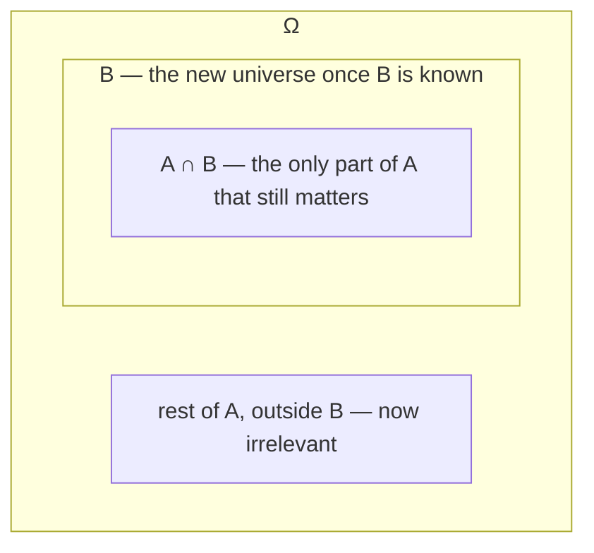

## Learning Objectives

- Define conditional probability P(A|B) = P(A∩B)/P(B) and explain why B becomes the new "universe" once it is known to have occurred.
- Apply the multiplication rule P(A∩B) = P(B)·P(A|B) to compute joint probabilities from sequential, conditional information.
- Define independence, P(A∩B) = P(A)·P(B), as the special case where conditioning on B leaves P(A) unchanged.
- Distinguish independence from mutual exclusivity, and show concretely why the two are nearly opposite conditions for events with nonzero probability.
- Use a probability tree to organize and compute conditional probabilities across a sequence of dependent events.

## Context & Motivation

Unconditional probability answers a static question: before anything is observed, how likely is this event? Almost nothing interesting in the real world stops there, though — new information arrives constantly, and each piece of it should, in principle, update what you believe about the probability of everything else. A patient tests positive for a disease; a spam filter sees the word "free" in a subject line; a poker player watches three cards get dealt face-up. In every one of these cases, the question that actually matters is no longer "how likely is X?" but "how likely is X, *given what I now know*?" — and that is exactly the question conditional probability is built to answer.

Conditional probability also turns out to be the single most load-bearing tool that everything downstream in this curriculum depends on. Bayes' theorem, covered next, is nothing more than conditional probability applied in both directions and rearranged algebraically. The notion of independent random variables, used everywhere from the Binomial distribution to the Law of Large Numbers, is defined directly in terms of the independence condition introduced here. Even hypothesis testing, much later in this track, is fundamentally a question of conditional probability: how likely is this observed data, given that the null hypothesis is true?

Independence, the special case where conditioning changes nothing, deserves particular care because it is the condition under which probability calculations become dramatically simpler — probabilities multiply straight through without any adjustment — and because it is also the single most commonly misapplied assumption in applied probability and statistics. Assuming independence when it doesn't actually hold (two stock prices, two symptoms of the same illness, two sensor readings from the same faulty device) is one of the most common real-world modeling errors, which is exactly why Stanford's CS109 and MIT's 6.041 both dwell on the precise definition rather than treating it as an intuitive shortcut.

## Core Theory

### Definition of conditional probability

For events A and B with P(B) > 0, the **conditional probability of A given B** is

P(A|B) = P(A ∩ B) / P(B)

The intuition: once B is known to have occurred, the sample space effectively shrinks from Ω down to B — B becomes the new universe of possible outcomes, since any outcome outside B is now known not to have happened. Within that shrunken universe, the "favorable" outcomes for A are exactly those in A that are also in B, i.e., A ∩ B. Dividing by P(B) renormalizes so that P(B|B) = P(B∩B)/P(B) = P(B)/P(B) = 1, confirming B is certain within its own conditional universe, as it must be.

Note P(A|B) requires P(B) > 0 — conditioning on an event of probability zero (or an impossible event) is undefined by this formula, since it would require dividing by zero.

### The multiplication rule

Rearranging the definition directly gives the **multiplication rule**:

P(A ∩ B) = P(B) · P(A|B) = P(A) · P(B|A)

This is often the more practically useful direction: many real scenarios naturally supply conditional information first (e.g., "70% of days it rains, and on rainy days there's a 90% chance of traffic") and ask for a joint probability (the probability of rain *and* traffic). The multiplication rule chains these together directly: P(rain ∩ traffic) = P(rain) · P(traffic | rain) = 0.7 × 0.9 = 0.63.

This generalizes to any number of events by repeated conditioning — the **chain rule**: P(A₁ ∩ A₂ ∩ … ∩ Aₙ) = P(A₁) · P(A₂|A₁) · P(A₃|A₁∩A₂) · … · P(Aₙ|A₁∩…∩Aₙ₋₁), each factor conditioning on everything assumed to have already occurred. This is precisely what a probability tree computes path by path: multiply the conditional probabilities along each branch to get that branch's joint probability.

### Independence

Events A and B are **independent** if knowing that B occurred does not change the probability of A — formally, P(A|B) = P(A) (whenever P(B) > 0). Substituting this into the multiplication rule, P(A ∩ B) = P(B)·P(A|B) = P(B)·P(A), giving the standard symmetric definition used even when one of the probabilities might be zero:

A and B are independent ⟺ P(A ∩ B) = P(A) · P(B)

This definition is symmetric in A and B (unlike the P(A|B) = P(A) form, which implicitly requires P(B) > 0), and it extends the natural intuition: for independent events, the joint probability is just the product — no conditioning adjustment needed at all, because there's nothing to adjust for. Independence should always be checked against this equation directly, not assumed from context, since real-world events are frequently correlated in ways that aren't obvious from a verbal description alone.

### Independence vs. mutual exclusivity

These are frequently confused but are, for events of positive probability, nearly opposite conditions. Mutual exclusivity (A ∩ B = ∅) means the events *cannot both happen* — knowing one occurred tells you the other *definitely did not* occur. Independence means knowing one occurred tells you *nothing at all* about the other. If A and B are mutually exclusive and both have positive probability, then P(A ∩ B) = P(∅) = 0, while P(A)·P(B) > 0 (a product of two positive numbers) — these can only be equal if one of P(A), P(B) is already zero. So two mutually exclusive events with nonzero probability are never independent; the occurrence of one is maximally informative about the other (it rules it out completely), which is the opposite of independence's "no information at all."

## Worked Examples

### Example 1 — conditional probability from a two-way table

**Problem:** In a survey of 200 employees, 120 work remotely and 80 work in-office. Of the remote workers, 90 report high job satisfaction; of the in-office workers, 40 report high job satisfaction. If a random employee reports high satisfaction, what is the probability they work remotely?

**Setup.** Let R = "works remotely," S = "reports high satisfaction." From the counts: P(R) = 120/200 = 0.6, P(Rᶜ) = 80/200 = 0.4. P(S|R) = 90/120 = 0.75 (satisfaction rate among remote workers). P(S|Rᶜ) = 40/80 = 0.5 (satisfaction rate among in-office workers).

**Total satisfied.** By the multiplication rule, P(R ∩ S) = P(R)·P(S|R) = 0.6 × 0.75 = 0.45, and P(Rᶜ ∩ S) = P(Rᶜ)·P(S|Rᶜ) = 0.4 × 0.5 = 0.20. Since R and Rᶜ partition Ω, P(S) = P(R∩S) + P(Rᶜ∩S) = 0.45 + 0.20 = 0.65.

**Answer.** P(R|S) = P(R ∩ S) / P(S) = 0.45 / 0.65 = 9/13 ≈ 0.692. So among satisfied employees, about 69.2% work remotely — notably higher than the overall 60% remote rate, reflecting that remote work correlates with higher satisfaction in this sample. (This computation — reversing a conditional — is exactly the shape Bayes' theorem formalizes next.)

### Example 2 — a probability tree for sequential draws without replacement

**Problem:** An urn contains 5 red balls and 3 blue balls. Two balls are drawn in sequence, without replacement. What is the probability both are red? What is the probability the second ball is red?

**First draw.** P(1st red) = 5/8.

**Second draw, conditioned on the first.** If the first ball drawn was red, 4 red and 3 blue remain out of 7, so P(2nd red | 1st red) = 4/7.

**Both red.** By the multiplication rule, P(both red) = P(1st red) · P(2nd red | 1st red) = (5/8)(4/7) = 20/56 = 5/14 ≈ 0.357.

**P(2nd red), unconditionally.** This requires summing over both possibilities for the first draw. If 1st is blue (probability 3/8), then 5 red remain out of 7, so P(2nd red | 1st blue) = 5/7. Then P(2nd red) = P(1st red)P(2nd red|1st red) + P(1st blue)P(2nd red|1st blue) = (5/8)(4/7) + (3/8)(5/7) = 20/56 + 15/56 = 35/56 = 5/8. Interestingly, P(2nd red) = 5/8, identical to P(1st red) — by symmetry, with no replacement and no other distinguishing information, every position in the draw sequence is equally likely to be red, a fact that becomes intuitive once verified this way but is easy to doubt beforehand.

### Example 3 — the pitfall example: independent vs. mutually exclusive, worked concretely

**Problem:** A fair die is rolled once. Let A = "the roll is even" = {2,4,6}, and B = "the roll is at most 2" = {1,2}. Are A and B independent? Are they mutually exclusive?

**Mutually exclusive?** A ∩ B = {2,4,6} ∩ {1,2} = {2}, which is not empty — so A and B are *not* mutually exclusive; they can both happen (rolling a 2).

**Independent?** P(A) = 3/6 = 1/2. P(B) = 2/6 = 1/3. P(A ∩ B) = P({2}) = 1/6. Check: P(A)·P(B) = (1/2)(1/3) = 1/6. Since P(A∩B) = P(A)P(B), A and B are independent — knowing the roll is at most 2 doesn't change the (conditional) probability that it's even: P(A|B) = P(A∩B)/P(B) = (1/6)/(1/3) = 1/2 = P(A), confirmed directly.

**Now the contrast.** Let C = "the roll is odd" = {1,3,5}. A and C are mutually exclusive (A ∩ C = ∅, since no roll is both even and odd) and have positive probability each (1/2 and 1/2). Check independence: P(A)·P(C) = (1/2)(1/2) = 1/4, but P(A ∩ C) = P(∅) = 0 ≠ 1/4. So A and C are *not* independent — in fact they are maximally dependent in the sense described in Core Theory: knowing C occurred tells you with certainty that A did not. This single die-roll setup produces both a genuine independent pair (A, B) and a genuine mutually-exclusive-but-dependent pair (A, C) side by side, making the distinction concrete rather than abstract.

## Common Misconceptions & Pitfalls

- **"If two events are mutually exclusive, they must be independent (or vice versa) — after all, both sound like 'unrelated.'"** As proven in Core Theory and demonstrated numerically in Example 3, mutually exclusive events with positive probability are never independent — learning one occurred tells you the other definitely didn't, which is about as much information as one event can convey about another. Reserve "unrelated" exclusively for independence; mutual exclusivity is a strong dependency, not an absence of one.
- **"P(A|B) and P(B|A) are the same thing, or at least close."** They generally differ, sometimes drastically — Example 1's P(R|S) = 9/13 versus the given P(S|R) = 0.75 are different numbers answering different questions ("given satisfied, remote?" versus "given remote, satisfied?"). Confusing the two directions of a conditional is often called the "prosecutor's fallacy," and untangling it correctly is exactly Bayes' theorem's job.
- **"Independence can be read off from the problem's description ('these seem like separate, unconnected events') without checking the equation."** Always verify P(A∩B) = P(A)P(B) numerically when it matters, as in Example 3, rather than relying on intuition — real datasets frequently have subtle dependencies (shared causes, sampling without replacement, common environmental factors) that make superficially "separate" events dependent.
- **"Once you condition on B, P(B) itself becomes irrelevant to any further calculation."** P(B) remains essential as the normalizing denominator throughout — it's precisely what rescales A∩B's probability back up to a proper probability once B is treated as the new certain event; omitting it (or using the wrong denominator) is one of the most common arithmetic slips in conditional probability problems, visible in both worked examples above.

## Summary

Conditional probability, P(A|B) = P(A∩B)/P(B), formalizes how the probability of A should update once B is known to have occurred, treating B as the new sample space. The multiplication rule, P(A∩B) = P(B)P(A|B), reverses this to build joint probabilities from conditional information, and chains naturally into a probability tree for sequences of dependent events. Independence, P(A∩B) = P(A)P(B) (equivalently P(A|B) = P(A)), is the special case where conditioning changes nothing — and it stands in near-opposition to mutual exclusivity, since two mutually exclusive events with positive probability are always maximally dependent, never independent. Every one of these ideas — conditioning, the multiplication rule, independence — becomes the direct machinery Bayes' theorem builds on next.

## Documentation Links

- [Stanford CS109 — Course Schedule](http://web.stanford.edu/class/cs109/schedule.html) — doc
- [MIT 6.041 — Lecture Notes (OCW)](https://ocw.mit.edu/courses/6-041-probabilistic-systems-analysis-and-applied-probability-fall-2010/pages/lecture-notes/) — doc
