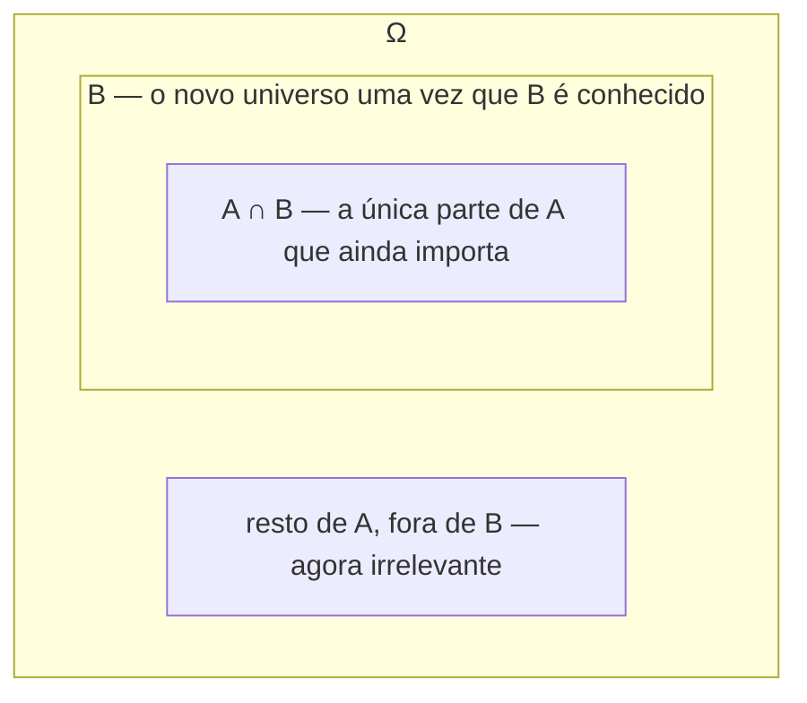

## Objetivos de Aprendizagem

- Definir probabilidade condicional P(A|B) = P(A∩B)/P(B) e explicar por que B se torna o novo "universo" uma vez que se sabe que ocorreu.
- Aplicar a regra da multiplicação P(A∩B) = P(B)·P(A|B) para calcular probabilidades conjuntas a partir de informação condicional sequencial.
- Definir independência, P(A∩B) = P(A)·P(B), como o caso especial em que condicionar em B deixa P(A) inalterado.
- Distinguir independência de exclusividade mútua, e mostrar concretamente por que as duas são condições quase opostas para eventos com probabilidade não nula.
- Usar uma árvore de probabilidade para organizar e calcular probabilidades condicionais ao longo de uma sequência de eventos dependentes.

## Contexto e Motivação

A probabilidade incondicional responde a uma pergunta estática: antes de qualquer coisa ser observada, quão provável é este evento? Quase nada de interessante no mundo real para por aí, no entanto, nova informação chega constantemente, e cada pedaço dela deveria, em princípio, atualizar o que você acredita sobre a probabilidade de tudo mais. Um paciente testa positivo para uma doença; um filtro de spam vê a palavra "grátis" em uma linha de assunto; um jogador de pôquer observa três cartas serem reveladas viradas para cima. Em cada um desses casos, a pergunta que realmente importa não é mais "quão provável é X?" mas "quão provável é X, *dado o que agora sei*?", e essa é exatamente a pergunta que a probabilidade condicional é construída para responder.

A probabilidade condicional também acaba sendo a ferramenta mais estruturalmente essencial da qual tudo que vem depois neste currículo depende. O Teorema de Bayes, coberto a seguir, nada mais é do que probabilidade condicional aplicada em ambas as direções e rearranjada algebricamente. A noção de variáveis aleatórias independentes, usada em toda parte, da distribuição Binomial à Lei dos Grandes Números, é definida diretamente em termos da condição de independência introduzida aqui. Até mesmo o teste de hipóteses, muito mais adiante nesta trilha, é fundamentalmente uma pergunta de probabilidade condicional: quão provável são esses dados observados, dado que a hipótese nula é verdadeira?

Independência, o caso especial em que condicionar não muda nada, merece cuidado particular porque é a condição sob a qual cálculos de probabilidade se tornam dramaticamente mais simples, probabilidades se multiplicam diretamente sem nenhum ajuste, e porque também é a suposição mais comumente mal aplicada em probabilidade e estatística aplicadas. Assumir independência quando ela de fato não vale (dois preços de ações, dois sintomas da mesma doença, duas leituras de sensor do mesmo dispositivo com defeito) é um dos erros de modelagem do mundo real mais comuns, o que é exatamente por que o CS109 de Stanford e o 6.041 do MIT ambos se demoram na definição precisa em vez de tratá-la como um atalho intuitivo.

## Teoria Central

### Definição de probabilidade condicional

Para eventos A e B com P(B) > 0, a **probabilidade condicional de A dado B** é

P(A|B) = P(A ∩ B) / P(B)

A intuição: uma vez que se sabe que B ocorreu, o espaço amostral efetivamente encolhe de Ω para B, B se torna o novo universo de resultados possíveis, já que qualquer resultado fora de B agora se sabe que não aconteceu. Dentro desse universo encolhido, os resultados "favoráveis" para A são exatamente aqueles em A que também estão em B, ou seja, A ∩ B. Dividir por P(B) renormaliza de modo que P(B|B) = P(B∩B)/P(B) = P(B)/P(B) = 1, confirmando que B é certo dentro de seu próprio universo condicional, como deve ser.

Note que P(A|B) exige P(B) > 0, condicionar em um evento de probabilidade zero (ou um evento impossível) é indefinido por essa fórmula, já que exigiria dividir por zero.

### A regra da multiplicação

Rearranjar a definição diretamente dá a **regra da multiplicação**:

P(A ∩ B) = P(B) · P(A|B) = P(A) · P(B|A)

Esta é frequentemente a direção mais praticamente útil: muitos cenários reais naturalmente fornecem informação condicional primeiro (por exemplo, "em 70% dos dias chove, e em dias chuvosos há 90% de chance de trânsito") e pedem uma probabilidade conjunta (a probabilidade de chuva *e* trânsito). A regra da multiplicação encadeia isso diretamente: P(chuva ∩ trânsito) = P(chuva) · P(trânsito | chuva) = 0,7 × 0,9 = 0,63.

Isso generaliza para qualquer número de eventos por condicionamento repetido, a **regra da cadeia**: P(A₁ ∩ A₂ ∩ … ∩ Aₙ) = P(A₁) · P(A₂|A₁) · P(A₃|A₁∩A₂) · … · P(Aₙ|A₁∩…∩Aₙ₋₁), cada fator condicionando em tudo que se assume já ter ocorrido. Isso é precisamente o que uma árvore de probabilidade calcula caminho por caminho: multiplique as probabilidades condicionais ao longo de cada ramo para obter a probabilidade conjunta daquele ramo.

### Independência

Eventos A e B são **independentes** se saber que B ocorreu não muda a probabilidade de A, formalmente, P(A|B) = P(A) (sempre que P(B) > 0). Substituindo isso na regra da multiplicação, P(A ∩ B) = P(B)·P(A|B) = P(B)·P(A), dando a definição simétrica padrão usada mesmo quando uma das probabilidades pode ser zero:

A e B são independentes ⟺ P(A ∩ B) = P(A) · P(B)

Essa definição é simétrica em A e B (ao contrário da forma P(A|B) = P(A), que implicitamente exige P(B) > 0), e estende a intuição natural: para eventos independentes, a probabilidade conjunta é apenas o produto, nenhum ajuste de condicionamento é necessário, porque não há nada para ajustar. Independência deve sempre ser verificada diretamente contra essa equação, não assumida a partir do contexto, já que eventos do mundo real são frequentemente correlacionados de formas que não são óbvias apenas a partir de uma descrição verbal.

### Independência vs. exclusividade mútua

Estas são frequentemente confundidas mas são, para eventos de probabilidade positiva, condições quase opostas. Exclusividade mútua (A ∩ B = ∅) significa que os eventos *não podem ambos acontecer*, saber que um ocorreu diz que o outro *definitivamente não* ocorreu. Independência significa que saber que um ocorreu não diz *absolutamente nada* sobre o outro. Se A e B são mutuamente exclusivos e ambos têm probabilidade positiva, então P(A ∩ B) = P(∅) = 0, enquanto P(A)·P(B) > 0 (um produto de dois números positivos), esses só podem ser iguais se um de P(A), P(B) já for zero. Então dois eventos mutuamente exclusivos com probabilidade não nula nunca são independentes; a ocorrência de um é maximamente informativa sobre o outro (a descarta completamente), o que é o oposto do "nenhuma informação" da independência.

## Exemplos Resolvidos

### Exemplo 1 — probabilidade condicional a partir de uma tabela de dupla entrada

**Problema:** Em uma pesquisa com 200 funcionários, 120 trabalham remotamente e 80 trabalham no escritório. Dos trabalhadores remotos, 90 relatam alta satisfação no trabalho; dos trabalhadores de escritório, 40 relatam alta satisfação no trabalho. Se um funcionário aleatório relata alta satisfação, qual é a probabilidade de que trabalhe remotamente?

**Configuração.** Seja R = "trabalha remotamente," S = "relata alta satisfação." A partir das contagens: P(R) = 120/200 = 0,6, P(Rᶜ) = 80/200 = 0,4. P(S|R) = 90/120 = 0,75 (taxa de satisfação entre trabalhadores remotos). P(S|Rᶜ) = 40/80 = 0,5 (taxa de satisfação entre trabalhadores de escritório).

**Total satisfeito.** Pela regra da multiplicação, P(R ∩ S) = P(R)·P(S|R) = 0,6 × 0,75 = 0,45, e P(Rᶜ ∩ S) = P(Rᶜ)·P(S|Rᶜ) = 0,4 × 0,5 = 0,20. Como R e Rᶜ particionam Ω, P(S) = P(R∩S) + P(Rᶜ∩S) = 0,45 + 0,20 = 0,65.

**Resposta.** P(R|S) = P(R ∩ S) / P(S) = 0,45 / 0,65 = 9/13 ≈ 0,692. Então entre funcionários satisfeitos, cerca de 69,2% trabalham remotamente, notavelmente mais alto que a taxa geral de 60% remotos, refletindo que trabalho remoto se correlaciona com maior satisfação nesta amostra. (Este cálculo, invertendo um condicional, é exatamente o formato que o Teorema de Bayes formaliza a seguir.)

### Exemplo 2 — uma árvore de probabilidade para sorteios sequenciais sem reposição

**Problema:** Uma urna contém 5 bolas vermelhas e 3 bolas azuis. Duas bolas são sorteadas em sequência, sem reposição. Qual é a probabilidade de ambas serem vermelhas? Qual é a probabilidade de a segunda bola ser vermelha?

**Primeiro sorteio.** P(1ª vermelha) = 5/8.

**Segundo sorteio, condicionado ao primeiro.** Se a primeira bola sorteada foi vermelha, restam 4 vermelhas e 3 azuis de 7, então P(2ª vermelha | 1ª vermelha) = 4/7.

**Ambas vermelhas.** Pela regra da multiplicação, P(ambas vermelhas) = P(1ª vermelha) · P(2ª vermelha | 1ª vermelha) = (5/8)(4/7) = 20/56 = 5/14 ≈ 0,357.

**P(2ª vermelha), incondicionalmente.** Isso exige somar sobre ambas as possibilidades para o primeiro sorteio. Se a 1ª é azul (probabilidade 3/8), então restam 5 vermelhas de 7, então P(2ª vermelha | 1ª azul) = 5/7. Então P(2ª vermelha) = P(1ª vermelha)P(2ª vermelha|1ª vermelha) + P(1ª azul)P(2ª vermelha|1ª azul) = (5/8)(4/7) + (3/8)(5/7) = 20/56 + 15/56 = 35/56 = 5/8. Curiosamente, P(2ª vermelha) = 5/8, idêntico a P(1ª vermelha), por simetria, sem reposição e sem outra informação distintiva, toda posição na sequência de sorteios é igualmente provável de ser vermelha, um fato que se torna intuitivo uma vez verificado dessa forma mas é fácil de duvidar de antemão.

### Exemplo 3 — o exemplo da armadilha: independente vs. mutuamente exclusivo, resolvido concretamente

**Problema:** Um dado justo é lançado uma vez. Seja A = "o lançamento é par" = {2,4,6}, e B = "o lançamento é no máximo 2" = {1,2}. A e B são independentes? São mutuamente exclusivos?

**Mutuamente exclusivos?** A ∩ B = {2,4,6} ∩ {1,2} = {2}, que não é vazio, então A e B *não* são mutuamente exclusivos; ambos podem acontecer (lançar um 2).

**Independentes?** P(A) = 3/6 = 1/2. P(B) = 2/6 = 1/3. P(A ∩ B) = P({2}) = 1/6. Verificação: P(A)·P(B) = (1/2)(1/3) = 1/6. Como P(A∩B) = P(A)P(B), A e B são independentes, saber que o lançamento é no máximo 2 não muda a probabilidade (condicional) de ser par: P(A|B) = P(A∩B)/P(B) = (1/6)/(1/3) = 1/2 = P(A), confirmado diretamente.

**Agora o contraste.** Seja C = "o lançamento é ímpar" = {1,3,5}. A e C são mutuamente exclusivos (A ∩ C = ∅, já que nenhum lançamento é ao mesmo tempo par e ímpar) e cada um tem probabilidade positiva (1/2 e 1/2). Verifique independência: P(A)·P(C) = (1/2)(1/2) = 1/4, mas P(A ∩ C) = P(∅) = 0 ≠ 1/4. Então A e C *não* são independentes, na verdade são maximamente dependentes no sentido descrito na Teoria Central: saber que C ocorreu diz com certeza que A não ocorreu. Esta única configuração de lançamento de dado produz tanto um par genuinamente independente (A, B) quanto um par genuinamente mutuamente-exclusivo-mas-dependente (A, C) lado a lado, tornando a distinção concreta em vez de abstrata.

## Equívocos Comuns e Armadilhas

- **"Se dois eventos são mutuamente exclusivos, eles devem ser independentes (ou vice-versa), afinal, ambos soam como 'não relacionados'."** Como provado na Teoria Central e demonstrado numericamente no Exemplo 3, eventos mutuamente exclusivos com probabilidade positiva nunca são independentes, saber que um ocorreu diz que o outro definitivamente não ocorreu, o que é praticamente o máximo de informação que um evento pode transmitir sobre outro. Reserve "não relacionado" exclusivamente para independência; exclusividade mútua é uma dependência forte, não uma ausência de uma.
- **"P(A|B) e P(B|A) são a mesma coisa, ou pelo menos próximas."** Geralmente diferem, às vezes drasticamente, o P(R|S) = 9/13 do Exemplo 1 versus o P(S|R) = 0,75 dado são números diferentes respondendo perguntas diferentes ("dado satisfeito, remoto?" versus "dado remoto, satisfeito?"). Confundir as duas direções de um condicional é frequentemente chamado de "falácia do promotor," e desembaraçá-la corretamente é exatamente o trabalho do Teorema de Bayes.
- **"Independência pode ser lida a partir da descrição do problema ('esses parecem eventos separados, não conectados') sem verificar a equação."** Sempre verifique P(A∩B) = P(A)P(B) numericamente quando importa, como no Exemplo 3, em vez de confiar na intuição, conjuntos de dados reais frequentemente têm dependências sutis (causas compartilhadas, amostragem sem reposição, fatores ambientais comuns) que tornam eventos superficialmente "separados" dependentes.
- **"Uma vez que você condiciona em B, P(B) em si se torna irrelevante para qualquer cálculo posterior."** P(B) permanece essencial como o denominador normalizador ao longo de todo o processo, é precisamente o que reescala a probabilidade de A∩B de volta para uma probabilidade apropriada uma vez que B é tratado como o novo evento certo; omiti-lo (ou usar o denominador errado) é um dos deslizes aritméticos mais comuns em problemas de probabilidade condicional, visível em ambos os exemplos resolvidos acima.

## Resumo

A probabilidade condicional, P(A|B) = P(A∩B)/P(B), formaliza como a probabilidade de A deveria se atualizar uma vez que se sabe que B ocorreu, tratando B como o novo espaço amostral. A regra da multiplicação, P(A∩B) = P(B)P(A|B), inverte isso para construir probabilidades conjuntas a partir de informação condicional, e se encadeia naturalmente em uma árvore de probabilidade para sequências de eventos dependentes. Independência, P(A∩B) = P(A)P(B) (equivalentemente P(A|B) = P(A)), é o caso especial em que condicionar não muda nada, e ela está em quase oposição à exclusividade mútua, já que dois eventos mutuamente exclusivos com probabilidade positiva são sempre maximamente dependentes, nunca independentes. Cada uma dessas ideias, condicionamento, a regra da multiplicação, independência, se torna o maquinário direto sobre o qual o Teorema de Bayes constrói a seguir.

## Documentation Links

- [Stanford CS109 — Course Schedule](http://web.stanford.edu/class/cs109/schedule.html) — doc
- [MIT 6.041 — Lecture Notes (OCW)](https://ocw.mit.edu/courses/6-041-probabilistic-systems-analysis-and-applied-probability-fall-2010/pages/lecture-notes/) — doc
