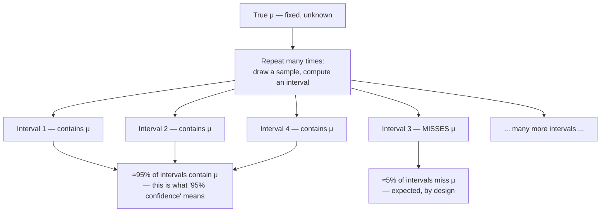

## Learning Objectives

- Construct a confidence interval for a population mean, x̄ ± z·(σ/√n), using the sampling distribution of X̄ established earlier in this cluster.
- Explain precisely, with a repeated-sampling argument, what "95% confidence" refers to — a property of the *procedure*, not a probability statement about one already-computed interval.
- State, correctly, why "there is a 95% probability the true mean is in this interval" is a misstatement of what a confidence interval guarantees, and articulate the correct alternative phrasing.
- Compute how the width of a confidence interval changes with the confidence level, the sample size, and the population standard deviation.
- Read off the correct z-critical-value for common confidence levels (90%, 95%, 99%) and apply it to a real numeric example.

## Context & Motivation

The previous concept established that X̄ is a good point estimator of μ — unbiased and consistent — but a single point estimate, on its own, communicates nothing about how much uncertainty remains. Reporting "the average commute time in this city is 27.4 minutes" based on a sample of 40 commuters gives no sense of whether the true citywide average is very likely close to 27.4, or could plausibly be anywhere from 20 to 35. A confidence interval closes exactly this gap: instead of a single number, it reports a *range* of plausible values for the unknown parameter, built directly from the same sampling-distribution machinery already developed in this cluster, along with an honest, quantified statement of how much that range can be trusted.

This concept is also the single most consistently misunderstood idea in all of introductory statistics, and the misunderstanding is not confined to students — surveys of practicing scientists across multiple fields have repeatedly found that a majority misstate what a confidence interval actually guarantees. The natural-sounding phrase "there's a 95% probability the true mean is in this interval" is subtly, and importantly, wrong, and untangling exactly why is worth real, careful attention here — not as a pedantic technicality, but because getting it right is the difference between correctly and incorrectly reasoning about what data can and cannot tell you. MIT's 6.041 treats this distinction as a core learning objective in its own right, precisely because the intuitive-sounding misreading is so persistent.

## Core Theory

### Constructing a confidence interval for μ (known σ, or large n)

Recall from earlier in this cluster that, for sufficiently large n (or when the population itself is Normal), the sampling distribution of X̄ is approximately Normal(μ, σ/√n) — centered on the true μ, with standard error σ/√n. Standardizing X̄ the same way any Normal random variable is standardized (subtract the mean, divide by the standard deviation) gives

Z = (X̄ − μ) / (σ/√n)

which is approximately a standard Normal random variable, N(0, 1). For a standard Normal variable, 95% of its probability mass lies between −1.96 and +1.96 (a value read directly from the standard Normal table established when the Normal distribution was introduced in this discipline). So, with 95% probability (over the space of hypothetical repeated samples, a point returned to below):

−1.96 ≤ (X̄ − μ) / (σ/√n) ≤ 1.96

Rearranging this inequality to isolate μ in the middle (multiplying through by σ/√n, then adding X̄ to all three parts) gives

X̄ − 1.96·(σ/√n) ≤ μ ≤ X̄ + 1.96·(σ/√n)

This is the **95% confidence interval for μ**, usually written compactly as

x̄ ± z·(σ/√n), with z = 1.96 for 95% confidence

Here z is the **critical value** — the number of standard errors out on a standard Normal distribution that captures the desired confidence level's worth of central probability. Common values: z = 1.645 for 90% confidence, z = 1.96 for 95%, z = 2.576 for 99%. (When σ is unknown, which is the typical real-world case, it is replaced by the sample standard deviation s, and — for smaller samples — z is replaced by a slightly larger critical value from the t-distribution to account for the added uncertainty of also having estimated σ from the data; the core logic developed here carries through unchanged.)

### What "95% confidence" actually means — the procedure, not the interval

Here is the crux, argued carefully. Before any data is drawn, X̄ is a random variable, and the interval [X̄ − 1.96·(σ/√n), X̄ + 1.96·(σ/√n)] is therefore also random — its endpoints depend on whatever sample happens to be drawn. The algebra above shows that this *random interval* contains the fixed true μ with probability 0.95, taken over the space of all possible samples that could be drawn. This is a perfectly legitimate probability statement — but it is a statement about the **procedure**, made *before* any specific sample is observed.

Once an actual sample is collected and the interval is computed — say, [24.1, 30.7] for the commute-time example — the randomness is gone. μ was always a fixed, unknown number; it either does or does not lie in [24.1, 30.7], with no probability left in the matter at all. It is a category error to attach a probability to a statement about two fixed numbers (a specific computed interval, and the fixed true μ) the same way a probability was attached to the *procedure* before data was collected. The 95% describes the **long-run behavior of the interval-construction procedure**, not a degree of belief about this one already-computed interval.

The precise, correct statement is: **"If this sampling-and-interval-construction procedure were repeated many times — draw a new sample, compute a new interval, every time — approximately 95% of the resulting intervals would contain the true μ."** The interval actually computed from the one real sample in hand is either one of the (roughly) 95% that succeeded, or one of the (roughly) 5% that missed — but there is no way to know, from that single interval alone, which category it falls into. Confidence is a property earned by the *method*, verified over repetition; it is not a probability that can be recomputed and attached after the fact to any one specific interval.



A useful way to keep this straight: it is the *coin* (the procedure) that has a known long-run success rate; once a specific coin flip has already landed and is sitting on the table, calling it "95% probability heads" no longer makes sense — it already landed one particular way. A single already-computed confidence interval is the coin already sitting on the table.

### Width of a confidence interval

The width of the interval, 2·z·(σ/√n), depends on three quantities, and it is worth understanding each direction of dependence:

- **Confidence level ↑ → width ↑.** A higher confidence level requires a larger z (99% needs z = 2.576, wider than 95%'s z = 1.96), because capturing a larger share of the sampling distribution's probability mass requires a wider net. There is an unavoidable trade-off: more confidence in the *procedure* comes only at the cost of a less precise (wider) interval.
- **Sample size n ↑ → width ↓.** Since the standard error σ/√n shrinks as n grows, larger samples produce narrower intervals at the same confidence level — a direct continuation of the consistency property from the previous concept: more data means a tighter, more informative interval, for the same level of procedural confidence.
- **Population spread σ ↑ → width ↑.** A more variable population inherently makes any single sample less informative about μ, widening the interval that results from it, all else held equal.

## Worked Examples

### Example 1 — constructing a 95% confidence interval

**Problem:** A sample of n = 64 commuters has a sample mean commute time of x̄ = 27.4 minutes. Assume the population standard deviation is known to be σ = 8 minutes (from long-running city transit data). Construct a 95% confidence interval for the true mean commute time μ.

**Standard error.** SE = σ/√n = 8/√64 = 8/8 = 1.0 minute.

**Margin of error.** z·SE = 1.96 × 1.0 = 1.96 minutes.

**Interval.** x̄ ± 1.96 → 27.4 − 1.96 = 25.44, and 27.4 + 1.96 = 29.36. So the 95% confidence interval is **[25.44, 29.36] minutes**.

**Correct interpretation.** If this same sampling-and-computation procedure (draw 64 commuters, compute x̄, build the interval x̄ ± 1.96) were repeated many times on many different samples of 64 commuters from this population, approximately 95% of the resulting intervals would contain the true (fixed, unknown) mean commute time. It is not correct to say "there's a 95% probability μ is between 25.44 and 29.36" — μ either is or isn't in that specific range, with certainty, even though which is the case remains unknown.

### Example 2 — the effect of raising the confidence level and the sample size

**Problem:** Using the same data as Example 1 (x̄ = 27.4, σ = 8, n = 64), construct a 99% confidence interval, and separately, show what a 95% interval would look like if the sample size had instead been n = 256.

**99% confidence, n = 64.** z = 2.576. Margin of error = 2.576 × 1.0 = 2.576. Interval: [27.4 − 2.576, 27.4 + 2.576] = **[24.82, 29.98]** — wider than the 95% interval from Example 1 ([25.44, 29.36]), exactly as expected: more confidence in the procedure costs precision.

**95% confidence, n = 256.** SE = 8/√256 = 8/16 = 0.5. Margin of error = 1.96 × 0.5 = 0.98. Interval: [27.4 − 0.98, 27.4 + 0.98] = **[26.42, 28.38]** — narrower than the original 95% interval from Example 1, because quadrupling the sample size (64 → 256) halved the standard error, exactly matching the √n relationship established in the sampling-distributions concept.

**Takeaway.** Confidence level and sample size pull the interval's width in opposite, independent directions: raising confidence widens the interval (at fixed n); raising n narrows the interval (at fixed confidence level). Both examples used the same x̄ and σ — only the confidence level or the sample size changed.

### Example 3 — simulating the "repeated sampling" guarantee directly

**Problem:** Confirm the correct interpretation of "95% confidence" by simulation: draw many samples from a population with a known true μ, build a 95% confidence interval from each, and check what fraction of those intervals actually contain the true μ.

```python
import random

random.seed(3)
true_mu = 100
true_sigma = 15
n = 36
z = 1.96
num_trials = 10_000

hits = 0
for _ in range(num_trials):
    sample = [random.gauss(true_mu, true_sigma) for _ in range(n)]
    xbar = sum(sample) / n
    se = true_sigma / (n ** 0.5)
    lower, upper = xbar - z * se, xbar + z * se
    if lower <= true_mu <= upper:
        hits += 1

print(f"Fraction of intervals containing the true mean: {hits / num_trials:.4f}")
```

Running this over 10,000 independently drawn samples produces a fraction very close to 0.95 — direct, empirical confirmation that "95% confidence" describes how often the *procedure* succeeds across repeated application, not a probability attachable to any single one of those 10,000 intervals individually. Any one interval, inspected on its own without knowing the true μ (which in a real study is exactly the situation faced — the whole point of the exercise is that μ is unknown), gives no way to tell whether it landed in the 95% that succeeded or the roughly 5% that missed.

## Common Misconceptions & Pitfalls

- **"There's a 95% probability that the true mean is in this specific interval."** This is the single most common — and most consequential — misstatement in all of introductory statistics, addressed at length in Core Theory. Once a specific interval like [25.44, 29.36] has been computed from actual data, μ either is or is not inside it, with no probability remaining in the matter; the 95% is a guarantee about the sampling-and-construction *procedure*, verified by the repeated-sampling simulation in Example 3, not about any one already-computed interval. The correct phrasing: "95% of intervals built this way, across repeated sampling, would contain the true μ."
- **"A wider interval always means worse data or a worse study."** A wider interval, at the same sample size and same data, is exactly what a *higher* confidence level demands (Example 2's 99% interval is wider than the 95% one from the same data) — width is not solely a measure of data quality; it also reflects a deliberate choice of how much confidence to demand from the procedure.
- **"If two 95% confidence intervals from two different studies overlap, the difference between the two study's means is not statistically significant."** This is a common but not strictly valid shortcut — overlapping confidence intervals do not directly translate to a formal test of the difference between two means (that comparison requires its own calculation, related to but not identical to the individual intervals), and treating interval overlap as an ad hoc substitute for a proper test can mislead.
- **"A 95% confidence interval means 95% of the data falls inside it."** A confidence interval describes uncertainty about the unknown parameter μ, not the spread of individual data points — that is a different concept entirely (closer to what a "prediction interval" or the population's own standard deviation describes). Example 1's interval, [25.44, 29.36] minutes, is far narrower than the actual spread of individual commuters' times (which has σ = 8 minutes) — it is a statement about where the *average* likely sits, not about where individual observations sit.
- **"Once you compute one confidence interval, you know how likely it is to be one of the 'good' ones."** There is no way to tell, from a single computed interval alone, whether it belongs to the roughly 95% that succeed or the roughly 5% that miss — Example 3's simulation only reveals the overall success rate because it has privileged access to the true μ, which in any real application is exactly the one thing that remains unknown.

## Summary

A confidence interval, x̄ ± z·(σ/√n), turns a single point estimate into a range of plausible values for an unknown population mean, built directly from the sampling distribution of X̄ established earlier in this cluster. Its width grows with the desired confidence level and the population's spread, and shrinks as sample size grows, tracing directly back to the standard error σ/√n. The single most important — and most often misunderstood — fact about confidence intervals is what "95% confidence" actually refers to: a property of the repeated-sampling *procedure* (95% of intervals constructed this way, across hypothetical repetition, would contain the true μ), never a probability statement attachable to any one already-computed interval, since the true μ is a fixed number that either is or isn't inside a specific already-observed interval, with no probability left to assign once the data is in hand. Getting this distinction right is essential groundwork for the next concept, hypothesis testing, whose p-values are prone to an exactly analogous, and equally serious, misinterpretation.

## Documentation Links

- [MIT 6.041 — Lecture Notes (OCW)](https://ocw.mit.edu/courses/6-041-probabilistic-systems-analysis-and-applied-probability-fall-2010/pages/lecture-notes/) — doc
- [MIT 6.041 — Syllabus (OCW)](https://ocw.mit.edu/courses/6-041-probabilistic-systems-analysis-and-applied-probability-fall-2010/pages/syllabus/) — doc
