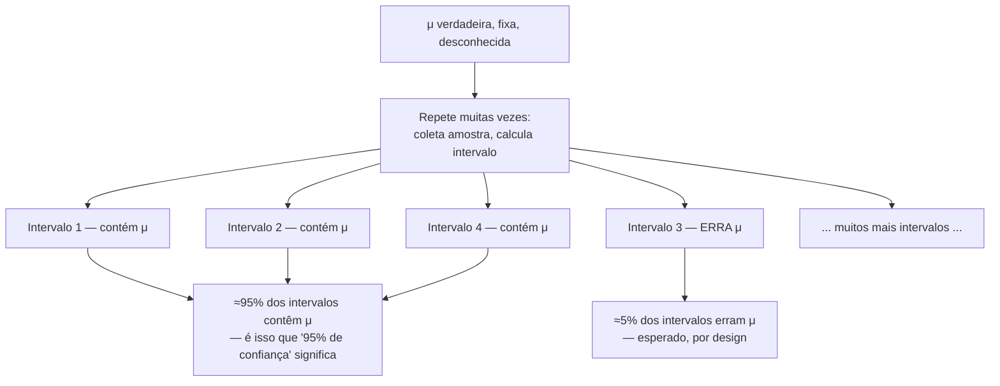

## Objetivos de Aprendizagem

- Construir um intervalo de confiança para uma média populacional, x̄ ± z·(σ/√n), usando a distribuição amostral de X̄ estabelecida anteriormente neste agrupamento.
- Explicar precisamente, com um argumento de amostragem repetida, a que "95% de confiança" se refere, uma propriedade do *procedimento*, não uma afirmação de probabilidade sobre um intervalo já calculado.
- Enunciar, corretamente, por que "há 95% de probabilidade de a média verdadeira estar neste intervalo" é uma formulação incorreta do que um intervalo de confiança garante, e articular a formulação alternativa correta.
- Calcular como a largura de um intervalo de confiança muda com o nível de confiança, o tamanho da amostra e o desvio padrão populacional.
- Consultar o valor crítico z correto para níveis de confiança comuns (90%, 95%, 99%) e aplicá-lo a um exemplo numérico real.

## Contexto e Motivação

O conceito anterior estabeleceu que X̄ é um bom estimador pontual de μ, não viesado e consistente, mas uma única estimativa pontual, por si só, não comunica nada sobre quanta incerteza permanece. Relatar "o tempo médio de deslocamento nesta cidade é 27,4 minutos" com base em uma amostra de 40 passageiros não dá nenhuma ideia se a média verdadeira da cidade toda está muito provavelmente perto de 27,4, ou poderia plausivelmente estar em qualquer lugar entre 20 e 35. Um intervalo de confiança fecha exatamente essa lacuna: em vez de um único número, ele relata uma *faixa* de valores plausíveis para o parâmetro desconhecido, construída diretamente a partir do mesmo maquinário de distribuição amostral já desenvolvido neste agrupamento, junto com uma afirmação honesta e quantificada de quanto essa faixa pode ser confiável.

Este conceito também é a ideia mais consistentemente mal-entendida em toda a estatística introdutória, e o mal-entendido não se restringe a estudantes, pesquisas com cientistas praticantes em múltiplos campos repetidamente descobriram que a maioria formula incorretamente o que um intervalo de confiança realmente garante. A frase de som natural "há 95% de probabilidade de a média verdadeira estar neste intervalo" está sutil, e importantemente, errada, e desvendar exatamente por quê vale a atenção cuidadosa dada aqui, não como um tecnicismo pedante, mas porque acertar isso é a diferença entre raciocinar correta e incorretamente sobre o que os dados podem e não podem dizer. O 6.041 do MIT trata dessa distinção como um objetivo de aprendizado central por direito próprio, precisamente porque a leitura equivocada de som intuitivo é tão persistente.

## Teoria Central

### Construindo um intervalo de confiança para μ (σ conhecido, ou n grande)

Recorde de anteriormente neste agrupamento que, para n suficientemente grande (ou quando a própria população é Normal), a distribuição amostral de X̄ é aproximadamente Normal(μ, σ/√n), centrada na μ verdadeira, com erro padrão σ/√n. Padronizar X̄ da mesma forma que qualquer variável aleatória Normal é padronizada (subtrair a média, dividir pelo desvio padrão) dá

Z = (X̄ − μ) / (σ/√n)

que é aproximadamente uma variável aleatória Normal padrão, N(0, 1). Para uma variável Normal padrão, 95% de sua massa de probabilidade está entre −1,96 e +1,96 (um valor lido diretamente da tabela Normal padrão estabelecida quando a distribuição Normal foi introduzida nesta disciplina). Então, com 95% de probabilidade (sobre o espaço de amostras repetidas hipotéticas, um ponto ao qual voltaremos abaixo):

−1,96 ≤ (X̄ − μ) / (σ/√n) ≤ 1,96

Rearranjando essa desigualdade para isolar μ no meio (multiplicando tudo por σ/√n, depois somando X̄ às três partes) dá

X̄ − 1,96·(σ/√n) ≤ μ ≤ X̄ + 1,96·(σ/√n)

Este é o **intervalo de confiança de 95% para μ**, normalmente escrito de forma compacta como

x̄ ± z·(σ/√n), com z = 1,96 para 95% de confiança

Aqui z é o **valor crítico**, o número de erros padrão em uma distribuição Normal padrão que captura a quantidade de probabilidade central correspondente ao nível de confiança desejado. Valores comuns: z = 1,645 para 90% de confiança, z = 1,96 para 95%, z = 2,576 para 99%. (Quando σ é desconhecido, que é o caso típico do mundo real, ele é substituído pelo desvio padrão amostral s, e, para amostras menores, z é substituído por um valor crítico ligeiramente maior da distribuição t para levar em conta a incerteza adicional de também ter estimado σ a partir dos dados; a lógica central desenvolvida aqui permanece inalterada.)

### O que "95% de confiança" realmente significa: o procedimento, não o intervalo

Aqui está o ponto crucial, argumentado cuidadosamente. Antes de qualquer dado ser coletado, X̄ é uma variável aleatória, e o intervalo [X̄ − 1,96·(σ/√n), X̄ + 1,96·(σ/√n)] é, portanto, também aleatório, seus pontos finais dependem de qual amostra acontece de ser coletada. A álgebra acima mostra que esse *intervalo aleatório* contém a μ verdadeira fixa com probabilidade 0,95, tomada sobre o espaço de todas as amostras possíveis que poderiam ser coletadas. Esta é uma afirmação de probabilidade perfeitamente legítima, mas é uma afirmação sobre o **procedimento**, feita *antes* de qualquer amostra específica ser observada.

Uma vez que uma amostra real é coletada e o intervalo é calculado, digamos, [24,1, 30,7] para o exemplo do tempo de deslocamento, a aleatoriedade desaparece. μ sempre foi um número fixo e desconhecido; ele está ou não está em [24,1, 30,7], sem nenhuma probabilidade remanescente na questão. É um erro categórico anexar uma probabilidade a uma afirmação sobre dois números fixos (um intervalo específico calculado, e a μ verdadeira fixa) da mesma forma que uma probabilidade foi anexada ao *procedimento* antes de os dados serem coletados. O 95% descreve o **comportamento de longo prazo do procedimento de construção do intervalo**, não um grau de crença sobre este intervalo já calculado específico.

A afirmação precisa e correta é: **"Se este procedimento de amostragem e construção de intervalo fosse repetido muitas vezes, coletar uma nova amostra, calcular um novo intervalo, sempre, aproximadamente 95% dos intervalos resultantes conteriam a μ verdadeira."** O intervalo de fato calculado a partir da única amostra real em mãos é ou um dos (aproximadamente) 95% que tiveram sucesso, ou um dos (aproximadamente) 5% que erraram, mas não há como saber, a partir daquele único intervalo isoladamente, em qual categoria ele se encaixa. Confiança é uma propriedade conquistada pelo *método*, verificada ao longo de repetição; não é uma probabilidade que pode ser recalculada e anexada posteriormente a qualquer intervalo específico.



Uma forma útil de manter isso claro: é a *moeda* (o procedimento) que tem uma taxa de sucesso de longo prazo conhecida; uma vez que um lançamento específico de moeda já caiu e está sobre a mesa, chamá-lo de "95% de probabilidade de cara" já não faz sentido, ele já caiu de uma forma particular. Um único intervalo de confiança já calculado é a moeda já sobre a mesa.

### Largura de um intervalo de confiança

A largura do intervalo, 2·z·(σ/√n), depende de três quantidades, e vale a pena entender cada direção da dependência:

- **Nível de confiança ↑ → largura ↑.** Um nível de confiança maior exige um z maior (99% precisa de z = 2,576, mais largo que o z = 1,96 do 95%), porque capturar uma parcela maior da massa de probabilidade da distribuição amostral exige uma rede mais larga. Há um trade-off inevitável: mais confiança no *procedimento* vem apenas ao custo de um intervalo menos preciso (mais largo).
- **Tamanho de amostra n ↑ → largura ↓.** Como o erro padrão σ/√n encolhe conforme n cresce, amostras maiores produzem intervalos mais estreitos no mesmo nível de confiança, uma continuação direta da propriedade de consistência do conceito anterior: mais dados significam um intervalo mais estreito e mais informativo, para o mesmo nível de confiança procedimental.
- **Dispersão populacional σ ↑ → largura ↑.** Uma população mais variável inerentemente torna qualquer amostra única menos informativa sobre μ, alargando o intervalo que resulta dela, mantendo tudo o mais constante.

## Exemplos Resolvidos

### Exemplo 1 — construindo um intervalo de confiança de 95%

**Problema:** Uma amostra de n = 64 passageiros tem uma média amostral de tempo de deslocamento de x̄ = 27,4 minutos. Assuma que o desvio padrão populacional é conhecido como σ = 8 minutos (a partir de dados de longa duração do trânsito da cidade). Construa um intervalo de confiança de 95% para a verdadeira média de tempo de deslocamento μ.

**Erro padrão.** EP = σ/√n = 8/√64 = 8/8 = 1,0 minuto.

**Margem de erro.** z·EP = 1,96 × 1,0 = 1,96 minutos.

**Intervalo.** x̄ ± 1,96 → 27,4 − 1,96 = 25,44, e 27,4 + 1,96 = 29,36. Então o intervalo de confiança de 95% é **[25,44, 29,36] minutos**.

**Interpretação correta.** Se este mesmo procedimento de amostragem e cálculo (coletar 64 passageiros, calcular x̄, construir o intervalo x̄ ± 1,96) fosse repetido muitas vezes em muitas amostras diferentes de 64 passageiros desta população, aproximadamente 95% dos intervalos resultantes conteriam a verdadeira (fixa, desconhecida) média de tempo de deslocamento. Não é correto dizer "há 95% de probabilidade de μ estar entre 25,44 e 29,36", μ ou está ou não está nessa faixa específica, com certeza, mesmo que qual dos casos seja verdadeiro permaneça desconhecido.

### Exemplo 2 — o efeito de aumentar o nível de confiança e o tamanho da amostra

**Problema:** Usando os mesmos dados do Exemplo 1 (x̄ = 27,4, σ = 8, n = 64), construa um intervalo de confiança de 99%, e separadamente, mostre como seria um intervalo de 95% se o tamanho da amostra tivesse sido n = 256.

**99% de confiança, n = 64.** z = 2,576. Margem de erro = 2,576 × 1,0 = 2,576. Intervalo: [27,4 − 2,576, 27,4 + 2,576] = **[24,82, 29,98]**, mais largo que o intervalo de 95% do Exemplo 1 ([25,44, 29,36]), exatamente como esperado: mais confiança no procedimento custa precisão.

**95% de confiança, n = 256.** EP = 8/√256 = 8/16 = 0,5. Margem de erro = 1,96 × 0,5 = 0,98. Intervalo: [27,4 − 0,98, 27,4 + 0,98] = **[26,42, 28,38]**, mais estreito que o intervalo original de 95% do Exemplo 1, porque quadruplicar o tamanho da amostra (64 → 256) reduziu o erro padrão pela metade, correspondendo exatamente à relação √n estabelecida no conceito de distribuições amostrais.

**Conclusão.** O nível de confiança e o tamanho da amostra puxam a largura do intervalo em direções opostas e independentes: aumentar a confiança alarga o intervalo (com n fixo); aumentar n estreita o intervalo (com nível de confiança fixo). Ambos os exemplos usaram o mesmo x̄ e σ, apenas o nível de confiança ou o tamanho da amostra mudou.

### Exemplo 3 — simulando diretamente a garantia de "amostragem repetida"

**Problema:** Confirme a interpretação correta de "95% de confiança" por simulação: colete muitas amostras de uma população com uma μ verdadeira conhecida, construa um intervalo de confiança de 95% a partir de cada uma, e verifique qual fração desses intervalos de fato contém a μ verdadeira.

```python
import random

random.seed(3)
true_mu = 100
true_sigma = 15
n = 36
z = 1.96
num_trials = 10_000

hits = 0
for _ in range(num_trials):
    sample = [random.gauss(true_mu, true_sigma) for _ in range(n)]
    xbar = sum(sample) / n
    se = true_sigma / (n ** 0.5)
    lower, upper = xbar - z * se, xbar + z * se
    if lower <= true_mu <= upper:
        hits += 1

print(f"Fraction of intervals containing the true mean: {hits / num_trials:.4f}")
```

Executar isso ao longo de 10.000 amostras coletadas independentemente produz uma fração muito próxima de 0,95, confirmação empírica direta de que "95% de confiança" descreve com que frequência o *procedimento* tem sucesso ao longo de aplicação repetida, não uma probabilidade anexável a qualquer um desses 10.000 intervalos individualmente. Qualquer intervalo isolado, inspecionado por si só sem saber a μ verdadeira (que em um estudo real é exatamente a situação enfrentada, todo o ponto do exercício é que μ é desconhecida), não dá nenhuma forma de saber se ele caiu nos 95% que tiveram sucesso ou nos cerca de 5% que erraram.

## Equívocos Comuns e Armadilhas

- **"Há 95% de probabilidade de a média verdadeira estar neste intervalo específico."** Esta é a formulação incorreta mais comum, e mais consequente, em toda a estatística introdutória, tratada extensamente na Teoria Central. Uma vez que um intervalo específico como [25,44, 29,36] foi calculado a partir de dados reais, μ ou está ou não está dentro dele, sem nenhuma probabilidade remanescente na questão; o 95% é uma garantia sobre o *procedimento* de amostragem e construção, verificada pela simulação de amostragem repetida do Exemplo 3, não sobre qualquer intervalo já calculado específico. A formulação correta: "95% dos intervalos construídos desta forma, ao longo de amostragem repetida, conteriam a μ verdadeira."
- **"Um intervalo mais largo sempre significa dados piores ou um estudo pior."** Um intervalo mais largo, com o mesmo tamanho de amostra e os mesmos dados, é exatamente o que um nível de confiança *mais alto* exige (o intervalo de 99% do Exemplo 2 é mais largo que o de 95% dos mesmos dados), a largura não é unicamente uma medida da qualidade dos dados; ela também reflete uma escolha deliberada de quanta confiança exigir do procedimento.
- **"Se dois intervalos de confiança de 95% de dois estudos diferentes se sobrepõem, a diferença entre as médias dos dois estudos não é estatisticamente significativa."** Este é um atalho comum mas não estritamente válido, intervalos de confiança sobrepostos não se traduzem diretamente em um teste formal da diferença entre duas médias (essa comparação exige seu próprio cálculo, relacionado mas não idêntico aos intervalos individuais), e tratar a sobreposição de intervalos como um substituto ad hoc para um teste apropriado pode induzir a erro.
- **"Um intervalo de confiança de 95% significa que 95% dos dados caem dentro dele."** Um intervalo de confiança descreve incerteza sobre o parâmetro desconhecido μ, não a dispersão de pontos de dados individuais, isso é um conceito inteiramente diferente (mais próximo do que um "intervalo de predição" ou o próprio desvio padrão da população descreve). O intervalo do Exemplo 1, [25,44, 29,36] minutos, é muito mais estreito que a dispersão real dos tempos de passageiros individuais (que tem σ = 8 minutos), é uma afirmação sobre onde a *média* provavelmente está, não sobre onde observações individuais estão.
- **"Uma vez que você calcula um intervalo de confiança, você sabe quão provável é que ele seja um dos 'bons'."** Não há como saber, a partir de um único intervalo calculado isoladamente, se ele pertence aos cerca de 95% que têm sucesso ou aos cerca de 5% que erram, a simulação do Exemplo 3 só revela a taxa de sucesso geral porque tem acesso privilegiado à μ verdadeira, que em qualquer aplicação real é exatamente a única coisa que permanece desconhecida.

## Resumo

Um intervalo de confiança, x̄ ± z·(σ/√n), transforma uma única estimativa pontual em uma faixa de valores plausíveis para uma média populacional desconhecida, construída diretamente a partir da distribuição amostral de X̄ estabelecida anteriormente neste agrupamento. Sua largura cresce com o nível de confiança desejado e a dispersão da população, e encolhe conforme o tamanho da amostra cresce, remontando diretamente ao erro padrão σ/√n. O fato mais importante, e mais frequentemente mal-entendido, sobre intervalos de confiança é a que "95% de confiança" realmente se refere: uma propriedade do *procedimento* de amostragem repetida (95% dos intervalos construídos desta forma, ao longo de repetição hipotética, conteriam a μ verdadeira), nunca uma afirmação de probabilidade anexável a qualquer intervalo já calculado específico, já que a μ verdadeira é um número fixo que ou está ou não está dentro de um intervalo específico já observado, sem nenhuma probabilidade remanescente para atribuir uma vez que os dados estão em mãos. Acertar essa distinção é preparação essencial para o próximo conceito, teste de hipóteses, cujos valores-p são propensos a uma interpretação equivocada exatamente análoga, e igualmente séria.

## Documentation Links

- [MIT 6.041 — Lecture Notes (OCW)](https://ocw.mit.edu/courses/6-041-probabilistic-systems-analysis-and-applied-probability-fall-2010/pages/lecture-notes/) — doc
- [MIT 6.041 — Syllabus (OCW)](https://ocw.mit.edu/courses/6-041-probabilistic-systems-analysis-and-applied-probability-fall-2010/pages/syllabus/) — doc
