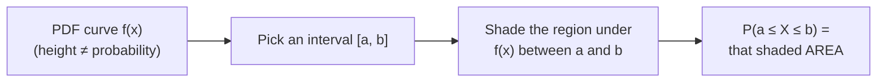

## Learning Objectives

- Explain why a probability mass function cannot describe a random variable that takes a continuum of possible values, motivating the need for a probability density function (PDF).
- State that P(X=x) = 0 for any single point x of a continuous random variable, and explain carefully why this does not mean x is impossible.
- Interpret P(a ≤ X ≤ b) as the area under the PDF curve between a and b, and compute such areas for simple shapes (rectangles, triangles).
- State the two defining properties a valid PDF must satisfy (non-negativity, total area equal to 1) and check a candidate function against both.
- Distinguish a PDF's height at a point from a probability, recognizing that PDF values can exceed 1 without contradiction.

## Context & Motivation

Every random variable considered so far — Bernoulli, Binomial, Poisson — has been **discrete**: it takes on a countable list of specific values (0, 1, 2, 3, …), each with its own probability, and the full distribution could always be captured as a table or a PMF formula. Many quantities worth modeling, though, don't naturally break into a countable list of possible values at all. The exact height of a randomly selected person, the precise time until a server responds to a request, the exact temperature at noon tomorrow — these can, at least in principle, take *any* value in some continuous range, not just a countable list of specific numbers. A **continuous random variable** is the tool for modeling exactly this kind of quantity, and it requires a genuinely different way of describing probabilities, because the PMF approach that worked so well for discrete variables breaks down completely once there are uncountably many possible values to assign probability to.

The break is not a minor technical inconvenience — it forces a real conceptual shift. If a continuous random variable could take literally any real number in, say, the interval [0, 10], and each individual value had some positive probability, those probabilities (uncountably many of them) could not possibly sum to a finite total of 1 the way a discrete PMF does; the only way the bookkeeping can possibly work is if every individual point has probability *exactly* zero, and only whole *ranges* of values (intervals, not single points) get assigned positive probability. This is one of the most genuinely confusing ideas for students first encountering continuous probability, and it deserves to be sat with rather than rushed past — the resolution, once it clicks, is one of the more satisfying conceptual payoffs in an introductory probability course.

The tool that makes this work is the **probability density function**, or **PDF** — a curve whose *height* is not itself a probability (unlike a PMF's height, which was exactly a probability), but whose *area* under any stretch of the curve is. This concept deliberately leans on area-under-the-curve intuition rather than a fully rigorous calculus-based treatment (the formal machinery of integration belongs to a calculus course this curriculum doesn't yet assume), because the geometric picture — probability as area, not height — is both the historically correct way calculus-based probability was first understood and entirely sufficient to build correct intuition and solve concrete problems at this level, exactly as MIT's 6.041 and Stanford's CS109 both introduce the topic before their students necessarily have a full calculus background locked in.

## Core Theory

### Why a PMF-style approach breaks down

Recall that a discrete PMF assigns a positive probability to each of a countable list of values, with all those probabilities summing to 1. A continuous random variable, by contrast, can take any value in an interval of real numbers — and an interval, however small, contains infinitely many (in fact, uncountably many) individual points. If each of those points were assigned some fixed positive probability, however tiny, summing all of them across the whole interval would give an infinite total, not 1 — the bookkeeping simply cannot close. The only way to avoid this contradiction is to accept that **individual points must carry zero probability**, and instead assign probability to *ranges* of values, described not by a table of point-probabilities but by a curve.

### The probability density function (PDF)

**Definition.** A continuous random variable X is described by a **probability density function** f(x), a curve satisfying two properties:

1. **Non-negativity**: f(x) ≥ 0 for every value of x. (A density can never be negative — negative "probability density" has no meaning.)
2. **Total area equals 1**: the total area under the curve f(x), across all possible values of x, equals exactly 1 — the continuous analogue of a discrete PMF's probabilities summing to 1.

Probabilities are then read off the curve as **areas**, not heights:

**P(a ≤ X ≤ b) = the area under the curve f(x) between x=a and x=b**

Using the integral symbol, this is written ∫ from a to b of f(x) — read simply as "the area under f between a and b," with no need, at this stage, for a rigorous limit-of-sums construction behind the ∫ symbol; think of it exactly the way you'd compute the area of a geometric shape (a rectangle, a triangle, a trapezoid) bounded above by the curve.

### Why P(X=x) = 0, and why that doesn't mean "impossible"

A single point x has zero width — the interval [x, x] has length 0. Since probability corresponds to *area*, and area requires both a height and a nonzero width to be anything other than zero, the "area" over an interval of width zero is exactly zero, no matter how tall the curve is at that point:

P(X=x) = P(x ≤ X ≤ x) = area of a region with zero width = **0**

This is worth pausing on directly, because it seems, at first, like a genuine paradox: if P(X=x)=0 for every possible value x, does that mean every value is impossible, and X can never actually equal anything? The resolution is that "probability zero" and "impossible" are **not the same idea** for continuous random variables, even though they coincide for discrete ones. X does land on *some* specific real number every time the experiment runs — that outcome simply isn't "impossible" in the ordinary sense — but the *probability* of landing on any one pre-specified exact value is zero, because there are uncountably many competing values, each equally entitled (in the sense of the density) to a share of the total probability of exactly 1, and dividing 1 among uncountably many points forces each individual point's share down to zero.

A useful way to build intuition: think of a dartboard where a dart can land at any real-valued point. Asking "what's the probability the dart lands at the *exact* mathematical point (3.0000000…, 4.0000000…), with infinitely many zeros"? is a different question from "what's the probability the dart lands *near* (3,4), say within some small region"? The second question has a meaningful positive answer (an area); the first, taken with perfect mathematical exactness, does not — yet the dart still has to land somewhere, on some exact point, every single throw.

A direct consequence: for continuous random variables, **P(a ≤ X ≤ b) = P(a < X < b)** — including or excluding the individual endpoints a and b makes no difference at all, since each endpoint contributes exactly 0 to the total area regardless. This is a genuine, useful simplification that has no discrete analogue (for a discrete random variable, whether an inequality is strict or not can very much change the answer, since individual points do carry positive probability there).

### PDF height is not a probability — it can exceed 1

Because probability corresponds to *area* rather than *height*, there is nothing at all wrong with a PDF taking values greater than 1 at some points — only the total *area* under the whole curve is constrained to equal 1, not the height at any individual point. A PDF that is very tall over a very narrow range (concentrating most of the probability into a small interval) can easily have height values well above 1 there, while still integrating (in the area sense) to exactly 1 overall, because the narrowness of the interval compensates for the tallness in the area calculation, the same way a very tall, very thin rectangle can have the same area as a short, wide one.

### The uniform distribution as a first concrete example

The simplest continuous distribution is the **uniform distribution** on an interval [c, d]: every sub-interval of a given length within [c, d] is equally likely, so the PDF is a flat, constant height across [c, d] and zero elsewhere. Since the total area must equal 1, and the region is a rectangle of width (d−c), the height must be exactly 1/(d−c):

f(x) = 1/(d−c)  for c ≤ x ≤ d,   and f(x) = 0 otherwise

This single flat-rectangle example is often the clearest place to first see both defining PDF properties (non-negativity: the height 1/(d−c) is positive since d>c; total area 1: width × height = (d−c) × 1/(d−c) = 1) verified directly, with no calculus beyond ordinary rectangle-area arithmetic.

## Worked Examples

### Example 1 — verifying a candidate PDF and computing a range probability (rectangle case)

**Problem:** A random variable X is uniformly distributed on the interval [2, 6]. (a) Write down its PDF and confirm it is valid. (b) Find P(3 ≤ X ≤ 5).

**Part (a).** The interval has width d−c = 6−2 = 4, so f(x) = 1/4 for 2 ≤ x ≤ 6, and f(x)=0 elsewhere. Checking the two PDF requirements: f(x) = 1/4 ≥ 0 everywhere it's nonzero ✓; total area = width × height = 4 × (1/4) = 1 ✓. This is a valid PDF.

**Part (b).** P(3 ≤ X ≤ 5) is the area under the flat curve between x=3 and x=5 — a rectangle of width (5−3)=2 and height 1/4:

P(3 ≤ X ≤ 5) = 2 × (1/4) = 0.5

So there's a 50% chance X falls in [3,5], even though [3,5] is only half the length of the full interval [2,6] — matching the intuition that a sub-interval covering half the total width of a uniform distribution should carry exactly half the total probability.

### Example 2 — a non-rectangular PDF (triangle case)

**Problem:** A random variable X has PDF f(x) = x/2 for 0 ≤ x ≤ 2, and f(x)=0 otherwise. (a) Confirm this is a valid PDF. (b) Find P(1 ≤ X ≤ 2).

**Part (a) — checking validity.** Non-negativity: for 0 ≤ x ≤ 2, x/2 ≥ 0 ✓. Total area: the graph of f(x)=x/2 over [0,2] is a straight line from (0,0) up to (2,1) — a right triangle with base 2 (along the x-axis, from 0 to 2) and height 1 (the value of f at x=2, namely 2/2=1). The area of a triangle is (1/2)·base·height:

total area = (1/2)(2)(1) = 1 ✓

This confirms f is a valid PDF, using only the elementary triangle-area formula — no integration machinery required.

**Part (b) — P(1 ≤ X ≤ 2).** This region is the portion of the same triangle from x=1 to x=2 — which is itself a (smaller) triangle, with base 1 (from x=1 to x=2) and height 1 (the value of f at x=2). Its area:

P(1 ≤ X ≤ 2) = (1/2)(1)(1) = 0.5

So exactly half the total probability lies in the upper half of the interval [0,2] — sensible, since the PDF is *increasing* on this interval (taller near x=2), so the right half of the base, even though it's the same width as the left half, sits under more of the curve's height and should be expected to carry more than a naive "half the width, half the probability" guess would suggest for a non-flat PDF; here it happens to work out to exactly 0.5, but only because of the specific linear shape chosen — a useful reminder that, unlike the uniform case, probability under a sloped PDF is not simply proportional to interval width alone.

### Example 3 — demonstrating P(X=x)=0 concretely against a shrinking interval

**Problem:** Using the uniform distribution on [2,6] from Example 1 (f(x)=1/4), compute P(3.9 ≤ X ≤ 4.1), then P(3.99 ≤ X ≤ 4.01), then P(3.999 ≤ X ≤ 4.001), and observe the trend as the interval shrinks toward the single point X=4.

**Compute each, as a rectangle area (width × height = width × 1/4):**

- P(3.9 ≤ X ≤ 4.1): width = 0.2, so probability = 0.2 × 0.25 = 0.05
- P(3.99 ≤ X ≤ 4.01): width = 0.02, so probability = 0.02 × 0.25 = 0.005
- P(3.999 ≤ X ≤ 4.001): width = 0.002, so probability = 0.002 × 0.25 = 0.0005

**Observe the trend.** As the interval around x=4 keeps shrinking (by a factor of 10 each time), the probability shrinks right along with it, by the same factor of 10 each time — and this can continue without bound: however small an interval is drawn around x=4, so long as the width is positive, the probability is the height (1/4, a perfectly finite, unremarkable number) times that width, and as width → 0, the probability → 0 as well. This is exactly the mechanism behind P(X=4)=0: it is not that x=4 is somehow special or excluded, but that a single point is the limiting case of an interval whose width has shrunk all the way to zero, carrying its area down to zero right along with it, even though the PDF's height at x=4 (namely 1/4) never itself became zero or undefined.

## Common Misconceptions & Pitfalls

- **"P(X=x)=0 means x is an impossible value for X."** This is the central misconception this concept exists to dispel. X still lands on *some* exact real number every time the underlying experiment happens — no value is excluded from being the outcome. What is zero is the *probability of that exact value being pre-specified in advance*, a consequence of there being uncountably many competing candidate values, not a statement that the value can't occur. Example 3 shows this mechanically: the probability shrinks toward zero continuously as the interval narrows toward the point, with nothing sudden or paradoxical happening at the point itself.
- **"The height of the PDF at a point is the probability of that point."** The height f(x) is a *density*, not a probability — it only becomes a probability once multiplied by (or integrated across) a width. A tall PDF value, even one exceeding 1, is completely valid and does not violate anything, since only the total *area* is constrained to 1, not any individual height.
- **"Since PDF values must be probabilities, f(x) can never be greater than 1."** False, and directly addressed in Core Theory: only the total area under the whole curve must equal 1; individual heights are unconstrained above, so long as the curve stays non-negative and the total area still comes out to exactly 1. A PDF concentrated over a very narrow interval necessarily has a large height there to compensate for the narrow width.
- **"P(a ≤ X ≤ b) and P(a < X < b) are different for continuous random variables, just like they'd differ for discrete ones."** For continuous random variables they are always equal, since each of the two boundary points a and b individually contributes exactly zero to the area — removing or including a zero-width sliver from an area calculation changes nothing. This is a genuine point of difference from discrete random variables, where strict versus non-strict inequalities very much can change the answer, since discrete individual points do carry positive probability.
- **"Computing an area under a non-rectangular PDF always requires calculus."** For the simple shapes typically encountered first (rectangles, triangles, and combinations of them, as in Examples 1 and 2), ordinary geometric area formulas suffice completely — calculus-based integration becomes necessary only for PDFs with curved (non-polygonal) shapes, which is beyond the scope of this concept's treatment.

## Summary

A continuous random variable can take any value in a range, and this forces a genuine departure from the PMF approach used for discrete variables: because an interval contains uncountably many points, each individual point must carry exactly zero probability, or the bookkeeping could never sum to 1. The probability density function (PDF) f(x) resolves this by describing probability as *area* rather than height: P(a ≤ X ≤ b) is the area under f(x) between a and b, and a valid PDF must be non-negative everywhere with total area exactly 1. P(X=x)=0 for any single exact value x — not because x is impossible, but because a single point has zero width, and area requires nonzero width to be anything but zero; this is why, for continuous random variables uniquely, strict and non-strict inequalities in a probability statement make no difference. PDF height is a density, not a probability, and can validly exceed 1, since only the total area (not any individual height) is constrained. For simple rectangular (uniform) and triangular PDFs, these areas can be computed with ordinary geometry, with no calculus required.

## Documentation Links

- [MIT 6.041 — Lecture Notes (OCW)](https://ocw.mit.edu/courses/6-041-probabilistic-systems-analysis-and-applied-probability-fall-2010/pages/lecture-notes/) — doc
- [Stanford CS109 — Course Schedule](http://web.stanford.edu/class/cs109/schedule.html) — doc
