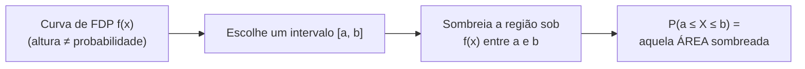

## Objetivos de Aprendizagem

- Explicar por que uma função massa de probabilidade não consegue descrever uma variável aleatória que assume um continuum de valores possíveis, motivando a necessidade de uma função densidade de probabilidade (FDP).
- Declarar que P(X=x) = 0 para qualquer ponto único x de uma variável aleatória contínua, e explicar cuidadosamente por que isso não significa que x é impossível.
- Interpretar P(a ≤ X ≤ b) como a área sob a curva da FDP entre a e b, e computar essas áreas para formas simples (retângulos, triângulos).
- Declarar as duas propriedades definidoras que uma FDP válida precisa satisfazer (não negatividade, área total igual a 1) e checar uma função candidata contra as duas.
- Distinguir a altura de uma FDP num ponto de uma probabilidade, reconhecendo que valores de FDP podem exceder 1 sem contradição.

## Contexto e Motivação

Toda variável aleatória considerada até agora (Bernoulli, Binomial, Poisson) foi **discreta**: assume uma lista contável de valores específicos (0, 1, 2, 3, …), cada um com sua própria probabilidade, e a distribuição completa sempre podia ser capturada como uma tabela ou uma fórmula de FMP. Muitas quantidades que valem a pena modelar, porém, não se dividem naturalmente numa lista contável de valores possíveis de forma alguma. A altura exata de uma pessoa selecionada aleatoriamente, o tempo preciso até um servidor responder a uma requisição, a temperatura exata ao meio-dia amanhã, esses podem, pelo menos em princípio, assumir *qualquer* valor em alguma faixa contínua, não só uma lista contável de números específicos. Uma **variável aleatória contínua** é a ferramenta para modelar exatamente esse tipo de quantidade, e exige uma forma genuinamente diferente de descrever probabilidades, porque a abordagem de FMP que funcionou tão bem para variáveis discretas quebra completamente uma vez que há incontavelmente muitos valores possíveis para atribuir probabilidade.

A quebra não é um inconveniente técnico menor, força uma mudança conceitual real. Se uma variável aleatória contínua pudesse assumir literalmente qualquer número real em, digamos, o intervalo [0, 10], e cada valor individual tivesse alguma probabilidade positiva, essas probabilidades (incontavelmente muitas delas) não poderiam possivelmente somar um total finito de 1 do jeito que uma FMP discreta faz; a única forma de a contabilidade possivelmente funcionar é se todo ponto individual tem probabilidade *exatamente* zero, e só faixas *inteiras* de valores (intervalos, não pontos únicos) recebem probabilidade positiva atribuída. Esta é uma das ideias mais genuinamente confusas para alunos encontrando probabilidade contínua pela primeira vez, e merece ser assentada em vez de apressada; a resolução, uma vez que se encaixa, é um dos retornos conceituais mais satisfatórios num curso introdutório de probabilidade.

A ferramenta que faz isso funcionar é a **função densidade de probabilidade**, ou **FDP**: uma curva cuja *altura* não é ela mesma uma probabilidade (diferente da altura de uma FMP, que era exatamente uma probabilidade), mas cuja *área* sob qualquer trecho da curva é. Este conceito deliberadamente se apoia em intuição de área-sob-a-curva em vez de um tratamento totalmente rigoroso baseado em cálculo (a maquinaria formal de integração pertence a um curso de cálculo que este currículo ainda não assume), porque a imagem geométrica (probabilidade como área, não altura) é tanto a forma historicamente correta como probabilidade baseada em cálculo foi primeiro entendida quanto inteiramente suficiente para construir intuição correta e resolver problemas concretos neste nível, exatamente como tanto o 6.041 do MIT quanto o CS109 de Stanford introduzem o tópico antes de seus alunos necessariamente terem uma formação completa de cálculo consolidada.

## Teoria Central

### Por que uma abordagem estilo FMP quebra

Lembre-se que uma FMP discreta atribui uma probabilidade positiva a cada uma de uma lista contável de valores, com todas essas probabilidades somando 1. Uma variável aleatória contínua, em contraste, pode assumir qualquer valor num intervalo de números reais, e um intervalo, por menor que seja, contém infinitos (de fato, incontáveis) pontos individuais. Se cada um desses pontos recebesse alguma probabilidade positiva fixa, por menor que fosse, somar todos eles através do intervalo inteiro daria um total infinito, não 1; a contabilidade simplesmente não consegue fechar. A única forma de evitar essa contradição é aceitar que **pontos individuais precisam carregar probabilidade zero**, e em vez disso atribuir probabilidade a *faixas* de valores, descritas não por uma tabela de probabilidades pontuais mas por uma curva.

### A função densidade de probabilidade (FDP)

**Definição.** Uma variável aleatória contínua X é descrita por uma **função densidade de probabilidade** f(x), uma curva satisfazendo duas propriedades:

1. **Não negatividade**: f(x) ≥ 0 para todo valor de x. (Uma densidade nunca pode ser negativa, "densidade de probabilidade" negativa não tem significado.)
2. **Área total igual a 1**: a área total sob a curva f(x), através de todos os valores possíveis de x, é igual exatamente a 1, o análogo contínuo das probabilidades de uma FMP discreta somando 1.

Probabilidades são então lidas da curva como **áreas**, não alturas:

**P(a ≤ X ≤ b) = a área sob a curva f(x) entre x=a e x=b**

Usando o símbolo de integral, isso se escreve ∫ de a até b de f(x), lido simplesmente como "a área sob f entre a e b", sem necessidade, nesta etapa, de uma construção rigorosa de limite de somas por trás do símbolo ∫; pense exatamente do jeito que você computaria a área de uma forma geométrica (um retângulo, um triângulo, um trapézio) limitada acima pela curva.

### Por que P(X=x) = 0, e por que isso não significa "impossível"

Um único ponto x tem largura zero, o intervalo [x, x] tem comprimento 0. Como probabilidade corresponde a *área*, e área exige tanto uma altura quanto uma largura não nula para ser outra coisa que não zero, a "área" sobre um intervalo de largura zero é exatamente zero, não importa quão alta a curva seja naquele ponto:

P(X=x) = P(x ≤ X ≤ x) = área de uma região com largura zero = **0**

Vale a pena parar diretamente nisso, porque parece, à primeira vista, um paradoxo genuíno: se P(X=x)=0 para todo valor possível x, isso significa que todo valor é impossível, e X nunca pode de fato ser igual a nada? A resolução é que "probabilidade zero" e "impossível" **não são a mesma ideia** para variáveis aleatórias contínuas, mesmo que coincidam para as discretas. X de fato cai em *algum* número real específico toda vez que o experimento roda, aquele resultado simplesmente não é "impossível" no sentido comum, mas a *probabilidade* de cair num valor exato pré-especificado é zero, porque há incontavelmente muitos valores candidatos competindo, cada um igualmente merecedor (no sentido da densidade) de uma fatia da probabilidade total de exatamente 1, e dividir 1 entre incontáveis pontos força a fatia de cada ponto individual para zero.

Uma forma útil de construir intuição: pense num alvo de dardo onde um dardo pode cair em qualquer ponto de valor real. Perguntar "qual é a probabilidade de o dardo cair no ponto matemático *exato* (3,0000000…, 4,0000000…), com infinitos zeros"? é uma pergunta diferente de "qual é a probabilidade de o dardo cair *perto* de (3,4), digamos dentro de alguma pequena região"? A segunda pergunta tem uma resposta positiva significativa (uma área); a primeira, tomada com exatidão matemática perfeita, não tem, mas ainda assim o dardo precisa cair em algum lugar, em algum ponto exato, a cada arremesso.

Uma consequência direta: para variáveis aleatórias contínuas, **P(a ≤ X ≤ b) = P(a < X < b)**, incluir ou excluir os pontos extremos individuais a e b não faz nenhuma diferença de forma alguma, já que cada ponto extremo contribui exatamente 0 para a área total independentemente. Esta é uma simplificação genuína e útil que não tem análogo discreto (para uma variável aleatória discreta, se uma desigualdade é estrita ou não pode muito bem mudar a resposta, já que pontos individuais de fato carregam probabilidade positiva ali).

### A altura da FDP não é uma probabilidade, pode exceder 1

Como probabilidade corresponde a *área* em vez de *altura*, não há nada de errado em uma FDP assumir valores maiores que 1 em alguns pontos; só a *área* total sob a curva inteira é restrita a ser igual a 1, não a altura em qualquer ponto individual. Uma FDP que é muito alta sobre uma faixa muito estreita (concentrando a maior parte da probabilidade num pequeno intervalo) pode facilmente ter valores de altura bem acima de 1 ali, enquanto ainda integra (no sentido de área) para exatamente 1 no geral, porque a estreiteza do intervalo compensa a altura no cálculo de área, da mesma forma que um retângulo muito alto e muito fino pode ter a mesma área que um baixo e largo.

### A distribuição uniforme como um primeiro exemplo concreto

A distribuição contínua mais simples é a **distribuição uniforme** num intervalo [c, d]: todo subintervalo de um dado comprimento dentro de [c, d] é igualmente provável, então a FDP é uma altura plana e constante através de [c, d] e zero em outro lugar. Como a área total precisa ser igual a 1, e a região é um retângulo de largura (d−c), a altura precisa ser exatamente 1/(d−c):

f(x) = 1/(d−c)  para c ≤ x ≤ d,   e f(x) = 0 caso contrário

Este único exemplo de retângulo plano é frequentemente o lugar mais claro para ver primeiro as duas propriedades definidoras de FDP (não negatividade: a altura 1/(d−c) é positiva já que d>c; área total 1: largura × altura = (d−c) × 1/(d−c) = 1) verificadas diretamente, sem cálculo além da aritmética comum de área de retângulo.

## Exemplos Resolvidos

### Exemplo 1: verificando uma FDP candidata e computando uma probabilidade de faixa (caso retângulo)

**Problema:** uma variável aleatória X é uniformemente distribuída no intervalo [2, 6]. (a) Escreva sua FDP e confirme que é válida. (b) Encontre P(3 ≤ X ≤ 5).

**Parte (a).** O intervalo tem largura d−c = 6−2 = 4, então f(x) = 1/4 para 2 ≤ x ≤ 6, e f(x)=0 em outro lugar. Checando os dois requisitos de FDP: f(x) = 1/4 ≥ 0 em todo lugar onde é não nula ✓; área total = largura × altura = 4 × (1/4) = 1 ✓. Esta é uma FDP válida.

**Parte (b).** P(3 ≤ X ≤ 5) é a área sob a curva plana entre x=3 e x=5, um retângulo de largura (5−3)=2 e altura 1/4:

P(3 ≤ X ≤ 5) = 2 × (1/4) = 0,5

Então há 50% de chance de X cair em [3,5], mesmo que [3,5] seja só metade do comprimento do intervalo completo [2,6], correspondendo à intuição de que um subintervalo cobrindo metade da largura total de uma distribuição uniforme deveria carregar exatamente metade da probabilidade total.

### Exemplo 2: uma FDP não retangular (caso triângulo)

**Problema:** uma variável aleatória X tem FDP f(x) = x/2 para 0 ≤ x ≤ 2, e f(x)=0 caso contrário. (a) Confirme que esta é uma FDP válida. (b) Encontre P(1 ≤ X ≤ 2).

**Parte (a): checando validade.** Não negatividade: para 0 ≤ x ≤ 2, x/2 ≥ 0 ✓. Área total: o gráfico de f(x)=x/2 sobre [0,2] é uma linha reta de (0,0) até (2,1), um triângulo retângulo com base 2 (ao longo do eixo x, de 0 a 2) e altura 1 (o valor de f em x=2, isto é 2/2=1). A área de um triângulo é (1/2)·base·altura:

área total = (1/2)(2)(1) = 1 ✓

Isso confirma que f é uma FDP válida, usando só a fórmula elementar de área de triângulo, sem maquinaria de integração exigida.

**Parte (b): P(1 ≤ X ≤ 2).** Esta região é a porção do mesmo triângulo de x=1 a x=2, que é ela mesma um triângulo (menor), com base 1 (de x=1 a x=2) e altura 1 (o valor de f em x=2). Sua área:

P(1 ≤ X ≤ 2) = (1/2)(1)(1) = 0,5

Então exatamente metade da probabilidade total está na metade superior do intervalo [0,2], sensato, já que a FDP está *crescendo* neste intervalo (mais alta perto de x=2), então a metade direita da base, mesmo tendo a mesma largura que a metade esquerda, fica sob mais da altura da curva e deveria ser esperada carregar mais do que um palpite ingênuo de "metade da largura, metade da probabilidade" sugeriria para uma FDP não plana; aqui acontece de dar exatamente 0,5, mas só por causa da forma linear específica escolhida, um lembrete útil de que, diferente do caso uniforme, probabilidade sob uma FDP inclinada não é simplesmente proporcional à largura do intervalo sozinha.

### Exemplo 3: demonstrando P(X=x)=0 concretamente contra um intervalo encolhendo

**Problema:** usando a distribuição uniforme em [2,6] do Exemplo 1 (f(x)=1/4), compute P(3,9 ≤ X ≤ 4,1), depois P(3,99 ≤ X ≤ 4,01), depois P(3,999 ≤ X ≤ 4,001), e observe a tendência conforme o intervalo encolhe em direção ao ponto único X=4.

**Compute cada um, como uma área de retângulo (largura × altura = largura × 1/4):**

- P(3,9 ≤ X ≤ 4,1): largura = 0,2, então probabilidade = 0,2 × 0,25 = 0,05
- P(3,99 ≤ X ≤ 4,01): largura = 0,02, então probabilidade = 0,02 × 0,25 = 0,005
- P(3,999 ≤ X ≤ 4,001): largura = 0,002, então probabilidade = 0,002 × 0,25 = 0,0005

**Observe a tendência.** Conforme o intervalo ao redor de x=4 continua encolhendo (por um fator de 10 a cada vez), a probabilidade encolhe junto, pelo mesmo fator de 10 a cada vez, e isso pode continuar sem limite: por menor que seja um intervalo desenhado ao redor de x=4, contanto que a largura seja positiva, a probabilidade é a altura (1/4, um número perfeitamente finito e nada notável) vezes aquela largura, e conforme largura → 0, a probabilidade → 0 também. Este é exatamente o mecanismo por trás de P(X=4)=0: não é que x=4 seja de algum jeito especial ou excluído, mas que um único ponto é o caso limite de um intervalo cuja largura encolheu até zero, levando sua área para zero junto, mesmo que a altura da FDP em x=4 (a saber, 1/4) nunca ela mesma se tornasse zero ou indefinida.

## Equívocos Comuns e Armadilhas

- **"P(X=x)=0 significa que x é um valor impossível para X."** Este é o equívoco central que este conceito existe para dissipar. X ainda cai em *algum* número real exato toda vez que o experimento subjacente acontece; nenhum valor é excluído de ser o resultado. O que é zero é a *probabilidade daquele valor exato ser pré-especificado de antemão*, uma consequência de haver incontavelmente muitos valores candidatos competindo, não uma afirmação de que o valor não pode ocorrer. O Exemplo 3 mostra isso mecanicamente: a probabilidade encolhe em direção a zero continuamente conforme o intervalo estreita em direção ao ponto, sem nada súbito ou paradoxal acontecendo no próprio ponto.
- **"A altura da FDP num ponto é a probabilidade daquele ponto."** A altura f(x) é uma *densidade*, não uma probabilidade; só se torna uma probabilidade uma vez multiplicada por (ou integrada através de) uma largura. Um valor alto de FDP, mesmo um excedendo 1, é completamente válido e não viola nada, já que só a *área* total é restrita a 1, não qualquer altura individual.
- **"Já que valores de FDP precisam ser probabilidades, f(x) nunca pode ser maior que 1."** Falso, e tratado diretamente na Teoria Central: só a área total sob a curva inteira precisa ser igual a 1; alturas individuais são irrestritas acima, contanto que a curva permaneça não negativa e a área total ainda dê exatamente 1. Uma FDP concentrada sobre um intervalo muito estreito necessariamente tem uma altura grande ali para compensar a largura estreita.
- **"P(a ≤ X ≤ b) e P(a < X < b) são diferentes para variáveis aleatórias contínuas, assim como diferiam para as discretas."** Para variáveis aleatórias contínuas elas são sempre iguais, já que cada um dos dois pontos extremos a e b individualmente contribui exatamente zero para a área; remover ou incluir uma fatia de largura zero de um cálculo de área não muda nada. Este é um ponto genuíno de diferença de variáveis aleatórias discretas, onde desigualdades estritas versus não estritas de fato podem mudar a resposta, já que pontos individuais discretos de fato carregam probabilidade positiva.
- **"Computar uma área sob uma FDP não retangular sempre exige cálculo."** Para as formas simples tipicamente encontradas primeiro (retângulos, triângulos, e combinações deles, como nos Exemplos 1 e 2), fórmulas geométricas comuns de área bastam completamente; integração baseada em cálculo se torna necessária só para FDPs com formas curvas (não poligonais), que está além do escopo do tratamento deste conceito.

## Resumo

Uma variável aleatória contínua pode assumir qualquer valor numa faixa, e isso força um afastamento genuíno da abordagem de FMP usada para variáveis discretas: porque um intervalo contém incontáveis pontos, cada ponto individual precisa carregar exatamente zero probabilidade, ou a contabilidade nunca poderia somar 1. A função densidade de probabilidade (FDP) f(x) resolve isso descrevendo probabilidade como *área* em vez de altura: P(a ≤ X ≤ b) é a área sob f(x) entre a e b, e uma FDP válida precisa ser não negativa em todo lugar com área total exatamente 1. P(X=x)=0 para qualquer valor exato único x, não porque x é impossível, mas porque um único ponto tem largura zero, e área exige largura não nula para ser outra coisa que não zero; é por isso que, para variáveis aleatórias contínuas unicamente, desigualdades estritas e não estritas numa afirmação de probabilidade não fazem diferença. Altura de FDP é uma densidade, não uma probabilidade, e pode validamente exceder 1, já que só a área total (não qualquer altura individual) é restrita. Para FDPs retangulares (uniformes) e triangulares simples, essas áreas podem ser computadas com geometria comum, sem cálculo exigido.

## Documentation Links

- [MIT 6.041 — Lecture Notes (OCW)](https://ocw.mit.edu/courses/6-041-probabilistic-systems-analysis-and-applied-probability-fall-2010/pages/lecture-notes/) — doc
- [Stanford CS109 — Course Schedule](http://web.stanford.edu/class/cs109/schedule.html) — doc
