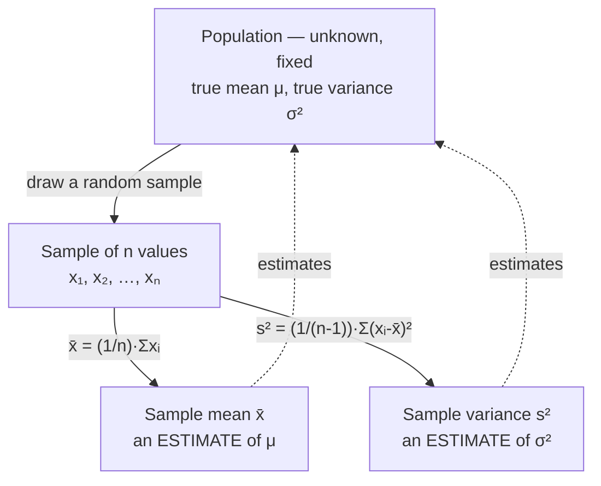

## Learning Objectives

- Compute the sample mean x̄, the median, and the sample variance s² / standard deviation s from a real, finite dataset.
- Explain precisely why x̄ is a *statistic* — a number computed from observed data — and not the same mathematical object as the expectation μ of a random variable's theoretical distribution.
- Justify why the sample variance divides by n − 1 rather than n, and compute both versions on a small dataset to see the difference concretely.
- Choose between the mean and the median as a measure of center for a given dataset, based on skewness and the presence of outliers.
- Interpret the standard deviation as a measure of spread in the same units as the original data, and contrast it with the variance.

## Context & Motivation

Everything covered so far in this discipline's probability half — sample spaces, random variables, the PMF and PDF, expectation and variance — describes a *theoretical* object: a fully specified probability distribution, whose expectation μ = E[X] and variance σ² = Var(X) are exact numbers determined entirely by the distribution's mathematical definition. If you know a random variable X is Binomial(n, p), you can compute E[X] = np and Var(X) = np(1 − p) exactly, without ever running an experiment, because the distribution itself is fully known.

Real data does not work this way. A biologist measuring the wingspan of 40 sparrows, a platform engineer logging the response time of 10,000 API requests, or a pollster surveying 1,200 voters is never handed the underlying distribution — only a finite batch of numbers actually observed. The population's true mean μ and true variance σ² are, in essentially every real situation, unknown and unknowable directly; all that exists is the sample: a list of numbers, x₁, x₂, …, xₙ, drawn (we hope, under some sampling scheme) from that population. Descriptive statistics is the discipline of taking that finite list and computing summary numbers from it — the sample mean x̄, the sample median, the sample variance s² — that describe the data actually in hand.

This might look, at first glance, like the same arithmetic already used to define expectation: sum values and divide by a count. It is closely related, but it is not the same object, and confusing the two is one of the most consequential category errors a newcomer to statistics can make. μ is a fixed (if unknown) property of a distribution; x̄ is a computed number that depends on which particular sample happened to be drawn, and would come out slightly different if the sampling were repeated. This entire cluster of concepts — descriptive statistics, sampling distributions, point estimation, confidence intervals, hypothesis testing — exists precisely to formalize the relationship between the two: x̄ is used as an *estimate* of μ, and the rest of this discipline is about quantifying exactly how much to trust that estimate. Stanford's CS109 devotes its statistics unit to exactly this transition — from probability, where the distribution is given and outcomes are derived, to statistics, where outcomes are given and the distribution must be inferred.

## Core Theory

### The sample mean x̄

Given a sample of n observed values x₁, x₂, …, xₙ, the **sample mean** is

x̄ = (1/n) · Σᵢ xᵢ = (x₁ + x₂ + ⋯ + xₙ) / n

This is arithmetically the same formula used to compute the average of any list of numbers. What makes it a *statistic* rather than a *parameter* is what it is being used for: x̄ is treated as an estimate of the population mean μ — the true, generally unknown average over the entire population the sample was drawn from. If a different sample of n sparrows had been caught and measured, a different x̄ would result, even though the underlying population (and its true μ) never changed. This sample-to-sample variability is the subject of the very next concept in this cluster (sampling distributions); for now, the essential point is definitional: **μ is a fixed number describing a distribution; x̄ is a random variable's realized value, computed from data, used to estimate μ.**

### The median

The **median** is the middle value of the data once sorted: for n odd, it is the single middle observation; for n even, it is the average of the two middle observations. Unlike the mean, the median does not weight every observation by its numeric value — it only cares about rank order. Consequence: the median is far more **robust to outliers** than the mean. Consider five household incomes (in thousands): 40, 45, 50, 55, 500. The mean is (40+45+50+55+500)/5 = 138 — a number that does not represent any household in the data, dragged upward entirely by one extreme value. The median is 50 — squarely in the middle of where four of the five households actually sit. Neither statistic is "wrong"; they answer different questions ("what's the arithmetic center of mass?" versus "what's the typical middle value?"), and the gap between them is itself informative — a large mean-median gap is a signature of a skewed distribution.

### Sample variance and standard deviation

Spread is measured by how far, typically, observations sit from the center. The **sample variance** is

s² = (1/(n − 1)) · Σᵢ (xᵢ − x̄)²

and the **sample standard deviation** is s = √(s²), reported in the same units as the original data (unlike variance, which is in squared units).

The formula looks almost identical to the theoretical variance σ² = E[(X − μ)²], with one deliberate difference: the division is by **n − 1**, not n. This is Bessel's correction, and it exists for a concrete reason. x̄ is computed from the very same sample used to compute the deviations (xᵢ − x̄); by construction, x̄ is the value that makes Σᵢ(xᵢ − x̄) exactly zero — it is the point of minimum total squared deviation for *this particular sample*. Using the sample's own mean as the reference point systematically makes the observed squared deviations a little smaller, on average, than they would be around the true (unknown) population mean μ. Dividing by n instead of n − 1 would therefore produce an estimate of σ² that is systematically too small — a **biased** estimator (the next concept in this cluster treats bias formally). Dividing by n − 1 exactly corrects this systematic underestimate, making s² an *unbiased* estimator of σ²: E[s²] = σ².

Concretely, of the n deviations (x₁ − x̄), …, (xₙ − x̄), only n − 1 are free to vary — the last one is always determined by the constraint that they must sum to zero (since x̄ is their average). This is the sample's **degrees of freedom**: n observations, minus 1 for having already used the data once to estimate x̄, leaves n − 1 independent pieces of information to estimate spread.



### Statistic vs. parameter: the central distinction

This vocabulary is worth stating with full precision, since the rest of this discipline depends on it:

| | Population (theoretical) | Sample (observed) |
|---|---|---|
| Center | μ (parameter — fixed, usually unknown) | x̄ (statistic — computed, varies by sample) |
| Spread | σ² (parameter) | s² (statistic) |
| Status | A property of the distribution itself | A number derived from n particular data points |

A **parameter** describes the population or distribution and is (outside of contrived toy problems) not directly observable. A **statistic** is any quantity computed purely from the sample data. x̄ is a statistic *used to estimate* the parameter μ; it is never literally equal to μ except by coincidence. This is not a pedantic distinction — an entire vocabulary of later concepts (bias, consistency, standard error, confidence intervals) exists only because x̄ ≠ μ in general, and quantifying that gap is the whole game.

## Worked Examples

### Example 1 — computing x̄, median, s² and s by hand

**Problem:** A quality-control engineer samples 8 light bulbs from a production run and records their lifetimes in hours: 980, 1005, 995, 1010, 970, 1000, 1015, 990. Compute the sample mean, median, sample variance, and sample standard deviation.

**Sample mean.** Sum = 980+1005+995+1010+970+1000+1015+990 = 7965. n = 8. x̄ = 7965/8 = 995.625 hours.

**Median.** Sorted: 970, 980, 990, 995, 1000, 1005, 1010, 1015. n = 8 (even), so median = average of the 4th and 5th values = (995 + 1000)/2 = 997.5 hours. (Close to x̄ here — no strong skew.)

**Sample variance.** Deviations from x̄ = 995.625: −15.625, 9.375, −0.625, 14.375, −25.625, 4.375, 19.375, −5.625. Squared: 244.14, 87.89, 0.39, 206.64, 656.64, 19.14, 375.39, 31.64. Sum of squares ≈ 1621.87. Divide by n − 1 = 7: s² ≈ 231.7 hours².

**Sample standard deviation.** s = √231.7 ≈ 15.22 hours.

**Interpretation.** Typical bulbs in this sample run about 995–996 hours, with a typical deviation from that center of roughly 15 hours. Note that dividing by n = 8 instead would have given s² ≈ 1621.87/8 ≈ 202.7 — noticeably smaller, illustrating the systematic downward bias that Bessel's correction repairs.

### Example 2 — mean vs. median under skew

**Problem:** A startup reports the following annual salaries (in thousands of dollars) for its 10 employees: 65, 68, 70, 72, 75, 78, 80, 82, 85, 410 (the last is the founder-CEO). Compute both the mean and median, and discuss which better represents a "typical" employee's salary.

**Mean.** Sum = 65+68+70+72+75+78+80+82+85+410 = 1085. x̄ = 108.5 (thousand).

**Median.** Sorted list is already sorted above; n = 10 (even), median = average of 5th and 6th values = (75 + 78)/2 = 76.5 (thousand).

**Discussion.** The mean, 108.5K, exceeds every single employee's salary except the CEO's — it is not representative of anyone's actual pay. The median, 76.5K, sits right in the middle of the nine ordinary employees' salaries and is a far better single-number summary of what a "typical" employee earns. This is the standard justification for why government statistics on income (median household income, not mean) use the median: income distributions are right-skewed by a long tail of very high earners, exactly like this toy example.

### Example 3 — a quick Python simulation of the n vs. n − 1 divisor

**Problem:** Demonstrate numerically, by repeated sampling from a known population, that dividing by n − 1 gives an unbiased estimate of σ² while dividing by n does not.

```python
import random

random.seed(0)
# True population: uniform on integers 1..100, so true variance sigma^2 is known exactly.
population = list(range(1, 101))
true_var = sum((x - sum(population)/len(population))**2 for x in population) / len(population)

n = 5
trials = 200_000
sum_s2_n_minus_1 = 0.0
sum_s2_n = 0.0

for _ in range(trials):
    sample = random.choices(population, k=n)
    xbar = sum(sample) / n
    sq_dev = sum((x - xbar) ** 2 for x in sample)
    sum_s2_n_minus_1 += sq_dev / (n - 1)
    sum_s2_n += sq_dev / n

print("true sigma^2:      ", round(true_var, 2))
print("avg s^2 (÷ n-1):    ", round(sum_s2_n_minus_1 / trials, 2))
print("avg s^2 (÷ n):      ", round(sum_s2_n / trials, 2))
```

Running this (small samples of n = 5, drawn with replacement, repeated 200,000 times) shows the average of the ÷(n − 1) statistic landing very close to the true σ², while the average of the ÷n statistic lands systematically below it — a direct numerical confirmation of the bias Bessel's correction is designed to remove, and a preview of exactly how "an estimator's expected value" will be evaluated formally in the next concept in this cluster.

## Common Misconceptions & Pitfalls

- **"x̄ and μ are just two names for the same thing."** They are not. μ is a fixed property of the population or distribution; x̄ is computed from one particular sample and would change if the sample were retaken. Example 1's x̄ = 995.625 is specific to those 8 bulbs — a different 8 bulbs from the same production run would almost certainly give a different x̄, even though the production run's true μ never moved.
- **"The mean is always the right measure of center."** Example 2 shows a case where the mean (108.5K) is worse than useless as a "typical value" summary because a single extreme outlier drags it far from where nearly all the data actually sits — the median (76.5K) is the better summary there. The right choice depends on the data's shape, not a fixed rule.
- **"Dividing by n − 1 instead of n is just an arbitrary convention."** It is not arbitrary — it corrects a specific, provable, systematic downward bias that results from estimating deviations around x̄ (which is itself fit to minimize those very deviations) rather than the true, unknown μ. Example 3 demonstrates this bias numerically: the ÷n version consistently underestimates the true variance across repeated sampling, while ÷(n − 1) does not.
- **"A small standard deviation means the data has no outliers."** Standard deviation summarizes typical spread across the *whole* sample; a single, extreme outlier can inflate s substantially even when the rest of the data is tightly clustered, which is exactly why some fields use the median and a robust spread measure (like the interquartile range) instead of the mean and standard deviation when heavy skew or outliers are suspected.
- **"Variance and standard deviation are interchangeable."** They are related but not interchangeable in interpretation: s² is in squared units (hours² in Example 1) and is what enters directly into formulas like the one for sample variance itself; s is in the original units (hours) and is what should be quoted when communicating "typical spread" to someone reading a report.

## Summary

Descriptive statistics take a finite, real, observed dataset and summarize it with the sample mean x̄, median, and sample variance s² / standard deviation s. The single most important conceptual point is that these are *statistics* — numbers computed from actual data, which vary from sample to sample — not the same mathematical objects as the *parameters* μ and σ² that describe a theoretical distribution exactly and are generally unknown in practice. x̄ estimates μ; s² (dividing by n − 1, not n, to correct a systematic bias from using x̄ itself as the reference point) estimates σ². The median offers a center-measure that is robust to outliers and skew in a way the mean is not, and the gap between mean and median is itself a useful diagnostic. This statistic/parameter distinction is the foundation on which sampling distributions, point estimation, and confidence intervals — the next three concepts in this cluster — are all built.

## Documentation Links

- [Stanford CS109 — Course Schedule](http://web.stanford.edu/class/cs109/schedule.html) — doc
- [Stanford CS109 — Course Home](https://web.stanford.edu/class/cs109/index.html) — doc
