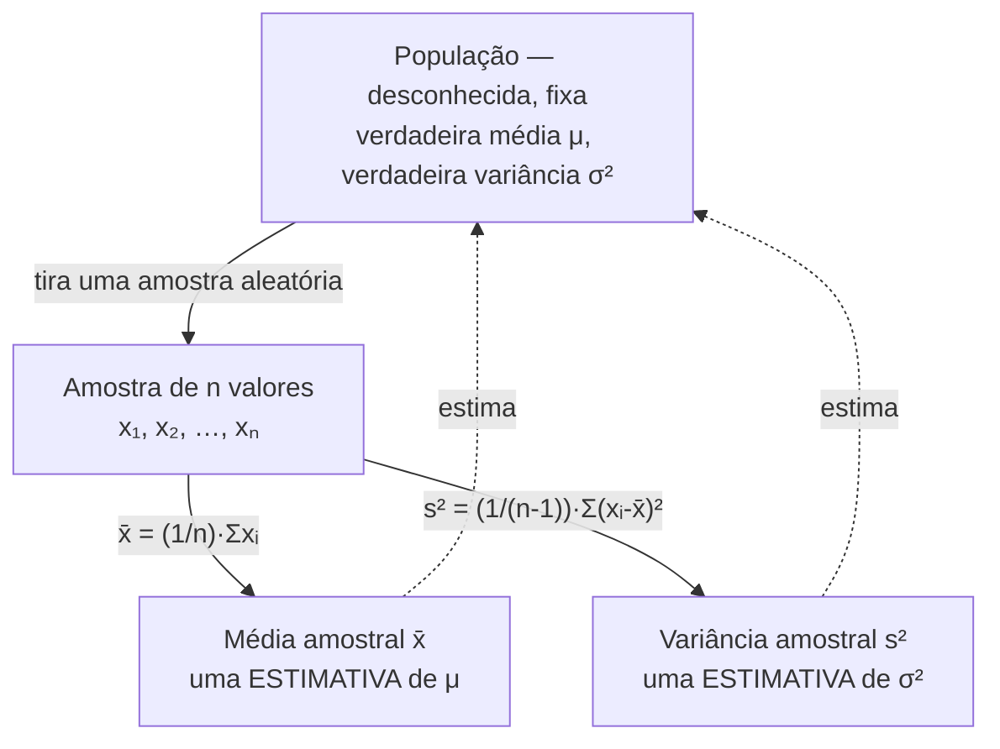

## Objetivos de Aprendizagem

- Computar a média amostral x̄, a mediana, e a variância amostral s² / desvio padrão s a partir de um conjunto de dados real e finito.
- Explicar precisamente por que x̄ é uma *estatística* (um número computado a partir de dados observados) e não o mesmo objeto matemático que a esperança μ da distribuição teórica de uma variável aleatória.
- Justificar por que a variância amostral divide por n − 1 em vez de n, e computar as duas versões num pequeno conjunto de dados para ver a diferença concretamente.
- Escolher entre a média e a mediana como medida de centro para um conjunto de dados dado, com base em assimetria e presença de outliers.
- Interpretar o desvio padrão como uma medida de dispersão nas mesmas unidades dos dados originais, e contrastá-lo com a variância.

## Contexto e Motivação

Tudo coberto até agora na metade de probabilidade desta disciplina (espaços amostrais, variáveis aleatórias, a FMP e a FDP, esperança e variância) descreve um objeto *teórico*: uma distribuição de probabilidade totalmente especificada, cuja esperança μ = E[X] e variância σ² = Var(X) são números exatos determinados inteiramente pela definição matemática da distribuição. Se você sabe que uma variável aleatória X é Binomial(n, p), você pode computar E[X] = np e Var(X) = np(1 − p) exatamente, sem nunca rodar um experimento, porque a própria distribuição é totalmente conhecida.

Dados reais não funcionam assim. Um biólogo medindo a envergadura de 40 pardais, um engenheiro de plataforma registrando o tempo de resposta de 10.000 requisições de API, ou um pesquisador entrevistando 1.200 eleitores nunca recebe a distribuição subjacente, só um lote finito de números de fato observados. A verdadeira média μ e a verdadeira variância σ² da população são, em essencialmente toda situação real, desconhecidas e diretamente incognoscíveis; tudo que existe é a amostra: uma lista de números, x₁, x₂, …, xₙ, tirada (esperamos, sob algum esquema de amostragem) daquela população. Estatística descritiva é a disciplina de pegar essa lista finita e computar dela números resumo (a média amostral x̄, a mediana amostral, a variância amostral s²) que descrevem os dados de fato em mãos.

Isso pode parecer, à primeira vista, a mesma aritmética já usada para definir esperança: somar valores e dividir por uma contagem. É intimamente relacionado, mas não é o mesmo objeto, e confundir os dois é um dos erros de categoria mais consequentes que um recém-chegado à estatística pode cometer. μ é uma propriedade fixa (mesmo que desconhecida) de uma distribuição; x̄ é um número computado que depende de qual amostra particular aconteceu de ser tirada, e sairia ligeiramente diferente se a amostragem fosse repetida. Todo esse conjunto de conceitos (estatística descritiva, distribuições de amostragem, estimação pontual, intervalos de confiança, teste de hipóteses) existe precisamente para formalizar a relação entre os dois: x̄ é usada como uma *estimativa* de μ, e o resto desta disciplina trata de quantificar exatamente quanto confiar naquela estimativa. O CS109 de Stanford dedica sua unidade de estatística exatamente a essa transição: de probabilidade, onde a distribuição é dada e resultados são derivados, para estatística, onde resultados são dados e a distribuição precisa ser inferida.

## Teoria Central

### A média amostral x̄

Dada uma amostra de n valores observados x₁, x₂, …, xₙ, a **média amostral** é

x̄ = (1/n) · Σᵢ xᵢ = (x₁ + x₂ + ⋯ + xₙ) / n

Isso é aritmeticamente a mesma fórmula usada para computar a média de qualquer lista de números. O que a torna uma *estatística* em vez de um *parâmetro* é para que está sendo usada: x̄ é tratada como uma estimativa da média populacional μ, a verdadeira média, geralmente desconhecida, sobre toda a população da qual a amostra foi tirada. Se uma amostra diferente de n pardais tivesse sido capturada e medida, resultaria uma x̄ diferente, mesmo que a população subjacente (e sua verdadeira μ) nunca tenha mudado. Essa variabilidade de amostra para amostra é o assunto do próximo conceito neste grupo (distribuições de amostragem); por ora, o ponto essencial é definicional: **μ é um número fixo descrevendo uma distribuição; x̄ é o valor realizado de uma variável aleatória, computado a partir de dados, usado para estimar μ.**

### A mediana

A **mediana** é o valor do meio dos dados uma vez ordenados: para n ímpar, é a única observação do meio; para n par, é a média das duas observações do meio. Diferente da média, a mediana não pondera cada observação por seu valor numérico; só se importa com a ordem de classificação. Consequência: a mediana é muito mais **robusta a outliers** que a média. Considere cinco rendas familiares (em milhares): 40, 45, 50, 55, 500. A média é (40+45+50+55+500)/5 = 138, um número que não representa nenhuma família nos dados, arrastado para cima inteiramente por um valor extremo. A mediana é 50, exatamente no meio de onde quatro das cinco famílias de fato estão. Nenhuma das duas estatísticas está "errada"; respondem perguntas diferentes ("qual é o centro de massa aritmético?" versus "qual é o valor do meio típico?"), e a lacuna entre elas é ela mesma informativa; uma grande lacuna média-mediana é uma assinatura de uma distribuição assimétrica.

### Variância amostral e desvio padrão

Dispersão é medida por quão longe, tipicamente, observações ficam do centro. A **variância amostral** é

s² = (1/(n − 1)) · Σᵢ (xᵢ − x̄)²

e o **desvio padrão amostral** é s = √(s²), reportado nas mesmas unidades dos dados originais (diferente de variância, que está em unidades quadradas).

A fórmula parece quase idêntica à variância teórica σ² = E[(X − μ)²], com uma diferença deliberada: a divisão é por **n − 1**, não n. Essa é a correção de Bessel, e existe por uma razão concreta. x̄ é computada a partir da mesma amostra usada para computar os desvios (xᵢ − x̄); por construção, x̄ é o valor que faz Σᵢ(xᵢ − x̄) exatamente zero, é o ponto de desvio quadrado total mínimo para *esta amostra particular*. Usar a própria média da amostra como ponto de referência sistematicamente torna os desvios quadrados observados um pouco menores, em média, do que seriam ao redor da verdadeira (desconhecida) média populacional μ. Dividir por n em vez de n − 1 portanto produziria uma estimativa de σ² sistematicamente pequena demais, um estimador **viesado** (o próximo conceito neste grupo trata viés formalmente). Dividir por n − 1 corrige exatamente essa subestimação sistemática, tornando s² um estimador *não viesado* de σ²: E[s²] = σ².

Concretamente, dos n desvios (x₁ − x̄), …, (xₙ − x̄), só n − 1 são livres para variar; o último é sempre determinado pela restrição de que precisam somar zero (já que x̄ é sua média). Esses são os **graus de liberdade** da amostra: n observações, menos 1 por já ter usado os dados uma vez para estimar x̄, deixa n − 1 pedaços independentes de informação para estimar dispersão.



### Estatística vs. parâmetro: a distinção central

Este vocabulário vale a pena declarar com precisão total, já que o resto desta disciplina depende dele:

| | População (teórica) | Amostra (observada) |
|---|---|---|
| Centro | μ (parâmetro, fixo, geralmente desconhecido) | x̄ (estatística, computada, varia por amostra) |
| Dispersão | σ² (parâmetro) | s² (estatística) |
| Status | Uma propriedade da própria distribuição | Um número derivado de n pontos de dados particulares |

Um **parâmetro** descreve a população ou distribuição e não é (fora de problemas de brinquedo artificiais) diretamente observável. Uma **estatística** é qualquer quantidade computada puramente a partir dos dados da amostra. x̄ é uma estatística *usada para estimar* o parâmetro μ; nunca é literalmente igual a μ exceto por coincidência. Isso não é uma distinção pedante; um vocabulário inteiro de conceitos posteriores (viés, consistência, erro padrão, intervalos de confiança) existe só porque x̄ ≠ μ em geral, e quantificar essa lacuna é o jogo inteiro.

## Exemplos Resolvidos

### Exemplo 1: computando x̄, mediana, s² e s à mão

**Problema:** um engenheiro de controle de qualidade amostra 8 lâmpadas de uma linha de produção e registra suas vidas úteis em horas: 980, 1005, 995, 1010, 970, 1000, 1015, 990. Compute a média amostral, a mediana, a variância amostral, e o desvio padrão amostral.

**Média amostral.** Soma = 980+1005+995+1010+970+1000+1015+990 = 7965. n = 8. x̄ = 7965/8 = 995,625 horas.

**Mediana.** Ordenado: 970, 980, 990, 995, 1000, 1005, 1010, 1015. n = 8 (par), então mediana = média do 4º e 5º valores = (995 + 1000)/2 = 997,5 horas. (Perto de x̄ aqui, sem assimetria forte.)

**Variância amostral.** Desvios de x̄ = 995,625: −15,625, 9,375, −0,625, 14,375, −25,625, 4,375, 19,375, −5,625. Ao quadrado: 244,14, 87,89, 0,39, 206,64, 656,64, 19,14, 375,39, 31,64. Soma dos quadrados ≈ 1621,87. Divide por n − 1 = 7: s² ≈ 231,7 horas².

**Desvio padrão amostral.** s = √231,7 ≈ 15,22 horas.

**Interpretação.** Lâmpadas típicas nesta amostra duram cerca de 995 a 996 horas, com um desvio típico daquele centro de aproximadamente 15 horas. Note que dividir por n = 8 em vez disso teria dado s² ≈ 1621,87/8 ≈ 202,7, notavelmente menor, ilustrando o viés sistemático para baixo que a correção de Bessel repara.

### Exemplo 2: média vs. mediana sob assimetria

**Problema:** uma startup reporta os seguintes salários anuais (em milhares de reais) para seus 10 funcionários: 65, 68, 70, 72, 75, 78, 80, 82, 85, 410 (o último é o fundador-CEO). Compute tanto a média quanto a mediana, e discuta qual representa melhor o salário "típico" de um funcionário.

**Média.** Soma = 65+68+70+72+75+78+80+82+85+410 = 1085. x̄ = 108,5 (mil).

**Mediana.** A lista já está ordenada acima; n = 10 (par), mediana = média do 5º e 6º valores = (75 + 78)/2 = 76,5 (mil).

**Discussão.** A média, 108,5 mil, excede o salário de todo funcionário exceto o do CEO; não é representativa da remuneração real de ninguém. A mediana, 76,5 mil, fica bem no meio dos salários dos nove funcionários comuns e é um resumo de número único muito melhor do que um funcionário "típico" ganha. Essa é a justificativa padrão de por que estatísticas governamentais de renda (renda familiar mediana, não média) usam a mediana: distribuições de renda são assimétricas à direita por uma longa cauda de rendimentos muito altos, exatamente como este exemplo simplificado.

### Exemplo 3: uma simulação rápida em Python do divisor n vs. n − 1

**Problema:** demonstre numericamente, por amostragem repetida de uma população conhecida, que dividir por n − 1 dá uma estimativa não viesada de σ² enquanto dividir por n não dá.

```python
import random

random.seed(0)
# População verdadeira: uniforme sobre inteiros 1..100, então a variância verdadeira é conhecida exatamente.
populacao = list(range(1, 101))
var_verdadeira = sum((x - sum(populacao)/len(populacao))**2 for x in populacao) / len(populacao)

n = 5
tentativas = 200_000
soma_s2_n_menos_1 = 0.0
soma_s2_n = 0.0

for _ in range(tentativas):
    amostra = random.choices(populacao, k=n)
    xbarra = sum(amostra) / n
    desvio_quad = sum((x - xbarra) ** 2 for x in amostra)
    soma_s2_n_menos_1 += desvio_quad / (n - 1)
    soma_s2_n += desvio_quad / n

print("sigma^2 verdadeira:      ", round(var_verdadeira, 2))
print("s^2 médio (÷ n-1):        ", round(soma_s2_n_menos_1 / tentativas, 2))
print("s^2 médio (÷ n):          ", round(soma_s2_n / tentativas, 2))
```

Rodar isso (amostras pequenas de n = 5, tiradas com reposição, repetidas 200.000 vezes) mostra a média da estatística ÷(n − 1) caindo bem perto da verdadeira σ², enquanto a média da estatística ÷n cai sistematicamente abaixo dela, uma confirmação numérica direta do viés que a correção de Bessel é projetada para remover, e uma prévia de exatamente como "o valor esperado de um estimador" vai ser avaliado formalmente no próximo conceito deste grupo.

## Equívocos Comuns e Armadilhas

- **"x̄ e μ são só dois nomes para a mesma coisa."** Não são. μ é uma propriedade fixa da população ou distribuição; x̄ é computada a partir de uma amostra particular e mudaria se a amostra fosse retirada de novo. O x̄ = 995,625 do Exemplo 1 é específico daquelas 8 lâmpadas; 8 lâmpadas diferentes da mesma linha de produção quase certamente dariam uma x̄ diferente, mesmo que a verdadeira μ da linha de produção nunca tenha mudado.
- **"A média é sempre a medida certa de centro."** O Exemplo 2 mostra um caso onde a média (108,5 mil) é pior que inútil como resumo de "valor típico" porque um único outlier extremo a arrasta para longe de onde quase todos os dados de fato estão; a mediana (76,5 mil) é o resumo melhor ali. A escolha certa depende da forma dos dados, não de uma regra fixa.
- **"Dividir por n − 1 em vez de n é só uma convenção arbitrária."** Não é arbitrário; corrige um viés sistemático específico e provável que resulta de estimar desvios ao redor de x̄ (que é ela mesma ajustada para minimizar exatamente esses desvios) em vez da verdadeira e desconhecida μ. O Exemplo 3 demonstra esse viés numericamente: a versão ÷n subestima consistentemente a verdadeira variância através de amostragem repetida, enquanto ÷(n − 1) não.
- **"Um desvio padrão pequeno significa que os dados não têm outliers."** Desvio padrão resume dispersão típica através de toda a amostra; um único outlier extremo pode inflar s substancialmente mesmo quando o resto dos dados está firmemente agrupado, que é exatamente por que alguns campos usam a mediana e uma medida de dispersão robusta (como o intervalo interquartil) em vez da média e do desvio padrão quando forte assimetria ou outliers são suspeitos.
- **"Variância e desvio padrão são intercambiáveis."** São relacionados mas não intercambiáveis em interpretação: s² está em unidades quadradas (horas² no Exemplo 1) e é o que entra diretamente em fórmulas como a da própria variância amostral; s está nas unidades originais (horas) e é o que deveria ser citado ao comunicar "dispersão típica" para alguém lendo um relatório.

## Resumo

Estatística descritiva pega um conjunto de dados finito, real e observado e o resume com a média amostral x̄, a mediana, e a variância amostral s² / desvio padrão s. O ponto conceitual mais importante é que essas são *estatísticas* (números computados a partir de dados reais, que variam de amostra para amostra), não os mesmos objetos matemáticos que os *parâmetros* μ e σ² que descrevem uma distribuição teórica exatamente e são geralmente desconhecidos na prática. x̄ estima μ; s² (dividindo por n − 1, não n, para corrigir um viés sistemático de usar a própria x̄ como ponto de referência) estima σ². A mediana oferece uma medida de centro que é robusta a outliers e assimetria de um jeito que a média não é, e a lacuna entre média e mediana é ela mesma um diagnóstico útil. Essa distinção estatística/parâmetro é a fundação sobre a qual distribuições de amostragem, estimação pontual, e intervalos de confiança, os próximos três conceitos neste grupo, são todos construídos.

## Documentation Links

- [Stanford CS109 — Course Schedule](http://web.stanford.edu/class/cs109/schedule.html) — doc
- [Stanford CS109 — Course Home](https://web.stanford.edu/class/cs109/index.html) — doc
