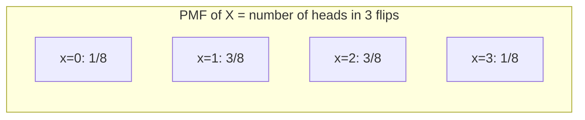

## Learning Objectives

- Define a random variable as a function mapping outcomes in a sample space to real numbers.
- Define the probability mass function (PMF) of a discrete random variable and state its two defining properties.
- Build a PMF table by hand from a sample space and an underlying probability assignment.
- Compute probabilities of events defined in terms of a random variable (e.g., P(X ≤ 3)) directly from its PMF.
- Use a simple simulation to sanity-check a PMF computed analytically.

## Context & Motivation

Sample spaces and events, as defined earlier in this track, can contain outcomes of any kind at all — coin sequences, card hands, colors, categorical labels — and probability theory works perfectly well over any of them. But most of the tools built on top of probability — averages, spreads, sums of repeated trials, limit theorems — are fundamentally arithmetic: they add, multiply, and compare numbers. To connect the abstract machinery of sample spaces and events to that arithmetic machinery, there needs to be a bridge that converts outcomes into numbers in the first place. That bridge is the **random variable**, and it is one of the most important conceptual shifts in this entire curriculum: from this point forward, most of probability theory is really about numbers derived from outcomes, rather than the raw outcomes themselves.

The reason this shift matters practically is that a random variable lets a single number — "the number of heads," "the sum of two dice," "the number of defective items in a batch" — carry forward all of the probability structure of the underlying experiment without needing to keep referring back to the original sample space every time. Once outcomes are converted to numbers via a random variable X, the entire probabilistic content of X is captured by its **probability mass function**: a table or formula listing every value X can take, together with the probability of each. Everything computed later in this track — expectation, variance, named distributions like the Binomial and Poisson — is built directly on top of the PMF, so getting comfortable constructing one by hand, from first principles, is the essential first skill.

MIT's 6.041 and Stanford's CS109 both introduce random variables with exactly the two running examples used below — counting heads in coin flips, and summing two dice — precisely because both are simple enough to enumerate completely by hand, yet rich enough to already show the two defining properties of a PMF (non-negativity and summing to 1) doing real, non-trivial work, since neither example has a trivially uniform PMF.

## Core Theory

### A random variable as a function on the sample space

A **random variable** X is a function X: Ω → ℝ that assigns a real number X(ω) to every outcome ω in the sample space. It is important to be precise here: X is not itself random in the sense of being unpredictable magic — it is an ordinary, fixed, deterministic function. The randomness comes entirely from which outcome ω the experiment happens to produce; once ω is fixed, X(ω) is a completely determined number.

For example, flip a fair coin 3 times: Ω = {HHH, HHT, HTH, THH, HTT, THT, TTH, TTT}, all 8 outcomes equally likely (probability 1/8 each). Define X = "number of heads." Then X is the function X(HHH) = 3, X(HHT) = 2, X(HTH) = 2, X(THH) = 2, X(HTT) = 1, X(THT) = 1, X(TTH) = 1, X(TTT) = 0 — a specific number attached to each of the 8 outcomes.

A random variable is called **discrete** if the set of values it can take is finite or countably infinite (as opposed to continuous random variables, covered later, which can take any value in an interval of real numbers). This concept covers discrete random variables exclusively.

### The probability mass function (PMF)

The **probability mass function** of a discrete random variable X, written pX(x) or P(X = x), gives the probability that X takes on the specific value x:

pX(x) = P(X = x) = P({ω ∈ Ω : X(ω) = x})

— read: "the probability of the event consisting of every outcome that X maps to the value x." A PMF must satisfy exactly two defining properties, both of which follow directly from the axioms of probability applied to the underlying event {ω : X(ω) = x}:

1. **Non-negativity**: pX(x) ≥ 0 for every possible value x, since it is itself a probability.
2. **Normalization**: Σₓ pX(x) = 1, where the sum runs over every value x that X can possibly take — because the events {X = x} for different x are disjoint (X can only take one value per outcome) and their union is all of Ω, so by additivity their probabilities must sum to P(Ω) = 1.

Any function satisfying these two properties is a valid PMF; conversely, checking a proposed PMF against exactly these two conditions is the standard way to verify it before using it further — directly analogous to checking a proposed probability assignment against Kolmogorov's axioms.

Once the PMF is known, the probability of any event described in terms of X — not just a single value, but a range or condition — is obtained by summing the PMF over every value satisfying that condition: P(X ∈ S) = Σₓ∈S pX(x) for any set S of possible values.

### Building a PMF by hand: number of heads in 3 coin flips

Returning to the 3-coin-flip example above, group the 8 equally likely outcomes by their X-value:

| x (number of heads) | outcomes mapping to x | count | pX(x) |
|---|---|---|---|
| 0 | TTT | 1 | 1/8 |
| 1 | HTT, THT, TTH | 3 | 3/8 |
| 2 | HHT, HTH, THH | 3 | 3/8 |
| 3 | HHH | 1 | 1/8 |

Check normalization: 1/8 + 3/8 + 3/8 + 1/8 = 8/8 = 1. ✓ Check non-negativity: all four values are positive. ✓ This PMF is exactly the Binomial distribution with n = 3 trials and success probability 1/2, though naming and generalizing that pattern is the subject of a later concept — here the point is only that the table above was built entirely by direct counting over the equally-likely sample space, using nothing beyond the definition of a PMF.



### Building a PMF by hand: sum of two fair dice

Let Ω = {(i,j) : i,j ∈ {1,…,6}}, 36 equally likely outcomes, and let X = "sum of the two dice," so X((i,j)) = i + j, ranging from 2 to 12. Counting how many of the 36 pairs give each sum:

| x | pairs summing to x | count | pX(x) |
|---|---|---|---|
| 2 | (1,1) | 1 | 1/36 |
| 3 | (1,2),(2,1) | 2 | 2/36 |
| 4 | (1,3),(2,2),(3,1) | 3 | 3/36 |
| 5 | (1,4),(2,3),(3,2),(4,1) | 4 | 4/36 |
| 6 | (1,5),…,(5,1) | 5 | 5/36 |
| 7 | (1,6),…,(6,1) | 6 | 6/36 |
| 8 | (2,6),…,(6,2) | 5 | 5/36 |
| 9 | (3,6),…,(6,3) | 4 | 4/36 |
| 10 | (4,6),(5,5),(6,4) | 3 | 3/36 |
| 11 | (5,6),(6,5) | 2 | 2/36 |
| 12 | (6,6) | 1 | 1/36 |

Check normalization: 1+2+3+4+5+6+5+4+3+2+1 = 36, so Σ pX(x) = 36/36 = 1. ✓ This PMF is the well-known symmetric "triangle" shape peaking at x = 7, which is precisely why 7 is the most commonly rolled sum with two dice, and it is a direct byproduct of simple counting, not of any special property of dice.

## Worked Examples

### Example 1 — computing an event probability from a PMF table

**Problem:** Using the two-dice PMF built above, find P(X ≤ 4) and P(X is even).

**P(X ≤ 4).** Sum the PMF over x ∈ {2, 3, 4}: pX(2) + pX(3) + pX(4) = 1/36 + 2/36 + 3/36 = 6/36 = 1/6.

**P(X is even).** Sum over x ∈ {2,4,6,8,10,12}: 1/36 + 3/36 + 5/36 + 5/36 + 3/36 + 1/36 = 18/36 = 1/2. Interestingly, the sum of two dice is even exactly half the time — which also follows from a parity argument (the sum is even exactly when both dice are odd or both are even, and each of those two cases has probability (1/2)(1/2) = 1/4, totaling 1/2), a nice independent check that the table-based count is correct.

### Example 2 — verifying a proposed PMF and finding a missing value

**Problem:** A discrete random variable Y takes values in {1, 2, 3, 4} with pY(1) = 0.1, pY(2) = 0.3, pY(3) = c, pY(4) = 0.2, for some constant c. Find c, and compute P(Y ≥ 3).

**Find c.** Normalization requires the four probabilities to sum to 1: 0.1 + 0.3 + c + 0.2 = 1, so 0.6 + c = 1, giving c = 0.4. (Check non-negativity: 0.4 ≥ 0. ✓ So this is now a valid PMF.)

**P(Y ≥ 3).** Sum pY(3) + pY(4) = 0.4 + 0.2 = 0.6.

This is the standard pattern whenever a PMF is given with one unknown value: normalization is not optional bookkeeping, it is the equation that pins the unknown down uniquely, exactly the way it was used to check (and here, to complete) a valid probability assignment.

### Example 3 — sanity-checking a PMF with a Monte Carlo simulation

**Problem:** Confirm the 3-coin-flip PMF built above (P(X=0)=1/8, P(X=1)=3/8, P(X=2)=3/8, P(X=3)=1/8) by simulating a large number of trials.

A short simulation flips 3 fair coins many times, tallies how often each head-count occurs, and compares the resulting relative frequencies to the analytical PMF:

```python
import random
from collections import Counter

def flip_three():
    return sum(random.choice([0, 1]) for _ in range(3))  # 1 = heads

trials = 200_000
counts = Counter(flip_three() for _ in range(trials))

for x in range(4):
    simulated = counts[x] / trials
    theoretical = [1/8, 3/8, 3/8, 1/8][x]
    print(f"x={x}: simulated={simulated:.4f}  theoretical={theoretical:.4f}")
```

Running this for 200,000 trials should produce simulated relative frequencies close to 0.125, 0.375, 0.375, 0.125 — typically agreeing to within about ±0.003 given the sample size, with the small remaining discrepancy attributable to ordinary sampling variability. This kind of simulation is a genuinely useful habit whenever a PMF is derived by hand: if the simulated frequencies and the theoretical PMF disagree by more than sampling noise can plausibly explain, that's a strong signal the by-hand derivation has an error worth re-checking, well before the discrepancy is used for anything further downstream (such as computing expectation, covered next).

## Common Misconceptions & Pitfalls

- **"A random variable is inherently unpredictable — it 'is' the randomness."** A random variable is a fixed, deterministic function X: Ω → ℝ; all of the randomness lives in which outcome ω actually occurs, not in the function itself. Once ω is known, X(ω) is a single determined number with no randomness left in it at all.
- **"The PMF just needs to be non-negative — any non-negative assignment works."** Both properties are required simultaneously: non-negativity *and* summing to exactly 1 over all possible values. Example 2 shows normalization actively used to solve for an unknown probability — a proposed assignment failing to sum to 1 (as in the analogous check for general probability measures) is simply invalid, however sensible the individual numbers look.
- **"P(X ≤ 4) means look up pX(4) alone."** As Example 1 shows, this notation asks for the probability of the *event* {X ≤ 4}, requiring a sum over every qualifying value (here x = 2, 3, 4 for the two-dice example, since 2 is the minimum), not a single PMF table lookup.
- **"Two different random variables built on the same sample space must have related PMFs."** X = "number of heads" and, say, a random variable defined as "1 if all three flips match, 0 otherwise" are both built from the identical Ω, yet have completely different domains and completely different PMFs — the sample space only supplies the underlying randomness; the PMF depends entirely on how the specific random variable maps outcomes to numbers.

## Summary

A random variable X: Ω → ℝ is a deterministic function converting outcomes into numbers, and its probability mass function pX(x) = P(X = x) captures the complete probabilistic behavior of X through two required properties: non-negativity and summing to 1 across every possible value. Building a PMF by hand — as done above for the number of heads in three coin flips and the sum of two dice — is a direct exercise in counting outcomes within the underlying equally-likely sample space and grouping them by the value X assigns. Once a PMF is in hand, any event phrased in terms of X reduces to summing the PMF over the qualifying values, and a Monte Carlo simulation offers a fast, practical way to sanity-check that a hand-derived PMF is correct before relying on it further. This PMF machinery is the direct foundation for expectation, variance, and every named discrete distribution covered next in this track.

## Documentation Links

- [MIT 6.041 — Lecture Notes (OCW)](https://ocw.mit.edu/courses/6-041-probabilistic-systems-analysis-and-applied-probability-fall-2010/pages/lecture-notes/) — doc
- [Stanford CS109 — Course Schedule](http://web.stanford.edu/class/cs109/schedule.html) — doc
