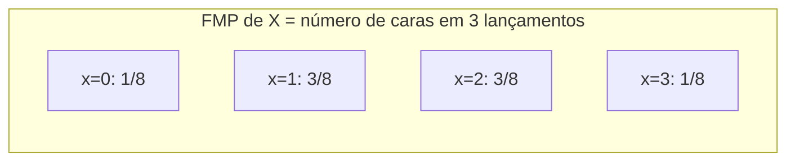

## Objetivos de Aprendizagem

- Definir uma variável aleatória como uma função mapeando resultados num espaço amostral para números reais.
- Definir a função massa de probabilidade (FMP) de uma variável aleatória discreta e declarar suas duas propriedades definidoras.
- Construir uma tabela de FMP à mão a partir de um espaço amostral e uma atribuição de probabilidade subjacente.
- Computar probabilidades de eventos definidos em termos de uma variável aleatória (por exemplo, P(X ≤ 3)) diretamente de sua FMP.
- Usar uma simulação simples para checar a sanidade de uma FMP computada analiticamente.

## Contexto e Motivação

Espaços amostrais e eventos, como definidos anteriormente nesta trilha, podem conter resultados de qualquer tipo (sequências de moeda, mãos de carta, cores, rótulos categóricos), e a teoria da probabilidade funciona perfeitamente bem sobre qualquer um deles. Mas a maioria das ferramentas construídas em cima da probabilidade (médias, dispersões, somas de tentativas repetidas, teoremas de limite) são fundamentalmente aritméticas: somam, multiplicam e comparam números. Para conectar a maquinaria abstrata de espaços amostrais e eventos a essa maquinaria aritmética, precisa haver uma ponte que converte resultados em números em primeiro lugar. Essa ponte é a **variável aleatória**, e é uma das mudanças conceituais mais importantes de todo este currículo: a partir deste ponto, a maior parte da teoria da probabilidade é de fato sobre números derivados de resultados, não sobre os resultados crus em si.

A razão de essa mudança importar praticamente é que uma variável aleatória permite que um único número (o "número de caras", "a soma de dois dados", "o número de itens defeituosos num lote") carregue adiante toda a estrutura de probabilidade do experimento subjacente sem precisar voltar a se referir ao espaço amostral original toda vez. Uma vez que resultados são convertidos em números via uma variável aleatória X, todo o conteúdo probabilístico de X é capturado por sua **função massa de probabilidade**: uma tabela ou fórmula listando todo valor que X pode assumir, junto com a probabilidade de cada um. Tudo computado mais adiante nesta trilha (esperança, variância, distribuições nomeadas como a Binomial e a de Poisson) é construído diretamente em cima da FMP, então ficar confortável construindo uma à mão, a partir de princípios básicos, é a habilidade essencial inicial.

O 6.041 do MIT e o CS109 de Stanford introduzem variáveis aleatórias com exatamente os dois exemplos correntes usados abaixo (contar caras em lançamentos de moeda, e somar dois dados) precisamente porque os dois são simples o bastante para enumerar completamente à mão, mas ricos o bastante para já mostrar as duas propriedades definidoras de uma FMP (não negatividade e somar 1) fazendo trabalho real e não trivial, já que nenhum dos exemplos tem uma FMP trivialmente uniforme.

## Teoria Central

### Uma variável aleatória como uma função sobre o espaço amostral

Uma **variável aleatória** X é uma função X: Ω → ℝ que atribui um número real X(ω) a todo resultado ω no espaço amostral. É importante ser preciso aqui: X não é ela mesma aleatória no sentido de ser mágica imprevisível; é uma função ordinária, fixa e determinística. A aleatoriedade vem inteiramente de qual resultado ω o experimento acontece de produzir; uma vez que ω é fixado, X(ω) é um número completamente determinado.

Por exemplo, lance uma moeda justa 3 vezes: Ω = {CCC, CCK, CKC, KCC, CKK, KCK, KKC, KKK}, todos os 8 resultados igualmente prováveis (probabilidade 1/8 cada). Defina X = "número de caras". Então X é a função X(CCC) = 3, X(CCK) = 2, X(CKC) = 2, X(KCC) = 2, X(CKK) = 1, X(KCK) = 1, X(KKC) = 1, X(KKK) = 0, um número específico anexado a cada um dos 8 resultados.

Uma variável aleatória se chama **discreta** se o conjunto de valores que pode assumir é finito ou contavelmente infinito (em contraste com variáveis aleatórias contínuas, cobertas mais adiante, que podem assumir qualquer valor num intervalo de números reais). Este conceito cobre variáveis aleatórias discretas exclusivamente.

### A função massa de probabilidade (FMP)

A **função massa de probabilidade** de uma variável aleatória discreta X, escrita pX(x) ou P(X = x), dá a probabilidade de X assumir o valor específico x:

pX(x) = P(X = x) = P({ω ∈ Ω : X(ω) = x})

lê-se: "a probabilidade do evento consistindo de todo resultado que X mapeia para o valor x". Uma FMP precisa satisfazer exatamente duas propriedades definidoras, ambas decorrendo diretamente dos axiomas de probabilidade aplicados ao evento subjacente {ω : X(ω) = x}:

1. **Não negatividade**: pX(x) ≥ 0 para todo valor possível x, já que é ela mesma uma probabilidade.
2. **Normalização**: Σₓ pX(x) = 1, onde a soma percorre todo valor x que X possivelmente pode assumir, porque os eventos {X = x} para x diferentes são disjuntos (X só pode assumir um valor por resultado) e sua união é todo Ω, então por aditividade suas probabilidades precisam somar P(Ω) = 1.

Qualquer função satisfazendo essas duas propriedades é uma FMP válida; reciprocamente, checar uma FMP proposta contra exatamente essas duas condições é a forma padrão de verificá-la antes de usá-la mais adiante, diretamente análogo a checar uma atribuição de probabilidade proposta contra os axiomas de Kolmogorov.

Uma vez que a FMP é conhecida, a probabilidade de qualquer evento descrito em termos de X, não só um único valor, mas uma faixa ou condição, é obtida somando a FMP sobre todo valor satisfazendo aquela condição: P(X ∈ S) = Σₓ∈S pX(x) para qualquer conjunto S de valores possíveis.

### Construindo uma FMP à mão: número de caras em 3 lançamentos de moeda

Voltando ao exemplo de 3 lançamentos de moeda acima, agrupe os 8 resultados igualmente prováveis pelo seu valor de X:

| x (número de caras) | resultados mapeando para x | contagem | pX(x) |
|---|---|---|---|
| 0 | KKK | 1 | 1/8 |
| 1 | CKK, KCK, KKC | 3 | 3/8 |
| 2 | CCK, CKC, KCC | 3 | 3/8 |
| 3 | CCC | 1 | 1/8 |

Checa normalização: 1/8 + 3/8 + 3/8 + 1/8 = 8/8 = 1. ✓ Checa não negatividade: os quatro valores são positivos. ✓ Esta FMP é exatamente a distribuição Binomial com n = 3 tentativas e probabilidade de sucesso 1/2, embora nomear e generalizar esse padrão seja o assunto de um conceito posterior; aqui o ponto é só que a tabela acima foi construída inteiramente por contagem direta sobre o espaço amostral igualmente provável, usando nada além da definição de uma FMP.



### Construindo uma FMP à mão: soma de dois dados justos

Seja Ω = {(i,j) : i,j ∈ {1,…,6}}, 36 resultados igualmente prováveis, e seja X = "soma dos dois dados", então X((i,j)) = i + j, variando de 2 a 12. Contando quantos dos 36 pares dão cada soma:

| x | pares somando x | contagem | pX(x) |
|---|---|---|---|
| 2 | (1,1) | 1 | 1/36 |
| 3 | (1,2),(2,1) | 2 | 2/36 |
| 4 | (1,3),(2,2),(3,1) | 3 | 3/36 |
| 5 | (1,4),(2,3),(3,2),(4,1) | 4 | 4/36 |
| 6 | (1,5),…,(5,1) | 5 | 5/36 |
| 7 | (1,6),…,(6,1) | 6 | 6/36 |
| 8 | (2,6),…,(6,2) | 5 | 5/36 |
| 9 | (3,6),…,(6,3) | 4 | 4/36 |
| 10 | (4,6),(5,5),(6,4) | 3 | 3/36 |
| 11 | (5,6),(6,5) | 2 | 2/36 |
| 12 | (6,6) | 1 | 1/36 |

Checa normalização: 1+2+3+4+5+6+5+4+3+2+1 = 36, então Σ pX(x) = 36/36 = 1. ✓ Esta FMP é a conhecida forma de "triângulo" simétrica com pico em x = 7, que é precisamente por que 7 é a soma mais comumente tirada com dois dados, e é um subproduto direto de contagem simples, não de nenhuma propriedade especial dos dados.

## Exemplos Resolvidos

### Exemplo 1: computando uma probabilidade de evento a partir de uma tabela de FMP

**Problema:** usando a FMP de dois dados construída acima, encontre P(X ≤ 4) e P(X é par).

**P(X ≤ 4).** Some a FMP sobre x ∈ {2, 3, 4}: pX(2) + pX(3) + pX(4) = 1/36 + 2/36 + 3/36 = 6/36 = 1/6.

**P(X é par).** Some sobre x ∈ {2,4,6,8,10,12}: 1/36 + 3/36 + 5/36 + 5/36 + 3/36 + 1/36 = 18/36 = 1/2. Interessantemente, a soma de dois dados é par exatamente metade do tempo, o que também decorre de um argumento de paridade (a soma é par exatamente quando os dois dados são ímpares ou os dois são pares, e cada um desses dois casos tem probabilidade (1/2)(1/2) = 1/4, totalizando 1/2), uma boa checagem independente de que a contagem baseada em tabela está correta.

### Exemplo 2: verificando uma FMP proposta e encontrando um valor ausente

**Problema:** uma variável aleatória discreta Y assume valores em {1, 2, 3, 4} com pY(1) = 0,1, pY(2) = 0,3, pY(3) = c, pY(4) = 0,2, para alguma constante c. Encontre c, e compute P(Y ≥ 3).

**Encontra c.** Normalização exige que as quatro probabilidades somem 1: 0,1 + 0,3 + c + 0,2 = 1, então 0,6 + c = 1, dando c = 0,4. (Checa não negatividade: 0,4 ≥ 0. ✓ Então esta agora é uma FMP válida.)

**P(Y ≥ 3).** Soma pY(3) + pY(4) = 0,4 + 0,2 = 0,6.

Este é o padrão padrão sempre que uma FMP é dada com um valor desconhecido: normalização não é contabilidade opcional, é a equação que fixa o desconhecido unicamente, exatamente do jeito que foi usada para checar (e aqui, para completar) uma atribuição de probabilidade válida.

### Exemplo 3: checando a sanidade de uma FMP com uma simulação de Monte Carlo

**Problema:** confirme a FMP de 3 lançamentos de moeda construída acima (P(X=0)=1/8, P(X=1)=3/8, P(X=2)=3/8, P(X=3)=1/8) simulando um grande número de tentativas.

Uma breve simulação lança 3 moedas justas muitas vezes, contabiliza com que frequência cada contagem de caras ocorre, e compara as frequências relativas resultantes com a FMP analítica:

```python
import random
from collections import Counter

def lanca_tres():
    return sum(random.choice([0, 1]) for _ in range(3))  # 1 = cara

tentativas = 200_000
contagens = Counter(lanca_tres() for _ in range(tentativas))

for x in range(4):
    simulado = contagens[x] / tentativas
    teorico = [1/8, 3/8, 3/8, 1/8][x]
    print(f"x={x}: simulado={simulado:.4f}  teorico={teorico:.4f}")
```

Rodar isso para 200.000 tentativas deveria produzir frequências relativas simuladas próximas de 0,125, 0,375, 0,375, 0,125, tipicamente concordando dentro de cerca de ±0,003 dado o tamanho da amostra, com a pequena discrepância restante atribuível a variabilidade de amostragem comum. Esse tipo de simulação é um hábito genuinamente útil sempre que uma FMP é derivada à mão: se as frequências simuladas e a FMP teórica discordam mais do que ruído de amostragem consegue plausivelmente explicar, isso é um sinal forte de que a derivação à mão tem um erro que vale a pena checar de novo, bem antes de a discrepância ser usada para qualquer coisa mais adiante (como computar esperança, coberto a seguir).

## Equívocos Comuns e Armadilhas

- **"Uma variável aleatória é inerentemente imprevisível, ela 'é' a aleatoriedade."** Uma variável aleatória é uma função fixa e determinística X: Ω → ℝ; toda a aleatoriedade mora em qual resultado ω de fato ocorre, não na própria função. Uma vez que ω é conhecido, X(ω) é um único número determinado sem nenhuma aleatoriedade restante.
- **"A FMP só precisa ser não negativa, qualquer atribuição não negativa funciona."** As duas propriedades são exigidas simultaneamente: não negatividade *e* somar exatamente 1 sobre todos os valores possíveis. O Exemplo 2 mostra normalização sendo ativamente usada para resolver uma probabilidade desconhecida; uma atribuição proposta que falha em somar 1 (como na checagem análoga para medidas de probabilidade gerais) é simplesmente inválida, por mais sensatos que os números individuais pareçam.
- **"P(X ≤ 4) significa buscar pX(4) sozinho."** Como o Exemplo 1 mostra, essa notação pede a probabilidade do *evento* {X ≤ 4}, exigindo uma soma sobre todo valor qualificado (aqui x = 2, 3, 4 para o exemplo de dois dados, já que 2 é o mínimo), não uma única busca na tabela de FMP.
- **"Duas variáveis aleatórias diferentes construídas sobre o mesmo espaço amostral precisam ter FMPs relacionadas."** X = "número de caras" e, digamos, uma variável aleatória definida como "1 se os três lançamentos coincidem, 0 caso contrário" são ambas construídas a partir do Ω idêntico, mas têm domínios completamente diferentes e FMPs completamente diferentes; o espaço amostral só fornece a aleatoriedade subjacente; a FMP depende inteiramente de como a variável aleatória específica mapeia resultados para números.

## Resumo

Uma variável aleatória X: Ω → ℝ é uma função determinística convertendo resultados em números, e sua função massa de probabilidade pX(x) = P(X = x) captura o comportamento probabilístico completo de X através de duas propriedades exigidas: não negatividade e soma igual a 1 através de todo valor possível. Construir uma FMP à mão, como feito acima para o número de caras em três lançamentos de moeda e a soma de dois dados, é um exercício direto de contar resultados dentro do espaço amostral igualmente provável subjacente e agrupá-los pelo valor que X atribui. Uma vez que uma FMP está em mãos, qualquer evento frasado em termos de X se reduz a somar a FMP sobre os valores qualificados, e uma simulação de Monte Carlo oferece uma forma rápida e prática de checar a sanidade de que uma FMP derivada à mão está correta antes de confiar nela mais adiante. Essa maquinaria de FMP é a fundação direta para esperança, variância, e toda distribuição discreta nomeada coberta a seguir nesta trilha.

## Documentation Links

- [MIT 6.041 — Lecture Notes (OCW)](https://ocw.mit.edu/courses/6-041-probabilistic-systems-analysis-and-applied-probability-fall-2010/pages/lecture-notes/) — doc
- [Stanford CS109 — Course Schedule](http://web.stanford.edu/class/cs109/schedule.html) — doc
