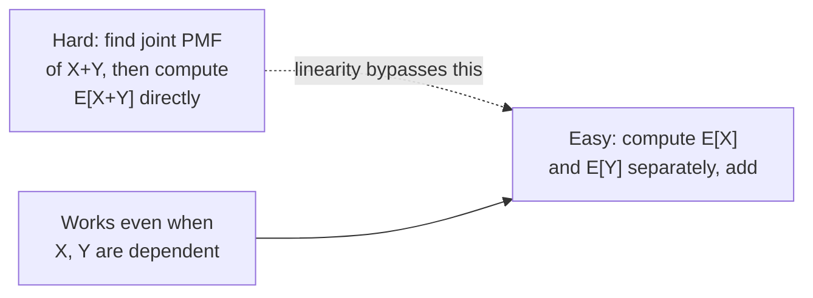

## Learning Objectives

- Define the expectation E[X] of a discrete random variable as the probability-weighted average of its values, and compute it directly from a PMF.
- State and apply linearity of expectation, E[X+Y] = E[X]+E[Y], including in cases where X and Y are dependent.
- Define variance as E[(X−E[X])²], and derive the computational shortcut Var(X) = E[X²] − (E[X])².
- Distinguish what expectation and variance each measure (central tendency versus spread), and interpret both in the context of a concrete random variable.
- Solve a counting-style expectation problem by decomposing a complicated random variable into a sum of simple indicator variables.

## Context & Motivation

A probability mass function tells you everything there is to know about a discrete random variable — every value it can take, and the exact probability of each — but "everything" is often more detail than a decision needs. If X is the number of customers who arrive at a shop in an hour, the full PMF might list probabilities for every value from 0 to some large number; what a manager actually wants to know is usually much smaller: on average, how many customers show up, and how much does that number typically vary from day to day? Expectation and variance are the two numbers that answer exactly these questions, and they earn their place as the two most-used summaries of a random variable precisely because a huge amount of practical reasoning about randomness — comparing two strategies, estimating a total cost, judging whether an outcome is unusually far from typical — can be done with just these two numbers, without ever writing out the full distribution.

This material follows directly from the discrete random variables and PMFs already introduced: expectation and variance are both computed *from* a PMF, so nothing here requires new probabilistic machinery, only a new way of summarizing information that was already fully present. What makes expectation particularly powerful, though, is a property that looks almost too convenient to be true when first encountered: the expectation of a sum of random variables is always the sum of their expectations, with no assumption of independence required. MIT's 6.041 course (Probabilistic Systems Analysis) builds an enormous amount of downstream material — from analyzing randomized algorithms to computing expected values of complicated combinatorial quantities — on exactly this one fact, because it lets a hard problem (find E[X] for some complicated X) be replaced by an easy one (write X as a sum of simple pieces, and add their easy-to-compute expectations), even when the pieces influence each other in complicated ways that would make a *joint* calculation intractable.

Variance rounds out the picture by measuring what expectation alone cannot: two random variables can have identical expectations while behaving completely differently in practice — one tightly clustered around its average, the other swinging wildly between extremes. Quantifying that difference precisely, and doing so in a way that supports further algebraic manipulation (the E[X²] − (E[X])² shortcut derived below is used constantly in later topics, including the variance of sums of independent random variables and the definition of standard deviation), is the second half of this concept.

## Core Theory

### Expectation of a discrete random variable

**Definition.** For a discrete random variable X with PMF P(X=x), the **expectation** (or **expected value**, or **mean**) of X is

E[X] = Σₓ x · P(X=x)

where the sum ranges over every value x that X can take. E[X] is a probability-weighted average: each possible value is weighted by how likely it is, rather than every value counting equally the way an ordinary arithmetic mean would.

E[X] need not be a value X can actually take. A fair six-sided die has E[X] = (1+2+3+4+5+6)/6 = 3.5 — no roll of the die ever shows 3.5, yet 3.5 is the correct long-run average, because over many rolls the values above 3.5 and below 3.5 balance out symmetrically. This is a genuinely important point about what expectation means: it is a statement about long-run average behavior across repetitions, not a prediction about any single outcome.

**Expectation of a function of X.** For a function g applied to X, the expectation of g(X) is computed the same way, without needing to first find the PMF of g(X) itself:

E[g(X)] = Σₓ g(x) · P(X=x)

This fact (sometimes called "the law of the unconscious statistician," because it is used so often that it barely feels like it needs a name) is what makes E[X²] computable directly from the PMF of X, which is exactly what the variance shortcut below relies on.

### Linearity of expectation

**Theorem.** For any two random variables X and Y (discrete, on the same probability space), and any constants a, b:

E[aX + bY] = a·E[X] + b·E[Y]

Critically, this holds **regardless of whether X and Y are independent or dependent** — no assumption about the relationship between X and Y is needed at all. This is what makes linearity of expectation such a disproportionately useful tool: it lets E[X+Y] be computed by simply computing E[X] and E[Y] separately and adding, even in situations where finding the *joint* distribution of X and Y (which would be needed for almost any other kind of joint calculation) is difficult or effectively impossible.

**Why it's true.** For the discrete case, writing out E[X+Y] using the joint PMF P(X=x,Y=y) and grouping terms:

E[X+Y] = Σₓ Σᵧ (x+y)·P(X=x,Y=y) = Σₓ Σᵧ x·P(X=x,Y=y) + Σₓ Σᵧ y·P(X=x,Y=y)

In the first double sum, summing P(X=x,Y=y) over all y for a fixed x recovers exactly the marginal P(X=x) (this is the "summing out" operation covered in the next concept), so the first term collapses to Σₓ x·P(X=x) = E[X]; symmetrically the second term collapses to E[Y]. No step in this argument used independence — grouping and summing out works regardless of how X and Y relate to each other. This is the entire proof, and it generalizes immediately (by induction) to any finite sum: E[X₁+X₂+⋯+Xₙ] = E[X₁]+E[X₂]+⋯+E[Xₙ].

### Variance and standard deviation

**Definition.** The **variance** of X measures the average squared distance of X from its own mean:

Var(X) = E[(X − E[X])²]

Squaring is essential rather than incidental: it makes every deviation contribute positively (so deviations above and below the mean don't cancel each other out the way they would if left unsquared — indeed E[X − E[X]] is always exactly 0, which is why the raw, unsquared deviation is useless as a spread measure), and it penalizes large deviations more than small ones.

**Computational shortcut.** Expanding the square using linearity of expectation:

Var(X) = E[X² − 2X·E[X] + (E[X])²]
       = E[X²] − 2·E[X]·E[X] + (E[X])²    (pulling the constants E[X] and (E[X])² out using linearity)
       = E[X²] − 2(E[X])² + (E[X])²
       = E[X²] − (E[X])²

This shortcut, **Var(X) = E[X²] − (E[X])²**, is used far more often in practice than the definitional formula, because it only requires two ordinary expectation computations (E[X] and E[X²], the latter via the law of the unconscious statistician above) rather than first finding E[X], then computing a whole new PMF-weighted sum of squared deviations.

**Standard deviation** is defined as SD(X) = √Var(X) — the square root brings the units back in line with X itself (variance is in "squared units," which is often awkward to interpret directly; if X is measured in dollars, Var(X) is in dollars², while SD(X) is back in dollars).

**A key non-linearity to flag:** unlike expectation, variance is *not* generally linear — Var(X+Y) ≠ Var(X) + Var(Y) in general, because cross-terms involving how X and Y move together (covariance) appear when Y depends on X. The equality Var(X+Y) = Var(X) + Var(Y) does hold when X and Y are independent, but that is a genuinely additional fact, not a free consequence of the definition the way linearity of expectation is.

## Worked Examples

### Example 1 — expectation and variance from a PMF directly

**Problem:** A random variable X has PMF P(X=1) = 0.2, P(X=2) = 0.5, P(X=3) = 0.3. Find E[X] and Var(X).

**E[X]:**

E[X] = 1(0.2) + 2(0.5) + 3(0.3) = 0.2 + 1.0 + 0.9 = 2.1

**E[X²]**, using the law of the unconscious statistician with g(x) = x²:

E[X²] = 1²(0.2) + 2²(0.5) + 3²(0.3) = 0.2 + 2.0 + 2.7 = 4.9

**Var(X)**, via the shortcut:

Var(X) = E[X²] − (E[X])² = 4.9 − (2.1)² = 4.9 − 4.41 = 0.49

So SD(X) = √0.49 = 0.7. As a check, the same variance can be computed the slow way from the definition: Σₓ (x−2.1)²·P(X=x) = (1−2.1)²(0.2) + (2−2.1)²(0.5) + (3−2.1)²(0.3) = (1.21)(0.2) + (0.01)(0.5) + (0.81)(0.3) = 0.242 + 0.005 + 0.243 = 0.49. ✓ Same answer, confirming the shortcut, at the cost of noticeably more arithmetic.

### Example 2 — linearity of expectation solving a problem the joint approach cannot easily reach

**Problem:** A hat contains n tickets numbered 1 through n. All n tickets are drawn out one at a time, in a uniformly random order, and placed into n numbered boxes (the ticket drawn i-th goes into box i). Call a **match** any position i where the ticket placed in box i is ticket number i. What is the expected number of matches?

**Why the direct approach is hard.** Let X be the total number of matches. Finding the PMF of X directly requires counting, for each possible value k, how many of the n! possible arrangements produce exactly k matches — a genuinely intricate combinatorial calculation (it involves inclusion-exclusion and derangements) that gets messy fast.

**The linearity shortcut.** Define, for each position i from 1 to n, an **indicator random variable** Xᵢ = 1 if position i is a match, and Xᵢ = 0 otherwise. Then the total number of matches is simply X = X₁ + X₂ + ⋯ + Xₙ — a sum of n simple pieces, however complicated their *joint* behavior (the Xᵢ are certainly not independent: knowing X₁=1 changes the probabilities for the rest, since one ticket has been used up).

By linearity of expectation — which, crucially, requires no independence assumption — E[X] = E[X₁] + E[X₂] + ⋯ + E[Xₙ], regardless of how tangled the dependence between the Xᵢ actually is.

Each individual E[Xᵢ] is easy: Xᵢ is 1 with probability equal to the chance that a uniformly random permutation places ticket i in position i, which by symmetry is exactly 1/n for every position i (each of the n tickets is equally likely to land in any given box). So E[Xᵢ] = 1·(1/n) + 0·(1 − 1/n) = 1/n.

Summing:

E[X] = n · (1/n) = 1

The expected number of matches is exactly 1, regardless of n — a strikingly clean answer to a problem whose direct PMF is genuinely complicated, obtained entirely by decomposing X into indicators and never once computing a joint distribution.

### Example 3 — expectation and variance of a shifted and scaled random variable

**Problem:** A random variable X has E[X] = 4 and Var(X) = 9. A new random variable is defined as Y = 3X − 5. Find E[Y] and Var(Y).

**E[Y]**, by linearity (with a = 3 treated as the coefficient on X and the constant −5 contributing directly, since E[constant] = constant):

E[Y] = E[3X − 5] = 3·E[X] − 5 = 3(4) − 5 = 12 − 5 = 7

**Var(Y).** Variance does not follow the same linear rule as expectation for scaling: shifting by a constant does not change spread at all (Var(X + c) = Var(X) for any constant c, since every value shifts by the same amount and the mean shifts to match, leaving deviations from the mean unchanged), while scaling by a constant a multiplies variance by a² (not a), since Var(aX) = E[(aX − a·E[X])²] = E[a²(X−E[X])²] = a²·Var(X). So:

Var(Y) = Var(3X − 5) = Var(3X) = 3² · Var(X) = 9 · 9 = 81

Note the constant −5 dropped out of the variance entirely (it shifts every value identically, so it cannot affect spread), while the coefficient 3 was squared, not applied directly — a common point of confusion addressed further below.

## Common Misconceptions & Pitfalls

- **"E[X] is the most likely value of X, or a value X can actually take."** E[X] is a weighted average, not a mode and not a guaranteed achievable outcome. The fair-die example above (E[X] = 3.5) makes this concrete: no single roll ever produces 3.5, yet it is the correct long-run average across many rolls.
- **"Linearity of expectation requires X and Y to be independent."** It does not — E[X+Y] = E[X]+E[Y] holds unconditionally, for any X and Y whatsoever, dependent or not. Example 2 above is a direct demonstration: the indicator variables Xᵢ are strongly dependent on one another (drawing one ticket changes the odds for the rest), yet their expectations still add up correctly to give E[X] = 1.
- **"Since expectation is linear, variance must be too — Var(X+Y) = Var(X) + Var(Y) always."** False in general; that equality requires X and Y to be independent (or, more precisely, uncorrelated). When X and Y are dependent, cross-terms (covariance) enter the calculation and the simple sum can be wrong in either direction.
- **"Var(aX) = a·Var(X), matching the linear scaling rule for expectation."** As Example 3 shows, scaling gets squared: Var(aX) = a²·Var(X), because variance is built from a squared deviation. A negative scale factor, say a = −2, gives Var(−2X) = 4·Var(X) — still positive, since variance can never be negative, even though the scale factor itself was negative.
- **"Var(X) = E[X²]" or "Var(X) = E[X]²" (dropping one part of the shortcut formula).** The correct shortcut is Var(X) = E[X²] − (E[X])² — both the second moment and the square of the mean are required, and confusing E[X²] with (E[X])² (or forgetting to subtract at all) is one of the most common arithmetic slips with this formula; Example 1 shows both quantities computed separately and explicitly to guard against this.

## Summary

Expectation E[X] = Σₓ x·P(X=x) summarizes a random variable's long-run average behavior with a single probability-weighted number, and it can be extended to any function g(X) via E[g(X)] = Σₓ g(x)·P(X=x). Its most powerful property is linearity — E[aX+bY] = a·E[X]+b·E[Y] — which holds unconditionally, even for dependent random variables, and which turns hard joint-distribution problems (as in the ticket-and-box matching example) into easy sums of simple pieces via indicator variables. Variance, Var(X) = E[(X−E[X])²], measures spread around the mean, and is almost always computed via the shortcut Var(X) = E[X²] − (E[X])², derived from expanding the square and applying linearity. Unlike expectation, variance is not generally additive over sums (independence is required for that), and scaling a random variable by a constant a multiplies its variance by a², not by a — both of these are genuine asymmetries between how expectation and variance behave under linear transformations, and both are common sources of error.

## Documentation Links

- [MIT 6.041 — Lecture Notes (OCW)](https://ocw.mit.edu/courses/6-041-probabilistic-systems-analysis-and-applied-probability-fall-2010/pages/lecture-notes/) — doc
- [ACM/IEEE CS2013 — Full Curriculum Guidelines](https://www.acm.org/binaries/content/assets/education/cs2013_web_final.pdf) — doc
