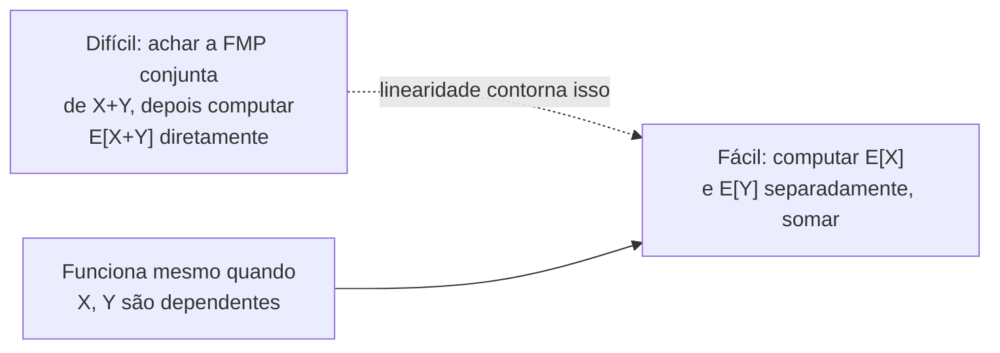

## Objetivos de Aprendizagem

- Definir a esperança E[X] de uma variável aleatória discreta como a média ponderada por probabilidade de seus valores, e computá-la diretamente de uma FMP.
- Declarar e aplicar linearidade da esperança, E[X+Y] = E[X]+E[Y], incluindo em casos onde X e Y são dependentes.
- Definir variância como E[(X−E[X])²], e derivar o atalho computacional Var(X) = E[X²] − (E[X])².
- Distinguir o que esperança e variância cada uma mede (tendência central versus dispersão), e interpretar as duas no contexto de uma variável aleatória concreta.
- Resolver um problema de esperança no estilo de contagem decompondo uma variável aleatória complicada numa soma de variáveis indicadoras simples.

## Contexto e Motivação

Uma função massa de probabilidade diz tudo que há para saber sobre uma variável aleatória discreta (todo valor que pode assumir, e a probabilidade exata de cada um), mas "tudo" frequentemente é mais detalhe do que uma decisão precisa. Se X é o número de clientes que chegam numa loja numa hora, a FMP completa poderia listar probabilidades para todo valor de 0 até algum número grande; o que um gerente de fato quer saber geralmente é muito menor: em média, quantos clientes aparecem, e quanto esse número tipicamente varia de dia para dia? Esperança e variância são os dois números que respondem exatamente essas perguntas, e ganham seu lugar como os dois resumos mais usados de uma variável aleatória precisamente porque uma quantidade enorme de raciocínio prático sobre aleatoriedade (comparar duas estratégias, estimar um custo total, julgar se um resultado está incomumente longe do típico) pode ser feita com só esses dois números, sem nunca escrever a distribuição completa.

Este material decorre diretamente das variáveis aleatórias discretas e FMPs já introduzidas: esperança e variância são ambas computadas *a partir de* uma FMP, então nada aqui exige nova maquinaria probabilística, só uma nova forma de resumir informação que já estava totalmente presente. O que torna a esperança particularmente poderosa, porém, é uma propriedade que parece boa demais para ser verdade quando encontrada pela primeira vez: a esperança de uma soma de variáveis aleatórias é sempre a soma de suas esperanças, sem exigir suposição alguma de independência. O curso 6.041 do MIT (Análise de Sistemas Probabilísticos) constrói uma quantidade enorme de material posterior (de analisar algoritmos aleatorizados a computar valores esperados de quantidades combinatórias complicadas) exatamente sobre esse único fato, porque permite que um problema difícil (achar E[X] para algum X complicado) seja substituído por um fácil (escrever X como uma soma de pedaços simples, e somar suas esperanças fáceis de computar), mesmo quando os pedaços se influenciam mutuamente de formas complicadas que tornariam um cálculo *conjunto* intratável.

Variância completa o quadro medindo o que esperança sozinha não consegue: duas variáveis aleatórias podem ter esperanças idênticas enquanto se comportam de forma completamente diferente na prática, uma firmemente agrupada ao redor de sua média, a outra oscilando violentamente entre extremos. Quantificar essa diferença precisamente, e fazer isso de uma forma que suporte manipulação algébrica adicional (o atalho E[X²] − (E[X])² derivado abaixo é usado constantemente em tópicos posteriores, incluindo a variância de somas de variáveis aleatórias independentes e a definição de desvio padrão), é a segunda metade deste conceito.

## Teoria Central

### Esperança de uma variável aleatória discreta

**Definição.** Para uma variável aleatória discreta X com FMP P(X=x), a **esperança** (ou **valor esperado**, ou **média**) de X é

E[X] = Σₓ x · P(X=x)

onde a soma percorre todo valor x que X pode assumir. E[X] é uma média ponderada por probabilidade: cada valor possível é ponderado por quão provável ele é, em vez de todo valor contar igualmente do jeito que uma média aritmética comum faria.

E[X] não precisa ser um valor que X pode de fato assumir. Um dado justo de seis lados tem E[X] = (1+2+3+4+5+6)/6 = 3,5, nenhuma rolagem do dado jamais mostra 3,5, mas ainda assim 3,5 é a média correta de longo prazo, porque através de muitas rolagens os valores acima de 3,5 e abaixo de 3,5 se equilibram simetricamente. Este é um ponto genuinamente importante sobre o que esperança significa: é uma afirmação sobre comportamento médio de longo prazo através de repetições, não uma predição sobre qualquer resultado único.

**Esperança de uma função de X.** Para uma função g aplicada a X, a esperança de g(X) é computada da mesma forma, sem precisar primeiro achar a FMP do próprio g(X):

E[g(X)] = Σₓ g(x) · P(X=x)

Esse fato (às vezes chamado "a lei do estatístico inconsciente", porque é usado tão frequentemente que quase não parece precisar de um nome) é o que torna E[X²] computável diretamente da FMP de X, que é exatamente do que o atalho de variância abaixo depende.

### Linearidade da esperança

**Teorema.** Para quaisquer duas variáveis aleatórias X e Y (discretas, no mesmo espaço de probabilidade), e quaisquer constantes a, b:

E[aX + bY] = a·E[X] + b·E[Y]

Criticamente, isso vale **independentemente de X e Y serem independentes ou dependentes**, nenhuma suposição sobre a relação entre X e Y é necessária de forma alguma. Isso é o que torna linearidade da esperança uma ferramenta desproporcionalmente útil: permite que E[X+Y] seja computado simplesmente computando E[X] e E[Y] separadamente e somando, mesmo em situações onde achar a distribuição *conjunta* de X e Y (que seria necessária para quase qualquer outro tipo de cálculo conjunto) é difícil ou efetivamente impossível.

**Por que é verdade.** Para o caso discreto, escrevendo E[X+Y] usando a FMP conjunta P(X=x,Y=y) e agrupando termos:

E[X+Y] = Σₓ Σᵧ (x+y)·P(X=x,Y=y) = Σₓ Σᵧ x·P(X=x,Y=y) + Σₓ Σᵧ y·P(X=x,Y=y)

Na primeira soma dupla, somar P(X=x,Y=y) sobre todo y para um x fixo recupera exatamente a marginal P(X=x) (essa é a operação de "somar para fora" coberta no próximo conceito), então o primeiro termo colapsa para Σₓ x·P(X=x) = E[X]; simetricamente o segundo termo colapsa para E[Y]. Nenhum passo neste argumento usou independência; agrupar e somar para fora funciona independentemente de como X e Y se relacionam entre si. Essa é a prova inteira, e generaliza imediatamente (por indução) para qualquer soma finita: E[X₁+X₂+⋯+Xₙ] = E[X₁]+E[X₂]+⋯+E[Xₙ].

### Variância e desvio padrão

**Definição.** A **variância** de X mede a distância quadrada média de X de sua própria média:

Var(X) = E[(X − E[X])²]

Elevar ao quadrado é essencial, não incidental: faz todo desvio contribuir positivamente (então desvios acima e abaixo da média não se cancelam do jeito que fariam se deixados sem quadrar, de fato E[X − E[X]] é sempre exatamente 0, que é por que o desvio cru, sem quadrar, é inútil como medida de dispersão), e penaliza desvios grandes mais que pequenos.

**Atalho computacional.** Expandindo o quadrado usando linearidade da esperança:

Var(X) = E[X² − 2X·E[X] + (E[X])²]
       = E[X²] − 2·E[X]·E[X] + (E[X])²    (puxando as constantes E[X] e (E[X])² para fora usando linearidade)
       = E[X²] − 2(E[X])² + (E[X])²
       = E[X²] − (E[X])²

Esse atalho, **Var(X) = E[X²] − (E[X])²**, é usado muito mais frequentemente na prática que a fórmula de definição, porque só exige duas computações de esperança comuns (E[X] e E[X²], a última via a lei do estatístico inconsciente acima) em vez de primeiro achar E[X], depois computar uma soma inteiramente nova ponderada por FMP de desvios quadrados.

**Desvio padrão** é definido como DP(X) = √Var(X), a raiz quadrada traz as unidades de volta em linha com o próprio X (variância está em "unidades quadradas", que frequentemente é estranho de interpretar diretamente; se X é medido em reais, Var(X) está em reais², enquanto DP(X) está de volta em reais).

**Uma não linearidade chave para sinalizar:** diferente de esperança, variância *não* é geralmente linear, Var(X+Y) ≠ Var(X) + Var(Y) em geral, porque termos cruzados envolvendo como X e Y se movem juntas (covariância) aparecem quando Y depende de X. A igualdade Var(X+Y) = Var(X) + Var(Y) de fato vale quando X e Y são independentes, mas isso é um fato genuinamente adicional, não uma consequência gratuita da definição do jeito que linearidade da esperança é.

## Exemplos Resolvidos

### Exemplo 1: esperança e variância a partir de uma FMP diretamente

**Problema:** uma variável aleatória X tem FMP P(X=1) = 0,2, P(X=2) = 0,5, P(X=3) = 0,3. Encontre E[X] e Var(X).

**E[X]:**

E[X] = 1(0,2) + 2(0,5) + 3(0,3) = 0,2 + 1,0 + 0,9 = 2,1

**E[X²]**, usando a lei do estatístico inconsciente com g(x) = x²:

E[X²] = 1²(0,2) + 2²(0,5) + 3²(0,3) = 0,2 + 2,0 + 2,7 = 4,9

**Var(X)**, via o atalho:

Var(X) = E[X²] − (E[X])² = 4,9 − (2,1)² = 4,9 − 4,41 = 0,49

Então DP(X) = √0,49 = 0,7. Como checagem, a mesma variância pode ser computada do jeito lento a partir da definição: Σₓ (x−2,1)²·P(X=x) = (1−2,1)²(0,2) + (2−2,1)²(0,5) + (3−2,1)²(0,3) = (1,21)(0,2) + (0,01)(0,5) + (0,81)(0,3) = 0,242 + 0,005 + 0,243 = 0,49. ✓ Mesma resposta, confirmando o atalho, ao custo de aritmética notavelmente maior.

### Exemplo 2: linearidade da esperança resolvendo um problema que a abordagem conjunta não consegue alcançar facilmente

**Problema:** um chapéu contém n tíquetes numerados de 1 a n. Todos os n tíquetes são tirados um de cada vez, em ordem uniformemente aleatória, e colocados em n caixas numeradas (o tíquete tirado em i-ésimo lugar vai para a caixa i). Chame de **acerto** qualquer posição i onde o tíquete colocado na caixa i é o tíquete número i. Qual é o número esperado de acertos?

**Por que a abordagem direta é difícil.** Seja X o número total de acertos. Achar a FMP de X diretamente exige contar, para cada valor possível k, quantos dos n! arranjos possíveis produzem exatamente k acertos, um cálculo combinatório genuinamente intrincado (envolve inclusão-exclusão e desarranjos) que fica confuso rápido.

**O atalho de linearidade.** Defina, para cada posição i de 1 a n, uma **variável aleatória indicadora** Xᵢ = 1 se a posição i é um acerto, e Xᵢ = 0 caso contrário. Então o número total de acertos é simplesmente X = X₁ + X₂ + ⋯ + Xₙ, uma soma de n pedaços simples, por mais complicado que seu comportamento *conjunto* seja (os Xᵢ certamente não são independentes: saber X₁=1 muda as probabilidades para o resto, já que um tíquete foi usado).

Por linearidade da esperança, que, crucialmente, não exige suposição de independência, E[X] = E[X₁] + E[X₂] + ⋯ + E[Xₙ], independentemente de quão emaranhada a dependência entre os Xᵢ de fato seja.

Cada E[Xᵢ] individual é fácil: Xᵢ é 1 com probabilidade igual à chance de uma permutação uniformemente aleatória colocar o tíquete i na posição i, que por simetria é exatamente 1/n para toda posição i (cada um dos n tíquetes é igualmente provável de cair em qualquer caixa dada). Então E[Xᵢ] = 1·(1/n) + 0·(1 − 1/n) = 1/n.

Somando:

E[X] = n · (1/n) = 1

O número esperado de acertos é exatamente 1, independentemente de n, uma resposta impressionantemente limpa para um problema cuja FMP direta é genuinamente complicada, obtida inteiramente decompondo X em indicadoras e nunca computando uma distribuição conjunta.

### Exemplo 3: esperança e variância de uma variável aleatória deslocada e escalada

**Problema:** uma variável aleatória X tem E[X] = 4 e Var(X) = 9. Uma nova variável aleatória é definida como Y = 3X − 5. Encontre E[Y] e Var(Y).

**E[Y]**, por linearidade (com a = 3 tratado como o coeficiente de X e a constante −5 contribuindo diretamente, já que E[constante] = constante):

E[Y] = E[3X − 5] = 3·E[X] − 5 = 3(4) − 5 = 12 − 5 = 7

**Var(Y).** Variância não segue a mesma regra linear que esperança para escala: deslocar por uma constante não muda dispersão de forma alguma (Var(X + c) = Var(X) para qualquer constante c, já que todo valor desloca pela mesma quantidade e a média desloca para corresponder, deixando desvios da média inalterados), enquanto escalar por uma constante a multiplica variância por a² (não a), já que Var(aX) = E[(aX − a·E[X])²] = E[a²(X−E[X])²] = a²·Var(X). Então:

Var(Y) = Var(3X − 5) = Var(3X) = 3² · Var(X) = 9 · 9 = 81

Note que a constante −5 caiu fora da variância completamente (desloca todo valor identicamente, então não pode afetar dispersão), enquanto o coeficiente 3 foi elevado ao quadrado, não aplicado diretamente, um ponto de confusão comum tratado mais adiante.

## Equívocos Comuns e Armadilhas

- **"E[X] é o valor mais provável de X, ou um valor que X pode de fato assumir."** E[X] é uma média ponderada, não uma moda e não um resultado garantidamente alcançável. O exemplo do dado justo acima (E[X] = 3,5) torna isso concreto: nenhuma rolagem única jamais produz 3,5, mas ainda assim é a média correta de longo prazo através de muitas rolagens.
- **"Linearidade da esperança exige que X e Y sejam independentes."** Não exige, E[X+Y] = E[X]+E[Y] vale incondicionalmente, para quaisquer X e Y, dependentes ou não. O Exemplo 2 acima é uma demonstração direta: as variáveis indicadoras Xᵢ são fortemente dependentes umas das outras (tirar um tíquete muda as chances para o resto), mas suas esperanças ainda somam corretamente para dar E[X] = 1.
- **"Já que esperança é linear, variância também precisa ser, Var(X+Y) = Var(X) + Var(Y) sempre."** Falso em geral; essa igualdade exige que X e Y sejam independentes (ou, mais precisamente, não correlacionadas). Quando X e Y são dependentes, termos cruzados (covariância) entram no cálculo e a soma simples pode estar errada em qualquer direção.
- **"Var(aX) = a·Var(X), correspondendo à regra de escala linear para esperança."** Como o Exemplo 3 mostra, escala é elevada ao quadrado: Var(aX) = a²·Var(X), porque variância é construída a partir de um desvio quadrado. Um fator de escala negativo, digamos a = −2, dá Var(−2X) = 4·Var(X), ainda positivo, já que variância nunca pode ser negativa, mesmo que o próprio fator de escala fosse negativo.
- **"Var(X) = E[X²]" ou "Var(X) = E[X]²" (deixando de fora uma parte da fórmula de atalho).** O atalho correto é Var(X) = E[X²] − (E[X])², tanto o segundo momento quanto o quadrado da média são exigidos, e confundir E[X²] com (E[X])² (ou esquecer de subtrair completamente) é um dos deslizes aritméticos mais comuns com essa fórmula; o Exemplo 1 mostra as duas quantidades computadas separadamente e explicitamente para se proteger disso.

## Resumo

Esperança E[X] = Σₓ x·P(X=x) resume o comportamento médio de longo prazo de uma variável aleatória com um único número ponderado por probabilidade, e pode ser estendida a qualquer função g(X) via E[g(X)] = Σₓ g(x)·P(X=x). Sua propriedade mais poderosa é linearidade, E[aX+bY] = a·E[X]+b·E[Y], que vale incondicionalmente, mesmo para variáveis aleatórias dependentes, e que transforma problemas difíceis de distribuição conjunta (como no exemplo de correspondência tíquete-e-caixa) em somas fáceis de pedaços simples via variáveis indicadoras. Variância, Var(X) = E[(X−E[X])²], mede dispersão ao redor da média, e é quase sempre computada via o atalho Var(X) = E[X²] − (E[X])², derivado expandindo o quadrado e aplicando linearidade. Diferente de esperança, variância não é geralmente aditiva sobre somas (independência é exigida para isso), e escalar uma variável aleatória por uma constante a multiplica sua variância por a², não por a, ambas assimetrias genuínas entre como esperança e variância se comportam sob transformações lineares, e ambas fontes comuns de erro.

## Documentation Links

- [MIT 6.041 — Lecture Notes (OCW)](https://ocw.mit.edu/courses/6-041-probabilistic-systems-analysis-and-applied-probability-fall-2010/pages/lecture-notes/) — doc
- [ACM/IEEE CS2013 — Full Curriculum Guidelines](https://www.acm.org/binaries/content/assets/education/cs2013_web_final.pdf) — doc
