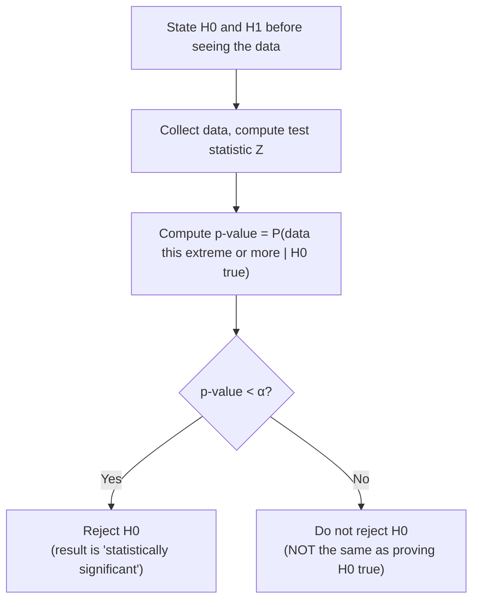

## Learning Objectives

- State the null hypothesis H₀ and alternative hypothesis H₁ for a given claim, and explain the asymmetric role they play in a hypothesis test.
- Define a p-value precisely, as a conditional probability computed under the assumption that H₀ is true — never a probability attached to H₀ itself.
- Carry out a full hypothesis test on a real example (testing whether a coin is fair given n flips and an observed number of heads), from hypotheses through p-value to conclusion.
- Explain explicitly, with a concrete illustration, why "the p-value is the probability H₀ is true" is a serious and common misinterpretation, and state the correct meaning instead.
- Connect a two-sided hypothesis test at significance level α to the corresponding confidence interval covered in the previous concept.

## Context & Motivation

The previous concept built a confidence interval — a range of plausible values for an unknown parameter — directly from the sampling distribution of a statistic. Hypothesis testing asks a closely related but differently shaped question: rather than "what range of values is plausible for μ?", it asks "is a specific, pre-committed claim about the parameter consistent with the data actually observed, or does the data make that claim look implausible?" This reframing — testing a specific claim against data, rather than estimating a range — is the dominant way empirical claims get formally evaluated across nearly every quantitative science: a clinical trial testing whether a new drug does better than a placebo, an A/B test asking whether a new website layout genuinely improves conversion, a physics experiment asking whether a measured effect is distinguishable from pure noise, are all, underneath their domain-specific language, running a hypothesis test.

The logic is a form of statistical proof by contradiction, and it is worth stating plainly before the formalism: assume, provisionally, that there is nothing going on — no effect, no bias, no difference from the baseline claim (this provisional assumption is the null hypothesis, H₀). Then ask: given that assumption, how surprising is the data that was actually observed? If the observed data would be extremely unlikely under that provisional assumption, that counts as evidence against the assumption — not proof it's false, but grounds for suspicion, quantified precisely by the p-value. This concept builds that logic carefully, using a concrete coin-fairness example throughout, and — just as the previous concept spent real effort on the correct meaning of "95% confidence" — this concept spends equal effort on what a p-value does and does not mean, because the single most common misinterpretation of a p-value (treating it as "the probability H₀ is true") is arguably even more widespread, and more consequential, than the confidence-interval misinterpretation already covered.

## Core Theory

### The null and alternative hypotheses

A hypothesis test begins with two competing statements about a population parameter:

- The **null hypothesis, H₀**, is the default, provisional claim — typically a statement of "no effect," "no difference," or "the parameter equals some specific baseline value." It is the hypothesis assumed true for the purpose of computing probabilities, not because it is believed to be true.
- The **alternative hypothesis, H₁**, is the claim that would be interesting or consequential if supported — typically the negation of H₀, or a specific directional claim (the parameter is greater than, less than, or simply different from the baseline value in H₀).

For a coin-fairness test: H₀: p = 0.5 (the coin is fair — p, here, is the probability of heads on a single flip, not to be confused with the p-value computed later), against H₁: p ≠ 0.5 (the coin is biased in either direction — a **two-sided** test), or H₁: p > 0.5 specifically (a **one-sided** test, if there's a specific prior reason to suspect bias only toward heads).

The asymmetry between H₀ and H₁ is deliberate and important: a hypothesis test is built to only ever produce evidence *against* H₀, never evidence *for* it. "Failing to reject H₀" is not the same as "proving H₀ true" — it only means the observed data was not surprising enough, under H₀, to justify abandoning it. This mirrors a courtroom's presumption of innocence: the defendant (H₀) is assumed innocent unless the evidence is strong enough to reject that assumption beyond a reasonable doubt; a not-guilty verdict is not a certification of innocence, only an acknowledgment that guilt wasn't established convincingly enough.

### The test statistic and the p-value

Given a sample, a **test statistic** is computed that measures how far the observed data sits from what H₀ predicts, in standardized units. For testing a proportion (like coin fairness) with a reasonably large n, the sampling distribution of the sample proportion p̂ is approximately Normal (by the same Central Limit Theorem logic developed earlier in this cluster, applied here to a proportion rather than a mean), with mean p₀ (the value H₀ claims) and standard error √(p₀(1 − p₀)/n). The test statistic is

Z = (p̂ − p₀) / √(p₀(1 − p₀)/n)

which, under H₀, follows approximately a standard Normal distribution.

The **p-value** is defined as: the probability, computed *assuming H₀ is true*, of observing a test statistic at least as extreme as the one actually observed. For a two-sided test, "at least as extreme" means at least as far from zero in either direction: p-value = P(|Z| ≥ |z_observed| | H₀ true), where the vertical bar denotes exactly the conditional probability formalism already established elsewhere in this discipline — this is not a loose figure of speech, it is a genuine conditional probability, conditioned specifically on H₀ being true.

A small p-value means: if H₀ really were true, data this extreme (or more extreme) would be quite rare — which is treated as evidence against H₀. A large p-value means: data like this would be unsurprising even under H₀ — giving no particular reason to doubt it.

### Significance level and the decision rule

Before looking at the data, a **significance level α** (commonly 0.05) is chosen as a threshold: if the p-value falls below α, H₀ is **rejected** in favor of H₁ ("statistically significant" at level α); if the p-value is at or above α, H₀ is **not rejected** (not "accepted" — merely not contradicted strongly enough). α also has a direct interpretation as a controlled error rate: it is exactly the probability of wrongly rejecting a true H₀ (a **Type I error**) that the test is designed to tolerate, by construction — a direct analogue of the "5% of intervals will miss" guarantee from the confidence-interval concept, and indeed the two are formally linked, as the next subsection shows.

### The link between confidence intervals and two-sided hypothesis tests

A two-sided hypothesis test at significance level α and a (1 − α)-confidence interval are two views of the same underlying calculation. Specifically: rejecting H₀: μ = μ₀ at significance level α (two-sided) happens exactly when μ₀ falls *outside* the corresponding (1 − α)-confidence interval for μ built from the same data. This is not a coincidence — both are derived from the identical standardized quantity (X̄ − μ₀)/(σ/√n) compared against the same critical value z; the confidence interval inverts the test's decision rule to show the whole range of hypothesized values that would *not* be rejected, rather than testing one single hypothesized value at a time.

## Worked Examples

### Example 1 — testing whether a coin is fair

**Problem:** A coin is flipped n = 100 times, landing heads 62 times. Test, at the α = 0.05 significance level, whether the coin is fair.

**Hypotheses.** H₀: p = 0.5 (fair coin). H₁: p ≠ 0.5 (biased, two-sided — no prior reason to suspect a direction).

**Test statistic.** p̂ = 62/100 = 0.62. Standard error under H₀: √(p₀(1−p₀)/n) = √(0.5 × 0.5 / 100) = √0.0025 = 0.05. Z = (p̂ − p₀)/SE = (0.62 − 0.5)/0.05 = 0.12/0.05 = 2.4.

**p-value.** For a two-sided test, p-value = P(|Z| ≥ 2.4) = 2 × P(Z ≥ 2.4). From the standard Normal table (or computation), P(Z ≥ 2.4) ≈ 0.0082, so the two-sided p-value ≈ 2 × 0.0082 = 0.0164.

**Conclusion.** Since 0.0164 < 0.05, reject H₀ at the 5% significance level: the data provides statistically significant evidence that the coin is not fair. Correct phrasing: "If the coin really were fair, getting 62 or more heads (or, equivalently, 38 or fewer) out of 100 flips would happen only about 1.6% of the time by chance alone — rare enough that we doubt the fairness assumption." This is emphatically not the same as "there is a 1.6% probability the coin is fair" — a distinction developed fully below.

### Example 2 — a non-significant result, and what it does and doesn't establish

**Problem:** A different coin is flipped n = 100 times, landing heads 54 times. Test, at α = 0.05, whether this coin is fair.

**Test statistic.** p̂ = 0.54. Z = (0.54 − 0.5)/0.05 = 0.04/0.05 = 0.8.

**p-value.** p-value = 2 × P(Z ≥ 0.8) ≈ 2 × 0.2119 = 0.4238.

**Conclusion.** Since 0.4238 ≥ 0.05, do **not** reject H₀. Correct phrasing: "54 heads out of 100 is not surprising if the coin is actually fair (such an outcome, or one further from 50, would happen about 42% of the time by chance alone), so this data gives no strong reason to doubt fairness." This is *not* the same as concluding the coin is definitely fair — a coin with a true p of, say, 0.53 (slightly biased) would also easily produce 54 heads out of 100 without triggering rejection; the test simply lacked the power, at this sample size, to distinguish "fair" from "very slightly biased." Failing to reject H₀ only means the data was consistent with H₀, not that H₀ has been confirmed.

### Example 3 — why the p-value is not "the probability H₀ is true," made concrete

**Problem:** Using Example 1's result (p-value ≈ 0.0164), explain concretely why this is not the same number as "the probability the coin is fair."

**The key confusion, stated precisely.** The p-value is P(data this extreme | H₀ true) — a statement about how surprising the *data* is, computed under the assumption that H₀ holds. What "the probability H₀ is true" would require is P(H₀ true | data) — the reverse conditional, a statement about the hypothesis itself, given the data actually seen. These are, in general, very different numbers, exactly as P(evidence | cause) and P(cause | evidence) are different quantities related (not equated) by Bayes' theorem, covered elsewhere in this discipline. Swapping the two, here, is precisely the same logical error as accepting P(A|B) = P(B|A) in general — false, except in special coincidental cases.

**Making it concrete.** Suppose, before flipping any coin, there was a strong prior belief that coins handed out in this particular experiment are fair with 99% prior probability (perhaps because they're freshly minted, officially certified coins, and biased coins are only rarely substituted in as a rare stress-test). Bayes' theorem (as covered elsewhere in this discipline) would combine that strong 99% prior with the observed data's likelihood to produce a posterior probability of fairness that could still be quite high — nowhere near as low as 1.6% — even though the p-value computed from the data alone was 0.0164. The p-value simply never had access to that prior information at all; it is purely a statement about how extreme the observed data is under H₀, computed in a vacuum with no reference to how plausible H₀ was believed to be beforehand. Treating the p-value itself as "the probability H₀ is true" silently (and wrongly) assumes away the entire role that prior belief plays — exactly the role that the final concept in this cluster, Bayesian inference, restores explicitly.

## Common Misconceptions & Pitfalls

- **"The p-value is the probability that H₀ is true."** This is false, and Example 3 shows concretely why: the p-value is P(data | H₀), not P(H₀ | data) — these are different conditional probabilities, related only through Bayes' theorem and a prior belief the p-value never incorporates. A p-value of 0.0164 in Example 1 says the *data* would be rare if H₀ were true; it says nothing on its own about how probable H₀ actually is.
- **"Failing to reject H₀ means H₀ has been proven true."** Example 2's non-significant result (p-value ≈ 0.42) does not establish that the coin is exactly fair — it only shows the data wasn't surprising enough, at this sample size, to justify rejecting fairness. A slightly biased coin could easily have produced the same data without detection; "not rejected" is not "confirmed."
- **"A smaller p-value means a bigger or more important effect."** The p-value measures how surprising the data would be under H₀, which depends heavily on sample size, not just effect size — a tiny, practically meaningless deviation from H₀ can produce a very small p-value if the sample size is large enough (more data makes even small departures from H₀ statistically detectable), and a substantial deviation can fail to reach significance with a small sample, as in Example 2. Statistical significance and practical importance are different questions.
- **"The significance level α is the probability that H₀ is actually false."** α is a threshold chosen in advance, representing the tolerated rate of wrongly rejecting a *true* H₀ (a Type I error) across repeated application of the testing procedure — directly analogous to the "5% of intervals will miss" guarantee from confidence intervals. It says nothing about the probability that this specific H₀, in this specific study, happens to be false.
- **"Running the same test on many different variables and reporting only the significant ones is a fair use of the α = 0.05 threshold."** Each individual test carries a 5% chance of a false positive by design; testing many hypotheses and only reporting the ones that happen to clear the bar (multiple comparisons, without correction) inflates the overall chance of at least one false "discovery" well above the nominal 5% — a widely known and serious pitfall in fields that run many exploratory tests, not directly derived here but worth flagging as a consequence of the same logic.

## Summary

A hypothesis test formalizes "how surprising would this data be if a specific claim (H₀) were true?" by computing a test statistic from the data and converting it into a p-value: the conditional probability, assuming H₀ is true, of observing data at least as extreme as what was actually seen. A small p-value (below a pre-chosen significance level α) leads to rejecting H₀; a large p-value means the data was unsurprising under H₀ and gives no strong reason to reject it — though this is never the same as proving H₀ true. The single most serious and pervasive misinterpretation is treating the p-value as "the probability H₀ is true": the p-value is P(data | H₀), while that claim would require P(H₀ | data) — the reverse conditional, which requires a prior belief the p-value never incorporates, exactly as Bayes' theorem distinguishes these two directions elsewhere in this discipline. Two-sided hypothesis tests and confidence intervals, from the previous concept, are two views of the same underlying calculation. This tension between "data-conditioned-on-hypothesis" (the frequentist p-value) and "hypothesis-conditioned-on-data" (what a prior-informed posterior would actually give) sets up the final concept in this cluster directly: Bayesian versus frequentist inference.

## Documentation Links

- [Stanford CS109 — Course Schedule](http://web.stanford.edu/class/cs109/schedule.html) — doc
- [MIT 6.041 — Lecture Notes (OCW)](https://ocw.mit.edu/courses/6-041-probabilistic-systems-analysis-and-applied-probability-fall-2010/pages/lecture-notes/) — doc
