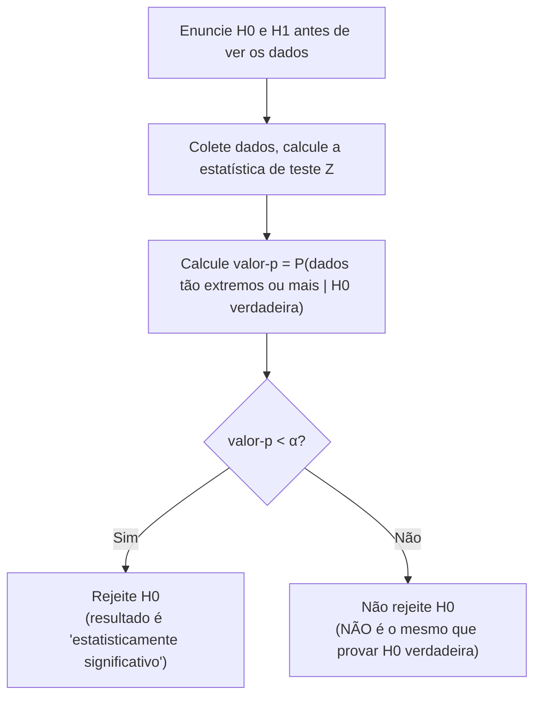

## Objetivos de Aprendizagem

- Enunciar a hipótese nula H₀ e a hipótese alternativa H₁ para uma dada alegação, e explicar o papel assimétrico que elas desempenham em um teste de hipóteses.
- Definir precisamente um valor-p, como uma probabilidade condicional calculada sob a suposição de que H₀ é verdadeira, nunca uma probabilidade anexada à própria H₀.
- Executar um teste de hipóteses completo em um exemplo real (testar se uma moeda é justa dados n lançamentos e um número observado de caras), das hipóteses ao valor-p até a conclusão.
- Explicar explicitamente, com uma ilustração concreta, por que "o valor-p é a probabilidade de H₀ ser verdadeira" é uma interpretação equivocada séria e comum, e enunciar o significado correto em seu lugar.
- Conectar um teste de hipóteses bilateral no nível de significância α ao intervalo de confiança correspondente coberto no conceito anterior.

## Contexto e Motivação

O conceito anterior construiu um intervalo de confiança, uma faixa de valores plausíveis para um parâmetro desconhecido, diretamente a partir da distribuição amostral de uma estatística. O teste de hipóteses faz uma pergunta intimamente relacionada mas de formato diferente: em vez de "qual faixa de valores é plausível para μ?", ele pergunta "uma alegação específica e pré-comprometida sobre o parâmetro é consistente com os dados de fato observados, ou os dados fazem essa alegação parecer implausível?" Essa reformulação, testar uma alegação específica contra dados, em vez de estimar uma faixa, é a forma dominante pela qual alegações empíricas são formalmente avaliadas em quase toda ciência quantitativa: um ensaio clínico testando se um novo medicamento é melhor que um placebo, um teste A/B perguntando se um novo layout de site genuinamente melhora a conversão, um experimento de física perguntando se um efeito medido é distinguível de puro ruído, todos, por baixo de sua linguagem específica de domínio, estão executando um teste de hipóteses.

A lógica é uma forma de prova estatística por contradição, e vale a pena enunciá-la claramente antes do formalismo: assuma, provisoriamente, que não há nada acontecendo, nenhum efeito, nenhum viés, nenhuma diferença da alegação básica (essa suposição provisória é a hipótese nula, H₀). Depois pergunte: dado essa suposição, quão surpreendentes são os dados de fato observados? Se os dados observados seriam extremamente improváveis sob essa suposição provisória, isso conta como evidência contra a suposição, não prova de que é falsa, mas motivo de suspeita, quantificado precisamente pelo valor-p. Este conceito constrói essa lógica cuidadosamente, usando um exemplo concreto de justiça de moeda ao longo de todo o texto, e, assim como o conceito anterior dedicou esforço real ao significado correto de "95% de confiança", este conceito dedica igual esforço ao que um valor-p significa e não significa, porque a interpretação equivocada mais comum de um valor-p (tratá-lo como "a probabilidade de H₀ ser verdadeira") é sem dúvida ainda mais difundida, e mais consequente, do que a interpretação equivocada de intervalo de confiança já coberta.

## Teoria Central

### A hipótese nula e a alternativa

Um teste de hipóteses começa com duas afirmações concorrentes sobre um parâmetro populacional:

- A **hipótese nula, H₀**, é a alegação padrão, provisória, tipicamente uma afirmação de "sem efeito", "sem diferença", ou "o parâmetro é igual a algum valor de referência específico". É a hipótese assumida verdadeira para fins de calcular probabilidades, não porque se acredite que seja verdadeira.
- A **hipótese alternativa, H₁**, é a alegação que seria interessante ou consequente se apoiada, tipicamente a negação de H₀, ou uma alegação direcional específica (o parâmetro é maior que, menor que, ou simplesmente diferente do valor de referência em H₀).

Para um teste de justiça de moeda: H₀: p = 0,5 (a moeda é justa, p, aqui, é a probabilidade de cara em um único lançamento, não deve ser confundida com o valor-p calculado depois), contra H₁: p ≠ 0,5 (a moeda é enviesada em qualquer direção, um teste **bilateral**), ou H₁: p > 0,5 especificamente (um teste **unilateral**, se houver uma razão prévia específica para suspeitar de viés apenas em direção a caras).

A assimetria entre H₀ e H₁ é deliberada e importante: um teste de hipóteses é construído para sempre produzir evidência *contra* H₀, nunca evidência *a favor* dela. "Falhar em rejeitar H₀" não é o mesmo que "provar que H₀ é verdadeira", significa apenas que os dados observados não foram suficientemente surpreendentes, sob H₀, para justificar abandoná-la. Isso espelha a presunção de inocência de um tribunal: o réu (H₀) é assumido inocente a menos que a evidência seja forte o suficiente para rejeitar essa suposição além de dúvida razoável; um veredito de não culpado não é uma certificação de inocência, apenas um reconhecimento de que a culpa não foi estabelecida de forma suficientemente convincente.

### A estatística de teste e o valor-p

Dada uma amostra, uma **estatística de teste** é calculada, medindo quão longe os dados observados estão do que H₀ prevê, em unidades padronizadas. Para testar uma proporção (como justiça de moeda) com um n razoavelmente grande, a distribuição amostral da proporção amostral p̂ é aproximadamente Normal (pela mesma lógica do Teorema Central do Limite desenvolvida anteriormente neste agrupamento, aplicada aqui a uma proporção em vez de uma média), com média p₀ (o valor que H₀ alega) e erro padrão √(p₀(1 − p₀)/n). A estatística de teste é

Z = (p̂ − p₀) / √(p₀(1 − p₀)/n)

que, sob H₀, segue aproximadamente uma distribuição Normal padrão.

O **valor-p** é definido como: a probabilidade, calculada *assumindo que H₀ é verdadeira*, de observar uma estatística de teste pelo menos tão extrema quanto a de fato observada. Para um teste bilateral, "pelo menos tão extrema" significa pelo menos tão longe de zero em qualquer direção: valor-p = P(|Z| ≥ |z_observado| | H₀ verdadeira), onde a barra vertical denota exatamente o formalismo de probabilidade condicional já estabelecido em outro lugar nesta disciplina, isso não é uma figura de linguagem solta, é uma probabilidade condicional genuína, condicionada especificamente a H₀ ser verdadeira.

Um valor-p pequeno significa: se H₀ realmente fosse verdadeira, dados tão extremos (ou mais) seriam bastante raros, o que é tratado como evidência contra H₀. Um valor-p grande significa: dados assim não seriam surpreendentes mesmo sob H₀, sem dar nenhuma razão particular para duvidar dela.

### Nível de significância e a regra de decisão

Antes de observar os dados, um **nível de significância α** (comumente 0,05) é escolhido como limiar: se o valor-p cai abaixo de α, H₀ é **rejeitada** em favor de H₁ ("estatisticamente significativo" no nível α); se o valor-p está em ou acima de α, H₀ **não é rejeitada** (não "aceita", apenas não contradita fortemente o suficiente). α também tem uma interpretação direta como uma taxa de erro controlada: é exatamente a probabilidade de rejeitar erroneamente uma H₀ verdadeira (um **erro Tipo I**) que o teste é projetado para tolerar, por construção, um análogo direto da garantia "5% dos intervalos vão errar" do conceito de intervalo de confiança, e de fato os dois estão formalmente ligados, como a próxima subseção mostra.

### A ligação entre intervalos de confiança e testes de hipóteses bilaterais

Um teste de hipóteses bilateral no nível de significância α e um intervalo de confiança de (1 − α) são duas visões do mesmo cálculo subjacente. Especificamente: rejeitar H₀: μ = μ₀ no nível de significância α (bilateral) acontece exatamente quando μ₀ cai *fora* do intervalo de confiança correspondente de (1 − α) para μ construído a partir dos mesmos dados. Isso não é coincidência, ambos são derivados da mesma quantidade padronizada idêntica (X̄ − μ₀)/(σ/√n) comparada contra o mesmo valor crítico z; o intervalo de confiança inverte a regra de decisão do teste para mostrar toda a faixa de valores hipotéticos que *não* seriam rejeitados, em vez de testar um único valor hipotetizado por vez.

## Exemplos Resolvidos

### Exemplo 1 — testando se uma moeda é justa

**Problema:** Uma moeda é lançada n = 100 vezes, caindo em cara 62 vezes. Teste, no nível de significância α = 0,05, se a moeda é justa.

**Hipóteses.** H₀: p = 0,5 (moeda justa). H₁: p ≠ 0,5 (enviesada, bilateral, sem razão prévia para suspeitar de uma direção).

**Estatística de teste.** p̂ = 62/100 = 0,62. Erro padrão sob H₀: √(p₀(1−p₀)/n) = √(0,5 × 0,5 / 100) = √0,0025 = 0,05. Z = (p̂ − p₀)/EP = (0,62 − 0,5)/0,05 = 0,12/0,05 = 2,4.

**Valor-p.** Para um teste bilateral, valor-p = P(|Z| ≥ 2,4) = 2 × P(Z ≥ 2,4). Da tabela Normal padrão (ou cálculo), P(Z ≥ 2,4) ≈ 0,0082, então o valor-p bilateral ≈ 2 × 0,0082 = 0,0164.

**Conclusão.** Como 0,0164 < 0,05, rejeite H₀ no nível de significância de 5%: os dados fornecem evidência estatisticamente significativa de que a moeda não é justa. Formulação correta: "Se a moeda realmente fosse justa, obter 62 ou mais caras (ou, equivalentemente, 38 ou menos) em 100 lançamentos aconteceria apenas cerca de 1,6% das vezes por acaso, raro o suficiente para duvidarmos da suposição de justiça." Isso definitivamente não é o mesmo que "há 1,6% de probabilidade de a moeda ser justa", uma distinção desenvolvida completamente abaixo.

### Exemplo 2 — um resultado não significativo, e o que ele estabelece e não estabelece

**Problema:** Uma moeda diferente é lançada n = 100 vezes, caindo em cara 54 vezes. Teste, em α = 0,05, se essa moeda é justa.

**Estatística de teste.** p̂ = 0,54. Z = (0,54 − 0,5)/0,05 = 0,04/0,05 = 0,8.

**Valor-p.** valor-p = 2 × P(Z ≥ 0,8) ≈ 2 × 0,2119 = 0,4238.

**Conclusão.** Como 0,4238 ≥ 0,05, **não** rejeite H₀. Formulação correta: "54 caras em 100 não é surpreendente se a moeda for de fato justa (tal resultado, ou um mais distante de 50, aconteceria cerca de 42% das vezes por acaso), então esses dados não dão razão forte para duvidar da justiça." Isso *não* é o mesmo que concluir que a moeda é definitivamente justa, uma moeda com um p verdadeiro de, digamos, 0,53 (levemente enviesada) também produziria facilmente 54 caras em 100 sem disparar a rejeição; o teste simplesmente não teve poder, nesse tamanho de amostra, para distinguir "justa" de "muito levemente enviesada". Falhar em rejeitar H₀ significa apenas que os dados foram consistentes com H₀, não que H₀ foi confirmada.

### Exemplo 3 — por que o valor-p não é "a probabilidade de H₀ ser verdadeira", tornado concreto

**Problema:** Usando o resultado do Exemplo 1 (valor-p ≈ 0,0164), explique concretamente por que esse não é o mesmo número que "a probabilidade de a moeda ser justa".

**A confusão-chave, enunciada precisamente.** O valor-p é P(dados tão extremos | H₀ verdadeira), uma afirmação sobre quão surpreendentes os *dados* são, calculada sob a suposição de que H₀ é válida. O que "a probabilidade de H₀ ser verdadeira" exigiria é P(H₀ verdadeira | dados), o condicional reverso, uma afirmação sobre a própria hipótese, dados os dados de fato observados. Esses são, em geral, números muito diferentes, exatamente como P(evidência | causa) e P(causa | evidência) são quantidades diferentes relacionadas (não igualadas) pelo Teorema de Bayes, coberto em outro lugar nesta disciplina. Trocar os dois, aqui, é precisamente o mesmo erro lógico de aceitar P(A|B) = P(B|A) em geral, falso, exceto em casos especiais coincidentes.

**Tornando isso concreto.** Suponha que, antes de lançar qualquer moeda, houvesse uma crença prévia forte de que moedas distribuídas neste experimento específico são justas com 99% de probabilidade prévia (talvez porque sejam moedas recém-cunhadas, oficialmente certificadas, e moedas enviesadas sejam apenas raramente substituídas como um teste de estresse raro). O Teorema de Bayes (como coberto em outro lugar nesta disciplina) combinaria essa forte prévia de 99% com a verossimilhança dos dados observados para produzir uma probabilidade posterior de justiça que ainda poderia ser bastante alta, longe de tão baixa quanto 1,6%, mesmo que o valor-p calculado a partir dos dados isoladamente fosse 0,0164. O valor-p simplesmente nunca teve acesso a essa informação prévia; é puramente uma afirmação sobre quão extremos são os dados observados sob H₀, calculada em um vácuo sem nenhuma referência a quão plausível se acreditava que H₀ era de antemão. Tratar o próprio valor-p como "a probabilidade de H₀ ser verdadeira" silenciosamente (e erroneamente) elimina todo o papel que a crença prévia desempenha, exatamente o papel que o conceito final deste agrupamento, inferência Bayesiana, restaura explicitamente.

## Equívocos Comuns e Armadilhas

- **"O valor-p é a probabilidade de H₀ ser verdadeira."** Isso é falso, e o Exemplo 3 mostra concretamente por quê: o valor-p é P(dados | H₀), não P(H₀ | dados), essas são probabilidades condicionais diferentes, relacionadas apenas por meio do Teorema de Bayes e uma crença prévia que o valor-p nunca incorpora. Um valor-p de 0,0164 no Exemplo 1 diz que os *dados* seriam raros se H₀ fosse verdadeira; não diz nada por si só sobre quão provável H₀ realmente é.
- **"Falhar em rejeitar H₀ significa que H₀ foi provada verdadeira."** O resultado não significativo do Exemplo 2 (valor-p ≈ 0,42) não estabelece que a moeda é exatamente justa, mostra apenas que os dados não foram suficientemente surpreendentes, nesse tamanho de amostra, para justificar rejeitar a justiça. Uma moeda levemente enviesada poderia facilmente ter produzido os mesmos dados sem ser detectada; "não rejeitado" não é "confirmado".
- **"Um valor-p menor significa um efeito maior ou mais importante."** O valor-p mede quão surpreendentes os dados seriam sob H₀, o que depende fortemente do tamanho da amostra, não apenas do tamanho do efeito, um desvio minúsculo e praticamente sem significado de H₀ pode produzir um valor-p muito pequeno se o tamanho da amostra for grande o suficiente (mais dados tornam até pequenos desvios de H₀ estatisticamente detectáveis), e um desvio substancial pode não alcançar significância com uma amostra pequena, como no Exemplo 2. Significância estatística e importância prática são perguntas diferentes.
- **"O nível de significância α é a probabilidade de H₀ ser de fato falsa."** α é um limiar escolhido de antemão, representando a taxa tolerada de rejeitar erroneamente uma H₀ *verdadeira* (um erro Tipo I) ao longo de aplicação repetida do procedimento de teste, diretamente análogo à garantia "5% dos intervalos vão errar" dos intervalos de confiança. Não diz nada sobre a probabilidade de essa H₀ específica, neste estudo específico, acontecer de ser falsa.
- **"Executar o mesmo teste em muitas variáveis diferentes e relatar apenas as significativas é um uso justo do limiar α = 0,05."** Cada teste individual carrega uma chance de 5% de falso positivo por design; testar muitas hipóteses e relatar apenas as que acontecem de ultrapassar a barra (comparações múltiplas, sem correção) infla a chance geral de pelo menos uma "descoberta" falsa bem acima do 5% nominal, uma armadilha amplamente conhecida e séria em campos que executam muitos testes exploratórios, não derivada diretamente aqui mas que vale a pena sinalizar como consequência da mesma lógica.

## Resumo

Um teste de hipóteses formaliza "quão surpreendentes seriam esses dados se uma alegação específica (H₀) fosse verdadeira?" calculando uma estatística de teste a partir dos dados e convertendo-a em um valor-p: a probabilidade condicional, assumindo que H₀ é verdadeira, de observar dados pelo menos tão extremos quanto os de fato vistos. Um valor-p pequeno (abaixo de um nível de significância α pré-escolhido) leva a rejeitar H₀; um valor-p grande significa que os dados não foram surpreendentes sob H₀ e não dá razão forte para rejeitá-la, embora isso nunca seja o mesmo que provar que H₀ é verdadeira. A interpretação equivocada mais séria e difundida é tratar o valor-p como "a probabilidade de H₀ ser verdadeira": o valor-p é P(dados | H₀), enquanto essa alegação exigiria P(H₀ | dados), o condicional reverso, que exige uma crença prévia que o valor-p nunca incorpora, exatamente como o Teorema de Bayes distingue essas duas direções em outro lugar nesta disciplina. Testes de hipóteses bilaterais e intervalos de confiança, do conceito anterior, são duas visões do mesmo cálculo subjacente. Essa tensão entre "dados condicionados à hipótese" (o valor-p frequentista) e "hipótese condicionada aos dados" (o que uma posterior informada por uma prévia de fato daria) prepara diretamente o conceito final deste agrupamento: inferência Bayesiana versus frequentista.

## Documentation Links

- [Stanford CS109 — Course Schedule](http://web.stanford.edu/class/cs109/schedule.html) — doc
- [MIT 6.041 — Lecture Notes (OCW)](https://ocw.mit.edu/courses/6-041-probabilistic-systems-analysis-and-applied-probability-fall-2010/pages/lecture-notes/) — doc
