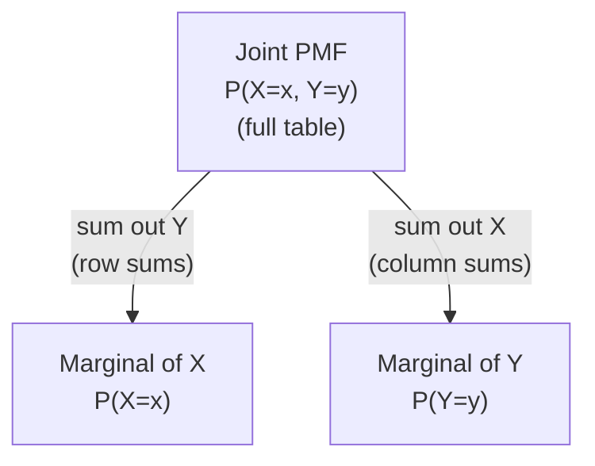

## Learning Objectives

- Define the joint PMF P(X=x, Y=y) of two discrete random variables, and verify that it sums to 1 over all (x,y) pairs.
- Recover the marginal distribution of X (or Y) from a joint PMF by summing out the other variable.
- State the definition of independent random variables, P(X=x, Y=y) = P(X=x)·P(Y=y) for all x, y, and check it against a given joint PMF table.
- Distinguish the independence of two random variables from the independence of two specific events, and explain why the former is a much stronger, all-pairs condition.
- Use a joint PMF to compute the probability of an event defined jointly on X and Y, such as P(X > Y) or P(X + Y = k).

## Context & Motivation

Every random variable studied so far has been described in isolation — one PMF, one variable, one set of possible values. Most interesting situations, though, involve more than one random quantity at once, and how those quantities relate to each other is very often the entire point of the analysis: does the number of page views on a website relate to the number of purchases made that day? Do two sensors reporting on the same system tend to agree or disagree? A **joint distribution** is the tool that describes two (or more) random variables together, in enough detail to answer exactly these kinds of questions — not just what each variable does on its own, but how they behave in combination.

This is also the natural place to revisit independence, a concept already introduced for events, and sharpen it into something considerably stronger. Two events A and B being independent (P(A∩B) = P(A)·P(B)) was always a statement about exactly those two events — nothing was claimed about any other event derived from the same experiment. Independence of two *random variables* X and Y is a much more sweeping claim: it says every event definable in terms of X is independent of every event definable in terms of Y, all at once, for every possible pair of values. Harvard's Stat 110 course (and MIT's 6.041 alongside it) treats this distinction as one of the more consequential ideas in the entire introductory sequence, because a huge amount of later machinery — from summing variances across independent variables, to the mechanics behind statistical estimation, to the assumptions baked into most machine learning models that treat data points as "independent and identically distributed" — leans on random-variable independence specifically, not merely on isolated pairs of events happening to be independent.

The joint PMF is also what finally makes precise something that was informally true all along: two random variables defined on the same underlying experiment are not really separate objects at all, but two different "views" (two different functions) of the very same random outcome. The joint PMF captures the full relationship between those two views, and the marginal distributions — recovered by summing the joint PMF appropriately — show how each variable behaves once the other's information is averaged away, connecting this new material directly back to the single-variable PMFs already familiar from the discrete random variables concept.

## Core Theory

### The joint PMF

**Definition.** For two discrete random variables X and Y defined on the same probability space, the **joint probability mass function** is

P(X=x, Y=y) — the probability that X takes value x *and* Y takes value y, simultaneously, for a given outcome.

As with any PMF, the joint PMF must be non-negative everywhere and sum to 1 over all possible pairs:

Σₓ Σᵧ P(X=x, Y=y) = 1

A joint PMF over a finite set of values for X and Y is often displayed as a table, with rows indexed by values of X, columns by values of Y, and each cell holding P(X=x, Y=y) for that row-column pair.

| X \ Y | y=0 | y=1 | y=2 |
|---|---|---|---|
| x=0 | 0.10 | 0.15 | 0.05 |
| x=1 | 0.20 | 0.10 | 0.10 |
| x=2 | 0.05 | 0.15 | 0.10 |

All 9 entries in this example sum to 1.00, as required of any valid joint PMF.

### Marginal distributions: summing out a variable

Given a joint PMF, the **marginal PMF** of X alone is recovered by summing the joint probabilities across every value of Y, for each fixed x:

P(X=x) = Σᵧ P(X=x, Y=y)

Symmetrically, the marginal PMF of Y is P(Y=y) = Σₓ P(X=x, Y=y). The name "marginal" comes from the literal bookkeeping habit of writing these row and column sums in the margins of the joint table.

Using the table above: the marginal P(X=1) = 0.20 + 0.10 + 0.10 = 0.40 (summing across row x=1); the marginal P(Y=0) = 0.10 + 0.20 + 0.05 = 0.35 (summing down column y=0). Every marginal recovered this way is a completely valid, ordinary single-variable PMF in its own right — it must itself sum to 1 across its values, which serves as a useful check: summing all six marginal values (three for X, three for Y) each individually sums to 1.

A crucial, easily missed point: the marginals alone do **not** in general determine the joint PMF. Many different joint distributions can share the exact same pair of marginals, differing only in how X and Y relate to each other — which is precisely the extra information the joint PMF carries that the marginals discard.

### Independence of random variables

**Definition.** Discrete random variables X and Y are **independent** if

P(X=x, Y=y) = P(X=x) · P(Y=y)   for every value x and every value y

Note the universal quantifier: this must hold for *every* pair (x,y) simultaneously, not just for some pairs. If even one pair fails the equality, X and Y are **not** independent, full stop — independence of random variables is an all-or-nothing property, not something that can hold "partially" or "for most values."

**Checking independence from a table.** The joint table above is *not* independent: the marginal P(X=0) = 0.10+0.15+0.05 = 0.30 and marginal P(Y=0) = 0.35, so independence would require the joint entry at (0,0) to equal 0.30 × 0.35 = 0.105 — but the table shows P(X=0,Y=0) = 0.10, which does not match. A single mismatched cell is enough to rule out independence entirely, regardless of how well the other eight cells might agree.

**Independence of events versus independence of random variables.** This distinction is worth making explicit and precise, because the vocabulary overlaps but the claims are very different in strength:

- **Event independence** (already covered): a single statement about two specific events, e.g., "the event {X=3} is independent of the event {Y=5}" — this says P(X=3, Y=5) = P(X=3)·P(Y=5), and nothing about any other value of X or Y.
- **Random-variable independence** (this concept): a statement about *all* pairs of values simultaneously — X and Y are independent random variables only if the equality above holds for every single (x,y) pair, which is equivalent to saying that *every* event of the form {X∈A} is independent of *every* event of the form {Y∈B}, for any sets A and B of values.

It is entirely possible for one specific pair of events derived from X and Y to be independent while X and Y, as random variables, are not independent overall — one matching cell in a joint table proves nothing about the other cells. Random-variable independence is the much stronger, all-pairs claim, and it is what is actually needed for results like Var(X+Y) = Var(X)+Var(Y) or for treating a sequence of measurements as "i.i.d." (independent and identically distributed).

### Independence and the factoring of joint PMFs

An immediate practical consequence of independence: if X and Y are independent, the entire joint PMF table can be reconstructed from just the two marginals, since every cell is simply the product of its row and column marginal. This is often the fastest way to build a joint PMF in the first place when independence is assumed or given as a modeling assumption (as it is, for instance, when defining the Binomial distribution as a sum of independent Bernoulli trials in a later concept) — rather than specifying every joint entry directly, it suffices to specify each variable's marginal PMF and multiply.

## Worked Examples

### Example 1 — marginals and an independence check from a joint table

**Problem:** Two fair coins are flipped. Let X = 1 if the first coin is heads, else 0. Let Y = the total number of heads across both coins (Y ∈ {0,1,2}). Build the joint PMF, find both marginals, and determine whether X and Y are independent.

**Building the joint PMF.** The sample space has 4 equally likely outcomes: HH, HT, TH, TT, each with probability 1/4.

- HH: X=1, Y=2
- HT: X=1, Y=1
- TH: X=0, Y=1
- TT: X=0, Y=0

So the joint PMF is: P(X=0,Y=0) = 1/4, P(X=0,Y=1) = 1/4, P(X=0,Y=2) = 0, P(X=1,Y=0) = 0, P(X=1,Y=1) = 1/4, P(X=1,Y=2) = 1/4. (All four nonzero cells hold 1/4, matching the four equally likely outcomes; the remaining two cells are 0 because, e.g., if the first coin is tails, Y=2 is impossible.)

**Marginals.** P(X=0) = 1/4 + 1/4 + 0 = 1/2; P(X=1) = 0 + 1/4 + 1/4 = 1/2 (matches the obvious fact that the first coin alone is fair). For Y: P(Y=0) = 1/4, P(Y=1) = 1/4 + 1/4 = 1/2, P(Y=2) = 1/4 (the familiar Binomial(2, 1/2) shape).

**Independence check.** Test the pair (X=0, Y=0): independence would require P(X=0,Y=0) = P(X=0)·P(Y=0) = (1/2)(1/4) = 1/8. But the table shows P(X=0,Y=0) = 1/4 ≠ 1/8. X and Y are **not** independent — which makes sense: knowing the first coin was tails (X=0) rules out Y=2 entirely and makes Y=0 relatively more likely than the unconditional marginal suggests, since the total head count is partly determined by the first coin's own outcome.

### Example 2 — computing a joint event probability, P(X > Y)

**Problem:** Using the joint PMF table from the Core Theory section (reproduced below), compute P(X > Y).

| X \ Y | y=0 | y=1 | y=2 |
|---|---|---|---|
| x=0 | 0.10 | 0.15 | 0.05 |
| x=1 | 0.20 | 0.10 | 0.10 |
| x=2 | 0.05 | 0.15 | 0.10 |

**Identify the qualifying cells.** X > Y holds for the pairs: (x=1,y=0), (x=2,y=0), (x=2,y=1). Every other cell has X ≤ Y.

**Sum their joint probabilities.**

P(X>Y) = P(X=1,Y=0) + P(X=2,Y=0) + P(X=2,Y=1) = 0.20 + 0.05 + 0.15 = 0.40

This is a direct illustration of why the *joint* PMF, and not just the two marginals, is necessary for this kind of question: an event defined by a relationship between X and Y (here, which one is larger) depends on how the two variables co-occur, information the marginals alone have already thrown away.

### Example 3 — building a joint PMF from two independent marginals

**Problem:** X and Y are known to be independent, with marginal PMFs P(X=1)=0.3, P(X=2)=0.7, and P(Y=1)=0.4, P(Y=2)=0.6. Construct the full joint PMF, and verify it sums to 1.

**Using independence to factor each cell.** Since X and Y are independent, P(X=x,Y=y) = P(X=x)·P(Y=y) for every pair:

- P(X=1,Y=1) = 0.3 × 0.4 = 0.12
- P(X=1,Y=2) = 0.3 × 0.6 = 0.18
- P(X=2,Y=1) = 0.7 × 0.4 = 0.28
- P(X=2,Y=2) = 0.7 × 0.6 = 0.42

**Verify.** 0.12 + 0.18 + 0.28 + 0.42 = 1.00 ✓, as required of any valid joint PMF. Note how directly this worked, compared to Example 1: given independence up front, the entire joint table was determined by nothing more than the two marginals and simple multiplication — no additional information about the relationship between X and Y was needed, because independence *is* precisely the statement that there is no such additional relationship to specify.

## Common Misconceptions & Pitfalls

- **"If the marginals match a known joint table, the joint distribution is uniquely determined."** False — as noted in Core Theory, many different joint PMFs can share identical marginals while differing in how the variables relate. Example 1's joint table and a hypothetical *independent* table built from the same two marginals (1/2, 1/2 for X and 1/4, 1/2, 1/4 for Y) would generally NOT match cell-for-cell, even though both would have the exact same marginals — the joint structure genuinely carries more information.
- **"X and Y are independent because I found one pair (x,y) where P(X=x,Y=y) = P(X=x)P(Y=y)."** Independence requires the factoring equality to hold for *every* pair, not just one. A single matching cell proves nothing about the rest of the table — Example 1 shows a joint distribution that could easily have one coincidentally-matching cell while still failing independence overall on other cells.
- **"Independence of events and independence of random variables are the same idea, just applied to different objects."** They are related but not the same strength of claim: event independence is a single equation about two specific events; random-variable independence requires that equation to hold simultaneously for every pair of values those variables can take. It is entirely possible for two random variables to fail independence overall while one specific pair of associated events happens to satisfy the independence equation by coincidence.
- **"Since X and Y come from the same experiment, they can't really be independent."** Independence is about the *probabilistic* relationship between the values, not about whether the variables are "derived from the same source" in some vague sense. Two random variables built from entirely separate physical processes (e.g., two unrelated coin flips) are the clearest examples of independence, but variables built from the same experiment can also be independent if the joint PMF happens to factor — the test is always the equation, not intuition about shared origin.
- **"Summing out a variable loses information, so the marginal PMF isn't really valid on its own."** The marginal PMF is a completely legitimate, self-contained PMF for that one variable — it sums to 1 and describes that variable's behavior correctly in isolation. What is lost by marginalizing is only information about the *relationship* to the other variable, not the validity of the marginal itself as a description of that one variable.

## Summary

The joint PMF P(X=x, Y=y) generalizes a single-variable PMF to describe two random variables together, and must sum to 1 over all (x,y) pairs. Marginal distributions are recovered by summing the joint PMF over the other variable (P(X=x) = Σᵧ P(X=x,Y=y)), but the marginals alone discard information about how the two variables relate and do not, in general, determine the joint PMF. Random variables X and Y are independent when P(X=x,Y=y) = P(X=x)·P(Y=y) holds for every pair of values simultaneously — a much stronger, all-pairs condition than the independence of two specific events, which only ever made a claim about those two particular events. When independence does hold, the joint PMF can be reconstructed directly by multiplying the two marginals, a shortcut used heavily in later concepts (such as building the Binomial distribution from independent Bernoulli trials).

## Documentation Links

- [MIT 6.041 — Lecture Notes (OCW)](https://ocw.mit.edu/courses/6-041-probabilistic-systems-analysis-and-applied-probability-fall-2010/pages/lecture-notes/) — doc
- [Harvard Stat 110 — Course Home](https://stat110.hsites.harvard.edu/) — doc
