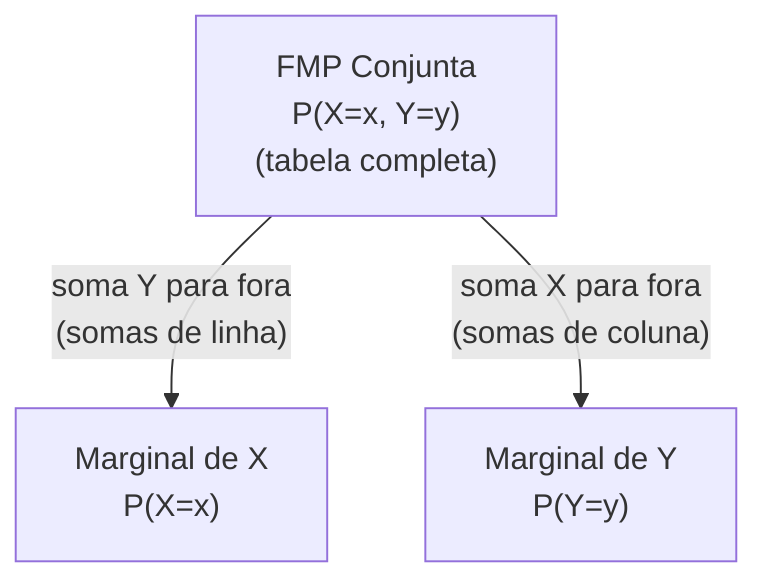

## Objetivos de Aprendizagem

- Definir a FMP conjunta P(X=x, Y=y) de duas variáveis aleatórias discretas, e verificar que soma 1 sobre todos os pares (x,y).
- Recuperar a distribuição marginal de X (ou Y) a partir de uma FMP conjunta somando para fora a outra variável.
- Declarar a definição de variáveis aleatórias independentes, P(X=x, Y=y) = P(X=x)·P(Y=y) para todo x, y, e checá-la contra uma tabela de FMP conjunta dada.
- Distinguir a independência de duas variáveis aleatórias da independência de dois eventos específicos, e explicar por que a primeira é uma condição de todos-os-pares muito mais forte.
- Usar uma FMP conjunta para computar a probabilidade de um evento definido conjuntamente em X e Y, como P(X > Y) ou P(X + Y = k).

## Contexto e Motivação

Toda variável aleatória estudada até agora foi descrita isoladamente, uma FMP, uma variável, um conjunto de valores possíveis. A maioria das situações interessantes, porém, envolve mais de uma quantidade aleatória de uma vez, e como essas quantidades se relacionam entre si é frequentemente todo o ponto da análise: o número de visualizações de página num site se relaciona com o número de compras feitas naquele dia? Dois sensores reportando sobre o mesmo sistema tendem a concordar ou discordar? Uma **distribuição conjunta** é a ferramenta que descreve duas (ou mais) variáveis aleatórias juntas, com detalhe suficiente para responder exatamente esses tipos de pergunta, não só o que cada variável faz sozinha, mas como se comportam em combinação.

Este é também o lugar natural para revisitar independência, um conceito já introduzido para eventos, e aguçá-lo em algo consideravelmente mais forte. Dois eventos A e B serem independentes (P(A∩B) = P(A)·P(B)) sempre foi uma afirmação sobre exatamente esses dois eventos; nada foi afirmado sobre qualquer outro evento derivado do mesmo experimento. Independência de duas *variáveis aleatórias* X e Y é uma afirmação muito mais abrangente: diz que todo evento definível em termos de X é independente de todo evento definível em termos de Y, todos de uma vez, para todo par de valores possível. O curso Stat 110 de Harvard (e o 6.041 do MIT junto com ele) trata essa distinção como uma das ideias mais consequentes em toda a sequência introdutória, porque uma quantidade enorme de maquinaria posterior (de somar variâncias através de variáveis independentes, à mecânica por trás de estimação estatística, às suposições embutidas na maioria dos modelos de aprendizado de máquina que tratam pontos de dados como "independentes e identicamente distribuídos") se apoia especificamente em independência de variável aleatória, não meramente em pares isolados de eventos que acontecem de ser independentes.

A FMP conjunta também é o que finalmente torna preciso algo que era informalmente verdadeiro o tempo todo: duas variáveis aleatórias definidas sobre o mesmo experimento subjacente não são realmente objetos separados de forma alguma, mas duas "visões" diferentes (duas funções diferentes) do mesmíssimo resultado aleatório. A FMP conjunta captura a relação completa entre essas duas visões, e as distribuições marginais, recuperadas somando a FMP conjunta apropriadamente, mostram como cada variável se comporta uma vez que a informação da outra é tirada por média, conectando este material novo diretamente de volta às FMPs de variável única já familiares do conceito de variáveis aleatórias discretas.

## Teoria Central

### A FMP conjunta

**Definição.** Para duas variáveis aleatórias discretas X e Y definidas sobre o mesmo espaço de probabilidade, a **função massa de probabilidade conjunta** é

P(X=x, Y=y), a probabilidade de X assumir o valor x *e* Y assumir o valor y, simultaneamente, para um resultado dado.

Como qualquer FMP, a FMP conjunta precisa ser não negativa em todo lugar e somar 1 sobre todos os pares possíveis:

Σₓ Σᵧ P(X=x, Y=y) = 1

Uma FMP conjunta sobre um conjunto finito de valores para X e Y é frequentemente exibida como uma tabela, com linhas indexadas por valores de X, colunas por valores de Y, e cada célula segurando P(X=x, Y=y) para aquele par linha-coluna.

| X \ Y | y=0 | y=1 | y=2 |
|---|---|---|---|
| x=0 | 0,10 | 0,15 | 0,05 |
| x=1 | 0,20 | 0,10 | 0,10 |
| x=2 | 0,05 | 0,15 | 0,10 |

Todas as 9 entradas neste exemplo somam 1,00, como exigido de qualquer FMP conjunta válida.

### Distribuições marginais: somando uma variável para fora

Dada uma FMP conjunta, a **FMP marginal** de X sozinho é recuperada somando as probabilidades conjuntas através de todo valor de Y, para cada x fixo:

P(X=x) = Σᵧ P(X=x, Y=y)

Simetricamente, a FMP marginal de Y é P(Y=y) = Σₓ P(X=x, Y=y). O nome "marginal" vem do hábito literal de contabilidade de escrever essas somas de linha e coluna nas margens da tabela conjunta.

Usando a tabela acima: a marginal P(X=1) = 0,20 + 0,10 + 0,10 = 0,40 (somando através da linha x=1); a marginal P(Y=0) = 0,10 + 0,20 + 0,05 = 0,35 (somando pela coluna y=0). Toda marginal recuperada dessa forma é uma FMP de variável única completamente válida e comum em si mesma; precisa ela mesma somar 1 através de seus valores, que serve como uma checagem útil: somar todos os seis valores marginais (três para X, três para Y) cada um individualmente soma 1.

Um ponto crucial e facilmente perdido: as marginais sozinhas **não** determinam a FMP conjunta em geral. Muitas distribuições conjuntas diferentes podem compartilhar exatamente o mesmo par de marginais, diferindo só em como X e Y se relacionam entre si, que é precisamente a informação extra que a FMP conjunta carrega e as marginais descartam.

### Independência de variáveis aleatórias

**Definição.** Variáveis aleatórias discretas X e Y são **independentes** se

P(X=x, Y=y) = P(X=x) · P(Y=y)   para todo valor x e todo valor y

Note o quantificador universal: isso precisa valer para *todo* par (x,y) simultaneamente, não só para alguns pares. Se até um par falha a igualdade, X e Y **não** são independentes, ponto final; independência de variáveis aleatórias é uma propriedade tudo-ou-nada, não algo que pode valer "parcialmente" ou "para a maioria dos valores".

**Checando independência a partir de uma tabela.** A tabela conjunta acima *não* é independente: a marginal P(X=0) = 0,10+0,15+0,05 = 0,30 e a marginal P(Y=0) = 0,35, então independência exigiria que a entrada conjunta em (0,0) fosse igual a 0,30 × 0,35 = 0,105, mas a tabela mostra P(X=0,Y=0) = 0,10, que não corresponde. Uma única célula não correspondente é suficiente para descartar independência completamente, não importa quão bem as outras oito células possam concordar.

**Independência de eventos versus independência de variáveis aleatórias.** Essa distinção vale a pena tornar explícita e precisa, porque o vocabulário se sobrepõe mas as afirmações são de força muito diferente:

- **Independência de eventos** (já coberta): uma única afirmação sobre dois eventos específicos, por exemplo, "o evento {X=3} é independente do evento {Y=5}", isso diz P(X=3, Y=5) = P(X=3)·P(Y=5), e nada sobre qualquer outro valor de X ou Y.
- **Independência de variável aleatória** (este conceito): uma afirmação sobre *todos* os pares de valores simultaneamente; X e Y são variáveis aleatórias independentes só se a igualdade acima vale para todo par (x,y) único, que é equivalente a dizer que *todo* evento da forma {X∈A} é independente de *todo* evento da forma {Y∈B}, para quaisquer conjuntos A e B de valores.

É inteiramente possível que um par específico de eventos derivados de X e Y seja independente enquanto X e Y, como variáveis aleatórias, não são independentes no geral; uma célula correspondente numa tabela conjunta não prova nada sobre as outras células. Independência de variável aleatória é a afirmação de todos-os-pares muito mais forte, e é o que de fato é necessário para resultados como Var(X+Y) = Var(X)+Var(Y) ou para tratar uma sequência de medições como "i.i.d." (independentes e identicamente distribuídas).

### Independência e a fatoração de FMPs conjuntas

Uma consequência prática imediata de independência: se X e Y são independentes, a tabela de FMP conjunta inteira pode ser reconstruída a partir de só as duas marginais, já que toda célula é simplesmente o produto de sua marginal de linha e coluna. Essa é frequentemente a forma mais rápida de construir uma FMP conjunta em primeiro lugar quando independência é assumida ou dada como uma suposição de modelagem (como acontece, por exemplo, ao definir a distribuição Binomial como uma soma de ensaios Bernoulli independentes num conceito posterior), em vez de especificar toda entrada conjunta diretamente, basta especificar a FMP marginal de cada variável e multiplicar.

## Exemplos Resolvidos

### Exemplo 1: marginais e uma checagem de independência a partir de uma tabela conjunta

**Problema:** duas moedas justas são lançadas. Seja X = 1 se a primeira moeda é cara, senão 0. Seja Y = o número total de caras através das duas moedas (Y ∈ {0,1,2}). Construa a FMP conjunta, encontre as duas marginais, e determine se X e Y são independentes.

**Construindo a FMP conjunta.** O espaço amostral tem 4 resultados igualmente prováveis: CC, CK, KC, KK, cada um com probabilidade 1/4.

- CC: X=1, Y=2
- CK: X=1, Y=1
- KC: X=0, Y=1
- KK: X=0, Y=0

Então a FMP conjunta é: P(X=0,Y=0) = 1/4, P(X=0,Y=1) = 1/4, P(X=0,Y=2) = 0, P(X=1,Y=0) = 0, P(X=1,Y=1) = 1/4, P(X=1,Y=2) = 1/4. (As quatro células não nulas seguram 1/4, correspondendo aos quatro resultados igualmente prováveis; as duas células restantes são 0 porque, por exemplo, se a primeira moeda é coroa, Y=2 é impossível.)

**Marginais.** P(X=0) = 1/4 + 1/4 + 0 = 1/2; P(X=1) = 0 + 1/4 + 1/4 = 1/2 (corresponde ao fato óbvio de que a primeira moeda sozinha é justa). Para Y: P(Y=0) = 1/4, P(Y=1) = 1/4 + 1/4 = 1/2, P(Y=2) = 1/4 (a familiar forma Binomial(2, 1/2)).

**Checagem de independência.** Teste o par (X=0, Y=0): independência exigiria P(X=0,Y=0) = P(X=0)·P(Y=0) = (1/2)(1/4) = 1/8. Mas a tabela mostra P(X=0,Y=0) = 1/4 ≠ 1/8. X e Y **não** são independentes, o que faz sentido: saber que a primeira moeda foi coroa (X=0) descarta Y=2 completamente e torna Y=0 relativamente mais provável do que a marginal incondicional sugere, já que a contagem total de caras é parcialmente determinada pelo próprio resultado da primeira moeda.

### Exemplo 2: computando uma probabilidade de evento conjunto, P(X > Y)

**Problema:** usando a tabela de FMP conjunta da seção Teoria Central (reproduzida abaixo), compute P(X > Y).

| X \ Y | y=0 | y=1 | y=2 |
|---|---|---|---|
| x=0 | 0,10 | 0,15 | 0,05 |
| x=1 | 0,20 | 0,10 | 0,10 |
| x=2 | 0,05 | 0,15 | 0,10 |

**Identifica as células qualificadas.** X > Y vale para os pares: (x=1,y=0), (x=2,y=0), (x=2,y=1). Toda outra célula tem X ≤ Y.

**Soma suas probabilidades conjuntas.**

P(X>Y) = P(X=1,Y=0) + P(X=2,Y=0) + P(X=2,Y=1) = 0,20 + 0,05 + 0,15 = 0,40

Esta é uma ilustração direta de por que a FMP *conjunta*, e não só as duas marginais, é necessária para esse tipo de pergunta: um evento definido por uma relação entre X e Y (aqui, qual é maior) depende de como as duas variáveis co-ocorrem, informação que as marginais sozinhas já jogaram fora.

### Exemplo 3: construindo uma FMP conjunta a partir de duas marginais independentes

**Problema:** X e Y são conhecidos serem independentes, com FMPs marginais P(X=1)=0,3, P(X=2)=0,7, e P(Y=1)=0,4, P(Y=2)=0,6. Construa a FMP conjunta completa, e verifique que soma 1.

**Usando independência para fatorar cada célula.** Já que X e Y são independentes, P(X=x,Y=y) = P(X=x)·P(Y=y) para todo par:

- P(X=1,Y=1) = 0,3 × 0,4 = 0,12
- P(X=1,Y=2) = 0,3 × 0,6 = 0,18
- P(X=2,Y=1) = 0,7 × 0,4 = 0,28
- P(X=2,Y=2) = 0,7 × 0,6 = 0,42

**Verifica.** 0,12 + 0,18 + 0,28 + 0,42 = 1,00 ✓, como exigido de qualquer FMP conjunta válida. Note quão diretamente isso funcionou, comparado ao Exemplo 1: dada independência de antemão, a tabela conjunta inteira foi determinada por nada mais que as duas marginais e multiplicação simples; nenhuma informação adicional sobre a relação entre X e Y foi necessária, porque independência *é* precisamente a afirmação de que não há tal relação adicional a especificar.

## Equívocos Comuns e Armadilhas

- **"Se as marginais correspondem a uma tabela conjunta conhecida, a distribuição conjunta está unicamente determinada."** Falso; como notado na Teoria Central, muitas FMPs conjuntas diferentes podem compartilhar marginais idênticas enquanto diferem em como as variáveis se relacionam. A tabela conjunta do Exemplo 1 e uma tabela hipotética *independente* construída a partir das mesmas duas marginais (1/2, 1/2 para X e 1/4, 1/2, 1/4 para Y) geralmente NÃO corresponderiam célula por célula, mesmo que as duas tivessem exatamente as mesmas marginais; a estrutura conjunta genuinamente carrega mais informação.
- **"X e Y são independentes porque encontrei um par (x,y) onde P(X=x,Y=y) = P(X=x)P(Y=y)."** Independência exige que a igualdade de fatoração valha para *todo* par, não só um. Uma única célula correspondente não prova nada sobre o resto da tabela; o Exemplo 1 mostra uma distribuição conjunta que poderia facilmente ter uma célula coincidentalmente correspondente enquanto ainda falha independência no geral em outras células.
- **"Independência de eventos e independência de variáveis aleatórias são a mesma ideia, só aplicada a objetos diferentes."** São relacionadas mas não a mesma força de afirmação: independência de eventos é uma única equação sobre dois eventos específicos; independência de variável aleatória exige que essa equação valha simultaneamente para todo par de valores que essas variáveis podem assumir. É inteiramente possível que duas variáveis aleatórias falhem independência no geral enquanto um par específico de eventos associados acontece de satisfazer a equação de independência por coincidência.
- **"Já que X e Y vêm do mesmo experimento, elas não podem realmente ser independentes."** Independência é sobre a relação *probabilística* entre os valores, não sobre se as variáveis são "derivadas da mesma fonte" num sentido vago. Duas variáveis aleatórias construídas a partir de processos físicos inteiramente separados (por exemplo, dois lançamentos de moeda não relacionados) são os exemplos mais claros de independência, mas variáveis construídas a partir do mesmo experimento também podem ser independentes se a FMP conjunta acontecer de fatorar; o teste é sempre a equação, não a intuição sobre origem compartilhada.
- **"Somar uma variável para fora perde informação, então a FMP marginal não é realmente válida sozinha."** A FMP marginal é uma FMP completamente legítima e autocontida para aquela única variável; soma 1 e descreve o comportamento daquela variável corretamente isoladamente. O que se perde ao marginalizar é só informação sobre a *relação* com a outra variável, não a validade da própria marginal como uma descrição daquela única variável.

## Resumo

A FMP conjunta P(X=x, Y=y) generaliza uma FMP de variável única para descrever duas variáveis aleatórias juntas, e precisa somar 1 sobre todos os pares (x,y). Distribuições marginais são recuperadas somando a FMP conjunta sobre a outra variável (P(X=x) = Σᵧ P(X=x,Y=y)), mas as marginais sozinhas descartam informação sobre como as duas variáveis se relacionam e não, em geral, determinam a FMP conjunta. Variáveis aleatórias X e Y são independentes quando P(X=x,Y=y) = P(X=x)·P(Y=y) vale para todo par de valores simultaneamente, uma condição de todos-os-pares muito mais forte que a independência de dois eventos específicos, que só fazia uma afirmação sobre esses dois eventos particulares. Quando independência de fato vale, a FMP conjunta pode ser reconstruída diretamente multiplicando as duas marginais, um atalho usado pesadamente em conceitos posteriores (como construir a distribuição Binomial a partir de ensaios Bernoulli independentes).

## Documentation Links

- [MIT 6.041 — Lecture Notes (OCW)](https://ocw.mit.edu/courses/6-041-probabilistic-systems-analysis-and-applied-probability-fall-2010/pages/lecture-notes/) — doc
- [Harvard Stat 110 — Course Home](https://stat110.hsites.harvard.edu/) — doc
