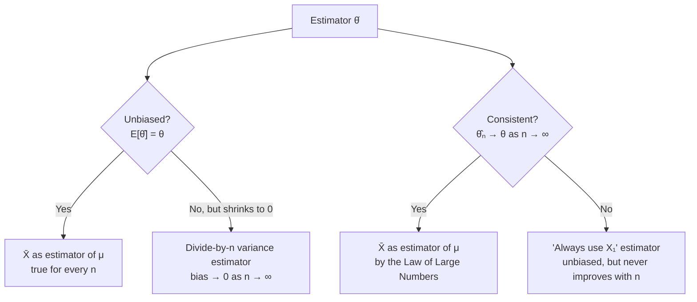

## Learning Objectives

- Define a point estimator and a point estimate, and distinguish an estimator (a rule, before data is observed) from an estimate (a number, after it is).
- Define unbiasedness precisely (E[estimator] = true parameter) and verify whether a given estimator is unbiased.
- Define consistency precisely and connect it directly to the Law of Large Numbers already established in this discipline.
- Explain why unbiasedness and consistency are different properties — an estimator can have one without the other — using concrete counterexamples.
- Compare two candidate estimators of the same parameter on the basis of bias, consistency, and variance, and justify which is preferable.

## Context & Motivation

The previous two concepts in this cluster established the vocabulary: a population has a fixed but unknown parameter (its true mean μ), a sample produces a statistic (the sample mean x̄), and that statistic's sampling distribution is centered on μ with a spread that shrinks as sample size grows. What has not yet been asked directly is: *why is x̄ the right choice at all?* Nothing so far has ruled out other candidates — the sample median, the average of just the first and last observations, or the midpoint of the smallest and largest values could all, in principle, serve as a "guess" at μ computed from the same data. Point estimation is the branch of statistics that makes this choice rigorous: it defines exactly what properties a good estimator should have, so that "use the sample mean" becomes a justified conclusion rather than an arbitrary convention.

This matters well beyond the sample mean itself. Every quantitative field that draws conclusions from data — clinical trials estimating a drug's effect size, an A/B test estimating a conversion-rate lift, a physicist estimating a fundamental constant from repeated measurements — is, underneath the domain-specific language, doing point estimation: choosing a formula (an estimator) to turn a batch of noisy data into a single best guess (a point estimate) at some fixed truth. The two properties developed in this concept — **unbiasedness** and **consistency** — are the two most fundamental criteria by which the quality of that formula gets judged, and both connect directly to ideas already built in this discipline: unbiasedness is a statement about the expectation of a random variable (the estimator, before data is observed), and consistency is a direct application of the Law of Large Numbers, covered earlier in this discipline's limit-theorems section.

## Core Theory

### Estimator vs. estimate

An **estimator** is a rule — a function of the (as yet unobserved) sample data — used to produce a guess at an unknown parameter. Before any data is collected, an estimator is itself a random variable (this is exactly the "statistic as random variable" idea from the previous concept), because its value depends on which random sample happens to be drawn. Once data has actually been observed and the formula is evaluated on it, the resulting single number is called an **estimate**. For the population mean μ, the estimator is X̄ = (1/n)Σᵢ Xᵢ (a formula, applicable to any sample of size n before it is drawn); the estimate is x̄ = 995.625 (a specific number, once 8 actual light bulb lifetimes — as in this cluster's first concept — have been measured). The distinction matters because *properties like unbiasedness and consistency are properties of the estimator* (a claim about its whole distribution across hypothetical repeated sampling), not of any one estimate (which is just a single realized number, neither "biased" nor "unbiased" on its own).

### Unbiasedness

An estimator θ̂ (read "theta-hat") of a parameter θ is **unbiased** if

E[θ̂] = θ

for every possible true value of θ — that is, averaged over the sampling distribution (across all the hypothetical samples that could have been drawn), the estimator neither systematically overshoots nor systematically undershoots the true parameter. The **bias** of an estimator is defined as Bias(θ̂) = E[θ̂] − θ; an unbiased estimator has bias exactly zero.

Two results already established in this discipline are, in this new vocabulary, exactly statements of unbiasedness:

- E[X̄] = μ (proved in the previous concept via linearity of expectation) says precisely that **X̄ is an unbiased estimator of μ**.
- E[S²] = σ² (the reason for dividing by n − 1 rather than n, established in the first concept of this cluster) says precisely that **S² (with the n − 1 divisor) is an unbiased estimator of σ²** — and, by the same token, that the "naive" divide-by-n version is a *biased* estimator, since its expectation is systematically less than σ².

Unbiasedness is a statement about *where the sampling distribution of the estimator is centered* — it says nothing at all about how spread out that sampling distribution is. An unbiased estimator can still be a poor one in practice if its variance is enormous, giving estimates that are individually wildly off from θ even though they average out correctly over many hypothetical repetitions.

### Consistency

An estimator θ̂ₙ (indexed by sample size n, to make the dependence explicit) is **consistent** if, as the sample size n grows without bound, θ̂ₙ converges to the true parameter θ — formally, for any margin ε > 0, the probability that θ̂ₙ differs from θ by more than ε shrinks to zero as n → ∞.

This is exactly the content of the **Law of Large Numbers**, already established elsewhere in this discipline: the LLN states that the average of independent, identically distributed random variables converges to the true expectation μ as the number of variables averaged grows. Applied here, this is precisely the statement that **X̄ is a consistent estimator of μ** — the more data collected, the more tightly X̄'s possible values cluster around the true μ, with the probability of a large discrepancy shrinking toward zero. The same standard-error calculation from the previous concept (SE = σ/√n → 0 as n → ∞) is the quantitative engine behind this: as the sampling distribution of X̄ grows ever tighter around μ, consistency follows directly.

### Unbiasedness and consistency are different properties

A natural but mistaken instinct is to treat these two properties as basically the same idea restated twice. They are not, and the difference matters:

- **Unbiased but not obviously about growing sample size:** unbiasedness is a single-sample-size statement — X̄ computed from a sample of size n = 3 is already exactly unbiased (E[X̄] = μ holds for *any* n ≥ 1), even though a sample of size 3 is far too small to pin down μ reliably. Unbiasedness says nothing about how *precise* the estimate is for a given n, only that it doesn't systematically drift off in one direction.
- **Consistent but biased:** an estimator can be biased for every finite n, yet have that bias shrink to zero as n grows, making it consistent anyway. For instance, the divide-by-n version of sample variance (Σ(xᵢ − x̄)²/n) is biased for every finite n (its expectation is (n − 1)/n · σ², always slightly less than σ²), but as n → ∞, (n − 1)/n → 1, so the bias vanishes in the limit — this estimator is biased but still consistent.
- **Unbiased but not consistent (a constructed counterexample):** define the estimator "always use only the very first observation, X₁, and ignore the rest of the sample, no matter how large n is." E[X₁] = μ, so this estimator is perfectly unbiased for every n. But it never improves as more data arrives — its variance stays fixed at σ² regardless of n, so it never converges to μ. This estimator is unbiased but **not** consistent, a case that shows the two properties are logically independent: neither implies the other.



### Why the sample mean is a well-justified choice

Putting these together: X̄ is unbiased for μ (for every n) *and* consistent (by the LLN, as n → ∞), a combination that is genuinely desirable — it neither drifts systematically nor stays permanently imprecise as more data accumulates. This is exactly why X̄ is the standard, default estimator of a population mean rather than an arbitrary convention: it is the estimator that satisfies both of the criteria developed here, and (though not derived in full here) it can further be shown to have the smallest variance among all unbiased estimators of μ under fairly general conditions — a stronger property called efficiency, beyond this concept's scope but worth naming as the reason X̄, rather than some other unbiased-and-consistent alternative, is preferred in practice.

## Worked Examples

### Example 1 — checking unbiasedness directly

**Problem:** A population has true mean μ = 50. Two candidate estimators of μ are proposed from a sample X₁, X₂, X₃ (n = 3): Estimator A = (X₁ + X₂ + X₃)/3 (the ordinary sample mean), and Estimator B = (X₁ + X₂ + X₃)/2 (the same sum, divided incorrectly by 2 instead of 3). Determine whether each is unbiased.

**Estimator A:** E[A] = E[(X₁+X₂+X₃)/3] = (1/3)(E[X₁]+E[X₂]+E[X₃]) = (1/3)(μ+μ+μ) = μ = 50. Unbiased. ✓

**Estimator B:** E[B] = E[(X₁+X₂+X₃)/2] = (1/2)(3μ) = 1.5μ = 75. Since E[B] = 75 ≠ μ = 50, Estimator B is biased — it systematically overestimates μ by exactly 50% on average, no matter how many samples are collected, because the divisor never matches the number of terms summed. This is a deliberately silly but instructive example: bias is a completely mechanical consequence of the estimator's formula, not something that requires unusual data to produce.

### Example 2 — consistency in action, via simulation

**Problem:** Confirm numerically that X̄ is consistent by observing how tightly its distribution clusters around the true μ as sample size n grows.

```python
import random
import statistics

random.seed(2)
true_mu = 50
true_sigma = 10

for n in [5, 50, 500, 5000]:
    estimates = []
    for _ in range(2000):
        sample = [random.gauss(true_mu, true_sigma) for _ in range(n)]
        estimates.append(statistics.mean(sample))
    spread = statistics.pstdev(estimates)
    frac_within_1 = sum(abs(e - true_mu) <= 1 for e in estimates) / len(estimates)
    print(f"n={n:5d}  spread of X̄ ≈ {spread:6.3f}   "
          f"fraction of estimates within ±1 of true μ: {frac_within_1:.3f}")
```

Running this shows the spread of X̄'s sampling distribution (approximately σ/√n = 10/√n) shrinking steadily as n grows — from roughly 4.47 at n = 5 down to about 0.14 at n = 5000 — and the fraction of estimates landing within ±1 of the true μ = 50 climbing from a small minority at n = 5 to nearly all of them at n = 5000. This is exactly the definition of consistency made concrete: as n grows, the probability of X̄ landing far from the true parameter shrinks toward zero.

### Example 3 — an unbiased estimator that is not consistent

**Problem:** Using the same population as Example 2 (true μ = 50, σ = 10), compare the ordinary sample mean X̄ₙ against the "always just use the first observation" estimator, X₁, as n grows, to confirm that X₁ stays unbiased but never becomes consistent.

**Reasoning (no simulation needed, though one would confirm it).** E[X₁] = μ = 50 for every sample, regardless of n — X₁ is exactly as unbiased as X̄ₙ is, since it is just a single draw from the same population. But Var(X₁) = σ² = 100 always, no matter how large n grows, since X₁ never incorporates any of the additional data — whereas Var(X̄ₙ) = σ²/n shrinks toward 0. So while both estimators are unbiased, only X̄ₙ is consistent: X₁'s sampling distribution never tightens around μ no matter how much more data is collected, while X̄ₙ's does. This is the cleanest possible illustration that unbiasedness alone does not guarantee an estimator actually gets better with more data — consistency is the separate property that captures that improvement.

## Common Misconceptions & Pitfalls

- **"An unbiased estimator is automatically a good estimator."** Unbiasedness only says the estimator's sampling distribution is centered correctly, on average across hypothetical repeated sampling — it says nothing about how spread out that distribution is. Example 3's X₁ is perfectly unbiased for every n, yet is a poor estimator in practice compared to X̄ₙ, because its variance never shrinks no matter how much data is collected.
- **"Consistency and unbiasedness are the same thing, or one implies the other."** They do not imply each other. The divide-by-n variance estimator discussed in Core Theory is biased for every finite n yet consistent (its bias vanishes as n → ∞); the "always use X₁" estimator in Example 3 is unbiased for every n yet never consistent. Both directions of implication fail.
- **"A single estimate being close to the true value proves the estimator is good."** Bias and consistency are properties of the estimator's entire sampling distribution across hypothetically repeated sampling, not of any one observed estimate. A biased or inconsistent estimator can still occasionally, by chance, produce an estimate close to the true parameter on a given sample — that single lucky outcome says nothing about the estimator's general reliability.
- **"More data always removes bias."** More data does reliably reduce variance (that's consistency) and can shrink certain kinds of bias toward zero (as with the divide-by-n variance estimator), but a fundamentally biased formula — like Estimator B in Example 1, which divides by the wrong constant — does not become less biased with more data; its bias (a fixed multiplicative factor there) persists at any sample size.
- **"The sample mean is the only reasonable estimator of the population mean."** Other estimators (the sample median, a trimmed mean that discards extreme values, weighted averages) can also be unbiased or consistent estimators of a population's central tendency under the right conditions, and are sometimes preferred — for instance, the median is a more robust estimator of center when outliers are a concern, as the very first concept in this cluster discussed. X̄ is preferred specifically because it combines unbiasedness, consistency, and (for Normally distributed, or many other, populations) minimum variance among unbiased estimators — not because no alternative estimators exist.

## Summary

Point estimation formalizes what makes an estimator (a rule computed from sample data, before it is observed) a good way to guess at an unknown parameter, as distinct from an estimate (the single realized number once data is in hand). Two properties matter most: **unbiasedness** (E[estimator] = true parameter, for every sample size) and **consistency** (the estimator converges to the true parameter as sample size grows without bound, a direct consequence of the Law of Large Numbers). These properties are logically independent — an estimator can be unbiased without being consistent, or consistent without being unbiased for any finite n — and the sample mean X̄ is the standard estimator of a population mean precisely because it is both: E[X̄] = μ for every n, and X̄ → μ as n → ∞ by the LLN. This dual justification is what makes "use the sample mean" a provably good choice rather than an arbitrary habit, and it sets up the next concept, confidence intervals, which quantifies exactly how much uncertainty remains around a point estimate for any given, finite sample size.

## Documentation Links

- [MIT 6.041 — Lecture Notes (OCW)](https://ocw.mit.edu/courses/6-041-probabilistic-systems-analysis-and-applied-probability-fall-2010/pages/lecture-notes/) — doc
- [MIT 6.041 — Syllabus (OCW)](https://ocw.mit.edu/courses/6-041-probabilistic-systems-analysis-and-applied-probability-fall-2010/pages/syllabus/) — doc
