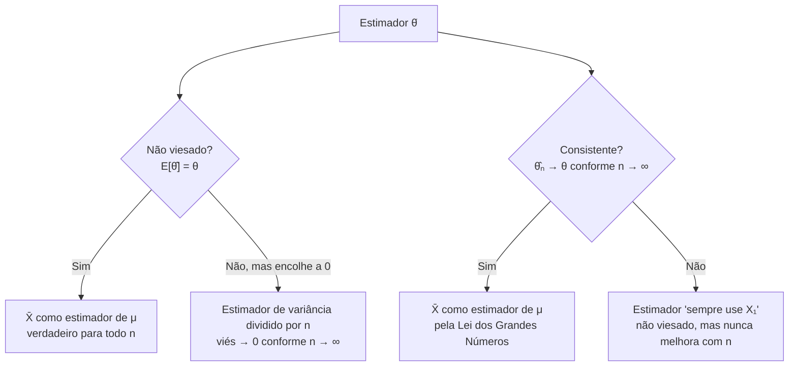

## Objetivos de Aprendizagem

- Definir um estimador pontual e uma estimativa pontual, e distinguir um estimador (uma regra, antes de os dados serem observados) de uma estimativa (um número, depois disso).
- Definir precisamente não viesamento (E[estimador] = parâmetro verdadeiro) e verificar se um dado estimador é não viesado.
- Definir precisamente consistência e conectá-la diretamente à Lei dos Grandes Números já estabelecida nesta disciplina.
- Explicar por que não viesamento e consistência são propriedades diferentes, um estimador pode ter uma sem a outra, usando contraexemplos concretos.
- Comparar dois estimadores candidatos do mesmo parâmetro com base em viés, consistência e variância, e justificar qual é preferível.

## Contexto e Motivação

Os dois conceitos anteriores deste agrupamento estabeleceram o vocabulário: uma população tem um parâmetro fixo mas desconhecido (sua média verdadeira μ), uma amostra produz uma estatística (a média amostral x̄), e a distribuição amostral dessa estatística é centrada em μ com uma dispersão que encolhe conforme o tamanho da amostra cresce. O que ainda não foi perguntado diretamente é: *por que x̄ é sequer a escolha certa?* Nada até agora descartou outros candidatos: a mediana amostral, a média apenas da primeira e da última observação, ou o ponto médio entre o menor e o maior valor poderiam todos, em princípio, servir como um "chute" para μ calculado a partir dos mesmos dados. A estimação pontual é o ramo da estatística que torna essa escolha rigorosa: ela define exatamente quais propriedades um bom estimador deve ter, de modo que "use a média amostral" se torne uma conclusão justificada em vez de uma convenção arbitrária.

Isso importa muito além da própria média amostral. Todo campo quantitativo que tira conclusões de dados (ensaios clínicos estimando o tamanho do efeito de um medicamento, um teste A/B estimando um aumento na taxa de conversão, um físico estimando uma constante fundamental a partir de medições repetidas) está, por baixo da linguagem específica do domínio, fazendo estimação pontual: escolhendo uma fórmula (um estimador) para transformar um lote de dados ruidosos em um único melhor chute (uma estimativa pontual) para alguma verdade fixa. As duas propriedades desenvolvidas neste conceito, **não viesamento** e **consistência**, são os dois critérios mais fundamentais pelos quais a qualidade dessa fórmula é julgada, e ambos se conectam diretamente a ideias já construídas nesta disciplina: não viesamento é uma afirmação sobre a esperança de uma variável aleatória (o estimador, antes de os dados serem observados), e consistência é uma aplicação direta da Lei dos Grandes Números, coberta anteriormente na seção de teoremas-limite desta disciplina.

## Teoria Central

### Estimador vs. estimativa

Um **estimador** é uma regra, uma função dos dados amostrais (ainda não observados), usada para produzir um chute para um parâmetro desconhecido. Antes de qualquer dado ser coletado, um estimador é ele mesmo uma variável aleatória (isso é exatamente a ideia de "estatística como variável aleatória" do conceito anterior), porque seu valor depende de qual amostra aleatória acontece de ser coletada. Uma vez que os dados foram de fato observados e a fórmula é avaliada sobre eles, o número único resultante é chamado de **estimativa**. Para a média populacional μ, o estimador é X̄ = (1/n)Σᵢ Xᵢ (uma fórmula, aplicável a qualquer amostra de tamanho n antes de ser coletada); a estimativa é x̄ = 995,625 (um número específico, uma vez que 8 tempos de vida reais de lâmpadas, como no primeiro conceito deste agrupamento, foram medidos). A distinção importa porque *propriedades como não viesamento e consistência são propriedades do estimador* (uma afirmação sobre toda a sua distribuição ao longo de amostragem repetida hipotética), não de qualquer estimativa específica (que é apenas um número realizado único, nem "viesado" nem "não viesado" por si só).

### Não viesamento

Um estimador θ̂ (lê-se "theta-chapéu") de um parâmetro θ é **não viesado** se

E[θ̂] = θ

para todo valor verdadeiro possível de θ, ou seja, calculado em média sobre a distribuição amostral (ao longo de todas as amostras hipotéticas que poderiam ter sido coletadas), o estimador nem sistematicamente supera nem sistematicamente fica abaixo do parâmetro verdadeiro. O **viés** de um estimador é definido como Viés(θ̂) = E[θ̂] − θ; um estimador não viesado tem viés exatamente zero.

Dois resultados já estabelecidos nesta disciplina são, neste novo vocabulário, exatamente afirmações de não viesamento:

- E[X̄] = μ (provado no conceito anterior via linearidade da esperança) diz precisamente que **X̄ é um estimador não viesado de μ**.
- E[S²] = σ² (a razão para dividir por n − 1 em vez de n, estabelecida no primeiro conceito deste agrupamento) diz precisamente que **S² (com o divisor n − 1) é um estimador não viesado de σ²**, e, pelo mesmo raciocínio, que a versão "ingênua" dividida por n é um estimador *viesado*, já que sua esperança é sistematicamente menor que σ².

Não viesamento é uma afirmação sobre *onde a distribuição amostral do estimador está centrada*, não diz absolutamente nada sobre quão dispersa é essa distribuição amostral. Um estimador não viesado ainda pode ser ruim na prática se sua variância for enorme, dando estimativas que individualmente estão muito longe de θ mesmo que se equilibrem corretamente ao longo de muitas repetições hipotéticas.

### Consistência

Um estimador θ̂ₙ (indexado pelo tamanho da amostra n, para tornar a dependência explícita) é **consistente** se, conforme o tamanho da amostra n cresce sem limite, θ̂ₙ converge para o parâmetro verdadeiro θ, formalmente, para qualquer margem ε > 0, a probabilidade de θ̂ₙ diferir de θ em mais que ε encolhe a zero conforme n → ∞.

Isto é exatamente o conteúdo da **Lei dos Grandes Números**, já estabelecida em outro lugar nesta disciplina: a LGN afirma que a média de variáveis aleatórias independentes e identicamente distribuídas converge para a esperança verdadeira μ conforme o número de variáveis calculadas na média cresce. Aplicado aqui, esta é precisamente a afirmação de que **X̄ é um estimador consistente de μ**: quanto mais dados coletados, mais estreitamente os valores possíveis de X̄ se agrupam em torno da μ verdadeira, com a probabilidade de uma grande discrepância encolhendo em direção a zero. O mesmo cálculo de erro padrão do conceito anterior (EP = σ/√n → 0 conforme n → ∞) é o motor quantitativo por trás disso: conforme a distribuição amostral de X̄ fica cada vez mais estreita em torno de μ, a consistência segue diretamente.

### Não viesamento e consistência são propriedades diferentes

Um instinto natural mas equivocado é tratar essas duas propriedades como basicamente a mesma ideia reafirmada duas vezes. Não são, e a diferença importa:

- **Não viesado mas não obviamente sobre crescer o tamanho da amostra:** não viesamento é uma afirmação para um único tamanho de amostra, X̄ calculado a partir de uma amostra de tamanho n = 3 já é exatamente não viesado (E[X̄] = μ vale para *qualquer* n ≥ 1), mesmo que uma amostra de tamanho 3 seja pequena demais para determinar μ de forma confiável. Não viesamento não diz nada sobre quão *precisa* é a estimativa para um dado n, apenas que ela não deriva sistematicamente em uma direção.
- **Consistente mas viesado:** um estimador pode ser viesado para todo n finito, mas ter esse viés encolhendo a zero conforme n cresce, tornando-o consistente mesmo assim. Por exemplo, a versão dividida-por-n da variância amostral (Σ(xᵢ − x̄)²/n) é viesada para todo n finito (sua esperança é (n − 1)/n · σ², sempre um pouco menor que σ²), mas conforme n → ∞, (n − 1)/n → 1, então o viés desaparece no limite, este estimador é viesado mas ainda consistente.
- **Não viesado mas não consistente (um contraexemplo construído):** defina o estimador "sempre use apenas a primeira observação, X₁, e ignore o resto da amostra, não importa quão grande n seja." E[X₁] = μ, então esse estimador é perfeitamente não viesado para todo n. Mas ele nunca melhora conforme mais dados chegam, sua variância permanece fixa em σ² independentemente de n, então ele nunca converge para μ. Esse estimador é não viesado mas **não** consistente, um caso que mostra que as duas propriedades são logicamente independentes: nenhuma implica a outra.



### Por que a média amostral é uma escolha bem justificada

Juntando essas peças: X̄ é não viesado para μ (para todo n) *e* consistente (pela LGN, conforme n → ∞), uma combinação que é genuinamente desejável, ela nem deriva sistematicamente nem permanece permanentemente imprecisa conforme mais dados se acumulam. É exatamente por isso que X̄ é o estimador padrão, default, de uma média populacional em vez de uma convenção arbitrária: é o estimador que satisfaz ambos os critérios desenvolvidos aqui, e (embora não derivado completamente aqui) pode-se ainda mostrar que ele tem a menor variância entre todos os estimadores não viesados de μ sob condições bastante gerais, uma propriedade mais forte chamada eficiência, além do escopo deste conceito, mas que vale a pena nomear como a razão pela qual X̄, em vez de alguma outra alternativa não viesada e consistente, é preferido na prática.

## Exemplos Resolvidos

### Exemplo 1 — verificando não viesamento diretamente

**Problema:** Uma população tem média verdadeira μ = 50. Dois estimadores candidatos de μ são propostos a partir de uma amostra X₁, X₂, X₃ (n = 3): Estimador A = (X₁ + X₂ + X₃)/3 (a média amostral comum), e Estimador B = (X₁ + X₂ + X₃)/2 (a mesma soma, dividida incorretamente por 2 em vez de 3). Determine se cada um é não viesado.

**Estimador A:** E[A] = E[(X₁+X₂+X₃)/3] = (1/3)(E[X₁]+E[X₂]+E[X₃]) = (1/3)(μ+μ+μ) = μ = 50. Não viesado. ✓

**Estimador B:** E[B] = E[(X₁+X₂+X₃)/2] = (1/2)(3μ) = 1,5μ = 75. Como E[B] = 75 ≠ μ = 50, o Estimador B é viesado, ele sistematicamente superestima μ em exatamente 50% em média, não importa quantas amostras sejam coletadas, porque o divisor nunca corresponde ao número de termos somados. Este é um exemplo deliberadamente bobo mas instrutivo: viés é uma consequência completamente mecânica da fórmula do estimador, não algo que exige dados incomuns para produzir.

### Exemplo 2 — consistência em ação, via simulação

**Problema:** Confirme numericamente que X̄ é consistente observando quão estreitamente sua distribuição se agrupa em torno da μ verdadeira conforme o tamanho da amostra n cresce.

```python
import random
import statistics

random.seed(2)
true_mu = 50
true_sigma = 10

for n in [5, 50, 500, 5000]:
    estimates = []
    for _ in range(2000):
        sample = [random.gauss(true_mu, true_sigma) for _ in range(n)]
        estimates.append(statistics.mean(sample))
    spread = statistics.pstdev(estimates)
    frac_within_1 = sum(abs(e - true_mu) <= 1 for e in estimates) / len(estimates)
    print(f"n={n:5d}  spread of X̄ ≈ {spread:6.3f}   "
          f"fraction of estimates within ±1 of true μ: {frac_within_1:.3f}")
```

Executar isso mostra a dispersão da distribuição amostral de X̄ (aproximadamente σ/√n = 10/√n) encolhendo continuamente conforme n cresce, de cerca de 4,47 em n = 5 até cerca de 0,14 em n = 5000, e a fração de estimativas caindo dentro de ±1 da μ verdadeira = 50 subindo de uma pequena minoria em n = 5 para quase todas em n = 5000. Isto é exatamente a definição de consistência tornada concreta: conforme n cresce, a probabilidade de X̄ cair longe do parâmetro verdadeiro encolhe em direção a zero.

### Exemplo 3 — um estimador não viesado que não é consistente

**Problema:** Usando a mesma população do Exemplo 2 (μ verdadeira = 50, σ = 10), compare a média amostral comum X̄ₙ com o estimador "sempre use apenas a primeira observação", X₁, conforme n cresce, para confirmar que X₁ permanece não viesado mas nunca se torna consistente.

**Raciocínio (nenhuma simulação necessária, embora uma confirmaria).** E[X₁] = μ = 50 para toda amostra, independentemente de n, X₁ é exatamente tão não viesado quanto X̄ₙ, já que é apenas um único sorteio da mesma população. Mas Var(X₁) = σ² = 100 sempre, não importa quão grande n cresça, já que X₁ nunca incorpora nenhum dos dados adicionais, enquanto Var(X̄ₙ) = σ²/n encolhe em direção a 0. Então, embora ambos os estimadores sejam não viesados, apenas X̄ₙ é consistente: a distribuição amostral de X₁ nunca se estreita em torno de μ não importa quantos dados adicionais sejam coletados, enquanto a de X̄ₙ se estreita. Esta é a ilustração mais limpa possível de que não viesamento sozinho não garante que um estimador realmente melhore com mais dados, consistência é a propriedade separada que captura essa melhora.

## Equívocos Comuns e Armadilhas

- **"Um estimador não viesado é automaticamente um bom estimador."** Não viesamento apenas diz que a distribuição amostral do estimador está centrada corretamente, em média ao longo de amostragem repetida hipotética, não diz nada sobre quão dispersa é essa distribuição. O X₁ do Exemplo 3 é perfeitamente não viesado para todo n, mas é um estimador ruim na prática comparado a X̄ₙ, porque sua variância nunca encolhe não importa quantos dados sejam coletados.
- **"Consistência e não viesamento são a mesma coisa, ou uma implica a outra."** Não implicam uma na outra. O estimador de variância dividido por n discutido na Teoria Central é viesado para todo n finito mas consistente (seu viés desaparece conforme n → ∞); o estimador "sempre use X₁" do Exemplo 3 é não viesado para todo n mas nunca consistente. As duas direções da implicação falham.
- **"Uma única estimativa próxima do valor verdadeiro prova que o estimador é bom."** Viés e consistência são propriedades de toda a distribuição amostral do estimador ao longo de amostragem hipoteticamente repetida, não de qualquer estimativa única observada. Um estimador viesado ou inconsistente ainda pode, ocasionalmente, por acaso, produzir uma estimativa próxima do parâmetro verdadeiro em uma amostra específica, esse único resultado sortudo não diz nada sobre a confiabilidade geral do estimador.
- **"Mais dados sempre removem o viés."** Mais dados de fato reduzem a variância de forma confiável (isso é consistência) e podem encolher certos tipos de viés em direção a zero (como no estimador de variância dividido por n), mas uma fórmula fundamentalmente viesada, como o Estimador B do Exemplo 1, que divide pela constante errada, não se torna menos viesada com mais dados; seu viés (um fator multiplicativo fixo ali) persiste em qualquer tamanho de amostra.
- **"A média amostral é o único estimador razoável da média populacional."** Outros estimadores (a mediana amostral, uma média aparada que descarta valores extremos, médias ponderadas) também podem ser estimadores não viesados ou consistentes da tendência central de uma população sob as condições certas, e às vezes são preferidos, por exemplo, a mediana é um estimador mais robusto do centro quando outliers são uma preocupação, como discutido no próprio primeiro conceito deste agrupamento. X̄ é preferido especificamente porque combina não viesamento, consistência e (para populações Normalmente distribuídas, ou muitas outras) variância mínima entre estimadores não viesados, não porque nenhum estimador alternativo exista.

## Resumo

A estimação pontual formaliza o que torna um estimador (uma regra calculada a partir de dados amostrais, antes de serem observados) uma boa forma de estimar um parâmetro desconhecido, em contraste com uma estimativa (o número único realizado uma vez que os dados estão em mãos). Duas propriedades importam mais: **não viesamento** (E[estimador] = parâmetro verdadeiro, para todo tamanho de amostra) e **consistência** (o estimador converge para o parâmetro verdadeiro conforme o tamanho da amostra cresce sem limite, uma consequência direta da Lei dos Grandes Números). Essas propriedades são logicamente independentes, um estimador pode ser não viesado sem ser consistente, ou consistente sem ser não viesado para qualquer n finito, e a média amostral X̄ é o estimador padrão de uma média populacional precisamente porque é ambos: E[X̄] = μ para todo n, e X̄ → μ conforme n → ∞ pela LGN. Essa dupla justificativa é o que torna "use a média amostral" uma escolha comprovadamente boa em vez de um hábito arbitrário, e prepara o próximo conceito, intervalos de confiança, que quantifica exatamente quanta incerteza permanece em torno de uma estimativa pontual para qualquer tamanho de amostra finito dado.

## Documentation Links

- [MIT 6.041 — Lecture Notes (OCW)](https://ocw.mit.edu/courses/6-041-probabilistic-systems-analysis-and-applied-probability-fall-2010/pages/lecture-notes/) — doc
- [MIT 6.041 — Syllabus (OCW)](https://ocw.mit.edu/courses/6-041-probabilistic-systems-analysis-and-applied-probability-fall-2010/pages/syllabus/) — doc
