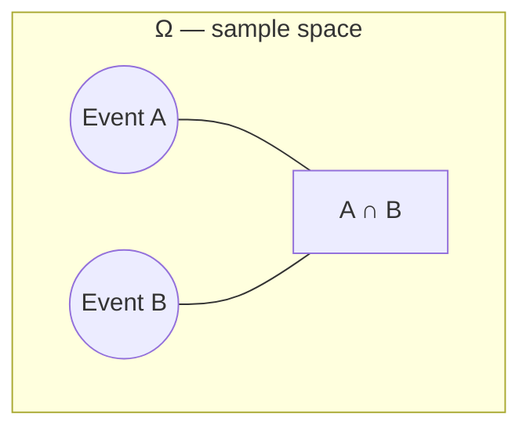

## Learning Objectives

- Define the sample space Ω of a random experiment and enumerate it for simple experiments.
- Define an event as a subset of Ω and translate everyday statements ("at least one head", "the sum is even") into set notation.
- Apply the set operations union, intersection, and complement to combine and describe events.
- Distinguish finite, countably infinite, and continuous sample spaces, and identify which kind a given experiment produces.
- Count the outcomes in a sample space or an event using combinatorial reasoning when outcomes are equally likely.

## Context & Motivation

Every probabilistic statement — "there's a 70% chance of rain," "the odds of drawing a flush are about 1 in 500," "there's a 1-in-14-million chance of winning the lottery" — is secretly a statement about a set. Before any of these numbers can be computed or even meaningfully discussed, there has to be an agreement about what the space of possible outcomes looks like and about which outcomes count toward the event being described. That agreement is exactly what a sample space and an event formalize, and it is the reason probability courses — MIT's 6.041 among them — spend their very first lecture on this vocabulary rather than jumping straight to formulas: get the sample space wrong, or misdescribe the event, and every downstream calculation is meaningless no matter how carefully the arithmetic is done afterward.

The payoff for getting this right early is that probability then becomes an exercise in ordinary set theory. "A or B" becomes A ∪ B. "A and B" becomes A ∩ B. "Not A" becomes Aᶜ. Once outcomes and events are described as sets, all the familiar machinery of set algebra — De Morgan's laws, distributivity, the notion of disjointness — becomes available for free, and reasoning about complicated compound events reduces to reasoning about set operations that were likely already familiar from other parts of discrete mathematics.

There's a second, more subtle reason this chapter matters: many real sample spaces are too large to write out outcome by outcome, and yet computing a probability under the "equally likely outcomes" model requires knowing exactly how many outcomes are in Ω and exactly how many are in the event of interest. A five-card poker hand has 2,598,960 possible outcomes; nobody lists them. Counting them — and counting the outcomes that make up an event like "exactly two pairs" — is precisely the job of the combinatorial tools (permutations, combinations, the multiplication principle) already developed in discrete mathematics. Sample spaces and events are the bridge that lets that machinery plug directly into probability: the moment an experiment has equally likely outcomes, "probability of an event" collapses into "count the favorable outcomes, count the total outcomes, divide" — and counting is a combinatorics problem through and through.

## Core Theory

### The sample space Ω

The **sample space** of a random experiment, denoted Ω, is the set of all possible outcomes of that experiment — exhaustive (every possible outcome is included) and mutually exclusive at the level of individual outcomes (the experiment produces exactly one outcome ω ∈ Ω each time it is run). The choice of Ω is a modeling decision: it should be fine-grained enough to describe everything you might ever want to ask about, but no finer than necessary.

Examples of sample spaces:

- A single coin flip: Ω = {H, T}. Finite, |Ω| = 2.
- Two coin flips, order matters: Ω = {HH, HT, TH, TT}. Finite, |Ω| = 4.
- Rolling a fair six-sided die: Ω = {1, 2, 3, 4, 5, 6}. Finite, |Ω| = 6.
- The number of coin flips until the first head appears: Ω = {1, 2, 3, …}. Countably infinite.
- The exact arrival time of the next bus, in minutes from now: Ω = [0, ∞). Continuous (uncountable).

The first three are **discrete finite** sample spaces; the fourth is **discrete countably infinite**; the fifth is **continuous**. This concept and the next four focus on discrete sample spaces — continuous ones and the density functions they require are covered later in this track.

### Events as subsets of Ω

An **event** A is any subset of the sample space, A ⊆ Ω. Saying "event A occurred" after running the experiment and observing outcome ω means precisely ω ∈ A. Two special events always exist: Ω itself, the **certain event** (it always occurs, since the experiment always produces some outcome), and the **empty set** ∅, the **impossible event** (it never occurs, since no outcome belongs to it).

Consider rolling a fair die, Ω = {1, 2, 3, 4, 5, 6}. "The roll is even" is the event A = {2, 4, 6}. "The roll is at least 5" is the event B = {5, 6}. "The roll is 7" is the event ∅ — impossible given this Ω. Events don't need a tidy verbal description at all; any subset of Ω, however arbitrary, such as {1, 3, 6}, is a perfectly legitimate event.

### Combining events: union, intersection, complement

Because events are sets, the standard set operations give exact translations of the natural-language connectives "or," "and," and "not":

- **Union**, A ∪ B = {ω ∈ Ω : ω ∈ A or ω ∈ B} — the event "A or B (or both) occurs."
- **Intersection**, A ∩ B = {ω ∈ Ω : ω ∈ A and ω ∈ B} — the event "both A and B occur."
- **Complement**, Aᶜ = {ω ∈ Ω : ω ∉ A} — the event "A does not occur."

Two events A and B are **mutually exclusive** (or **disjoint**) if A ∩ B = ∅ — they share no outcomes, so they cannot both occur on the same run of the experiment. With the die example above, A = {2, 4, 6} and B = {5, 6} are not disjoint (A ∩ B = {6}), but A and C = {1, 3, 5} (the odd rolls) are disjoint, since no roll is both even and odd.

These operations obey the same laws as general set algebra, most usefully **De Morgan's laws**: (A ∪ B)ᶜ = Aᶜ ∩ Bᶜ, and (A ∩ B)ᶜ = Aᶜ ∪ Bᶜ. In words: "not (A or B)" means "neither A nor B," and "not (A and B)" means "at least one of A, B fails to occur." These identities let compound negated statements be rewritten into a form that's often much easier to compute with — a technique used constantly once actual probabilities are attached to events.

Picture Ω as the full rectangle in a Venn diagram; A and B are regions (circles) inside it; A ∪ B is everything covered by either circle; A ∩ B is only the overlapping lens; Aᶜ is everything in the rectangle outside circle A.

### Counting outcomes: equally-likely-outcome sample spaces

When every outcome in a finite Ω is equally likely, the probability of an event A reduces to a counting problem:

P(A) = |A| / |Ω|

— the number of outcomes favorable to A, divided by the total number of outcomes. This formula is only valid under the equally-likely assumption (a fair die, a well-shuffled deck, an unbiased coin); it is *not* a general definition of probability, which axioms of probability establish separately. But when it applies, everything hinges on counting |Ω| and |A| correctly, and that is exactly where permutations and combinations — already developed in discrete mathematics — become the working tools of probability rather than an abstract counting exercise.

Take a standard 52-card deck, and consider the experiment of dealing a 5-card hand where order doesn't matter. The sample space is the set of all 5-card subsets of the deck, so |Ω| = C(52, 5) = 2,598,960 — a combination, since the order the cards are dealt in is irrelevant to what hand you end up holding. Now consider the event A = "the hand contains exactly 2 aces." Counting |A| requires choosing 2 of the 4 aces, C(4, 2) = 6 ways, and separately choosing 3 of the remaining 48 non-ace cards, C(48, 3) = 17,296 ways; by the multiplication principle, |A| = 6 × 17,296 = 103,776. So P(A) = 103,776 / 2,598,960 ≈ 0.0399, about a 4% chance. None of that arithmetic is probability-specific — it is pure combinatorics, and the sample-space/event framework is simply what tells you which counts to compute and which to divide by which.

## Worked Examples

### Example 1 — sample space and events for two dice

**Problem:** Two fair six-sided dice are rolled. Let Ω be the set of ordered pairs (first die, second die). Describe Ω, and find the events A = "the sum is 7," B = "both dice show the same value," and A ∩ B.

**Sample space.** Each die independently shows one of {1, …, 6}, and order matters (first die, second die are distinguishable), so Ω = {(i, j) : i, j ∈ {1, …, 6}}, and |Ω| = 6 × 6 = 36 by the multiplication principle.

**Event A.** The pairs summing to 7 are (1,6), (2,5), (3,4), (4,3), (5,2), (6,1) — so A = {(1,6), (2,5), (3,4), (4,3), (5,2), (6,1)}, |A| = 6.

**Event B.** The pairs with equal values are (1,1), (2,2), (3,3), (4,4), (5,5), (6,6) — so B = {(1,1), …, (6,6)}, |B| = 6.

**A ∩ B.** A pair can't simultaneously sum to 7 and have both dice equal (if i = j, the sum 2i is even, and 7 is odd), so A ∩ B = ∅ — A and B are mutually exclusive. Consequently P(A ∩ B) = 0 once probabilities are attached, and P(A ∪ B) will simply be P(A) + P(B) with no overlap to subtract, a shortcut only available because these two events are disjoint.

### Example 2 — translating compound statements into set operations

**Problem:** A single card is drawn from a standard 52-card deck. Let F = "the card is a face card" (jack, queen, king — 12 such cards) and H = "the card is a heart" (13 cards, one per rank). Describe, as sets and by counting, the events "F or H," "F and H," and "the card is neither a face card nor a heart."

**F ∪ H.** This is every card that is a face card, a heart, or both. Direct counting requires avoiding double-counting the overlap: |F ∪ H| = |F| + |H| − |F ∩ H|. The overlap F ∩ H is "face card that is also a heart" — the jack, queen, king of hearts, so |F ∩ H| = 3. Then |F ∪ H| = 12 + 13 − 3 = 22.

**F ∩ H.** As just computed, 3 cards: J♥, Q♥, K♥.

**Neither.** "Neither a face card nor a heart" is (F ∪ H)ᶜ, which by De Morgan's law equals Fᶜ ∩ Hᶜ — directly readable as "not a face card AND not a heart." Its count is |Ω| − |F ∪ H| = 52 − 22 = 30. This matches computing it the other way too: cards that are neither hearts nor face cards are the 39 non-heart cards, minus the face cards among those non-heart suits (3 suits × 3 face cards = 9 face cards outside hearts), giving 39 − 9 = 30. Both routes agree, which is a useful check whenever De Morgan's law is invoked to rewrite a "neither/nor" event.

### Example 3 — a sample space that requires combinations to count

**Problem:** A committee of 3 people is chosen at random from a group of 5 women and 4 men (9 people total). What is the probability that the committee has exactly 2 women and 1 man?

**Sample space.** Ω is the set of all 3-person subsets of the 9 people; since committee membership doesn't depend on the order people are picked in, |Ω| = C(9, 3) = 84.

**Event A = "exactly 2 women, 1 man."** By the multiplication principle applied to two independent combinatorial choices — choosing 2 of the 5 women, and separately choosing 1 of the 4 men — |A| = C(5, 2) × C(4, 1) = 10 × 4 = 40.

**Probability.** P(A) = |A| / |Ω| = 40 / 84 = 10/21 ≈ 0.476.

This example is exactly the kind of situation the Context section pointed to: the sample space itself (all 3-person subsets of 9 people) is a combination, C(9,3), and the event inside it is counted by combining two further combinations via the multiplication principle. No new counting idea is needed beyond what permutations and combinations already supply — sample-space/event language just tells you precisely which sets to count.

## Common Misconceptions & Pitfalls

- **"The sample space must list literal physical outcomes, one true way."** In fact the modeling choice of Ω is up to the analyst, as long as it is exhaustive and outcomes are mutually exclusive. Two flips of a coin could be modeled as Ω = {HH, HT, TH, TT} (order matters) or, less usefully for most questions, Ω = {0 heads, 1 head, 2 heads} — both are valid sample spaces, but they are *not* interchangeable if outcomes in the second model aren't equally likely (1 head is twice as likely as 0 heads or 2 heads), so the count-based formula P(A) = |A|/|Ω| only applies cleanly to the first, finer-grained model.
- **"A and B disjoint" is the same idea as "A and B independent."** These are unrelated concepts that get worked out properly once conditional probability is introduced, but the confusion often starts right here at the set level: disjoint (A ∩ B = ∅) is a purely set-theoretic, structural fact about two events sharing no outcomes, while independence is a probabilistic fact about whether knowing one event changes the likelihood of the other. Don't let the visual of non-overlapping Venn-diagram circles suggest anything about independence.
- **"|A ∪ B| = |A| + |B|, always."** This only holds when A and B are disjoint. In general |A ∪ B| = |A| + |B| − |A ∩ B|, as Example 2 demonstrates directly — forgetting to subtract the overlap double-counts every outcome that belongs to both events.
- **"Complement means 'the opposite outcome,' not 'the set of every other outcome.'"** Aᶜ is not a single opposite outcome; it is every outcome in Ω not in A. For a die roll, if A = "roll is 1," then Aᶜ = {2, 3, 4, 5, 6} — five outcomes, not one "opposite" outcome.

## Summary

A sample space Ω collects every possible outcome of a random experiment, and an event is any subset A ⊆ Ω — a set of outcomes that count as that event occurring. The set operations union (∪, "or"), intersection (∩, "and"), and complement (ᶜ, "not") translate everyday probabilistic language directly into set algebra, with De Morgan's laws providing the correct way to negate compound "or"/"and" statements. Two events are mutually exclusive when A ∩ B = ∅, a purely structural condition distinct from independence. When outcomes in a finite Ω are equally likely, P(A) = |A|/|Ω| reduces probability entirely to counting, and that counting is precisely where the multiplication principle, permutations, and combinations from discrete mathematics do the real work — as seen in counting card hands and committee compositions above.

## Documentation Links

- [MIT 6.041 — Syllabus (OCW)](https://ocw.mit.edu/courses/6-041-probabilistic-systems-analysis-and-applied-probability-fall-2010/pages/syllabus/) — doc
- [ACM/IEEE CS2013 — Full Curriculum Guidelines](https://www.acm.org/binaries/content/assets/education/cs2013_web_final.pdf) — doc
