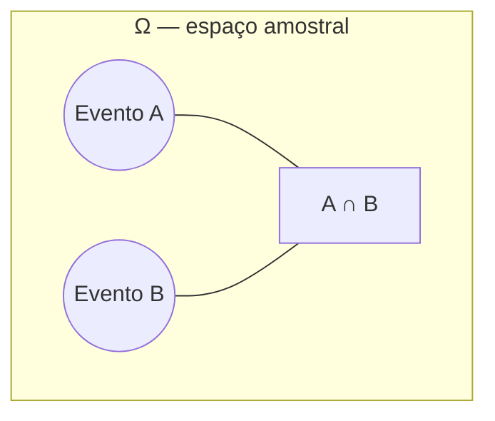

## Objetivos de Aprendizagem

- Definir o espaço amostral Ω de um experimento aleatório e enumerá-lo para experimentos simples.
- Definir um evento como um subconjunto de Ω e traduzir afirmações do dia a dia ("pelo menos uma cara", "a soma é par") para notação de conjuntos.
- Aplicar as operações de conjunto união, interseção e complemento para combinar e descrever eventos.
- Distinguir espaços amostrais finitos, contavelmente infinitos e contínuos, e identificar qual tipo um experimento dado produz.
- Contar os resultados num espaço amostral ou num evento usando raciocínio combinatório quando resultados são igualmente prováveis.

## Contexto e Motivação

Toda afirmação probabilística ("há 70% de chance de chover", "as chances de tirar um flush são cerca de 1 em 500", "há 1 chance em 14 milhões de ganhar na loteria") é secretamente uma afirmação sobre um conjunto. Antes que qualquer um desses números possa ser computado ou mesmo discutido de forma significativa, precisa haver um acordo sobre como o espaço de resultados possíveis se parece e sobre quais resultados contam para o evento sendo descrito. Esse acordo é exatamente o que um espaço amostral e um evento formalizam, e é a razão pela qual cursos de probabilidade (o 6.041 do MIT entre eles) gastam sua primeiríssima aula nesse vocabulário em vez de pular direto para fórmulas: erre o espaço amostral, ou descreva mal o evento, e todo cálculo posterior fica sem sentido não importa quão cuidadosamente a aritmética seja feita depois.

O retorno de acertar isso cedo é que probabilidade então se torna um exercício de teoria dos conjuntos comum. "A ou B" se torna A ∪ B. "A e B" se torna A ∩ B. "Não A" se torna Aᶜ. Uma vez que resultados e eventos são descritos como conjuntos, toda a maquinaria familiar de álgebra de conjuntos (leis de De Morgan, distributividade, a noção de disjunção) fica disponível de graça, e raciocinar sobre eventos compostos complicados se reduz a raciocinar sobre operações de conjunto que provavelmente já eram familiares de outras partes da matemática discreta.

Há uma segunda razão, mais sutil, pela qual este capítulo importa: muitos espaços amostrais reais são grandes demais para escrever resultado por resultado, e ainda assim computar uma probabilidade sob o modelo de "resultados igualmente prováveis" exige saber exatamente quantos resultados há em Ω e exatamente quantos há no evento de interesse. Uma mão de pôquer de cinco cartas tem 2.598.960 resultados possíveis; ninguém os lista. Contá-los, e contar os resultados que compõem um evento como "exatamente dois pares", é precisamente o trabalho das ferramentas combinatórias (permutações, combinações, o princípio multiplicativo) já desenvolvidas em matemática discreta. Espaços amostrais e eventos são a ponte que permite que essa maquinaria se conecte diretamente à probabilidade: no momento em que um experimento tem resultados igualmente prováveis, "probabilidade de um evento" colapsa para "conte os resultados favoráveis, conte os resultados totais, divida", e contar é um problema de combinatória do início ao fim.

## Teoria Central

### O espaço amostral Ω

O **espaço amostral** de um experimento aleatório, denotado Ω, é o conjunto de todos os resultados possíveis daquele experimento, exaustivo (todo resultado possível está incluído) e mutuamente exclusivo no nível de resultados individuais (o experimento produz exatamente um resultado ω ∈ Ω a cada vez que é executado). A escolha de Ω é uma decisão de modelagem: deveria ser granular o suficiente para descrever tudo que você algum dia poderia querer perguntar, mas não mais granular que o necessário.

Exemplos de espaços amostrais:

- Um único lançamento de moeda: Ω = {C, K}. Finito, |Ω| = 2.
- Dois lançamentos de moeda, ordem importa: Ω = {CC, CK, KC, KK}. Finito, |Ω| = 4.
- Rolar um dado justo de seis lados: Ω = {1, 2, 3, 4, 5, 6}. Finito, |Ω| = 6.
- O número de lançamentos de moeda até a primeira cara aparecer: Ω = {1, 2, 3, …}. Contavelmente infinito.
- O horário exato de chegada do próximo ônibus, em minutos a partir de agora: Ω = [0, ∞). Contínuo (incontável).

Os três primeiros são espaços amostrais **discretos finitos**; o quarto é **discreto contavelmente infinito**; o quinto é **contínuo**. Este conceito e os próximos quatro focam em espaços amostrais discretos; os contínuos e as funções de densidade que exigem são cobertos mais adiante nesta trilha.

### Eventos como subconjuntos de Ω

Um **evento** A é qualquer subconjunto do espaço amostral, A ⊆ Ω. Dizer "o evento A ocorreu" depois de executar o experimento e observar o resultado ω significa precisamente ω ∈ A. Dois eventos especiais sempre existem: o próprio Ω, o **evento certo** (sempre ocorre, já que o experimento sempre produz algum resultado), e o **conjunto vazio** ∅, o **evento impossível** (nunca ocorre, já que nenhum resultado pertence a ele).

Considere rolar um dado justo, Ω = {1, 2, 3, 4, 5, 6}. "A rolagem é par" é o evento A = {2, 4, 6}. "A rolagem é pelo menos 5" é o evento B = {5, 6}. "A rolagem é 7" é o evento ∅, impossível dado esse Ω. Eventos não precisam de uma descrição verbal arrumada de forma alguma; qualquer subconjunto de Ω, por mais arbitrário que seja, como {1, 3, 6}, é um evento perfeitamente legítimo.

### Combinando eventos: união, interseção, complemento

Como eventos são conjuntos, as operações de conjunto padrão dão traduções exatas dos conectivos de linguagem natural "ou", "e" e "não":

- **União**, A ∪ B = {ω ∈ Ω : ω ∈ A ou ω ∈ B}, o evento "A ou B (ou ambos) ocorre".
- **Interseção**, A ∩ B = {ω ∈ Ω : ω ∈ A e ω ∈ B}, o evento "tanto A quanto B ocorrem".
- **Complemento**, Aᶜ = {ω ∈ Ω : ω ∉ A}, o evento "A não ocorre".

Dois eventos A e B são **mutuamente exclusivos** (ou **disjuntos**) se A ∩ B = ∅, não compartilham nenhum resultado, então não podem ambos ocorrer na mesma execução do experimento. Com o exemplo do dado acima, A = {2, 4, 6} e B = {5, 6} não são disjuntos (A ∩ B = {6}), mas A e C = {1, 3, 5} (as rolagens ímpares) são disjuntos, já que nenhuma rolagem é ao mesmo tempo par e ímpar.

Essas operações obedecem as mesmas leis da álgebra de conjuntos geral, mais utilmente as **leis de De Morgan**: (A ∪ B)ᶜ = Aᶜ ∩ Bᶜ, e (A ∩ B)ᶜ = Aᶜ ∪ Bᶜ. Em palavras: "não (A ou B)" significa "nem A nem B", e "não (A e B)" significa "pelo menos um dentre A, B deixa de ocorrer". Essas identidades permitem que afirmações negadas compostas sejam reescritas numa forma frequentemente muito mais fácil de computar, uma técnica usada constantemente uma vez que probabilidades reais são atribuídas a eventos.

Imagine Ω como o retângulo completo num diagrama de Venn; A e B são regiões (círculos) dentro dele; A ∪ B é tudo coberto por qualquer um dos círculos; A ∩ B é só a lente de sobreposição; Aᶜ é tudo no retângulo fora do círculo A.

### Contando resultados: espaços amostrais de resultados igualmente prováveis

Quando todo resultado num Ω finito é igualmente provável, a probabilidade de um evento A se reduz a um problema de contagem:

P(A) = |A| / |Ω|

o número de resultados favoráveis a A, dividido pelo número total de resultados. Essa fórmula só é válida sob a suposição de igualmente prováveis (um dado justo, um baralho bem embaralhado, uma moeda sem viés); *não* é uma definição geral de probabilidade, que os axiomas de probabilidade estabelecem separadamente. Mas quando se aplica, tudo depende de contar |Ω| e |A| corretamente, e é exatamente aí que permutações e combinações, já desenvolvidas em matemática discreta, se tornam as ferramentas de trabalho da probabilidade em vez de um exercício abstrato de contagem.

Tome um baralho padrão de 52 cartas, e considere o experimento de distribuir uma mão de 5 cartas onde ordem não importa. O espaço amostral é o conjunto de todos os subconjuntos de 5 cartas do baralho, então |Ω| = C(52, 5) = 2.598.960, uma combinação, já que a ordem em que as cartas são distribuídas é irrelevante para qual mão você acaba segurando. Agora considere o evento A = "a mão contém exatamente 2 ases". Contar |A| exige escolher 2 dos 4 ases, C(4, 2) = 6 formas, e separadamente escolher 3 das 48 cartas restantes que não são ases, C(48, 3) = 17.296 formas; pelo princípio multiplicativo, |A| = 6 × 17.296 = 103.776. Então P(A) = 103.776 / 2.598.960 ≈ 0,0399, cerca de 4% de chance. Nada dessa aritmética é específico de probabilidade; é combinatória pura, e o arcabouço de espaço amostral/evento simplesmente diz a você quais contagens computar e por qual dividir.

## Exemplos Resolvidos

### Exemplo 1: espaço amostral e eventos para dois dados

**Problema:** dois dados justos de seis lados são rolados. Seja Ω o conjunto de pares ordenados (primeiro dado, segundo dado). Descreva Ω, e encontre os eventos A = "a soma é 7", B = "os dois dados mostram o mesmo valor", e A ∩ B.

**Espaço amostral.** Cada dado independentemente mostra um de {1, …, 6}, e ordem importa (primeiro dado, segundo dado são distinguíveis), então Ω = {(i, j) : i, j ∈ {1, …, 6}}, e |Ω| = 6 × 6 = 36 pelo princípio multiplicativo.

**Evento A.** Os pares somando 7 são (1,6), (2,5), (3,4), (4,3), (5,2), (6,1), então A = {(1,6), (2,5), (3,4), (4,3), (5,2), (6,1)}, |A| = 6.

**Evento B.** Os pares com valores iguais são (1,1), (2,2), (3,3), (4,4), (5,5), (6,6), então B = {(1,1), …, (6,6)}, |B| = 6.

**A ∩ B.** Um par não pode simultaneamente somar 7 e ter os dois dados iguais (se i = j, a soma 2i é par, e 7 é ímpar), então A ∩ B = ∅, A e B são mutuamente exclusivos. Consequentemente P(A ∩ B) = 0 uma vez que probabilidades são atribuídas, e P(A ∪ B) vai simplesmente ser P(A) + P(B) sem sobreposição a subtrair, um atalho disponível só porque esses dois eventos são disjuntos.

### Exemplo 2: traduzindo afirmações compostas para operações de conjunto

**Problema:** uma única carta é tirada de um baralho padrão de 52 cartas. Seja F = "a carta é uma figura" (valete, dama, rei, 12 dessas cartas) e H = "a carta é de copas" (13 cartas, uma por valor). Descreva, como conjuntos e por contagem, os eventos "F ou H", "F e H", e "a carta não é nem figura nem copas".

**F ∪ H.** Isso é toda carta que é figura, copas, ou ambos. Contagem direta exige evitar contar a sobreposição duas vezes: |F ∪ H| = |F| + |H| − |F ∩ H|. A sobreposição F ∩ H é "figura que também é copas", o valete, a dama, o rei de copas, então |F ∩ H| = 3. Então |F ∪ H| = 12 + 13 − 3 = 22.

**F ∩ H.** Como acabado de computar, 3 cartas: J♥, Q♥, K♥.

**Nenhum dos dois.** "Nem figura nem copas" é (F ∪ H)ᶜ, que pela lei de De Morgan é igual a Fᶜ ∩ Hᶜ, diretamente legível como "não é figura E não é copas". Sua contagem é |Ω| − |F ∪ H| = 52 − 22 = 30. Isso bate com computar da outra forma também: cartas que não são nem copas nem figuras são as 39 cartas que não são copas, menos as figuras entre esses naipes que não são copas (3 naipes × 3 figuras = 9 figuras fora de copas), dando 39 − 9 = 30. As duas rotas concordam, o que é uma checagem útil sempre que a lei de De Morgan é invocada para reescrever um evento "nem/nem".

### Exemplo 3: um espaço amostral que exige combinações para contar

**Problema:** um comitê de 3 pessoas é escolhido aleatoriamente de um grupo de 5 mulheres e 4 homens (9 pessoas no total). Qual é a probabilidade de que o comitê tenha exatamente 2 mulheres e 1 homem?

**Espaço amostral.** Ω é o conjunto de todos os subconjuntos de 3 pessoas das 9 pessoas; já que a pertinência ao comitê não depende da ordem em que as pessoas são escolhidas, |Ω| = C(9, 3) = 84.

**Evento A = "exatamente 2 mulheres, 1 homem".** Pelo princípio multiplicativo aplicado a duas escolhas combinatórias independentes (escolher 2 das 5 mulheres, e separadamente escolher 1 dos 4 homens), |A| = C(5, 2) × C(4, 1) = 10 × 4 = 40.

**Probabilidade.** P(A) = |A| / |Ω| = 40 / 84 = 10/21 ≈ 0,476.

Este exemplo é exatamente o tipo de situação para a qual a seção de Contexto apontou: o próprio espaço amostral (todos os subconjuntos de 3 pessoas de 9 pessoas) é uma combinação, C(9,3), e o evento dentro dele é contado combinando duas combinações adicionais via o princípio multiplicativo. Nenhuma ideia nova de contagem é necessária além do que permutações e combinações já fornecem; a linguagem de espaço amostral/evento só diz a você precisamente quais conjuntos contar.

## Equívocos Comuns e Armadilhas

- **"O espaço amostral precisa listar resultados físicos literais, de uma única forma verdadeira."** De fato a escolha de modelagem de Ω cabe a quem analisa, desde que seja exaustiva e os resultados sejam mutuamente exclusivos. Dois lançamentos de uma moeda poderiam ser modelados como Ω = {CC, CK, KC, KK} (ordem importa) ou, menos útil para a maioria das perguntas, Ω = {0 caras, 1 cara, 2 caras}; os dois são espaços amostrais válidos, mas *não* são intercambiáveis se os resultados no segundo modelo não são igualmente prováveis (1 cara é duas vezes mais provável que 0 caras ou 2 caras), então a fórmula baseada em contagem P(A) = |A|/|Ω| só se aplica de forma limpa ao primeiro modelo, mais granular.
- **"'A e B disjuntos' é a mesma ideia que 'A e B independentes'."** Esses são conceitos não relacionados que são trabalhados corretamente uma vez que probabilidade condicional é introduzida, mas a confusão frequentemente começa bem aqui no nível de conjuntos: disjunto (A ∩ B = ∅) é um fato puramente teórico-conjuntista e estrutural sobre dois eventos não compartilharem nenhum resultado, enquanto independência é um fato probabilístico sobre se saber sobre um evento muda a probabilidade do outro. Não deixe a imagem visual de círculos de diagrama de Venn não sobrepostos sugerir nada sobre independência.
- **"|A ∪ B| = |A| + |B|, sempre."** Isso só vale quando A e B são disjuntos. Em geral |A ∪ B| = |A| + |B| − |A ∩ B|, como o Exemplo 2 demonstra diretamente; esquecer de subtrair a sobreposição conta duas vezes todo resultado que pertence aos dois eventos.
- **"Complemento significa 'o resultado oposto', não 'o conjunto de todo outro resultado'."** Aᶜ não é um único resultado oposto; é todo resultado em Ω que não está em A. Para uma rolagem de dado, se A = "a rolagem é 1", então Aᶜ = {2, 3, 4, 5, 6}, cinco resultados, não um único resultado "oposto".

## Resumo

Um espaço amostral Ω reúne todo resultado possível de um experimento aleatório, e um evento é qualquer subconjunto A ⊆ Ω, um conjunto de resultados que contam como aquele evento ocorrendo. As operações de conjunto união (∪, "ou"), interseção (∩, "e") e complemento (ᶜ, "não") traduzem a linguagem probabilística do dia a dia diretamente para álgebra de conjuntos, com as leis de De Morgan fornecendo a forma correta de negar afirmações compostas de "ou"/"e". Dois eventos são mutuamente exclusivos quando A ∩ B = ∅, uma condição puramente estrutural distinta de independência. Quando resultados num Ω finito são igualmente prováveis, P(A) = |A|/|Ω| reduz probabilidade inteiramente a contagem, e essa contagem é precisamente onde o princípio multiplicativo, permutações e combinações da matemática discreta fazem o trabalho de verdade, como visto contando mãos de carta e composições de comitê acima.

## Documentation Links

- [MIT 6.041 — Syllabus (OCW)](https://ocw.mit.edu/courses/6-041-probabilistic-systems-analysis-and-applied-probability-fall-2010/pages/syllabus/) — doc
- [ACM/IEEE CS2013 — Full Curriculum Guidelines](https://www.acm.org/binaries/content/assets/education/cs2013_web_final.pdf) — doc
