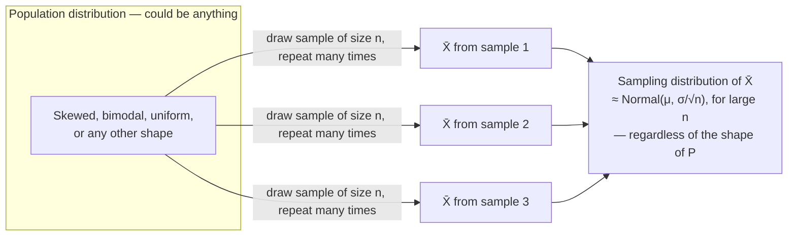

## Learning Objectives

- Explain why a sample statistic (like x̄) is itself a random variable, with its own probability distribution, distinct from the distribution of a single observation.
- Define the sampling distribution of the sample mean, and state its exact mean and standard deviation in terms of the population's μ, σ, and the sample size n.
- State the Central Limit Theorem's implication for the sampling distribution of x̄, including why it applies even when the population itself is far from Normal.
- Distinguish the standard deviation of the population (σ) from the standard error of the mean (σ/√n), and explain why increasing n shrinks the latter but not the former.
- Use a simulation to observe the sampling distribution of a statistic taking shape empirically as many samples are drawn.

## Context & Motivation

The previous concept established a sharp distinction: μ is a fixed, usually unknown property of a population, while x̄ is a number computed from one particular, finite sample — an estimate of μ, not μ itself. What was left implicit there is worth making fully explicit now, because it is one of the strangest and most useful ideas in all of statistics: since x̄ depends on *which* sample happened to be drawn, and the sample itself was the result of a random process (random selection of individuals, random measurement, random noise), **x̄ is a random variable**. Not metaphorically — literally, in the exact technical sense already built up across this discipline's probability half: it has a sample space of possible values (every possible sample of size n could produce a different x̄), and therefore its own probability distribution, describing how likely each possible value of x̄ is.

This distribution — the distribution of a statistic, taken over the (hypothetical) process of drawing many different random samples of the same size from the same population — is called a **sampling distribution**. It is a genuinely different object from two things it is easy to confuse it with: it is not the distribution of a single observation (i.e., not the population distribution itself), and it is not a single number like x̄ (it is the whole distribution that x̄ itself follows, across hypothetical repeated sampling). Once this shift in perspective clicks, an enormous amount of machinery from the probability half of this discipline — expectation, variance, and especially the Central Limit Theorem — becomes directly applicable not to a single random variable's outcomes, but to a *statistic computed from many of them at once*.

This is precisely why the Central Limit Theorem earns its name and its central place in this curriculum: it turns out that the sampling distribution of x̄ tends toward a Normal distribution as n grows, *no matter what shape the underlying population has*. The population could be wildly skewed, bimodal, or bounded on one side only — response times, incomes, or component failure counts, none of which are remotely bell-shaped individually — and yet the distribution of x̄ computed from moderately large samples of that population looks approximately Normal anyway. This single fact is the mathematical engine underneath confidence intervals and hypothesis tests, the next two concepts in this cluster; without it, statistical inference about an unknown population mean would require knowing the population's exact distributional shape in advance, which in practice is almost never available.

## Core Theory

### A statistic is a random variable

Consider drawing a random sample X₁, X₂, …, Xₙ from a population with (unknown) mean μ and (unknown) variance σ². Before the sample is drawn, each Xᵢ is itself a random variable (its value is not yet known), and the sample mean

X̄ = (1/n) · Σᵢ Xᵢ

is a function of n random variables, hence itself a random variable, with its own distribution. Only *after* the sample is actually drawn and measured does X̄ collapse to the single realized number x̄ used in the previous concept. The **sampling distribution of X̄** describes how X̄'s value would vary across the (conceptually infinite) universe of all possible samples of size n that could have been drawn — not something ever fully observed in practice, but a well-defined mathematical object that can be derived or approximated.

### The mean and standard error of the sampling distribution of X̄

Two facts about the sampling distribution of X̄ can be derived directly from the linearity of expectation and the variance-of-a-sum rule for independent random variables, both already established in this discipline's probability half:

**Mean of X̄:** E[X̄] = E[(1/n)Σᵢ Xᵢ] = (1/n)Σᵢ E[Xᵢ] = (1/n)(nμ) = μ.

So the sampling distribution of X̄ is centered exactly on the true population mean μ — on average, across all possible samples, X̄ neither systematically overshoots nor undershoots μ. (This property — E[X̄] = μ — is exactly what "unbiasedness" means, treated formally in the next concept.)

**Variance and standard error of X̄:** assuming the Xᵢ are independent (a standard assumption for a proper random sample), Var(X̄) = Var((1/n)Σᵢ Xᵢ) = (1/n²)Σᵢ Var(Xᵢ) = (1/n²)(nσ²) = σ²/n.

Taking the square root gives the **standard error of the mean**:

SE = σ/√n

This is a critical quantity, and it is easy to conflate with σ itself if not stated carefully: σ is the standard deviation of a *single* observation drawn from the population, and it does not shrink no matter how large a sample is taken — the population's inherent variability is what it is. SE = σ/√n, by contrast, is the standard deviation of the *sampling distribution of the mean*, and it shrinks as n grows, because averaging more observations together cancels out more of the individual noise. Quadrupling the sample size halves the standard error (since √4 = 2) — a direct, quantitative statement of exactly why "more data" makes an estimate of μ more reliable.

### The Central Limit Theorem applied to X̄

The Central Limit Theorem (established elsewhere in this discipline) states that the sum — and equivalently the mean — of a large number of independent, identically distributed random variables tends toward a Normal distribution, regardless of the shape of the individual variables' own distribution. Applied here:

For sufficiently large n, X̄ is approximately Normal(μ, σ²/n), i.e., X̄ ≈ N(μ, σ/√n as its standard deviation)

— even when the population the Xᵢ are drawn from is not Normal at all. "Sufficiently large" is a rule of thumb, not a sharp cutoff: n ≥ 30 is a commonly cited threshold for populations that are not too heavily skewed, though a strongly skewed or heavy-tailed population may need a larger n before the Normal approximation becomes trustworthy, and a population that is already Normal makes X̄ exactly Normal for *any* n, even n = 1.



This is the strange and useful payoff promised earlier: no matter how non-Normal the underlying population is, the sampling distribution of its mean tends toward the one distribution — Normal — whose behavior is thoroughly understood and tabulated. That single fact underwrites the construction of confidence intervals and the logic of hypothesis testing that follow directly from it.

### Sampling distributions of other statistics

While X̄ is the running example throughout this cluster, the same idea — a statistic computed from a random sample is itself a random variable with its own distribution — applies to any statistic: the sample median, the sample variance s², a sample proportion p̂ (the fraction of "successes" in a sample, closely related to the Binomial distribution already covered in this discipline), or the difference of two sample means. Each has its own sampling distribution, generally with its own shape and rate of convergence to Normality (some, like p̂ for large n, converge quickly by the same CLT logic; others, like small-sample s², have a distinctly non-Normal sampling distribution even for moderate n). The CLT's guarantee about X̄ specifically is what this cluster relies on going forward.

## Worked Examples

### Example 1 — computing the standard error directly

**Problem:** A population of packages has weights with population standard deviation σ = 4 kg. If random samples of n = 25 packages are repeatedly weighed and averaged, what is the standard deviation of the resulting sampling distribution of X̄? What happens to that standard deviation if the sample size is increased to n = 100?

**At n = 25:** SE = σ/√n = 4/√25 = 4/5 = 0.8 kg. So although any single package's weight typically varies by about 4 kg from the population mean, the *average* of 25 packages typically varies by only about 0.8 kg from μ — a fivefold tightening, purely from averaging.

**At n = 100:** SE = 4/√100 = 4/10 = 0.4 kg. Quadrupling n (from 25 to 100) halved the standard error (from 0.8 to 0.4), exactly matching the √n relationship: to halve the standard error again would require quadrupling n once more, to 400 — a direct illustration of *diminishing returns*: cutting the standard error in half always costs 4× the sample size, no matter how large n already is.

### Example 2 — the CLT rescues a badly skewed population

**Problem:** Component lifetimes in a batch follow an Exponential distribution (a strongly right-skewed distribution, covered elsewhere in this discipline: many short lifetimes, a long tail of rare, very long ones) with population mean μ = 200 hours and population standard deviation σ = 200 hours (a property of the Exponential distribution: its σ always equals its μ). If samples of n = 50 components are drawn and each sample's mean lifetime is computed, describe the resulting sampling distribution of X̄.

**Reasoning.** Despite the population being nowhere close to Normal (it is heavily right-skewed, bounded below by zero, with no symmetry at all), the Central Limit Theorem guarantees that for n = 50 — comfortably above the usual n ≥ 30 rule of thumb — the sampling distribution of X̄ is approximately Normal(μ = 200, SE = σ/√n = 200/√50 ≈ 28.28). So, even though a single component's lifetime could easily and unremarkably be, say, 600 hours (three times the mean — routine for an Exponential distribution's long tail), the *average* lifetime across 50 components landing anywhere near 600 would be extraordinarily unlikely: that would be more than 14 standard errors above the mean of the (approximately Normal) sampling distribution of X̄. This is exactly the CLT's payoff — averaging over even a moderately sized sample tames a badly-behaved population into a well-behaved, approximately Normal sampling distribution for its mean.

### Example 3 — simulating a sampling distribution numerically

**Problem:** Confirm the CLT's claim empirically for a strongly skewed population, using simulation rather than the theorem's formula.

```python
import random
import statistics

random.seed(1)

def draw_from_skewed_population():
    # A crude stand-in for a right-skewed population: mostly small values,
    # occasionally a large one — like the Exponential lifetimes above.
    return random.expovariate(1 / 200)  # mean 200, heavily right-skewed

n = 40
num_samples = 5000
sample_means = []

for _ in range(num_samples):
    sample = [draw_from_skewed_population() for _ in range(n)]
    sample_means.append(statistics.mean(sample))

print("Population mean (theoretical):        200")
print("Mean of the sampling distribution:    ", round(statistics.mean(sample_means), 2))
print("Std dev of the sampling distribution: ", round(statistics.pstdev(sample_means), 2))
print("Predicted standard error (σ/√n):      ", round(200 / (n ** 0.5), 2))
```

Running this shows the empirical mean of the 5,000 collected sample means landing close to the true population mean of 200 (confirming E[X̄] = μ), and the empirical standard deviation of those 5,000 sample means landing close to the predicted standard error σ/√n ≈ 31.6 — even though every individual draw from `draw_from_skewed_population()` came from a distribution that looks nothing like a bell curve. Plotting a histogram of `sample_means` (omitted here, but easy to add) would additionally show a distinctly bell-shaped, approximately symmetric distribution — direct visual confirmation of the CLT in action on a population that started out heavily skewed.

## Common Misconceptions & Pitfalls

- **"The sampling distribution is just the population distribution."** They are two entirely different objects. The population distribution describes single observations (in Example 2, individual component lifetimes, heavily right-skewed); the sampling distribution of X̄ describes the *average of 50 such observations*, which is approximately Normal and far less spread out. Confusing the two leads to wildly wrong intuitions about how variable an average actually is.
- **"A bigger sample makes σ smaller."** It does not — σ is a fixed property of the population and does not change no matter how the sample is collected. What shrinks with larger n is the *standard error* SE = σ/√n, the spread of the sampling distribution of the mean — a distinct quantity. Example 1 shows σ = 4 kg staying fixed while SE dropped from 0.8 to 0.4 kg purely from increasing n.
- **"If n is small, the CLT just doesn't apply, full stop."** The CLT's Normal approximation for X̄ improves with larger n, but it is not an all-or-nothing switch that flips at exactly n = 30; a population that is already close to Normal makes X̄ nearly Normal even for small n, while a heavily skewed or heavy-tailed population may need a sample considerably larger than 30 before the approximation is trustworthy. "n ≥ 30" is a widely used rule of thumb, not a theorem.
- **"Every statistic's sampling distribution becomes Normal for large n."** The CLT specifically concerns sums and means of independent, identically distributed variables. Some statistics (like the sample maximum, or the sample variance in small samples) have sampling distributions that do not converge to Normal in the same simple way — the CLT's guarantee is about X̄ (and, by extension, sums), not a blanket statement about every conceivable statistic.
- **"One randomly drawn sample IS the sampling distribution."** A sampling distribution is a hypothetical construct describing the spread of X̄ over *all possible* samples of size n — not something that materializes by drawing just one sample. Example 3's simulation approximates the sampling distribution only because it draws 5,000 separate samples and looks at the spread of their means collectively — a single sample's mean is just one draw from that distribution, not the distribution itself.

## Summary

A statistic like the sample mean X̄, computed from a random sample, is itself a random variable — because a different random sample would produce a different value — and it therefore has its own probability distribution, the sampling distribution, distinct from both the population's distribution and from any single realized value of x̄. For X̄ specifically, E[X̄] = μ (the sampling distribution is centered exactly on the true population mean) and the spread of that sampling distribution is given by the standard error, SE = σ/√n, which shrinks as sample size grows even though the population's own σ does not. The Central Limit Theorem guarantees that, for sufficiently large n, this sampling distribution is approximately Normal — regardless of how non-Normal the underlying population is — which is precisely what makes it possible to reason rigorously about x̄ as an estimate of μ using Normal-distribution machinery, setting up everything that follows in point estimation, confidence intervals, and hypothesis testing.

## Documentation Links

- [MIT 6.041 — Lecture Notes (OCW)](https://ocw.mit.edu/courses/6-041-probabilistic-systems-analysis-and-applied-probability-fall-2010/pages/lecture-notes/) — doc
- [Stanford CS109 — Course Schedule](http://web.stanford.edu/class/cs109/schedule.html) — doc
