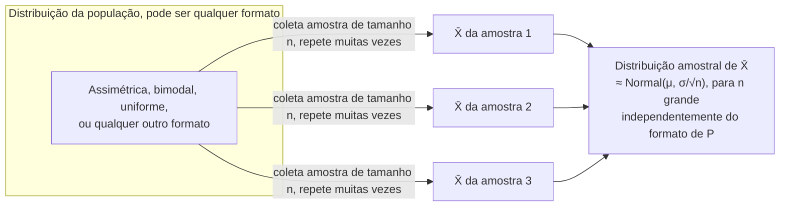

## Objetivos de Aprendizagem

- Explicar por que uma estatística amostral (como x̄) é ela mesma uma variável aleatória, com sua própria distribuição de probabilidade, distinta da distribuição de uma única observação.
- Definir a distribuição amostral da média amostral, e enunciar sua média e desvio padrão exatos em termos do μ, σ e tamanho de amostra n da população.
- Enunciar a implicação do Teorema Central do Limite para a distribuição amostral de x̄, incluindo por que ela se aplica mesmo quando a própria população está longe de ser Normal.
- Distinguir o desvio padrão da população (σ) do erro padrão da média (σ/√n), e explicar por que aumentar n encolhe o segundo mas não o primeiro.
- Usar uma simulação para observar a distribuição amostral de uma estatística tomando forma empiricamente conforme muitas amostras são coletadas.

## Contexto e Motivação

O conceito anterior estabeleceu uma distinção nítida: μ é uma propriedade fixa, geralmente desconhecida, de uma população, enquanto x̄ é um número calculado a partir de uma amostra particular e finita, uma estimativa de μ, não μ em si. O que ficou implícito ali vale a pena tornar totalmente explícito agora, porque é uma das ideias mais estranhas e úteis de toda a estatística: já que x̄ depende de *qual* amostra aconteceu de ser coletada, e a própria amostra foi resultado de um processo aleatório (seleção aleatória de indivíduos, medição aleatória, ruído aleatório), **x̄ é uma variável aleatória**. Não metaforicamente, literalmente, no sentido técnico exato já construído ao longo da metade de probabilidade desta disciplina: ela tem um espaço amostral de valores possíveis (toda amostra possível de tamanho n poderia produzir um x̄ diferente), e portanto sua própria distribuição de probabilidade, descrevendo quão provável é cada valor possível de x̄.

Essa distribuição, a distribuição de uma estatística, tomada sobre o processo (hipotético) de coletar muitas amostras aleatórias diferentes do mesmo tamanho da mesma população, é chamada de **distribuição amostral**. É um objeto genuinamente diferente de duas coisas com as quais é fácil confundi-la: não é a distribuição de uma única observação (ou seja, não é a própria distribuição da população), e não é um único número como x̄ (é a distribuição inteira que o próprio x̄ segue, ao longo de amostragem repetida hipotética). Uma vez que essa mudança de perspectiva se encaixa, uma enorme quantidade de maquinário da metade de probabilidade desta disciplina (esperança, variância e especialmente o Teorema Central do Limite) se torna diretamente aplicável não aos resultados de uma única variável aleatória, mas a uma *estatística calculada a partir de muitas delas de uma vez*.

É exatamente por isso que o Teorema Central do Limite ganha seu nome e seu lugar central neste currículo: acontece que a distribuição amostral de x̄ tende a uma distribuição Normal conforme n cresce, *não importa qual formato a população subjacente tenha*. A população poderia ser extremamente assimétrica, bimodal, ou limitada apenas de um lado (tempos de resposta, rendas, ou contagens de falha de componentes, nenhuma delas remotamente em forma de sino individualmente), e ainda assim a distribuição de x̄ calculada a partir de amostras moderadamente grandes dessa população parece aproximadamente Normal de qualquer forma. Esse único fato é o motor matemático por trás dos intervalos de confiança e dos testes de hipótese, os próximos dois conceitos deste agrupamento; sem ele, a inferência estatística sobre uma média populacional desconhecida exigiria conhecer o formato distribucional exato da população de antemão, o que na prática quase nunca está disponível.

## Teoria Central

### Uma estatística é uma variável aleatória

Considere coletar uma amostra aleatória X₁, X₂, …, Xₙ de uma população com média (desconhecida) μ e variância (desconhecida) σ². Antes de a amostra ser coletada, cada Xᵢ é ela mesma uma variável aleatória (seu valor ainda não é conhecido), e a média amostral

X̄ = (1/n) · Σᵢ Xᵢ

é uma função de n variáveis aleatórias, portanto ela mesma uma variável aleatória, com sua própria distribuição. Somente *depois* que a amostra é de fato coletada e medida é que X̄ colapsa para o único número realizado x̄ usado no conceito anterior. A **distribuição amostral de X̄** descreve como o valor de X̄ variaria ao longo do universo (conceitualmente infinito) de todas as amostras possíveis de tamanho n que poderiam ter sido coletadas, não algo jamais totalmente observado na prática, mas um objeto matemático bem definido que pode ser derivado ou aproximado.

### A média e o erro padrão da distribuição amostral de X̄

Dois fatos sobre a distribuição amostral de X̄ podem ser derivados diretamente da linearidade da esperança e da regra da variância de uma soma para variáveis aleatórias independentes, ambas já estabelecidas na metade de probabilidade desta disciplina:

**Média de X̄:** E[X̄] = E[(1/n)Σᵢ Xᵢ] = (1/n)Σᵢ E[Xᵢ] = (1/n)(nμ) = μ.

Então a distribuição amostral de X̄ é centrada exatamente na média populacional verdadeira μ: em média, ao longo de todas as amostras possíveis, X̄ nem sistematicamente supera nem fica abaixo de μ. (Essa propriedade, E[X̄] = μ, é exatamente o que "não viesado" significa, tratada formalmente no próximo conceito.)

**Variância e erro padrão de X̄:** assumindo que os Xᵢ são independentes (uma suposição padrão para uma amostra aleatória apropriada), Var(X̄) = Var((1/n)Σᵢ Xᵢ) = (1/n²)Σᵢ Var(Xᵢ) = (1/n²)(nσ²) = σ²/n.

Tirando a raiz quadrada obtém-se o **erro padrão da média**:

EP = σ/√n

Esta é uma quantidade crítica, e é fácil confundi-la com o próprio σ se não for enunciada com cuidado: σ é o desvio padrão de uma *única* observação coletada da população, e ele não encolhe não importa quão grande seja a amostra coletada, a variabilidade inerente da população é o que é. EP = σ/√n, em contraste, é o desvio padrão da *distribuição amostral da média*, e ele encolhe conforme n cresce, porque calcular a média de mais observações juntas cancela mais do ruído individual. Quadruplicar o tamanho da amostra reduz o erro padrão pela metade (já que √4 = 2), uma afirmação direta e quantitativa de exatamente por que "mais dados" tornam uma estimativa de μ mais confiável.

### O Teorema Central do Limite aplicado a X̄

O Teorema Central do Limite (estabelecido em outro lugar desta disciplina) afirma que a soma, e equivalentemente a média, de um grande número de variáveis aleatórias independentes e identicamente distribuídas tende a uma distribuição Normal, independentemente do formato da própria distribuição das variáveis individuais. Aplicado aqui:

Para n suficientemente grande, X̄ é aproximadamente Normal(μ, σ²/n), ou seja, X̄ ≈ N(μ, com σ/√n como seu desvio padrão)

mesmo quando a população da qual os Xᵢ são coletados não é Normal de forma alguma. "Suficientemente grande" é uma regra prática, não um corte definido: n ≥ 30 é um limiar comumente citado para populações que não são fortemente assimétricas, embora uma população fortemente assimétrica ou de cauda pesada possa precisar de um n maior antes que a aproximação Normal se torne confiável, e uma população que já é Normal torna X̄ exatamente Normal para *qualquer* n, mesmo n = 1.



Este é o retorno estranho e útil prometido antes: não importa quão não Normal seja a população subjacente, a distribuição amostral de sua média tende à única distribuição, a Normal, cujo comportamento é totalmente compreendido e tabelado. Esse único fato sustenta a construção de intervalos de confiança e a lógica do teste de hipóteses que seguem diretamente dele.

### Distribuições amostrais de outras estatísticas

Embora X̄ seja o exemplo condutor ao longo deste agrupamento, a mesma ideia (uma estatística calculada a partir de uma amostra aleatória é ela mesma uma variável aleatória com sua própria distribuição) se aplica a qualquer estatística: a mediana amostral, a variância amostral s², uma proporção amostral p̂ (a fração de "sucessos" em uma amostra, intimamente relacionada à distribuição Binomial já coberta nesta disciplina), ou a diferença de duas médias amostrais. Cada uma tem sua própria distribuição amostral, geralmente com seu próprio formato e taxa de convergência para a Normalidade (algumas, como p̂ para n grande, convergem rapidamente pela mesma lógica do TCL; outras, como s² em amostras pequenas, têm uma distribuição amostral distintamente não Normal mesmo para n moderado). A garantia do TCL especificamente sobre X̄ é o que este agrupamento utiliza daqui em diante.

## Exemplos Resolvidos

### Exemplo 1 — calculando o erro padrão diretamente

**Problema:** Uma população de pacotes tem pesos com desvio padrão populacional σ = 4 kg. Se amostras aleatórias de n = 25 pacotes são repetidamente pesadas e a média calculada, qual é o desvio padrão da distribuição amostral resultante de X̄? O que acontece com esse desvio padrão se o tamanho da amostra for aumentado para n = 100?

**Em n = 25:** EP = σ/√n = 4/√25 = 4/5 = 0,8 kg. Então, embora o peso de qualquer pacote individual tipicamente varie cerca de 4 kg em relação à média populacional, a *média* de 25 pacotes tipicamente varia apenas cerca de 0,8 kg em relação a μ, um estreitamento de cinco vezes, puramente pela ação de calcular a média.

**Em n = 100:** EP = 4/√100 = 4/10 = 0,4 kg. Quadruplicar n (de 25 para 100) reduziu o erro padrão pela metade (de 0,8 para 0,4), correspondendo exatamente à relação √n: reduzir o erro padrão pela metade novamente exigiria quadruplicar n mais uma vez, para 400, uma ilustração direta de *retornos decrescentes*: cortar o erro padrão pela metade sempre custa 4× o tamanho da amostra, não importa quão grande n já seja.

### Exemplo 2 — o TCL resgata uma população fortemente assimétrica

**Problema:** Tempos de vida de componentes em um lote seguem uma distribuição Exponencial (uma distribuição fortemente assimétrica à direita, coberta em outro lugar desta disciplina: muitos tempos de vida curtos, uma longa cauda de raros, muito longos) com média populacional μ = 200 horas e desvio padrão populacional σ = 200 horas (uma propriedade da distribuição Exponencial: seu σ sempre é igual ao seu μ). Se amostras de n = 50 componentes são coletadas e o tempo de vida médio de cada amostra é calculado, descreva a distribuição amostral resultante de X̄.

**Raciocínio.** Apesar de a população estar longe de ser Normal (é fortemente assimétrica à direita, limitada por baixo em zero, sem qualquer simetria), o Teorema Central do Limite garante que, para n = 50, confortavelmente acima da regra prática usual n ≥ 30, a distribuição amostral de X̄ é aproximadamente Normal(μ = 200, EP = σ/√n = 200/√50 ≈ 28,28). Então, mesmo que o tempo de vida de um único componente possa facilmente e sem estranhamento ser, digamos, 600 horas (três vezes a média, rotineiro para a longa cauda de uma distribuição Exponencial), o tempo de vida *médio* ao longo de 50 componentes cair perto de 600 seria extraordinariamente improvável: isso estaria a mais de 14 erros padrão acima da média da distribuição amostral (aproximadamente Normal) de X̄. Este é exatamente o retorno do TCL: calcular a média mesmo sobre uma amostra de tamanho moderado domestica uma população mal comportada em uma distribuição amostral bem comportada e aproximadamente Normal para sua média.

### Exemplo 3 — simulando numericamente uma distribuição amostral

**Problema:** Confirme empiricamente a afirmação do TCL para uma população fortemente assimétrica, usando simulação em vez da fórmula do teorema.

```python
import random
import statistics

random.seed(1)

def draw_from_skewed_population():
    # Um substituto grosseiro para uma população assimétrica à direita: principalmente
    # valores pequenos, ocasionalmente um grande, como os tempos de vida Exponenciais acima.
    return random.expovariate(1 / 200)  # média 200, fortemente assimétrica à direita

n = 40
num_samples = 5000
sample_means = []

for _ in range(num_samples):
    sample = [draw_from_skewed_population() for _ in range(n)]
    sample_means.append(statistics.mean(sample))

print("Média populacional (teórica):              200")
print("Média da distribuição amostral:            ", round(statistics.mean(sample_means), 2))
print("Desvio padrão da distribuição amostral:    ", round(statistics.pstdev(sample_means), 2))
print("Erro padrão previsto (σ/√n):                ", round(200 / (n ** 0.5), 2))
```

Executar isso mostra a média empírica das 5.000 médias amostrais coletadas caindo perto da média populacional verdadeira de 200 (confirmando E[X̄] = μ), e o desvio padrão empírico dessas 5.000 médias amostrais caindo perto do erro padrão previsto σ/√n ≈ 31,6, mesmo que cada sorteio individual de `draw_from_skewed_population()` tenha vindo de uma distribuição que não se parece em nada com uma curva de sino. Plotar um histograma de `sample_means` (omitido aqui, mas fácil de adicionar) mostraria adicionalmente uma distribuição distintamente em forma de sino, aproximadamente simétrica, confirmação visual direta do TCL em ação sobre uma população que começou fortemente assimétrica.

## Equívocos Comuns e Armadilhas

- **"A distribuição amostral é apenas a distribuição da população."** São dois objetos inteiramente diferentes. A distribuição da população descreve observações únicas (no Exemplo 2, tempos de vida de componentes individuais, fortemente assimétricos à direita); a distribuição amostral de X̄ descreve a *média de 50 dessas observações*, que é aproximadamente Normal e muito menos dispersa. Confundir os dois leva a intuições completamente erradas sobre quão variável uma média realmente é.
- **"Uma amostra maior torna σ menor."** Não torna; σ é uma propriedade fixa da população e não muda não importa como a amostra seja coletada. O que encolhe com n maior é o *erro padrão* EP = σ/√n, a dispersão da distribuição amostral da média, uma quantidade distinta. O Exemplo 1 mostra σ = 4 kg permanecendo fixo enquanto o EP caiu de 0,8 para 0,4 kg puramente pelo aumento de n.
- **"Se n é pequeno, o TCL simplesmente não se aplica, ponto final."** A aproximação Normal do TCL para X̄ melhora com n maior, mas não é uma chave liga-desliga que muda exatamente em n = 30; uma população que já é próxima da Normal torna X̄ quase Normal mesmo para n pequeno, enquanto uma população fortemente assimétrica ou de cauda pesada pode precisar de uma amostra consideravelmente maior que 30 antes que a aproximação seja confiável. "n ≥ 30" é uma regra prática amplamente usada, não um teorema.
- **"A distribuição amostral de toda estatística se torna Normal para n grande."** O TCL diz respeito especificamente a somas e médias de variáveis independentes e identicamente distribuídas. Algumas estatísticas (como o máximo amostral, ou a variância amostral em amostras pequenas) têm distribuições amostrais que não convergem para a Normal da mesma forma simples, a garantia do TCL é sobre X̄ (e, por extensão, somas), não uma afirmação genérica sobre toda estatística concebível.
- **"Uma amostra aleatória coletada É a distribuição amostral."** Uma distribuição amostral é um construto hipotético descrevendo a dispersão de X̄ ao longo de *todas as amostras possíveis* de tamanho n, não algo que se materializa ao coletar apenas uma amostra. A simulação do Exemplo 3 aproxima a distribuição amostral apenas porque coleta 5.000 amostras separadas e observa a dispersão de suas médias coletivamente, a média de uma única amostra é apenas um sorteio dessa distribuição, não a distribuição em si.

## Resumo

Uma estatística como a média amostral X̄, calculada a partir de uma amostra aleatória, é ela mesma uma variável aleatória (porque uma amostra aleatória diferente produziria um valor diferente), e portanto tem sua própria distribuição de probabilidade, a distribuição amostral, distinta tanto da distribuição da população quanto de qualquer valor único realizado de x̄. Para X̄ especificamente, E[X̄] = μ (a distribuição amostral é centrada exatamente na média populacional verdadeira) e a dispersão dessa distribuição amostral é dada pelo erro padrão, EP = σ/√n, que encolhe conforme o tamanho da amostra cresce mesmo que o próprio σ da população não encolha. O Teorema Central do Limite garante que, para n suficientemente grande, essa distribuição amostral é aproximadamente Normal, independentemente de quão não Normal seja a população subjacente, o que é precisamente o que torna possível raciocinar rigorosamente sobre x̄ como uma estimativa de μ usando o maquinário da distribuição Normal, preparando tudo o que se segue em estimação pontual, intervalos de confiança e teste de hipóteses.

## Documentation Links

- [MIT 6.041 — Lecture Notes (OCW)](https://ocw.mit.edu/courses/6-041-probabilistic-systems-analysis-and-applied-probability-fall-2010/pages/lecture-notes/) — doc
- [Stanford CS109 — Course Schedule](http://web.stanford.edu/class/cs109/schedule.html) — doc
