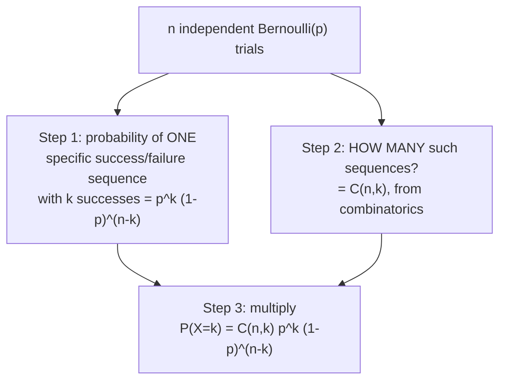

## Learning Objectives

- Define the Bernoulli(p) distribution and derive E[X] = p and Var(X) = p(1−p) directly from the definition.
- Define the Binomial(n,p) distribution as the sum of n independent Bernoulli(p) trials, and interpret its parameters.
- Derive the Binomial PMF formula P(X=k) = C(n,k)·pᵏ·(1−p)ⁿ⁻ᵏ from first principles, using the combinations formula.
- Derive E[X] = np and Var(X) = np(1−p) for the Binomial distribution using linearity of expectation across the underlying Bernoulli trials.
- Recognize real scenarios that fit the Bernoulli/Binomial modeling assumptions (fixed number of independent, identical yes/no trials) and identify cases where those assumptions fail.

## Context & Motivation

Of all the probability distributions with names, Bernoulli and Binomial are the two most fundamental, because so much of applied probability reduces, in the end, to counting successes across repeated yes/no trials: does a manufactured part pass inspection or not, does a user click an ad or not, does a transmitted bit arrive corrupted or not. The **Bernoulli distribution** is the model for a single such trial, and the **Binomial distribution** is the model for the total count of successes across many independent repetitions of it — together they form the building block that a large fraction of later named distributions (including the Poisson distribution, taken up next as a limiting case of Binomial) are built from or compared against.

What makes this concept especially satisfying is that it is not a new, free-standing piece of machinery to memorize — it is a direct, concrete payoff of two ideas already fully developed elsewhere in this curriculum. The Binomial PMF formula leans explicitly on the combinations formula C(n,k) from discrete mathematics: counting the number of successes in n trials is, underneath the probability language, a counting problem — *how many different ways can exactly k of the n trials come up "success"?* — and that question has already been answered precisely by C(n,k) = n!/(k!(n−k)!). Likewise, deriving the mean and variance of the Binomial distribution from scratch would be a genuinely unpleasant direct calculation over its PMF, but becomes almost effortless once the Binomial is recognized as a *sum* of n independent Bernoulli trials and linearity of expectation is invoked — exactly the technique introduced in the expectation-and-variance concept, applied here to its single most common and useful case.

Both Harvard's Stat 110 and Stanford's CS109 build a significant fraction of their early distribution-theory content around this pairing, precisely because it demonstrates, very concretely, how the tools built up so far (combinatorics, linearity of expectation, independence) combine to produce a fully-derived, non-arbitrary distribution — nothing about the Binomial formula or its mean and variance is asserted without justification; every piece traces back to something already proven.

## Core Theory

### The Bernoulli distribution

**Definition.** A random variable X follows a **Bernoulli(p)** distribution if it takes only two values, 1 ("success") and 0 ("failure"), with

P(X=1) = p,   P(X=0) = 1 − p

for some fixed parameter 0 ≤ p ≤ 1. This is the simplest possible non-trivial random variable — a single trial with two outcomes — and it is the atomic building block for the Binomial distribution below.

**Mean.** By the definition of expectation:

E[X] = 1·p + 0·(1−p) = p

The expected value of a single Bernoulli trial is simply its success probability — a satisfying, immediate check: if p = 0.3, the "average" outcome of the 0/1 variable is 0.3, which is exactly the long-run proportion of successes across many repetitions.

**Variance.** First, E[X²]: since X only ever takes values 0 and 1, X² = X always (0² = 0 and 1² = 1), so E[X²] = E[X] = p. Applying the variance shortcut from the expectation-and-variance concept:

Var(X) = E[X²] − (E[X])² = p − p² = p(1−p)

**Var(X) = p(1−p)** is maximized at p = 0.5 (where it equals 0.25) and shrinks toward 0 as p approaches either 0 or 1 — matching the intuition that a nearly-certain outcome (p close to 0 or 1) has very little randomness to it, while a coin-flip-like p = 0.5 has the most spread possible for a two-valued variable.

### The Binomial distribution, as a sum of Bernoullis

**Definition.** Suppose n independent Bernoulli(p) trials are performed, each with the same success probability p, and let X be the *total number of successes* across all n trials. Then X follows a **Binomial(n,p)** distribution. Formally, if X₁, X₂, …, Xₙ are independent, identically distributed Bernoulli(p) random variables, then

X = X₁ + X₂ + ⋯ + Xₙ ~ Binomial(n,p)

The two parameters have direct meanings: n is the fixed number of trials, and p is the success probability shared by each trial. X itself can take any integer value from 0 (no successes) to n (every trial a success).

### Deriving the Binomial PMF via combinations

**Goal.** Find P(X=k) — the probability of exactly k successes in n independent Bernoulli(p) trials.

**Step 1 — probability of one specific arrangement.** Consider one particular sequence of outcomes with exactly k successes and n−k failures — say, successes on trials 1 through k and failures on the rest (the specific positions do not matter yet). Because the trials are independent, the probability of this *exact* sequence is the product of the individual trial probabilities:

p · p ⋯ p (k times) · (1−p) · (1−p) ⋯ (1−p) (n−k times) = pᵏ(1−p)ⁿ⁻ᵏ

Critically, this same probability, pᵏ(1−p)ⁿ⁻ᵏ, applies to *any* specific sequence with exactly k successes and n−k failures, regardless of which positions hold the successes — multiplication is commutative, so rearranging which trials succeed doesn't change the product.

**Step 2 — how many such sequences are there?** This is precisely a counting question already solved in discrete mathematics: choosing *which* k of the n trial positions are the successes (order doesn't matter — only which positions are "success" positions) is exactly C(n,k) = n!/(k!(n−k)!), the number of k-element subsets of an n-element set.

**Step 3 — combine.** Since these C(n,k) distinct sequences are mutually exclusive events (a given outcome of the n trials matches exactly one specific sequence of successes and failures), and each has the same probability pᵏ(1−p)ⁿ⁻ᵏ from Step 1, the total probability of "exactly k successes, in any arrangement" is the count times the per-sequence probability:

**P(X=k) = C(n,k) · pᵏ · (1−p)ⁿ⁻ᵏ,   for k = 0, 1, …, n**

This is the Binomial PMF, and every piece of it now has a concrete derivation: the pᵏ(1−p)ⁿ⁻ᵏ factor comes from independence (multiplying trial probabilities), and the C(n,k) factor comes directly from the combinations formula — counting how many of the n! possible orderings of successes and failures correspond to the same total count k.

### Mean and variance of the Binomial, via linearity

Deriving E[X] and Var(X) directly from the Binomial PMF above (summing k·C(n,k)pᵏ(1−p)ⁿ⁻ᵏ over all k) is possible but algebraically unpleasant. Recognizing X = X₁+X₂+⋯+Xₙ as a sum of Bernoulli trials makes both derivations nearly immediate.

**Mean, by linearity of expectation** (which, as established previously, requires no independence assumption at all, though these particular Xᵢ happen to be independent too):

E[X] = E[X₁+X₂+⋯+Xₙ] = E[X₁]+E[X₂]+⋯+E[Xₙ] = p + p + ⋯ + p (n times) = **np**

**Variance.** Here independence of the Xᵢ genuinely matters — recall from the expectation-and-variance concept that Var(sum) = sum of variances specifically requires independence, unlike the unconditional linearity of expectation:

Var(X) = Var(X₁+X₂+⋯+Xₙ) = Var(X₁)+Var(X₂)+⋯+Var(Xₙ)   (valid here because the Xᵢ are independent)
       = p(1−p) + p(1−p) + ⋯ + p(1−p) (n times) = **np(1−p)**

So a Binomial(n,p) random variable has E[X] = np and Var(X) = np(1−p) — each simply n times the corresponding Bernoulli quantity, a direct and clean consequence of decomposing X into n independent identical pieces.

## Worked Examples

### Example 1 — computing a single Binomial probability from the derived formula

**Problem:** A quality-control process tests 6 manufactured components independently; each has a 0.1 probability of being defective. What is the probability that exactly 2 of the 6 are defective?

**Set up.** This fits the Binomial model directly: n = 6 trials, p = 0.1 (treating "defective" as "success" for counting purposes — the labeling is arbitrary, only the probability matters), and we want P(X=2).

**Apply the formula.**

P(X=2) = C(6,2) · (0.1)² · (0.9)⁴

C(6,2) = 6!/(2!4!) = (6·5)/(2·1) = 15

(0.1)² = 0.01,  (0.9)⁴ = 0.6561

P(X=2) = 15 × 0.01 × 0.6561 = 15 × 0.006561 = 0.098415

So there is roughly a 9.84% chance exactly 2 of the 6 components are defective. Each factor traces back to something already established: C(6,2)=15 counts *which* 2 of the 6 positions are defective, and (0.1)²(0.9)⁴ is the probability of any one specific such arrangement (2 defects, 4 good, in a fixed order), by independence of the trials.

### Example 2 — mean and variance without ever touching the PMF sum

**Problem:** Using the same setup as Example 1 (n=6, p=0.1), find the expected number of defective components and the variance of that count, without summing the PMF.

**Mean.** Directly via E[X] = np:

E[X] = 6 × 0.1 = 0.6

On average, 0.6 of the 6 components are expected to be defective — a fractional value, same as with any expectation, not a value X can literally take (X only takes integers 0 through 6), but the correct long-run average.

**Variance.** Directly via Var(X) = np(1−p):

Var(X) = 6 × 0.1 × 0.9 = 0.54

So SD(X) = √0.54 ≈ 0.735. Both quantities were obtained in one line each, entirely bypassing the Binomial PMF — a direct payoff of the linearity-of-expectation derivation above, which is precisely why that derivation, rather than a brute-force sum over the PMF, is the one worth remembering.

### Example 3 — connecting Bernoulli parameters to Binomial parameters explicitly

**Problem:** An online quiz has 10 independent true/false questions, each answered by pure random guessing (so each has a 0.5 probability of being answered correctly). (a) What distribution does each individual question's outcome follow? (b) What distribution does the total number of correct answers follow, and what are its mean and variance?

**Part (a).** A single question, answered by guessing, is exactly a Bernoulli(0.5) random variable: 1 if correct, 0 if incorrect, with P(correct) = 0.5.

**Part (b).** The total number of correct answers across the 10 independent questions is the *sum* of 10 independent Bernoulli(0.5) trials — by definition, this is Binomial(n=10, p=0.5).

Mean: E[X] = np = 10 × 0.5 = 5 (on average, half the questions are answered correctly by pure guessing — matching intuition exactly).

Variance: Var(X) = np(1−p) = 10 × 0.5 × 0.5 = 2.5, so SD(X) = √2.5 ≈ 1.58.

As a spot-check using the PMF formula directly, the probability of getting *exactly* 5 correct (the mean) is P(X=5) = C(10,5)(0.5)⁵(0.5)⁵ = 252 × (0.5)¹⁰ = 252/1024 ≈ 0.246 — notably, even the mean outcome itself only occurs about 24.6% of the time, a useful reminder (echoing a misconception from expectation-and-variance) that the expected value need not be the most probable single outcome by an overwhelming margin, though here it is in fact the single most likely value.

## Common Misconceptions & Pitfalls

- **"The Binomial PMF formula C(n,k)pᵏ(1−p)ⁿ⁻ᵏ is just something to memorize."** Every factor has a derivation traced through above: pᵏ(1−p)ⁿ⁻ᵏ is the probability of one specific ordering (from independence), and C(n,k) counts how many orderings give the same total k (from combinatorics). Treating the formula as opaque makes it easy to misapply — e.g., forgetting the combinations factor entirely and computing only pᵏ(1−p)ⁿ⁻ᵏ, which answers a different question (the probability of one specific sequence, not "exactly k successes in any order").
- **"Var(X₁+⋯+Xₙ) = Var(X₁)+⋯+Var(Xₙ) always, the same way E[X₁+⋯+Xₙ] always splits."** As emphasized in expectation-and-variance, the variance-splits-over-a-sum step specifically requires independence; it is used validly here only because the Bernoulli trials making up a Binomial are stipulated to be independent. If the individual trials were dependent (e.g., sampling without replacement from a finite population, which correlates outcomes), this variance formula would not apply, even though the mean formula E[X]=np still would (linearity of expectation needs no independence).
- **"A Binomial random variable can be split into n Bernoulli trials only when the trials really are 'physically separate' events."** The decomposition X = X₁+⋯+Xₙ is a mathematical device, valid any time the modeling assumptions (fixed n, constant p, independent trials, only two outcomes per trial) hold — it doesn't require the trials to be physically distinguishable events happening at different times, only that they satisfy those specific mathematical conditions.
- **"p is always close to 0.5, and Binomial only really 'looks like' the familiar bell-curve shape when it is."** p can be any value in [0,1]. Example 1 used p=0.1 (heavily skewed toward 0 successes for small n), and the distribution's shape is markedly asymmetric for p far from 0.5 with small n; symmetry (or near-symmetry) is a special feature of p near 0.5, not a general property of every Binomial distribution.
- **"If a scenario involves counting occurrences, it must be Binomial."** Binomial requires a *fixed, known number of trials* n. A scenario with a fixed time window or fixed area, in which occurrences can happen any number of times with no natural upper bound (e.g., number of emails arriving in an hour), is not well-modeled by a fixed-n Binomial — this is exactly the situation the Poisson distribution (the next concept) is built to handle instead.

## Summary

Bernoulli(p) models a single yes/no trial, with E[X]=p and Var(X)=p(1−p), both derived directly from the two-point definition. Binomial(n,p) models the count of successes across n independent Bernoulli(p) trials, and its PMF, P(X=k) = C(n,k)·pᵏ·(1−p)ⁿ⁻ᵏ, is derived by combining the probability of one specific success/failure sequence (pᵏ(1−p)ⁿ⁻ᵏ, from independence) with a count of how many such sequences give exactly k successes (C(n,k), from the combinations formula in discrete mathematics). Writing X as a sum of n independent Bernoulli trials makes E[X]=np follow immediately from linearity of expectation (no independence needed) and Var(X)=np(1−p) follow from the additivity of variance across independent variables (independence required here specifically). This decomposition — sum of simple independent pieces — is a technique that reappears directly in deriving the Poisson distribution as a limit of the Binomial.

## Documentation Links

- [Harvard Stat 110 — Course Home](https://stat110.hsites.harvard.edu/) — doc
- [Stanford CS109 — Course Schedule](http://web.stanford.edu/class/cs109/schedule.html) — doc
