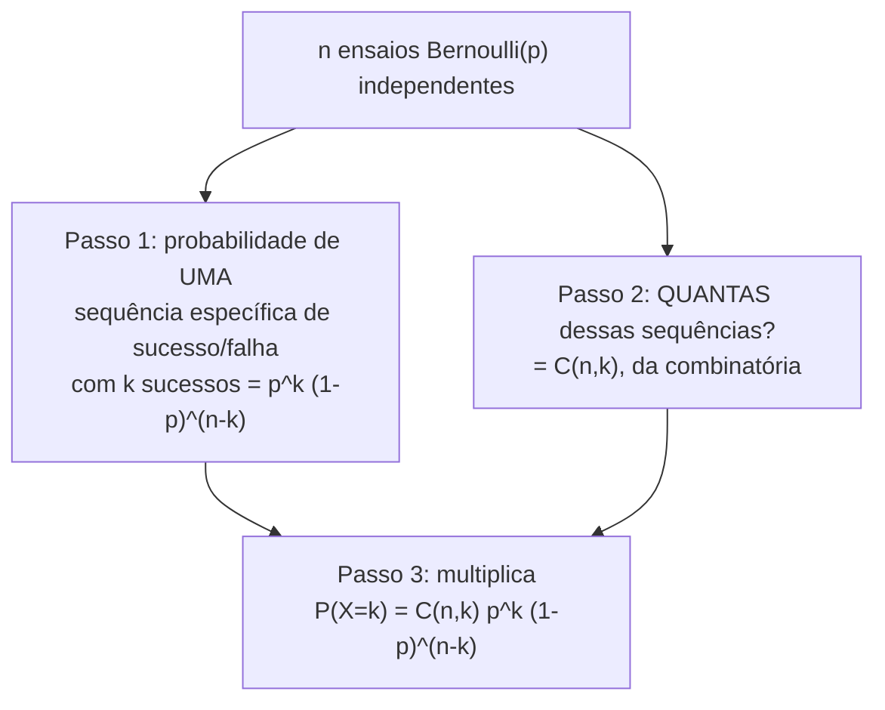

## Objetivos de Aprendizagem

- Definir a distribuição Bernoulli(p) e derivar E[X] = p e Var(X) = p(1−p) diretamente da definição.
- Definir a distribuição Binomial(n,p) como a soma de n ensaios Bernoulli(p) independentes, e interpretar seus parâmetros.
- Derivar a fórmula da FMP Binomial P(X=k) = C(n,k)·pᵏ·(1−p)ⁿ⁻ᵏ a partir de princípios básicos, usando a fórmula de combinações.
- Derivar E[X] = np e Var(X) = np(1−p) para a distribuição Binomial usando linearidade da esperança através dos ensaios Bernoulli subjacentes.
- Reconhecer cenários reais que se encaixam nas suposições de modelagem Bernoulli/Binomial (número fixo de ensaios sim/não independentes e idênticos) e identificar casos onde essas suposições falham.

## Contexto e Motivação

De todas as distribuições de probabilidade nomeadas, Bernoulli e Binomial são as duas mais fundamentais, porque tanto da probabilidade aplicada se reduz, no fim, a contar sucessos através de ensaios sim/não repetidos: uma peça manufaturada passa na inspeção ou não, um usuário clica num anúncio ou não, um bit transmitido chega corrompido ou não. A **distribuição Bernoulli** é o modelo para um único desses ensaios, e a **distribuição Binomial** é o modelo para a contagem total de sucessos através de muitas repetições independentes dele; juntas formam o bloco de construção do qual uma grande fração de distribuições nomeadas posteriores (incluindo a distribuição de Poisson, tratada a seguir como um caso limite da Binomial) são construídas ou comparadas contra.

O que torna este conceito especialmente satisfatório é que não é uma peça de maquinaria nova e independente para decorar; é um retorno direto e concreto de duas ideias já totalmente desenvolvidas em outro lugar deste currículo. A fórmula da FMP Binomial se apoia explicitamente na fórmula de combinações C(n,k) da matemática discreta: contar o número de sucessos em n ensaios é, por baixo da linguagem de probabilidade, um problema de contagem (de quantas formas diferentes exatamente k dos n ensaios podem sair "sucesso"?), e essa pergunta já foi respondida precisamente por C(n,k) = n!/(k!(n−k)!). Da mesma forma, derivar a média e a variância da distribuição Binomial do zero seria um cálculo direto genuinamente desagradável sobre sua FMP, mas se torna quase sem esforço uma vez que a Binomial é reconhecida como uma *soma* de n ensaios Bernoulli independentes e linearidade da esperança é invocada, exatamente a técnica introduzida no conceito de esperança e variância, aplicada aqui a seu caso único mais comum e útil.

Tanto o Stat 110 de Harvard quanto o CS109 de Stanford constroem uma fração significativa de seu conteúdo inicial de teoria de distribuições ao redor desse pareamento, precisamente porque demonstra, bem concretamente, como as ferramentas construídas até agora (combinatória, linearidade da esperança, independência) se combinam para produzir uma distribuição totalmente derivada e não arbitrária; nada sobre a fórmula Binomial ou sua média e variância é afirmado sem justificativa; toda peça remonta a algo já provado.

## Teoria Central

### A distribuição Bernoulli

**Definição.** Uma variável aleatória X segue uma distribuição **Bernoulli(p)** se assume só dois valores, 1 ("sucesso") e 0 ("falha"), com

P(X=1) = p,   P(X=0) = 1 − p

para algum parâmetro fixo 0 ≤ p ≤ 1. Esta é a variável aleatória não trivial mais simples possível (um único ensaio com dois resultados), e é o bloco de construção atômico para a distribuição Binomial abaixo.

**Média.** Pela definição de esperança:

E[X] = 1·p + 0·(1−p) = p

O valor esperado de um único ensaio Bernoulli é simplesmente sua probabilidade de sucesso, uma checagem satisfatória e imediata: se p = 0,3, o resultado "médio" da variável 0/1 é 0,3, que é exatamente a proporção de longo prazo de sucessos através de muitas repetições.

**Variância.** Primeiro, E[X²]: já que X só assume valores 0 e 1, X² = X sempre (0² = 0 e 1² = 1), então E[X²] = E[X] = p. Aplicando o atalho de variância do conceito de esperança e variância:

Var(X) = E[X²] − (E[X])² = p − p² = p(1−p)

**Var(X) = p(1−p)** é maximizada em p = 0,5 (onde é igual a 0,25) e encolhe em direção a 0 conforme p se aproxima de 0 ou 1, correspondendo à intuição de que um resultado quase certo (p perto de 0 ou 1) tem muito pouca aleatoriedade, enquanto um p = 0,5 tipo lançamento de moeda tem a maior dispersão possível para uma variável de dois valores.

### A distribuição Binomial, como uma soma de Bernoullis

**Definição.** Suponha que n ensaios Bernoulli(p) independentes sejam realizados, cada um com a mesma probabilidade de sucesso p, e seja X o *número total de sucessos* através de todos os n ensaios. Então X segue uma distribuição **Binomial(n,p)**. Formalmente, se X₁, X₂, …, Xₙ são variáveis aleatórias Bernoulli(p) independentes e identicamente distribuídas, então

X = X₁ + X₂ + ⋯ + Xₙ ~ Binomial(n,p)

Os dois parâmetros têm significados diretos: n é o número fixo de ensaios, e p é a probabilidade de sucesso compartilhada por cada ensaio. O próprio X pode assumir qualquer valor inteiro de 0 (nenhum sucesso) a n (todo ensaio um sucesso).

### Derivando a FMP Binomial via combinações

**Objetivo.** Encontrar P(X=k), a probabilidade de exatamente k sucessos em n ensaios Bernoulli(p) independentes.

**Passo 1: probabilidade de um arranjo específico.** Considere uma sequência particular de resultados com exatamente k sucessos e n−k falhas, digamos, sucessos nos ensaios 1 até k e falhas no resto (as posições específicas ainda não importam). Como os ensaios são independentes, a probabilidade dessa sequência *exata* é o produto das probabilidades individuais de cada ensaio:

p · p ⋯ p (k vezes) · (1−p) · (1−p) ⋯ (1−p) (n−k vezes) = pᵏ(1−p)ⁿ⁻ᵏ

Criticamente, essa mesma probabilidade, pᵏ(1−p)ⁿ⁻ᵏ, se aplica a *qualquer* sequência específica com exatamente k sucessos e n−k falhas, independentemente de quais posições segurem os sucessos; multiplicação é comutativa, então rearranjar quais ensaios têm sucesso não muda o produto.

**Passo 2: quantas dessas sequências existem?** Esta é precisamente uma pergunta de contagem já resolvida em matemática discreta: escolher *quais* k das n posições de ensaio são os sucessos (ordem não importa, só quais posições são posições de "sucesso") é exatamente C(n,k) = n!/(k!(n−k)!), o número de subconjuntos de k elementos de um conjunto de n elementos.

**Passo 3: combine.** Como essas C(n,k) sequências distintas são eventos mutuamente exclusivos (um resultado dado dos n ensaios corresponde a exatamente uma sequência específica de sucessos e falhas), e cada uma tem a mesma probabilidade pᵏ(1−p)ⁿ⁻ᵏ do Passo 1, a probabilidade total de "exatamente k sucessos, em qualquer arranjo" é a contagem vezes a probabilidade por sequência:

**P(X=k) = C(n,k) · pᵏ · (1−p)ⁿ⁻ᵏ,   para k = 0, 1, …, n**

Esta é a FMP Binomial, e toda peça dela agora tem uma derivação concreta: o fator pᵏ(1−p)ⁿ⁻ᵏ vem de independência (multiplicando probabilidades de ensaio), e o fator C(n,k) vem diretamente da fórmula de combinações, contando quantas das n! ordenações possíveis de sucessos e falhas correspondem à mesma contagem total k.

### Média e variância da Binomial, via linearidade

Derivar E[X] e Var(X) diretamente da FMP Binomial acima (somando k·C(n,k)pᵏ(1−p)ⁿ⁻ᵏ sobre todo k) é possível mas algebricamente desagradável. Reconhecer X = X₁+X₂+⋯+Xₙ como uma soma de ensaios Bernoulli torna as duas derivações quase imediatas.

**Média, por linearidade da esperança** (que, como estabelecido anteriormente, não exige suposição de independência alguma, embora esses Xᵢ particulares aconteçam de ser independentes também):

E[X] = E[X₁+X₂+⋯+Xₙ] = E[X₁]+E[X₂]+⋯+E[Xₙ] = p + p + ⋯ + p (n vezes) = **np**

**Variância.** Aqui independência dos Xᵢ genuinamente importa; lembre-se do conceito de esperança e variância que Var(soma) = soma das variâncias especificamente exige independência, diferente da linearidade incondicional da esperança:

Var(X) = Var(X₁+X₂+⋯+Xₙ) = Var(X₁)+Var(X₂)+⋯+Var(Xₙ)   (válido aqui porque os Xᵢ são independentes)
       = p(1−p) + p(1−p) + ⋯ + p(1−p) (n vezes) = **np(1−p)**

Então uma variável aleatória Binomial(n,p) tem E[X] = np e Var(X) = np(1−p), cada uma simplesmente n vezes a quantidade Bernoulli correspondente, uma consequência direta e limpa de decompor X em n pedaços independentes idênticos.

## Exemplos Resolvidos

### Exemplo 1: computando uma única probabilidade Binomial a partir da fórmula derivada

**Problema:** um processo de controle de qualidade testa 6 componentes manufaturados independentemente; cada um tem 0,1 de probabilidade de ser defeituoso. Qual é a probabilidade de que exatamente 2 dos 6 sejam defeituosos?

**Configuração.** Isso se encaixa no modelo Binomial diretamente: n = 6 ensaios, p = 0,1 (tratando "defeituoso" como "sucesso" para propósitos de contagem, a rotulação é arbitrária, só a probabilidade importa), e queremos P(X=2).

**Aplica a fórmula.**

P(X=2) = C(6,2) · (0,1)² · (0,9)⁴

C(6,2) = 6!/(2!4!) = (6·5)/(2·1) = 15

(0,1)² = 0,01,  (0,9)⁴ = 0,6561

P(X=2) = 15 × 0,01 × 0,6561 = 15 × 0,006561 = 0,098415

Então há aproximadamente 9,84% de chance de exatamente 2 dos 6 componentes serem defeituosos. Cada fator remonta a algo já estabelecido: C(6,2)=15 conta *quais* 2 das 6 posições são defeituosas, e (0,1)²(0,9)⁴ é a probabilidade de qualquer um desses arranjos específicos (2 defeitos, 4 bons, em ordem fixa), por independência dos ensaios.

### Exemplo 2: média e variância sem nunca tocar a soma da FMP

**Problema:** usando a mesma configuração do Exemplo 1 (n=6, p=0,1), encontre o número esperado de componentes defeituosos e a variância dessa contagem, sem somar a FMP.

**Média.** Diretamente via E[X] = np:

E[X] = 6 × 0,1 = 0,6

Em média, 0,6 dos 6 componentes é esperado ser defeituoso, um valor fracionário, como qualquer esperança, não um valor que X pode literalmente assumir (X só assume inteiros de 0 a 6), mas a média correta de longo prazo.

**Variância.** Diretamente via Var(X) = np(1−p):

Var(X) = 6 × 0,1 × 0,9 = 0,54

Então DP(X) = √0,54 ≈ 0,735. As duas quantidades foram obtidas numa linha cada, contornando inteiramente a FMP Binomial, um retorno direto da derivação de linearidade da esperança acima, que é precisamente por que aquela derivação, em vez de uma soma por força bruta sobre a FMP, é a que vale a pena lembrar.

### Exemplo 3: conectando parâmetros Bernoulli a parâmetros Binomial explicitamente

**Problema:** um questionário online tem 10 perguntas de verdadeiro/falso independentes, cada uma respondida por chute puramente aleatório (então cada uma tem 0,5 de probabilidade de ser respondida corretamente). (a) Que distribuição o resultado de cada pergunta individual segue? (b) Que distribuição o número total de respostas corretas segue, e quais são sua média e variância?

**Parte (a).** Uma única pergunta, respondida por chute, é exatamente uma variável aleatória Bernoulli(0,5): 1 se correta, 0 se incorreta, com P(correta) = 0,5.

**Parte (b).** O número total de respostas corretas através das 10 perguntas independentes é a *soma* de 10 ensaios Bernoulli(0,5) independentes; por definição, isso é Binomial(n=10, p=0,5).

Média: E[X] = np = 10 × 0,5 = 5 (em média, metade das perguntas é respondida corretamente por chute puro, correspondendo exatamente à intuição).

Variância: Var(X) = np(1−p) = 10 × 0,5 × 0,5 = 2,5, então DP(X) = √2,5 ≈ 1,58.

Como uma checagem pontual usando a fórmula da FMP diretamente, a probabilidade de obter *exatamente* 5 corretas (a média) é P(X=5) = C(10,5)(0,5)⁵(0,5)⁵ = 252 × (0,5)¹⁰ = 252/1024 ≈ 0,246, notavelmente, mesmo o resultado médio em si só ocorre cerca de 24,6% do tempo, um lembrete útil (ecoando um equívoco de esperança e variância) de que o valor esperado não precisa ser o resultado único mais provável por uma margem esmagadora, embora aqui de fato seja o valor único mais provável.

## Equívocos Comuns e Armadilhas

- **"A fórmula da FMP Binomial C(n,k)pᵏ(1−p)ⁿ⁻ᵏ é só algo para decorar."** Todo fator tem uma derivação traçada acima: pᵏ(1−p)ⁿ⁻ᵏ é a probabilidade de uma ordenação específica (de independência), e C(n,k) conta quantas ordenações dão o mesmo total k (de combinatória). Tratar a fórmula como opaca torna fácil aplicá-la mal, por exemplo, esquecer o fator de combinações completamente e computar só pᵏ(1−p)ⁿ⁻ᵏ, que responde uma pergunta diferente (a probabilidade de uma sequência específica, não "exatamente k sucessos em qualquer ordem").
- **"Var(X₁+⋯+Xₙ) = Var(X₁)+⋯+Var(Xₙ) sempre, do mesmo jeito que E[X₁+⋯+Xₙ] sempre se divide."** Como enfatizado em esperança e variância, o passo de variância se dividindo sobre uma soma especificamente exige independência; é usado validamente aqui só porque os ensaios Bernoulli compondo uma Binomial são estipulados como independentes. Se os ensaios individuais fossem dependentes (por exemplo, amostragem sem reposição de uma população finita, que correlaciona resultados), essa fórmula de variância não se aplicaria, mesmo que a fórmula de média E[X]=np ainda se aplicasse (linearidade da esperança não precisa de independência).
- **"Uma variável aleatória Binomial só pode ser dividida em n ensaios Bernoulli quando os ensaios são realmente eventos 'fisicamente separados'."** A decomposição X = X₁+⋯+Xₙ é um dispositivo matemático, válido sempre que as suposições de modelagem (n fixo, p constante, ensaios independentes, só dois resultados por ensaio) valem; não exige que os ensaios sejam eventos fisicamente distinguíveis acontecendo em momentos diferentes, só que satisfaçam essas condições matemáticas específicas.
- **"p é sempre perto de 0,5, e Binomial só realmente 'se parece' com a familiar forma de sino quando é."** p pode ser qualquer valor em [0,1]. O Exemplo 1 usou p=0,1 (fortemente assimétrico em direção a 0 sucessos para n pequeno), e a forma da distribuição é marcadamente assimétrica para p longe de 0,5 com n pequeno; simetria (ou quase simetria) é uma característica especial de p perto de 0,5, não uma propriedade geral de toda distribuição Binomial.
- **"Se um cenário envolve contar ocorrências, precisa ser Binomial."** Binomial exige um número *fixo e conhecido de ensaios* n. Um cenário com uma janela de tempo fixa ou área fixa, no qual ocorrências podem acontecer qualquer número de vezes sem limite superior natural (por exemplo, número de e-mails chegando numa hora), não é bem modelado por uma Binomial de n fixo; essa é exatamente a situação que a distribuição de Poisson (o próximo conceito) é construída para tratar em vez disso.

## Resumo

Bernoulli(p) modela um único ensaio sim/não, com E[X]=p e Var(X)=p(1−p), ambas derivadas diretamente da definição de dois pontos. Binomial(n,p) modela a contagem de sucessos através de n ensaios Bernoulli(p) independentes, e sua FMP, P(X=k) = C(n,k)·pᵏ·(1−p)ⁿ⁻ᵏ, é derivada combinando a probabilidade de uma sequência específica de sucesso/falha (pᵏ(1−p)ⁿ⁻ᵏ, de independência) com uma contagem de quantas dessas sequências dão exatamente k sucessos (C(n,k), da fórmula de combinações da matemática discreta). Escrever X como uma soma de n ensaios Bernoulli independentes faz E[X]=np decorrer imediatamente de linearidade da esperança (sem precisar de independência) e Var(X)=np(1−p) decorrer da aditividade de variância através de variáveis independentes (independência exigida aqui especificamente). Essa decomposição (soma de pedaços simples independentes) é uma técnica que reaparece diretamente ao derivar a distribuição de Poisson como um limite da Binomial.

## Documentation Links

- [Harvard Stat 110 — Course Home](https://stat110.hsites.harvard.edu/) — doc
- [Stanford CS109 — Course Schedule](http://web.stanford.edu/class/cs109/schedule.html) — doc
