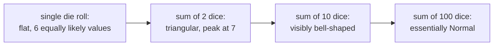

## Learning Objectives

- State the Central Limit Theorem: the distribution of the sum (or average) of many i.i.d. random variables approaches a Normal distribution as the count grows, regardless of the shape of the individual variables.
- Explain, at an intuitive level, why averaging tends to produce a bell-shaped result even when individual variables are not bell-shaped.
- Apply the CLT to approximate probabilities about a sum or average of i.i.d. variables using the Normal distribution, standardizing with the appropriate mean and variance.
- Distinguish what the CLT provides (an approximate distributional *shape* for large n) from what the Law of Large Numbers provides (convergence of the average to a single *value*).
- Recognize the CLT as the underlying reason the Normal distribution appears so frequently across unrelated real-world phenomena.

## Context & Motivation

The previous concept, the Law of Large Numbers, established that the sample average of many independent trials converges toward the true expectation — but it said nothing about *how* that average is distributed along the way, for any specific, finite n. Is the sample average of 30 trials likely to be scattered symmetrically around the true mean, or lopsided? Tightly clustered, or loosely? The **Central Limit Theorem (CLT)** answers exactly this question, and the answer is one of the most surprising and useful facts in all of probability: regardless of the shape of the individual random variables being averaged — uniform, heavily skewed, bimodal, anything with finite variance — their sum or average, once enough of them are combined, looks approximately **Normal**. Not approximately uniform, not approximately shaped like whatever the original variables looked like — Normal, specifically, every time.

This is precisely the mechanism this course promised back in the Normal distribution concept: the reason the bell curve shows up constantly across measurement error, human height, test scores, and countless other domains is that each of those quantities is, in effect, the accumulated result of many small independent contributing factors — genetics plus nutrition plus environment for height; countless tiny sources of instrument noise for measurement error — and the CLT guarantees that *any* such accumulation trends toward a Normal shape, almost regardless of the details of what's being accumulated. This is the payoff being cashed in now: the Normal distribution isn't an arbitrary or lucky choice of model — it is close to the mathematically inevitable shape for any quantity built from summing up many small, roughly independent pieces.

Stanford's CS109 treats the CLT in exactly the spirit this concept follows: state it clearly, build strong intuition for why it's true and when to expect it to kick in, and use it confidently to approximate real probabilities — leaving the fully rigorous proof (which genuinely requires tools like characteristic functions, well beyond this course) to a more theoretical treatment such as MIT 6.041's. The goal here is a *working*, applied command of the theorem, not a derivation of it from scratch.

## Core Theory

### Statement of the Central Limit Theorem

Let X₁, X₂, …, Xₙ be independent and identically distributed random variables, each with finite mean μ and finite variance σ². Let Sₙ = X₁ + X₂ + ⋯ + Xₙ be their sum, and Mₙ = Sₙ/n be their average. The **Central Limit Theorem** states that as n → ∞, the (standardized) distribution of Sₙ — and equivalently of Mₙ — approaches the standard Normal distribution:

(Sₙ − nμ) / (σ√n) → N(0, 1)  approximately, for large n

Equivalently, stated directly for the sum and the average without pre-standardizing:

Sₙ is approximately N(nμ, nσ²) for large n
Mₙ is approximately N(μ, σ²/n) for large n

Both of these express the same fact from different angles. Notice the mean and variance in each: the sum's approximate mean nμ and variance nσ² follow from ordinary linearity-of-expectation and independence-of-variance rules already familiar from earlier concepts; the average's mean μ and variance σ²/n exactly match what was derived for Mₙ under the Law of Large Numbers. What the CLT adds *on top of* the LLN is the specific claim that the *shape* of that distribution — not just its mean and its shrinking variance — becomes Normal as n grows, no matter what the original Xᵢ looked like.

This last clause — "regardless of the shape of the individual Xᵢ" — is the genuinely remarkable part of the theorem and the reason it's treated as one of the two central pillars (alongside the LLN) of this entire course. A single die roll is about as far from bell-shaped as a distribution gets: it's flat, discrete Uniform over {1, ..., 6}, with no peak at all. Yet the CLT guarantees that the average of many die rolls looks increasingly bell-shaped as more rolls are averaged — a fact demonstrated concretely below.

### Why averaging smooths out shape: an intuitive argument

A full proof of the CLT requires machinery (moment generating functions or characteristic functions) outside this course's scope, but the intuition behind *why* summing independent variables tends to produce a bell shape is accessible without it. Consider summing just two independent die rolls. A single die roll is flat across {1, ..., 6} — every value equally likely. But the sum of two dice, ranging from 2 to 12, is emphatically not flat: there is only one way to roll a sum of 2 (1+1) or 12 (6+6), but six ways to roll a sum of 7 (1+6, 2+5, 3+4, 4+3, 5+2, 6+1). Extreme sums require every contributing die to land at an extreme value simultaneously — a increasingly rare coincidence as more dice are added — while a middling sum can be reached by enormously many different combinations of individual values. This combinatorial fact — that middling totals have vastly more ways to occur than extreme totals — is the intuitive seed of the CLT, and it only gets stronger as more independent variables are added to the sum: extreme total outcomes require an ever more special conspiracy of every individual term landing at an extreme simultaneously, while typical outcomes can arise via a rapidly growing number of combinations, concentrating probability mass into a smooth, symmetric hump around the mean.



### Using the CLT: standardizing a sum or average

The practical use of the CLT is identical to the standardization mechanics from the Normal distribution concept, applied now to a sum or average of arbitrary i.i.d. variables rather than to a variable that was already assumed Normal. Given X₁, …, Xₙ i.i.d. with mean μ and variance σ², to approximate P(Mₙ ≤ some value), compute a Z-score using Mₙ's own mean and standard deviation:

Z = (Mₙ − μ) / (σ/√n)

and treat Z as approximately N(0, 1), using a Z-table exactly as before. This is the single most common applied use of the entire theorem: no matter what distribution the original Xᵢ came from, as long as n is reasonably large (a rough rule of thumb often cited is n ≥ 30, though the exact threshold depends on how skewed the original distribution is), this standardization lets ordinary Normal-table machinery answer questions about the sum or average.

## Worked Examples

### Example 1 — simulating the average of many die rolls numerically

**Problem:** Roll a fair six-sided die n times and average the results, repeating this experiment many times to build up a distribution of the average. Compare the shape for n = 1 versus n = 30.

```python
import random
import statistics

random.seed(7)

def average_of_n_rolls(n):
    return sum(random.randint(1, 6) for _ in range(n)) / n

trials = 20_000
averages_n1 = [average_of_n_rolls(1) for _ in range(trials)]
averages_n30 = [average_of_n_rolls(30) for _ in range(trials)]

print(f"n=1:  mean={statistics.mean(averages_n1):.3f}, stdev={statistics.pstdev(averages_n1):.3f}")
print(f"n=30: mean={statistics.mean(averages_n30):.3f}, stdev={statistics.pstdev(averages_n30):.3f}")
```

Representative output:

```
n=1:  mean=3.503, stdev=1.706
n=30: mean=3.499, stdev=0.311
```

**Interpretation.** For n = 1, plotting the 20,000 recorded averages would just reproduce the flat, uniform histogram of a single die — every value 1 through 6 roughly equally represented, with a standard deviation matching the die's own σ ≈ 1.708 (consistent with the discrete Uniform variance formula). For n = 30, both simulations correctly center near the true mean, 3.5 (as the Law of Large Numbers predicts for any n), but critically, if the 20,000 averages-of-30 were plotted as a histogram, the shape would look convincingly bell-curved — smooth, single-peaked, symmetric around 3.5 — despite every individual die roll feeding into it being flat and far from bell-shaped. This is the CLT in action: shape convergence to Normal, layered on top of the mean convergence the LLN already guarantees.

### Example 2 — using the CLT to approximate a probability

**Problem:** A single die roll has mean μ = 3.5 and variance σ² = 35/12 ≈ 2.9167 (standard facts for a fair six-sided die). If 100 dice are rolled and averaged, approximate the probability that the average is at least 3.7.

**Set up using the CLT.** M₁₀₀ is approximately N(μ, σ²/n) = N(3.5, 2.9167/100) = N(3.5, 0.029167). The standard deviation of M₁₀₀ is √0.029167 ≈ 0.1708.

**Standardize.** Z = (3.7 − 3.5) / 0.1708 ≈ 1.17.

**Look up.** P(Z ≥ 1.17) = 1 − P(Z ≤ 1.17) ≈ 1 − 0.8790 = 0.1210.

**Interpretation.** Even though a single die roll's own distribution is nothing like Normal, the CLT licenses treating the average of 100 rolls as approximately Normal, giving a usable, reasonably accurate estimate — about a 12% chance the average of 100 dice rolls is 3.7 or higher — without needing the exact (and much harder to compute directly) distribution of a sum of 100 discrete Uniform variables.

### Example 3 — connecting back to why the Normal distribution is everywhere

**Problem:** Explain, using the CLT, why a measurement instrument's total error — built up from many small, independent sources of noise (thermal fluctuation, minor calibration drift, tiny mechanical vibration, and so on) — is well modeled as Normal, even though no individual noise source is itself Normal.

**Reasoning.** Model the total measurement error E as a sum, E = ε₁ + ε₂ + ⋯ + εₖ, where each εᵢ is one small, independent source of noise, with its own (possibly quite non-Normal, even unknown) distribution, but finite mean and variance. As long as k, the number of independent noise sources, is reasonably large and no single εᵢ dominates the total, the CLT applies directly to this sum exactly as it did to the sum of die rolls: E is approximately Normal, with mean equal to the sum of the individual means and variance equal to the sum of the individual variances (since the εᵢ are independent). This is the general template behind essentially every real-world "why is this Normal?" question: identify the quantity as a sum (or average) of many small, roughly independent contributing pieces, and the CLT supplies the answer — approximately Normal — without needing to know anything about the individual pieces beyond finite mean and variance.

## Common Misconceptions & Pitfalls

- **"The Central Limit Theorem says any single random variable becomes Normal for large n."** It does not apply to a single random variable at all — it applies specifically to a *sum or average of many* i.i.d. random variables. A single die roll is exactly as far from Normal after the CLT is stated as before; it's the average of *many* die rolls that becomes approximately Normal, and only as the count of rolls being averaged grows.
- **"The CLT and the Law of Large Numbers say the same thing."** They answer different questions about the same object, Mₙ. The LLN says Mₙ converges (in probability) to the single value μ — a statement about where Mₙ ends up. The CLT says, for large but finite n, what the *distribution* of Mₙ around that value looks like — approximately Normal, with variance σ²/n — a statement about shape and spread along the way, not just the destination.
- **"The original variables need to already be roughly bell-shaped for the CLT to kick in."** The entire force of the theorem is the opposite: it applies *regardless* of the original shape, as Example 1's flat-die-to-bell-curve demonstration shows directly. What is required is finite variance and independence (or near-independence) of the individual terms — not any resemblance to Normal in the originals.
- **"A small n is good enough, since the CLT is a universal guarantee."** The CLT is an asymptotic (large-n) statement; how large n needs to be for a good approximation depends on how skewed or unusual the original distribution is. A symmetric, well-behaved starting distribution (like a die) looks convincingly Normal by n = 30 or so; a heavily skewed one may need a much larger n before the Normal approximation becomes trustworthy.
- **"Since the average converges to a single value (per the LLN), its distribution eventually has zero spread."** The CLT's own variance formula, σ²/n, does shrink toward 0 as n grows — consistent with the LLN — but for any *finite* n it is still positive, and the CLT's claim is precisely about the (still meaningfully spread-out, just increasingly narrow) approximately-Normal shape at that finite n, not a claim that spread vanishes outright at any specific stage.

## Summary

The Central Limit Theorem states that the sum (or average) of n independent, identically distributed random variables — regardless of the shape of those individual variables, as long as they have finite mean μ and variance σ² — approaches a Normal distribution as n grows: Sₙ is approximately N(nμ, nσ²), and Mₙ is approximately N(μ, σ²/n). This holds even for individual variables as flat and un-Normal as a single die roll, because summing independent contributions concentrates probability mass into typical, middling outcomes (reachable via vastly more combinations) far more than into extreme ones (reachable via only a rare conspiracy of every term landing at an extreme simultaneously). Practically, the CLT lets any sum-or-average probability question be answered via ordinary Normal standardization and a Z-table, regardless of what the underlying distribution actually is. And it is, ultimately, the deep reason the Normal distribution from the previous concept shows up so relentlessly throughout the real world: any quantity that arises as the accumulation of many small, roughly independent effects is, by the CLT, mathematically compelled toward a bell shape.

## Documentation Links

- [Stanford CS109 — Course Schedule](http://web.stanford.edu/class/cs109/schedule.html) — doc
- [MIT 6.041 — Lecture Notes (OCW)](https://ocw.mit.edu/courses/6-041-probabilistic-systems-analysis-and-applied-probability-fall-2010/pages/lecture-notes/) — doc
