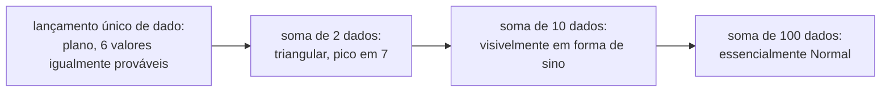

## Objetivos de Aprendizagem

- Enunciar o Teorema Central do Limite: a distribuição da soma (ou média) de muitas variáveis aleatórias i.i.d. se aproxima de uma distribuição Normal conforme a contagem cresce, independentemente do formato das variáveis individuais.
- Explicar, em nível intuitivo, por que fazer médias tende a produzir um resultado em forma de sino mesmo quando as variáveis individuais não têm essa forma.
- Aplicar o TCL para aproximar probabilidades sobre uma soma ou média de variáveis i.i.d. usando a distribuição Normal, padronizando com a média e a variância apropriadas.
- Distinguir o que o TCL fornece (um *formato* distribucional aproximado para n grande) do que a Lei dos Grandes Números fornece (convergência da média para um único *valor*).
- Reconhecer o TCL como a razão subjacente pela qual a distribuição Normal aparece com tanta frequência em fenômenos do mundo real sem relação entre si.

## Contexto e Motivação

O conceito anterior, a Lei dos Grandes Números, estabeleceu que a média amostral de muitas tentativas independentes converge para a expectativa verdadeira, mas não disse nada sobre *como* essa média se distribui ao longo do caminho, para qualquer n finito específico. A média amostral de 30 tentativas tende a se espalhar simetricamente em torno da média verdadeira, ou de forma assimétrica? Concentrada, ou dispersa? O **Teorema Central do Limite (TCL)** responde exatamente a essa pergunta, e a resposta é um dos fatos mais surpreendentes e úteis de toda a probabilidade: independentemente do formato das variáveis aleatórias individuais sendo somadas (uniforme, fortemente assimétrica, bimodal, qualquer coisa com variância finita), sua soma ou média, uma vez que um número suficiente delas seja combinado, se parece aproximadamente com uma **Normal**. Não aproximadamente uniforme, não aproximadamente com o formato das variáveis originais: Normal, especificamente, sempre.

Este é exatamente o mecanismo que este curso prometeu lá no conceito da distribuição Normal: a razão pela qual a curva em sino aparece constantemente em erro de medição, altura humana, notas de testes e inúmeros outros domínios é que cada uma dessas quantidades é, de fato, o resultado acumulado de muitos pequenos fatores contribuintes independentes (genética mais nutrição mais ambiente, no caso da altura; incontáveis pequenas fontes de ruído de instrumento, no caso do erro de medição), e o TCL garante que *qualquer* acumulação desse tipo tende a um formato Normal, quase independentemente dos detalhes do que está sendo acumulado. Este é o retorno sendo colhido agora: a distribuição Normal não é uma escolha arbitrária ou sortuda de modelo, ela é próxima do formato matematicamente inevitável para qualquer quantidade construída a partir da soma de muitas partes pequenas e aproximadamente independentes.

O CS109 de Stanford trata o TCL exatamente no espírito que este conceito segue: enunciá-lo claramente, construir uma intuição forte de por que é verdadeiro e quando esperar que se manifeste, e usá-lo com confiança para aproximar probabilidades reais, deixando a prova totalmente rigorosa (que genuinamente exige ferramentas como funções características, muito além deste curso) para um tratamento mais teórico, como o do MIT 6.041. O objetivo aqui é um domínio *aplicado* e funcional do teorema, não uma derivação dele do zero.

## Teoria Central

### Enunciado do Teorema Central do Limite

Sejam X₁, X₂, …, Xₙ variáveis aleatórias independentes e identicamente distribuídas, cada uma com média finita μ e variância finita σ². Seja Sₙ = X₁ + X₂ + ⋯ + Xₙ sua soma, e Mₙ = Sₙ/n sua média. O **Teorema Central do Limite** afirma que, conforme n → ∞, a distribuição (padronizada) de Sₙ, e equivalentemente de Mₙ, se aproxima da distribuição Normal padrão:

(Sₙ − nμ) / (σ√n) → N(0, 1)  aproximadamente, para n grande

Equivalentemente, enunciado diretamente para a soma e a média sem pré-padronizar:

Sₙ é aproximadamente N(nμ, nσ²) para n grande
Mₙ é aproximadamente N(μ, σ²/n) para n grande

Ambos expressam o mesmo fato de ângulos diferentes. Note a média e a variância em cada um: a média aproximada nμ e a variância nσ² da soma seguem das regras já familiares de linearidade da esperança e de independência de variâncias, vistas em conceitos anteriores; a média μ e a variância σ²/n da média correspondem exatamente ao que foi derivado para Mₙ na Lei dos Grandes Números. O que o TCL acrescenta *além* da LGN é a afirmação específica de que o *formato* dessa distribuição, não apenas sua média e sua variância decrescente, se torna Normal conforme n cresce, não importa qual fosse o formato original dos Xᵢ.

Esta última cláusula, "independentemente do formato das Xᵢ individuais", é a parte genuinamente notável do teorema e a razão pela qual ele é tratado como um dos dois pilares centrais (junto com a LGN) de todo este curso. O lançamento de um único dado está tão longe de ter formato de sino quanto uma distribuição pode estar: é uma Uniforme discreta plana sobre {1, ..., 6}, sem qualquer pico. Ainda assim, o TCL garante que a média de muitos lançamentos de dado parece cada vez mais em forma de sino conforme mais lançamentos são incluídos na média, um fato demonstrado concretamente abaixo.

### Por que fazer médias suaviza o formato: um argumento intuitivo

Uma prova completa do TCL exige maquinário (funções geradoras de momento ou funções características) fora do escopo deste curso, mas a intuição por trás de *por que* somar variáveis independentes tende a produzir um formato de sino é acessível sem isso. Considere somar apenas dois lançamentos independentes de dado. Um único lançamento de dado é plano sobre {1, ..., 6}, cada valor igualmente provável. Mas a soma de dois dados, variando de 2 a 12, definitivamente não é plana: há apenas uma forma de somar 2 (1+1) ou 12 (6+6), mas seis formas de somar 7 (1+6, 2+5, 3+4, 4+3, 5+2, 6+1). Somas extremas exigem que todo dado contribuinte caia simultaneamente em um valor extremo, uma coincidência cada vez mais rara conforme mais dados são adicionados, enquanto uma soma mediana pode ser alcançada por enormemente mais combinações diferentes de valores individuais. Este fato combinatório, de que totais medianos têm muito mais formas de ocorrer do que totais extremos, é a semente intuitiva do TCL, e só fica mais forte conforme mais variáveis independentes são adicionadas à soma: resultados totais extremos exigem uma conspiração cada vez mais especial de todo termo individual caindo em um extremo simultaneamente, enquanto resultados típicos podem surgir por meio de um número rapidamente crescente de combinações, concentrando a massa de probabilidade em um pico suave e simétrico em torno da média.



### Usando o TCL: padronizando uma soma ou média

O uso prático do TCL é idêntico à mecânica de padronização do conceito da distribuição Normal, aplicada agora a uma soma ou média de variáveis i.i.d. arbitrárias em vez de a uma variável que já era assumida Normal. Dadas X₁, …, Xₙ i.i.d. com média μ e variância σ², para aproximar P(Mₙ ≤ algum valor), calcule um Z-score usando a própria média e o desvio padrão de Mₙ:

Z = (Mₙ − μ) / (σ/√n)

e trate Z como aproximadamente N(0, 1), usando uma tabela Z exatamente como antes. Este é o uso aplicado mais comum de todo o teorema: não importa de qual distribuição as Xᵢ originais vieram, desde que n seja razoavelmente grande (uma regra prática frequentemente citada é n ≥ 30, embora o limiar exato dependa de quão assimétrica é a distribuição original), essa padronização permite que a maquinária comum de tabela Normal responda perguntas sobre a soma ou a média.

## Exemplos Resolvidos

### Exemplo 1 — simulando numericamente a média de muitos lançamentos de dado

**Problema:** Lance um dado justo de seis lados n vezes e faça a média dos resultados, repetindo esse experimento muitas vezes para construir uma distribuição da média. Compare o formato para n = 1 versus n = 30.

```python
import random
import statistics

random.seed(7)

def average_of_n_rolls(n):
    return sum(random.randint(1, 6) for _ in range(n)) / n

trials = 20_000
averages_n1 = [average_of_n_rolls(1) for _ in range(trials)]
averages_n30 = [average_of_n_rolls(30) for _ in range(trials)]

print(f"n=1:  mean={statistics.mean(averages_n1):.3f}, stdev={statistics.pstdev(averages_n1):.3f}")
print(f"n=30: mean={statistics.mean(averages_n30):.3f}, stdev={statistics.pstdev(averages_n30):.3f}")
```

Saída representativa:

```
n=1:  mean=3.503, stdev=1.706
n=30: mean=3.499, stdev=0.311
```

**Interpretação.** Para n = 1, plotar as 20.000 médias registradas apenas reproduziria o histograma plano e uniforme de um único dado, cada valor de 1 a 6 aproximadamente igualmente representado, com desvio padrão correspondendo ao próprio σ ≈ 1,708 do dado (consistente com a fórmula de variância da Uniforme discreta). Para n = 30, ambas as simulações centralizam corretamente perto da média verdadeira, 3,5 (como a Lei dos Grandes Números prevê para qualquer n), mas, crucialmente, se as 20.000 médias-de-30 fossem plotadas como histograma, o formato pareceria convincentemente uma curva de sino: suave, com um único pico, simétrico em torno de 3,5, apesar de todo lançamento individual de dado que alimenta essa média ser plano e longe de ter forma de sino. Este é o TCL em ação: convergência de formato para a Normal, sobreposta à convergência de média que a LGN já garante.

### Exemplo 2 — usando o TCL para aproximar uma probabilidade

**Problema:** Um único lançamento de dado tem média μ = 3,5 e variância σ² = 35/12 ≈ 2,9167 (fatos padrão para um dado justo de seis lados). Se 100 dados são lançados e a média é calculada, aproxime a probabilidade de que a média seja de pelo menos 3,7.

**Montagem usando o TCL.** M₁₀₀ é aproximadamente N(μ, σ²/n) = N(3,5, 2,9167/100) = N(3,5, 0,029167). O desvio padrão de M₁₀₀ é √0,029167 ≈ 0,1708.

**Padronize.** Z = (3,7 − 3,5) / 0,1708 ≈ 1,17.

**Consulte.** P(Z ≥ 1,17) = 1 − P(Z ≤ 1,17) ≈ 1 − 0,8790 = 0,1210.

**Interpretação.** Mesmo que a distribuição de um único lançamento de dado não seja nada parecida com a Normal, o TCL permite tratar a média de 100 lançamentos como aproximadamente Normal, dando uma estimativa útil e razoavelmente precisa (cerca de 12% de chance de a média de 100 lançamentos de dado ser 3,7 ou mais) sem precisar da distribuição exata (e muito mais difícil de calcular diretamente) de uma soma de 100 variáveis Uniformes discretas.

### Exemplo 3 — conectando de volta a por que a distribuição Normal está em toda parte

**Problema:** Explique, usando o TCL, por que o erro total de um instrumento de medição, construído a partir de muitas pequenas fontes independentes de ruído (flutuação térmica, pequenas derivas de calibração, vibração mecânica minúscula, e assim por diante), é bem modelado como Normal, mesmo que nenhuma fonte de ruído individual seja em si Normal.

**Raciocínio.** Modele o erro total de medição E como uma soma, E = ε₁ + ε₂ + ⋯ + εₖ, onde cada εᵢ é uma pequena fonte de ruído independente, com sua própria distribuição (possivelmente bem não Normal, até desconhecida), mas com média e variância finitas. Desde que k, o número de fontes de ruído independentes, seja razoavelmente grande e nenhum εᵢ isolado domine o total, o TCL se aplica diretamente a essa soma exatamente como se aplicou à soma de lançamentos de dado: E é aproximadamente Normal, com média igual à soma das médias individuais e variância igual à soma das variâncias individuais (já que os εᵢ são independentes). Este é o modelo geral por trás de essencialmente toda pergunta do mundo real do tipo "por que isso é Normal?": identifique a quantidade como uma soma (ou média) de muitas partes pequenas e aproximadamente independentes, e o TCL fornece a resposta, aproximadamente Normal, sem precisar saber nada sobre as partes individuais além de média e variância finitas.

## Equívocos Comuns e Armadilhas

- **"O Teorema Central do Limite diz que qualquer variável aleatória individual se torna Normal para n grande."** Ele não se aplica a uma única variável aleatória de forma alguma, ele se aplica especificamente a uma *soma ou média de muitas* variáveis aleatórias i.i.d. Um único lançamento de dado está exatamente tão longe da Normal depois de o TCL ser enunciado quanto antes; é a média de *muitos* lançamentos de dado que se torna aproximadamente Normal, e apenas conforme a contagem de lançamentos incluídos na média cresce.
- **"O TCL e a Lei dos Grandes Números dizem a mesma coisa."** Eles respondem perguntas diferentes sobre o mesmo objeto, Mₙ. A LGN diz que Mₙ converge (em probabilidade) para o único valor μ, uma afirmação sobre onde Mₙ termina. O TCL diz, para n grande mas finito, qual é o formato da *distribuição* de Mₙ em torno desse valor, aproximadamente Normal, com variância σ²/n, uma afirmação sobre formato e dispersão ao longo do caminho, não apenas sobre o destino.
- **"As variáveis originais precisam já ter aproximadamente forma de sino para o TCL se manifestar."** Toda a força do teorema é o oposto: ele se aplica *independentemente* do formato original, como a demonstração de dado-plano-para-curva-de-sino do Exemplo 1 mostra diretamente. O que é exigido é variância finita e independência (ou quase independência) dos termos individuais, não qualquer semelhança com a Normal nas originais.
- **"Um n pequeno já é suficiente, já que o TCL é uma garantia universal."** O TCL é uma afirmação assintótica (n grande); quão grande n precisa ser para uma boa aproximação depende de quão assimétrica ou incomum é a distribuição original. Uma distribuição inicial simétrica e bem comportada (como um dado) já parece convincentemente Normal por volta de n = 30; uma fortemente assimétrica pode precisar de um n muito maior antes que a aproximação Normal se torne confiável.
- **"Já que a média converge para um único valor (pela LGN), sua distribuição eventualmente tem dispersão zero."** A própria fórmula de variância do TCL, σ²/n, de fato encolhe em direção a 0 conforme n cresce, consistente com a LGN, mas para qualquer n *finito* ela ainda é positiva, e a afirmação do TCL é precisamente sobre o formato aproximadamente Normal (ainda com dispersão significativa, apenas cada vez mais estreita) nesse n finito, não uma afirmação de que a dispersão desaparece de fato em algum estágio específico.

## Resumo

O Teorema Central do Limite afirma que a soma (ou média) de n variáveis aleatórias independentes e identicamente distribuídas, independentemente do formato dessas variáveis individuais, desde que tenham média finita μ e variância finita σ², se aproxima de uma distribuição Normal conforme n cresce: Sₙ é aproximadamente N(nμ, nσ²), e Mₙ é aproximadamente N(μ, σ²/n). Isso vale mesmo para variáveis individuais tão planas e não Normais quanto um único lançamento de dado, porque somar contribuições independentes concentra a massa de probabilidade em resultados típicos e medianos (alcançáveis por vastamente mais combinações) muito mais do que em resultados extremos (alcançáveis apenas por uma rara conspiração de todo termo caindo em um extremo simultaneamente). Na prática, o TCL permite que qualquer pergunta de probabilidade sobre soma ou média seja respondida por meio da padronização Normal comum e de uma tabela Z, independentemente de qual seja a distribuição subjacente real. E é, em última instância, a razão profunda pela qual a distribuição Normal do conceito anterior aparece com tanta insistência ao longo do mundo real: qualquer quantidade que surja como o acúmulo de muitos efeitos pequenos e aproximadamente independentes é, pelo TCL, matematicamente compelida a um formato de sino.

## Documentation Links

- [Stanford CS109 — Course Schedule](http://web.stanford.edu/class/cs109/schedule.html) — doc
- [MIT 6.041 — Lecture Notes (OCW)](https://ocw.mit.edu/courses/6-041-probabilistic-systems-analysis-and-applied-probability-fall-2010/pages/lecture-notes/) — doc
